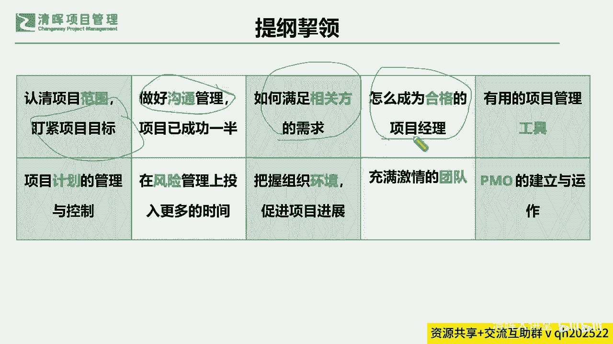
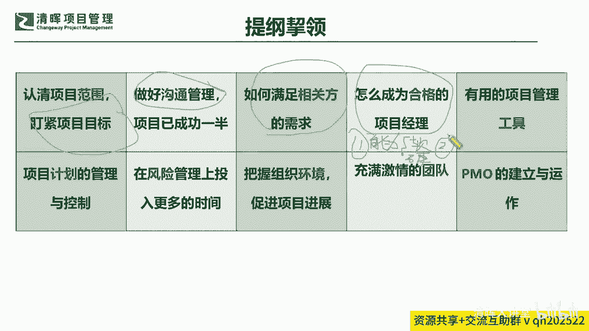
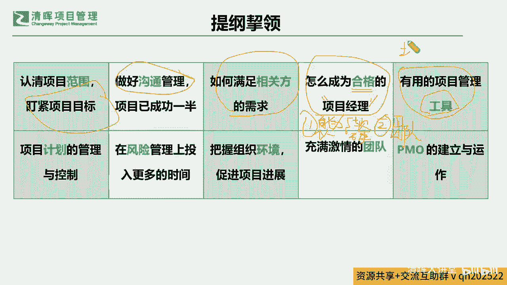
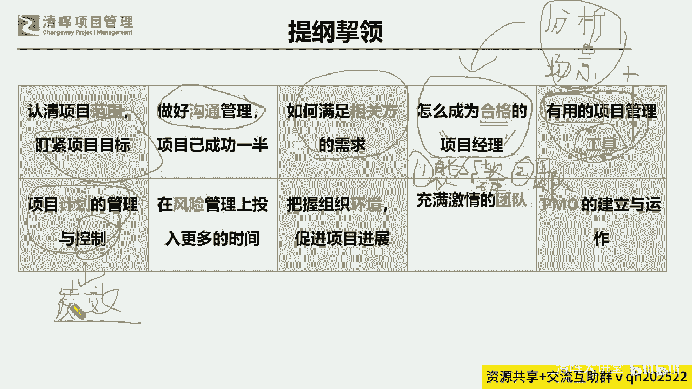
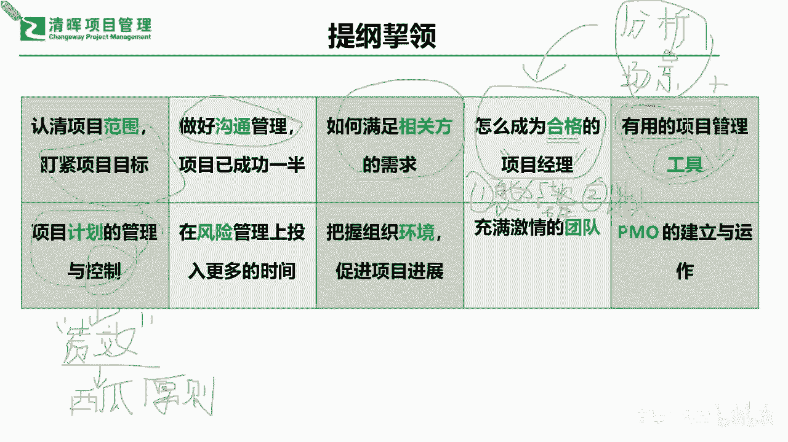

# 🚀【实战干货】解锁《高效项目管理100法》，让你的项目速度飙升！ - P2：3.提纲望领 - 清晖大讲堂 - BV1CS411c7Vs

这个高校项目管理的这个这个地图上啊，我们就用一个最简单的一个矩阵型啊。

我们也不画特别这个fancy的啊，很漂亮的一个这种这种图形。

我们就用矩阵型最简单最容易看，我们来去看一看。

怎么样能做到高效率呢，其实在这个高效率当中，它里面也给我们提到了一些。

我们刚才从思维上唱，跳脱思维之外的一些很多的方面。

那也有一部分是跟我们的学过的一些理论知识。

是重合的，那也有一部分呢其实是一个蛮新的一个点。

那么在这里呢也跟大家去同步来去谈一谈啊，那比如说我们在提到。

怎么样去认清这个项目的范围，来去不断的紧盯项目的目标。

那么同步呢，我们要做好这样的一个软技能的沟通管理。

这是一个基本的渠道，和你怎么样能能让大家去实现。

那个最终你想能去达成的一个目标。

的一个这种关键的路径，那同步呢我们怎么样去把这个相关方的需求。

不断迭代的去挖掘清晰是吧。

那么另外一点就是，我们成为一个合格的项目经理。

这个啥意思，简而言之就是今天你如果发现事做不好。

达不到人家做的那种成果，有可能是因为两种原因。

只有两种原因啊，我们化繁为简，如果今天你是项目经理。

你发现你带项目，永远就没有人家这个这个资深的项目经理。

这个带的成果好，客户满意度高，只有两种原因，导致一种原因是什么。

是你的这个什么你的这个什么个人能力不够，是吧啊哈。

就是我们讲的就是你个人需要需要去提升，就是你的个人能力不够。

我们再来讲这个个人能力不够，主要指的是哪些能力啊，简单讲就是我们学过就是软硬技能嘛。

软硬技能软技能就是一些你的领导力。

沟通能力，这些也要学啊，不是天生的，我再次强调啊，这些也要学。

不是天生，不是你爱说话，你就软技能高，不是这样的啊。

所以这是软技能，那另外还有个硬技能是什么，就是大家切切实实去学的PMP敏捷。

P b a n p d p。

甚至还有产品的我们的整个的一些MBA。

这些都是硬技能，就是你扎扎实实学了多少东西，这是第一个点，你可能会出问题。

就是你这个能力不足，软机能不足，硬机能不足，你如果带跑这个项目。

还有一个点是什么，还有一个点什么。

大家想想看，除了你个人能力不足之外，你还你认为还有一个什么样的一个问题啊。

大家学过touch过敏捷的时候，什么叫合格。

什么叫合格的项目经理，首先来讲项目经理他有非常重要的一个职能。

它不仅仅是自己把事情做好，它最重要一点。

你会发现实际上大多数的一些组织当中，所有的人。

甚至大部分的人汇报，不汇报给项目经理的汇报吗。

有没有这条汇报线其实很少有，是不是很少有，那在很少有的这样一种情况之下。

他其实最主要是在干嘛要干嘛。

它就是一个什么团队技能，你个人能力加上团队技能。

个人能力加团队技能。

要不就是你个人能力不行，要不然就是你团队技能不行。

就这两点原因，没有什么其他原因啊，绝对没有什么其他原因，你可以去找找。

也可以观察一下啊，也就是说怎么样成为合格的项目经理，你要么加强你个人的。

另外就是要你加强你的团队技能，当然两边都是必要的。

所以这才能变成一个这个合格的是吧，那么看我们还有一些什么样的一些重要的。

这个高效率的技能呢。

就你必须要有一些工具，这个工具大家不要狭义地理解为，只是一些流程术语。

方法论，这个工具还包含了什么。

就是我们一些非常非常重要的一些思维模型。

也就是说这个思维模型，就像我们刚才给大家提前引入的这些问题一样。

也许它并没有被总结成一个非常非常这种啊，理论化的一个东西。

但是大家如果一开始考虑不到闭环，考虑不到阶段性成果交付。

考虑不到这种全局观的时候，你其实很难去说。

我还要去呃，这个这个讨论哪一种工具，就简而言之，我举个例子啊。

如果今天我们是我们学了很多东西，就像我们每一个人可能兜里都揣了一把一。

100种武器啊，我们只讲揣了100种武器。

但是上了战场之后，真正谁的战斗力比较高，是因为他兜里揣的武器越多越好吗。

啊一定不是这样子的，那真正那个武力值爆满的那个人哈。

就是会去用这些武器的人是什么样的人。

它一定是能够快速分析什么作战场景分析对吧。

作战场景它能够快速分析这个作战场景。

能够知道在什么样的情况之下，快速掏出什么样的武器才是最有效的。

也就是说这个分析场景的能力。

第一步才能区别出他们实际战场的作战能力。

那有些大部分人我们今天来讲啊，我再我再举一个两个切实有的。

一个咱们的一个这个兵种，一个叫狙击手是吧。

啊狙击手这个兵种大家都听过啊，狙击手是干什么，他就是来狙击的嘛。

就是在埋伏在那里是吧，看到有目标之后，想办法一枪一个是吧。

非常好啊，一枪一个，但是我们大多数的同学这个能力欠缺的时候。

这个能力欠缺的时候，你会你会变成什么。

你兜里可能子弹好多哟对吧，100种武器啊，打也打不完。

你就会什么乱枪打鸟是吧，散弹反正我就使劲儿去打。

把我知道的都用出去，结果呢其实一个也没打到。

只哎还会吓到对方，是不是还会吓到，甚至可能提醒到对方要做警惕。

甚至还有一些什么就是直接失败了，你可能也被别人什么你都没机会打完。

是不是啊，你就直接被这个这个别人给打死了是吧。

所以实际上这个就是，你必须要知道你的一个底层逻辑，你掌握工具什么叫有用。

什么叫有用，就是结合你前面的这些东西。

你要分析综合，你才能知道什么时间点掏出什么东西，去解决什么问题。

精准化，这才能高效率，我们一直在讲高效率嘛是吧。

那么再接下来就是我们常规的啦，比如说我们计划面的这种管理和控制。

不要仅仅去排计划，我们再次有很多同学又会陷入到一个这个。

这个漩涡里面去说，这个项目经理不停的在改计划。

就剩一个计划面的一个这个调整了，其他的地方都没有看到他。

这其实是一个非常有问题的点啊，有问题的点。

那么接下来呢也非常重要的一点，就是我们不仅仅要去做这样的一个计划的排配。

我们更加要干嘛要去控制它。

要去控制，也就不断的要去调整它，那么我们在调整它的时候。

我们又有一个重要的点，你怎么知道哪些部分。

应该怎么样去快速响应和调整呢，其实在这个这个点上啊。

我们就能够给大家提出来一个很重要的一个呃。

这个要求，我们怎么样让大家啊可以快速知道。

怎么样去调整才是最为关键的一个点呢。

在这里我们给大家支一个招啊，在线认真听的同学，你一定都能get到啊。

这个怎么样去控制是最快的，大家想想看你怎么样去控最快啊。

怎么样控制最快，我教给大家一个很简单的方法啊。

其实不需要把这个东西想的很复杂，大家以往的对于绩效的理解是什么。

我在讲我PMP课的时候，我都让很多的同学记下来一个公式。

就是我们会什么绩效等于啥，就绩效，就是指那个我们在监控阶段会产生一个偏差嘛。

是不是啊。

产生一个偏差，就是这个偏差从哪儿来，就是我们的计划减去实际是吧。

就是你计划排成什么样，实际做的又不是那个样子，结果产生一些什么偏差。

这个叫绩效是吧，那我那我们从绩效上来讲。

我就一定会去比较它的一个什么，比较他的一个计划和实际当中的一个什么差异。

我再去分析，我才能去搞出来到底需不需要纠偏。

需不需要走变更流程等等是吧。

我们原来讲的正规军都是这么来做的，但如果我们有效率一点来监控。

能不能监控到哪里是有问题的呢，在这里我只给大家讲一个东西啊。

讲一个东西叫做啊。

有as错的同学说正直是吧啊，正直也是一个控制点啊。

我们介绍一个点啊，叫做介绍一个理念，其实在CP里面应该见过的叫做西瓜原则。

西瓜原则啥意思。

也就是说我们今天不要仅仅监控的时候去看什。

么诶，我计划减实际没有偏差。

是不是就代表它完全没有问题呢，或者说我计划都是实际也是绿色的。

都是都是没有问题的，是不是就是一个完全安全的一个一进展呢。

未必见得大家都很有经验是吧。

未必见得，那么在这个时候，就像我们一直在看这个on schedule，on time是吧啊。

都是都是在计划范围，在时间范围之内的，这种是没有办法去确保100%的一个什么。

这种这种交付的成功的。

那么在这个点上，我们其实啊也能去看到的一点。

我们在实打实的这个落地的时候，我们就会需要去用到这个敏捷里面的西瓜原则。

它是最有效率的。

就是你今天不要告诉我说，我所有的都是按计划都是啊，我已经达成了是吧。

那么我们把你已经做出来的东西来展示展示。

其实就是我们敏捷里面讲的那个冲刺，评审的那个概念，这个概念就像一个照妖镜一样是吧。

也就是说你今天不是做完了吗，啊不是已经阶段性的东西已经能够出来了吗。

好那么也告诉大家。

你在这样的一个过程里面，我们到底还有什么东西啊。

可能没有被正确的做对，那没有正确做对的时候。

你就没有办法去展示的出来，所以可能在这个过程当中，我们就需要让大家快速去响应。

快速去迭代。

那么可能在这个过程当中，我们就必须让大家能够看到。

我们的所有的这个整个的一个实际的达成。

这个就是我们讲西瓜皮是绿的，但是我们要更加确保西瓜瓤。

这个红色的是熟不掉的，是能够交付的。

而不是生的是吧，所以就这一个原则，你做完了好，那你你就把你做完的东西展示出来。

demo一下看看是吧，好，那么我们还有再讲风险。

风险这个东西啊，为什么我们就用一个比较。

这个这个落地的大白话来诠释，就是投入更多的时间。

为啥风险大家都知道，识别风险我们是有一个路径的是吧好。

那为什么我们要在实这个风险管理上。

投入更多的时间呢，其实这个点啊，大家之前在掌握这个整个全盘项目管理。

pp理论的时候，其实都知道风险是什么时间点就应该开始管啦。

风险管理是什么时间点就可就要开始管啦。

在我们五大过程组里面。

什么时间点就要开始管了，各位同志们，什么时间我们的启动规划执行监控收尾。

哪一个时间点啊。

啊好3206的同学说启动啊，没错啊，我们在风险管理从启动就开始管了。

而且在过程当中要不断的不断的不断的迭代。

是不是啊，还有as two同学说启动没错啊。

事事如愿，同学啊都很赞啊，至少这个理念是记住了。

也理解了，那么为什么投入更多时间是有必要的呢，因为我们知道风险这个东西是来应对什么的。

不确定的，是不是不确定的。

也就是说这个东西，就是我们大家在第七版PMP的时候。

你应该学到过一个新的PMI3角里面。

一个叫商业敏敏锐度，还有印象吗。

商业敏锐度是吧，sensitive就是我们讲的accrue，就是我们讲的这个敏敏感性。

其实你在风险管理上投入更多的时间。

它是在增加什么，就是你能够快速敏感地去响应外部的变化。

就是你不能太古板的去执行你原来的这些东西。

因为你可能外部的东西一直在变，是不是一直在变化。

你你不可能一下子就干什么，把它完全要什么搞清楚是吧。

所以可能在这一点上，我们需要跟大家非常明确的指出这一点啊。

就是一定要一定要掌握这种这种。

快速掌握这种啊我们整个的一个理念啊，来去来去。

让我们的风险贯穿在我们的始终是吧。

贯穿在我们始终，而且这个风险管理，你越是能够有敏感度去应对这种变化。

你的成功概率和调整的这种什么时间点越有利。

是不是也就是说你的敏感度啊。

大家如果没看过第七版的同学去翻一翻啊，PMI3角里面有个这个商业敏感度啊。

原来那个地方讲的是战略与管理思维是吧啊。

所以这个啊鼠标不是很好用啊，就是敏感度你自己去翻翻啊，它其实就是这个意思。

你就需要去快速响应外部的变化，就你不能把自己的这个无感给封闭起来了。

你封闭起来之后，他就没办法有效率。

就是你越敏感越敏锐，你才能行动更快嘛啊。

所以这是一个，那另外我们看到把握组织环境，促进项目进展一模一样。

就是要响应外部的变化，让你的这个反应速度能够更加快速。

更加有利一点是吧，那么还更重要的一点呢。

我们也提到了我们的什么，这种充满激情的一个团队的重要性。

那充满激情的团队我们一般指的是什么意思啊。

那我们团队为什么你说高效率就行了，还要激情。

那我什么叫激情，激情在英文里面叫passion是吧。

同志们，passion的背后是什么意思，激情的背后是什么意思。

这个词我们在中国的这个团队成员当中。

很少被提及，但是我们一听到西方的管理学，甚至西方的团队管理的时候。

我们有很多这样的一个这个啊。

这个这样的一个说我们的高绩效团队是吧，我们都是要团队成员都有激情。

可以融入到团队当中，贡献自己的力量，那什么叫激情，啥叫激情。

什么叫passion，同志们，什么叫passion，大家认为passion重不重要。

这个passion重不重要。

重不重要，这个对我们这个咱们的典型的啊。

这咱们体制内的同学出来的啊，你一定会感觉到啊。

可能会有一个非常不同的一点是什么，就是我们自己本身啊。

一定会需要有一个很重要这个事事如愿。

同学说重要是吧，passion是什么，其实我告诉大家从心理学上来讲啊。

这个激情这个词的背后，它有一个重要的三个字叫做自驱力。

自驱力，什么叫激情。

不是光光开心一下啊，它其实是一种充满激情。

就是拥有强烈的自驱，拥有强烈的自取。

也就是说所有的事情，今天我们就讲鸡蛋从外面打就是死掉了是吧。

从里面打就是一个是新打，打碎就是一个新的生命。

那所以在这样的点上，我们就会啊非常清晰的get到一个点是什么。

我们整个的一个团队的激情，他是非常非常关键的一个什么提升的路径。

也就是说你拥有一个充满激情的团队，其实你就是已经把这个什么团队，你是个合格的经项目经理吗，你看上下就联系起来了，你就可以通过团队能力去把我们的这种自驱，把它引，把它完全就是什么这个调动起来是吧。

调动起来之后，大家都有冲劲儿，你就想今天我们的高铁为什么这么快，以前绿皮车为什么那么慢，因为原来可能绿皮火车我们就是火车跑得快，全凭车头带是吧，就是我们就是车头会有这样的动力。

但是我们的车厢都是后面在拖着的，你拖越长越速度越受影响，是不是，但是现在为什么高铁快啊，因为高铁的每一节车厢都在自驱，他自己都能往前跑，是不是，所以也就是说，我们一定是希望大家能够快速的来。

去进行这样的一个什么升级和迭代，而不是什么全靠项目经理一个人来救活，这也是为什么很多的项目经理可能会抱怨是吧，还会有一些这种呃呃反馈，说全都是我一个人在做风险分析，大家都不能往前去多走几步吗。

其实你不要去抱怨，作为一个项目经理，你不能去抱怨这一点，因为团队的能力也是你需要去调动起来的，你不能靠大家自觉是是吧，所以可能在这个点上，我们团队自驱能力就是来去提升你团队能力，刚才也讲了。

你怎么样成为一个合格的项目经理是吧，那就两点嘛，你提升个人能力，提提升团队管理能力，那其实你的团队管理能力就是来，怎么样去把大家的自驱力调动起来，自驱力调动起来之后才会有passion。

有了passion就会变成动力，就像你每节车都加油了是吧，那么同样啊，其实大家作为一个自己的检验，就像大家每次去上班是吧，大家真正有多少是做自己同事喜欢的事业是吧，你一踏进办公室，大家都一样的兴奋。

非常愿意去为这个事业去努力是吧，其实这个还是非常非常有差别的，包含我们其实先不讲到工作，我们就讲学PMP这个事情，比如说考PBA考这个ACP，很多同学在课堂上就会表现出不同的状态，一看就能看出来是吧。

到底是自区还是他区的是吧，我们很多同学虽然是自己主动报名的是吧，但是肯定是有一部分同学这个上课这个状态，就告诉我们，他其实虽然是主动报名，但是他是被迫的驱动的，也就是说可能会出现说这个被老板要求啦啊。

换工作的时候要求了，或者是可能在呃，有一些这种这种升职加薪的时候，有这种背书上缺少了，它其实还是一种他区是不是，这并不是你觉得这个项目，项目管理这个价值那么高啊，你一定要去学一学。

你突然一下子开了天窗了，你觉得这个东西真的是很有价值，其实大家来听一听啊，你是不是我们前后联系来看，你自己是不是也会觉得，其实项目管理的思路，他真的的确切切实实是非常有价值的，因为它牵一发动全局。

所有的这些层面上它都能贯穿，而且它给我们的这种价值的交付，它就是整个这样的一个价值链的一个闭环，的这么一个这个思维的一个升级对吧，所以他的确是很有帮助的，所以我们要从这一点上切实去学好它。

这也是自驱是吧，那么还有最后的一个点啊，大家其实看到的就是我们的PMO，PMO这个东西很容易被误解为，但实际上我们在更加进一步的这个PMO的，一个高效率的PO的一个建立上。

在这个PMBOK第七版里面也去有涉猎到啊，这样的一个呃这个整个的一个要求，其实PMO呢它其实更好的是一个什么，就是这两个字啊，它不是其他大厂，它其实就是把我们原来做项目的这种点。

把它变成一个体系化的一个系统化的一个东西，就是PMO，它会更加从上到下，从各个维度来去做这样的事情了，所以可能我们知道这样的一个交付的时候，我们其实也会非常明确的给自己提出一个，更高的要求啊。

啊我们可能非常那明确的一点，我们知道这样的一个部分之后，我们也会去啊，看到我们自己的自身的一些这种啊，可能我们的意识上的欠缺呀，这种能力上的一些需要补充的点啊等等是吧，那么我们可能在这个点上呢，啊。

严老师也在跟大家去提出来，一些比较细的一个点啊，什么叫细的点，刚才提到了一个我们做计划，我们要去拆细分，那么我们讲在拆细分的时候，其实我们更加要关注到的一个提效增，增加这种效能的一个点。

