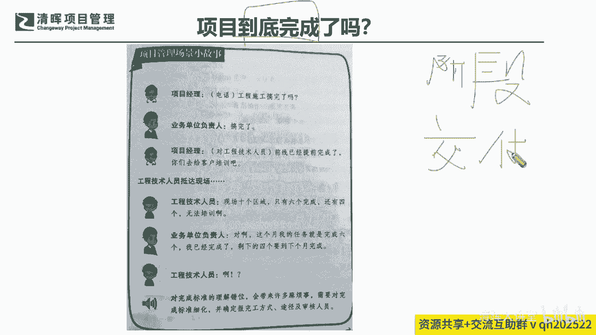
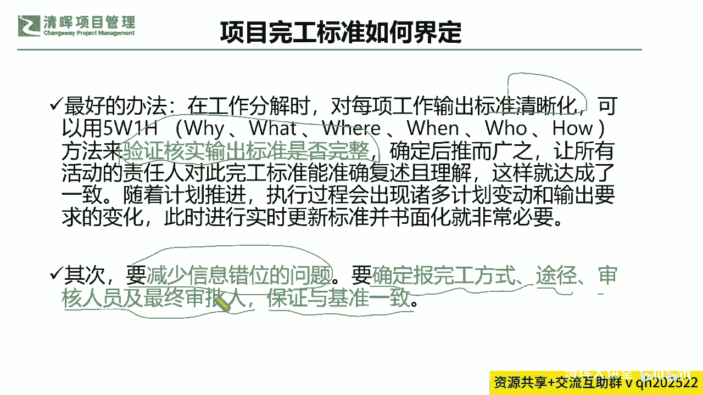
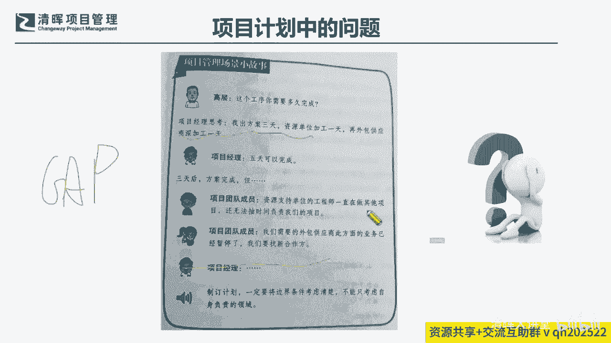
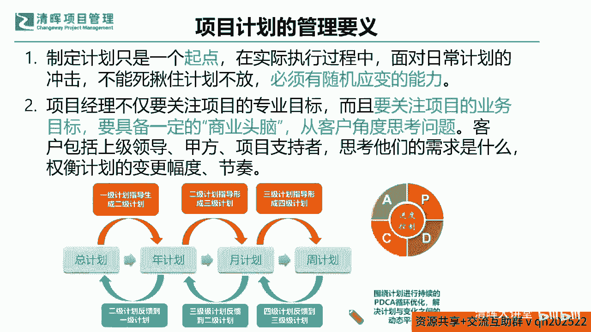
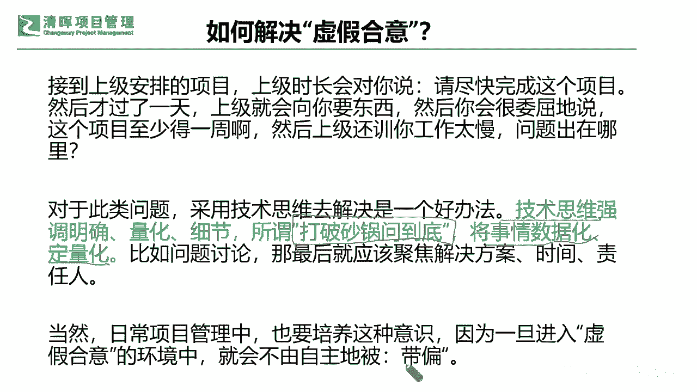
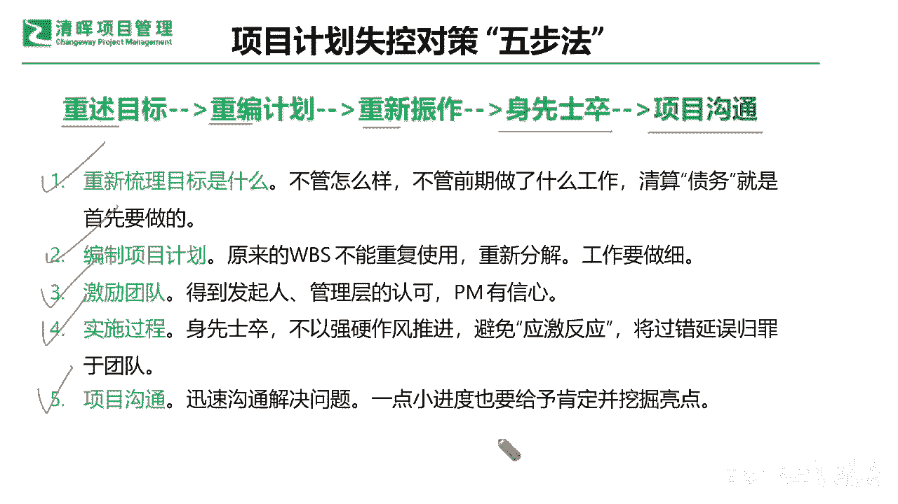
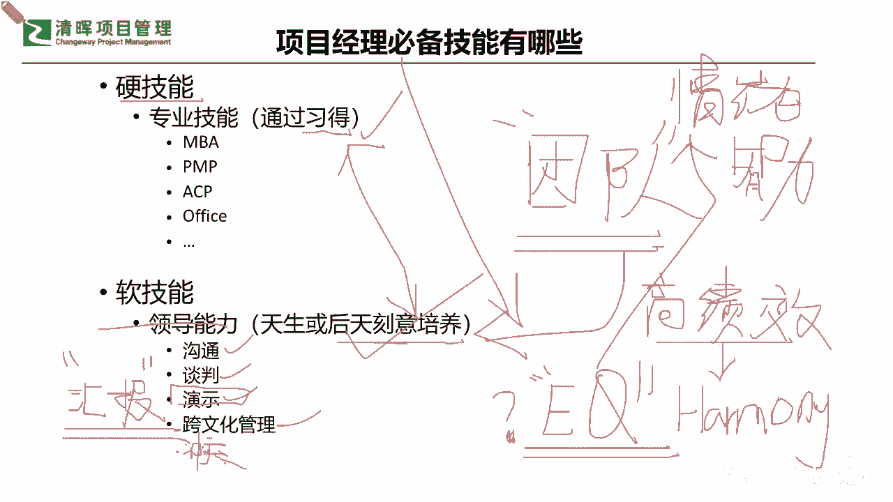

# 🚀【实战干货】解锁《高效项目管理100法》，让你的项目速度飙升！ - P4：5.项目计划的管理要义 - 清晖大讲堂 - BV1CS411c7Vs

来看一个东西啊，我们看一个这个项目管理场景的一个小故事啊，比如说项目经理说了这个电话问一下，说我们工程施工搞完了没有，然后这个业务单位的负责人就说搞完了，那么项目经理就说好，那前线已经提前完成了。

那你们去给客户培训去吧，那结果我们的工程技术人员就到现场去了，结果发现啊现场有十多个区域，只有六个完成了，还有四个根本没法啊培训，那么可能在这样的一个情况之下，业务负责人就说对呀。

这个月我的任务就是完成六个啊，我已经完成了，剩下四个要到下个月完成的，那工程技术人员就是啊是吧，这就是他一个非常大的一个认知的一个差异，所以对于完成标准的一个理解的错位，这是不是一个很大的问题呢。

也就是说我们其实最终在交付节点，就是阶段交付，我再次强调一个点啊，你在阶段交付成果上是一定要细化量化，甚至打破砂锅问到底的，也就是说你的阶段交付具体是什么，如果不能被明晰化，你这个项目是无法展开。

甚至无法满意落地的。

也就是说在这里面，我们要提出两个有效的一个工具，帮助你把这部分的这个低效率给它拿掉，那第一个呢就是要想办法在拆解的时候，尽量去什么标准清晰化，并且通过各种各样的方法来去啊，验证核实输出标准是否完整。

也就是我们常用的由啊5WEH，还有我们的一个什么，这个我们自己的一个什么，各种各样的一个这种啊，整个流程的一个标准化的一个，风险识别方法等等，来确认你最终交付啊，确认范围，确认产品范围，确认项目范围。

来去看你输出的这个标准是不是完整，那么另外就是要不断的要去确定你的完工方式，途径，你的审核人最终谁来买单，你的基准是否完全被认可和一致，来减少信息错位，以避免大家认知不一致的这样的一个问题是吧。

那么可能在这样的一个过程当中，我们也会去问到自己同样的一个问题。

是说我们计划当中如果没有把这个这个标准，把这些东西讲清楚的时候，你在做计划的时候会产生什么问题，会产生什么，比如说你看现在这个场景啊，大家来看，比如说你这工需要做多长时间完成啊，那项目经理。

这个我们可能这个需要出方案就三天，然后资源单位还得再做一天，还要再外包再做一天，总共五天，结果三天之后方案完成了，但是呢项目啊这个项目团队的这个成员呢，说这个资源单位支持的工程师。

一直在做其他的这个项目，他并没有时间这个负责我们的项目，所以项目团队成员说外包的业务也暂停了，需要重新找合作方，然后项目经理就傻眼了，在这个时候其实出现是什么问题，理论的一个以理论的时间和实际的发生。

是有这种非常大的一个什么东西啊，这种差距的，也就是说你项目经理绝对不能很理想的，就认为什么啊，我一共是五天了，我就只算五天，那你有没有去确认过里面这种细节，它到底work不work是吧。

到底是不是能够真正实现真正落地的，这个是非常非常关键的一个点，那么在这样的一个过程当中呢，我们其实就会给自己提出很多的一个问题啦。

那么还会有什么样的问题啊，说哎呦，发起人说甲方快要来验收啦，说我们的项目进度怎么样啊，然后项目经理说项目正在收尾呢，收尾之后我们要内部验收，通过之后就可以交付给客户了，收尾五天内部验收两天。

一周后就行了，结果一个星期之后呢，发起人就开始问了，说怎么还在做内部的验收啊，然后项目经理这个时候就说了，说这个哎呀项目的输出啊，项目的输出啊，需要这个运输啊，这个运输又堵车排队啊，花了两天时间。

本来要一个小时的，所以今天才刚刚开始这个测试啊，所以我们看到的一个状况就是什么，发生了变异了，但是紧前紧后花费的时间它不并不简，简，单单是个简单的加法，它可能会产生这样的一个什么这种落差。

导致我们整个的一个项目进度阶段，交付的一个这个呃，这个延迟甚至可能更严重的一些交付问题是吧，那么你看在计划当中出现的这种问题，它是由于什么导致的呢，其实我们回归到本质的一个点啊，那我们看到这个点的时候。

我们要知道啊，我们实际上我们需要制定计划，拿出来一版能够去借鉴的这个东西。

我们其实仅仅是一个什么starting point，Starting point，也就是说啊，我们需要大家能够有更多的这样的一个意识，不仅仅是做一版计划跟大家讲清楚就完了，而是需要干什么。

让大家在执行过程当中跟大家同步，有这种随机应变的一个什么能力，那随机应变的能力是啥意思呢，实际上就是要不断的干什么，关注项目的专业目标，同时啊记住这两个目标啊，同志们，专业目标只是你的交付成果啊。

你还有一个目标要同步专注，叫啥业务目标，我给你画画重点啊，啥意思，也就是说，你不仅要有这样的一个专业的一个目标达成啊，我就严防死守，就像我们刚才那个而且还要干什么，还要不断的去给出我们的一个什么业务的。

目标的达成，就是你的商业头脑啊，也就是说你是否从客户角度去想问题，你从客户角度，你这个计划是满足他的一个，这种变更的幅度和节奏吗，就是来回应我们刚才那个举的例子是吧，各位同学也做了一个简单的头脑风暴。

也去想了想是吧，的确啊，他有这个敏捷有敏捷的道理的，我如果我们可以从颗粒度上来讲，就像我们举一个不恰当的例子啊，可能不是那么太妥当，但是大家能够听得非常明白的一点，就是像我们今天去医院看病一样是吧。

医生你是希望医生一下子就告诉你一个，说一下子就之前不告诉不告诉我，一下子告诉你就是得了个绝症是吧，你肯定接受不了，是不是，那所以我们宁愿是干什么，你宁愿年年体检，医生每年告诉你，你有这需要注意。

那需要注意是吧，都是一些小病，但提醒提醒你，你还有益于加深这种什么重视度，加深这种什么这种锻炼的程度，而且能促进你更加优化，更加搞好你自己的作息啊，饮食啊，是不是啊。

这跟项目经理管项目是一模一样的逻辑啊，也就是说你如果一次性就给人家宣判绝症了，谁还谁还愿意跟你配合是吧，你肯定是希望在这个过程当中，你能第一时间响应，比如说你离得近了，就会有近视的这种可能。

你就不断提醒不能近视啊，你如果稍微有个一两百度近视，就赶紧把这个什么矫正镜啊，把这个东西措施都用起来是吧，让大家重视啊，不断的来去保护好自己的这方面，不让也这个持续恶化，是不是啊，其实这种阶段性的交付。

它其实是有利于客户去接受的，而且有利于这种调整的，所以一定要站在这种客户角度去思考，你才能理解这个随机应变，随机应变，我再来讲，随机应变不是胡乱变啊，很多同学不理解，说说这个之前讲的随缘吧。

啊随缘就是啥也不做，不是啊，完全不是这个意思啊，随缘在我们讲，即便是在佛佛教里面这种随缘啊，他都是讲求你要去正驱动去找寻，虽然随缘的意思是你不强求，但是不代表你什么都不做啊，你还是要不断的去想。

正能量的方向，是朝正确的方向去努力，也就是说可能在这个随机应变的这种能力，所谓的这种弹性从哪里来，随机应变的能力从哪里来，也就是说，你今天你完全能够把你自己变成一个什么，既是PM。

又是甲方的这种呃这种客户的一种视角，你才能理解随机应变到底应该怎么个变法，其实客户也就在不断的变呐，它其实也就在不断的试，他的所谓这个G是什么意思啊，G是什么意思啊，价值就是我们一直在讲的这种价值。

哪些价值对它大了，它就是往那个方向去靠，所以项目经理你如果变得更加随机应变一点，你所谓那个鸡是啥，你就要不断的去研究它，那个价值最大的点在哪儿，搜集他的信息，你甚至都要跑到他前面去帮他做这种调整。

是不是啊，其实这个就是一个随机应变，这不是什么都不做，恰恰相反，这是要做很多的功课啊，随机应变是需要做很多功课的啊，就是我们通常所讲的，就是你要非常努力才能看起来毫不费力是吧，一样的是这样子啊。

所以没有凭空就可以去拿来一些什么东西啊，就可以随机，不是不是被动的接受啊，所以这点大家了解清楚之后呢，我们也可以看到我们整个的项目经理，你如果想更好的高效率的来做好，这个项目计划和规划。

那你就需要去同步有这两种思维，那与此同时呢也要增加自己的随机应变的能力，来意识到做计划仅仅是个开始，并不是什么终点是吧，其实也没有所谓的终点，因为我们是在不断的干嘛。

迭代向前的都是一个一个什么迭代的是吧，好那么我们知道了这个部分啊，我们再来去看看，其实在我们的项目管理中，还有哪些事情会影响咱们的效率呢，在这里面再点出来一个问题啊，大家来看看这个场景熟不熟悉啊。

比如说项目中，项目这个管理过程当中有哪些虚假合意的东西，什么叫虚假合议，比如说你看这个这个小的情景，说，项目经理决定近期组织一次，团队非正式的沟通活动是吧，准备搞一场这个户外的活动，刚好周一下午。

项目经理在这个项目例会结束的时候，开始聊起这件事了，然后团队成员就说，那我们去哪里合适嘞，然后团队成员，这个也有其他团队成员说去户外爬山吧，然后还有人提出来说嗯，爬山是挺不错的一个想法。

但由于下午有一场会议，大家也就散会了，就没有形成这样的一个结论，是不是啊，周末大家就出发了，但是天气太热，山也很高，大家非常的累，于是有人就开始抱怨了，说这是谁的主意啊是吧。

你看跟前面讲的就是有点不同了，然后也有团队成员说，这不是你的主意吗，那还有这个团队成员说，我是听到谁谁谁说了去，我才说去的，所以实际上你会发现，当出现实际的项目管理当中的问题的时候。

其实我们有很多团队成员之间会干什么，互相推诿，或甚至会产生许多不同的一些什么意见，这种意见呢你即便逐个去跟大家谈，你也无法达成这种什么共识，所以这种是很影响咱们的一个什么，快速迭代的效率。

就是你的团队产生矛盾了，那产生这种问题怎么办嘞，像这种虚假合一的问题怎么办呢，那其实就是有一个非常非常简易的解决方法啊，杨老师今天跟大家讲的都是非常落地和实践的，一些实际拿回去就能用的方法。

所以一定要听明白了啊，那么我们在这里怎么解决这个方法呢，你只需要做一个动作，就是这个啊，我们通常所说的打破沙锅问到底什么意思啊，比如说像刚才的那种情景啊，说大家说诶周末去哪里团建呢，然后有人说这儿。

有人说那儿，然后结果我们就默认为说要去到哪里了，是不是，那实际上是不是这么回事呢，也许不是啊，那么如果是这样的一种情况的时候，咋整嘞咋整呀，我们就会发现，其实啊，我们能够看到我们这样的一个情况的时候。

只有这样的一种方式是最有效的，就是用技术思维来去不断的问，比如说项目经理，你就可以持续接下去问，如果大家要爬山，我查了啊，咱们周末可能是一个大晴天，大家如果爬山的话，可能要注意防晒，甚至可能要避免中暑。

那是不是大家的体力都能够跟得上呢，那如果有了这样的提前的一个打破砂锅问到底，也许到发生这样的一个问题的时候，也就没人能去什么抱怨到这个头上来了，因为这就根本不是一个什么问题。

因为大家已经提前什么知道了是吧，所以可能在这样的一个过程当中，我们只有将数据啊，将事情数据化定量化，这才是一个最关键的一个什么这种啊，升级的方法是吧，所以我们知道了这样的一个情况的时候。

我们也能够去看到啊，我们在整体的这样的一个状况当中，我们怎么样能够让自己啊，能够让自己能够让我们的团队更明确，更清晰的知道我们的整个的路径，那其实就是要不断的在这个日常的项目，管理当中培养出这种意识。

如果一旦发现团队有这种虚假合一的，这种这种动作啊，就一定第一时间就干嘛，就去打破砂锅问到底，把事情数据化定量化来避免这种低效率，让大家能够第一时间知道我们要怎么做，责任人是谁，解决方案是什么。

以及时间点是什么是吧，不要被带跑偏了啊，不要去被带跑偏了好，那我们知道了这个部分啊，我们不仅又要去跟大家来去呃，思考啊，思考一下这个问题啊，那如果如果我们能够更好的去实现。

这样的一个项目的一个高效率的计划面的管理。

和我们的一个团队面的一个管理的话，那么我们面对这种可能性的计划的一些失控，它其实就有一个非常重要的一个理念的，五步法啊，分享给大家，就是不断的去重塑目标，重编计划，重新振作和身先士卒。

以及不断的闭环的迭代的项目沟通啊，也就是说大家看到了很多重重重，其实就代表了我们的什么迭代的一个思路，也就是说在整个的过程当中，我们面对能够更好地应对变化的就是什么，变在前面是吧，不可能是不变是吧。

一定是变在前面是吧，好那我们有了这样的一个意识，那么我们可能逐步逐步能够，把我们的这种项目管理的这种效率，也逐渐的提升起来，那么在这个过程当中呢，我们一定是对自己啊，对项目经理的个人的这种综合的能力啊。

我们能带出来团队能成功交付产品，能够成功去获得客户的满意度，项目经理的个人能力，也是始终非常关键的一个决定性因素，所以在这里呢，严老师也在咱们不知不觉接近尾声的时候，再去赘述一下这个重要的一个点。

就是我们的项目经理，作为高效率项目管理的一个项目经理。

你必须要必备的技能有哪些，这个我们一定要跟大家反复要去讲清楚啊，那我们刚才讲了，他会有这个什么硬技能，软技能，我又给大家放了一个什么团队技能，是不是啊，好那么我们分别来掰扯掰扯啊。

这些技能从哪里能够洗这个获得呢，那首先硬技能大家刚才都都搞清楚了，比如说我们要学的要考证的是吧，这些东西都是可以通过学习得来的是吧，习得嘛对吧，只要你意识到你有这样的一个需要提升的点。

那么你也花时愿意花时间进去，花精力进去，那这个就是一定可以通过学习，不断的来去什么收获的是吧，那么这是我们的硬技能的方面，那么还有软技能的方面是吧，那软技能的方面的话，我们还会提到一个什么领导能力。

领导能力天生或者是后天的刻意培养，在这里啊，我再次强调leadership一定可能会有一些啊，你会觉得非常有天赋的人，这也毋庸置疑，是不是就像我们学习也是一样啊，他也会有一些非常有天赋的一些这种人才。

但是我们大部分我们讲即便爱因斯坦是吧，我们99%以上的人，其实都还是要靠后天的这种习得，来去刻意培养的，也就是说你在什么样的一个环境之下，你在什么样的一个要求之下，你就需要给到自己。

什么样的一个什么这样的一个啊自驱，那你有了这样一个自驱呢，你其实能更好的能够去看到这样的一个，我们的整体的一个领导能力的一个呈现，就是你可以不断的去通过提升自己，怎么提升呢，沟通能力，谈判能力。

汇报能力是吧，还有我们的跨文化能力是吧，那么在这里呢有一点啊，我要讲一下，顺便也跟大家分享一个信息啊，在这里讲的这个项目汇报能力啊，演示能力也叫汇报能力啊，项目汇报能力应该是很多小伙伴的一个诉求。

对不对啊，我们说这个项目经理，就最怕的就是做做这种汇报，不知道怎么去能够体现出这种价值，那如果感兴趣的小伙伴可以稍微关注一下，应该是在12月初吧，啊12月初有一期，咱们的这个星辉在线学堂的这个训练营啊。

严老师专门去跟大家讲讲，这个项目经理汇报的这种技能和实操的，一些方法啊，这个可以作为一个专题，跟大家详细的去掰扯掰扯啊，因为这个其实里面也有很多的大学问啊，所以如果感兴趣的同学啊，想去提升自己的这个啊。

实际的这个项目汇报能力的这个同学，可以联系我们的清晖在线学堂的这个小仙童，联系我们的老师来去咨询一下，应该我们时间日期应该已经定了啊，应该后期大家也能看到我们的宣传海报啊，也可以去啊，多关注一下。

也可以咨询我们的在线学堂的老师啊，来去提前定位，因为我们在线学堂应该是面向全国啊，我们也是有一些为了确保这个学习效果，应该也是有些名额的一个限制啊，所以大家尽早来去啊，咨询也感兴趣的也可以去尽早报名啊。

好那么我们这是软技能方面，还有个团队技能啊，好我看到话梅同学和韩军同学在问这个，怎么样去加入，想学这个，可以问一下我们清晖在线学堂的这个啊，小仙童啊，如果你们有自己的班班老师也可以咨询啊。

因为我们在线学堂的话，它其实是一个非常啊博大的，或者说我们这个平台呢，都会定期给大家出很多有益的这种训练营，都是实践性，实操性非常强的，可以持续关注一下，可以问到我们的在线的老师啊，和你们身边的班班啊。

当我们看到这个团队技能的时候，咋提升，其实啊同志们，这个东西就是这个东西就是软技能，其实团队技能就是软技能，唯一有一点不同的一点就是我们怎么样，就是怎么样能去啊学到这种与人打交道的技巧。

但又不陷入这种技巧当中，什么意思啊，也就是说我们今天知道这个领导力，我们要学会沟通，学会谈判，学跨文化管理，甚至还有冲突管理是吧，这个大家都之前学过的是吧，那冲突管理，那我们知道这些东西之外呢。

其实团队更加我们提出一个新的概念给大家啊，就是在PMP的第七版里面，我们其实提到了一个叫高绩效团队，这个大家还记得吗，英文讲的叫呃，high performing team是吧，高绩效团队。

那么在这个点上，我就需要跟大家来去讲一个东西，什么叫高绩效，就是还是那句话，就是你自己跑得快行不行，光你自己厉害行不行不行是吧，也就是说你的团队成员得一起厉害，大家一起绩效，彼此赋能才能变成高绩效。

而且高绩效之下大家不是一个什么恶性循环，大家还要非常融洽，就是所谓的一个词叫harmony，是不是我们要和谐啊，我们一直在讲，这个我们的发展也要与环境和谐共生是吧，harmony我们也要融洽。

那么可能在这样的一个过程当中呢，我们就知道我们的高绩效团队，他其实还有一个东西非常重要的，就是你的团队你怎么样能让大家更融洽，在EQ上，在情商上也很重要，这个情商一直被大家所误解，怎么误解呢。

就觉得EQ啊就是天生的，就跟那个IQ一样，就我们讲IQ可能都不一定完全是天生的啊，哈IQ也可以，后期再去练一练的是吧，其实IQIQ智商，从大家每个人初始阶段其实大差不差，但是差的都是在什么。

后天的这种环境的影响和一些练习是吧，所以可能我们会非常明确的来看到，这样的一个状况的时候，我们知道怎么样能把这个高绩效团队建立起来，就是要不断锤炼项目经理的一个什么EQ，那什么叫情商呢，我来问个问题啊。

各位同志们，我们已经接近尾声了啊，所以大家也要，我非常看到几位同学非常的专注啊，也及时会给响应的，那我们其他同学也来想想看，一直在讲EQEQ啥叫个情商，啥叫情商，我们讲会说话就叫情商吗。

还是说我们会能去把这个东西啊讲得很漂亮啊，能观察到别人的一些这种情绪，这就叫情商吗，这情商的这个概念是什么，大家一直在讲这个EQEQ的，大家理解是什么，情商是什么，如果今天如果说我们呃给大家的一个建议。

就是提高情商，那啥叫个情商，你认为什么叫情商啊啊韩军同学说说，让彼此舒服，同时实现彼此价值，这个说法有点过于标准了，韩军同学，我怀疑你肯定看过相关的书啊，你就讲的非常的理论和学术了是吧。

这个高度肯定是没有错的，但是怎么样接地气一点，今天就是这样，我今天就想让自己的情商提高一点，那我怎么去提高对吧，我当然也知道实现彼此价值，那怎么实现呢是吧，就是这个情商情商是啥，情商是什么。

我们用接地气一点的话好啊，这个y and林同学说控制自己情绪嗯，很好，就有点有操作性了，就是把你的这个temper啊，把你的情绪控制住，这个也许也是一个情商的体现，然后事事如愿，同学非常接近。

其实会来事儿是吧，嗯这个察言观色是不是啊，察言观色会来事儿嘛，然后严丰天蓝同学说，识别和控制彼此情绪，这个又又近了一步啊，非常好，就是不仅要控制识别自己的情绪，还要会去识别和引导别人的情绪。

是不是啊是吧好，那么在这里啊，其实这个情商啊在英文里面啊，i have as two的同学非常好啊，感谢大家在最后的时间点还这么的这个专注啊，其实就是我们有一些这个这个开始的这个，闭环了啊。

那么s two的同学说结合情景做做好恰当应对，嗯非常的我讲的你这句话也非常恰当啊，那么还有得同学说听的不刺耳，给人感觉这个人很不错，值得一定了解，会做人做事嗯，会做人会做事就挺高的一个要求。

那严峰天兰同学补充了一个包括自驱力嗯，非常好好，其实我们在讲的这个所谓的这个情商，在英文里面叫emotional的一个COTENT是吧，那其实它就是指人们在情绪啊，情感啊，意志啊，耐受力呀，挫折性呀。

抗压性呀这方面综合的一个什么体现，也就是说什么意思啊，就是你这个人是不是一个正常的情商高的人，就是来看到你能不能很好的来自我自我，能有自我的意识，能够控制自我的情绪，能够自我激励。

并且你也能够刚才那个同学提到的说，你能够认知到他人的情绪，也能够及时处理和他人的这种情绪之间的，这种互相的影响是吧，这才叫情商是吧，所以情商它也是领导力，一个必须的一个组成部分。

你不仅要掌握好自己的一个情绪的一个智力，他还要掌握好引导好别人的一个情绪智力，这里讲的情商可能他就是一个情绪的治理，我们在这里讲啊，很多人吃亏在哪里事情能做，但是就是什么情商低，其实在这里讲的情商低。

不是说他不爱说话或者不会说话，甚至有些时候你会发现有些PM还挺能说的，但是他就是没办法get到这些点是吧，怎么带好团队，那其实这个情绪治理就是要由几吉人啊，由己及人管控好自己，掌控好自己。

不断的给自己打鸡血，补充自己的能量之外，还要给别人提供啊，s two的同学非常对啊，给自己和别人提供情绪价值，也就是说你要给自己引GAGE，同时你要给自己打鸡血的同时，还要给什么团队来打鸡血。

这其实就是非常非常重要的一个点啊，那么我们知道了这个部分，我们再再来看看啊，我们在在这样的一个建议之下呢，严老师也在最后啊跟大家再去分享一个，再分享一个这个杨老师加料的三个小要求是吧。

