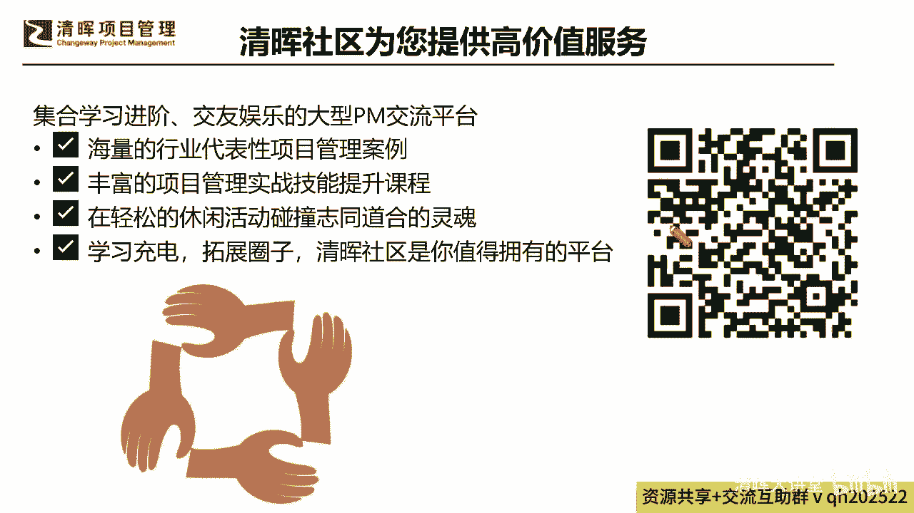
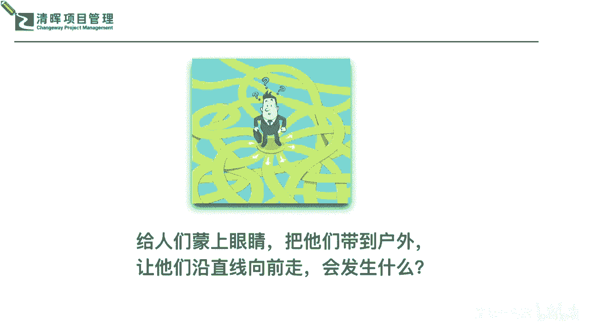
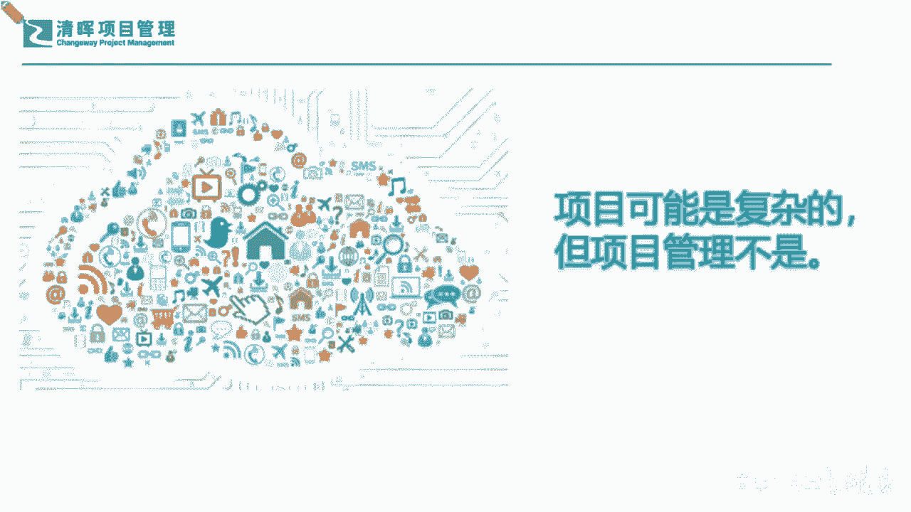
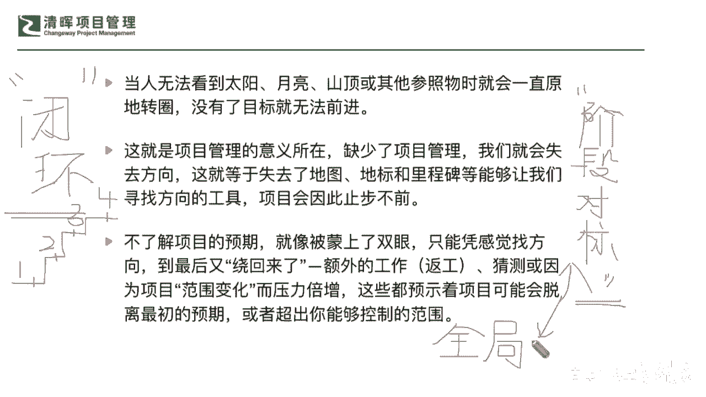
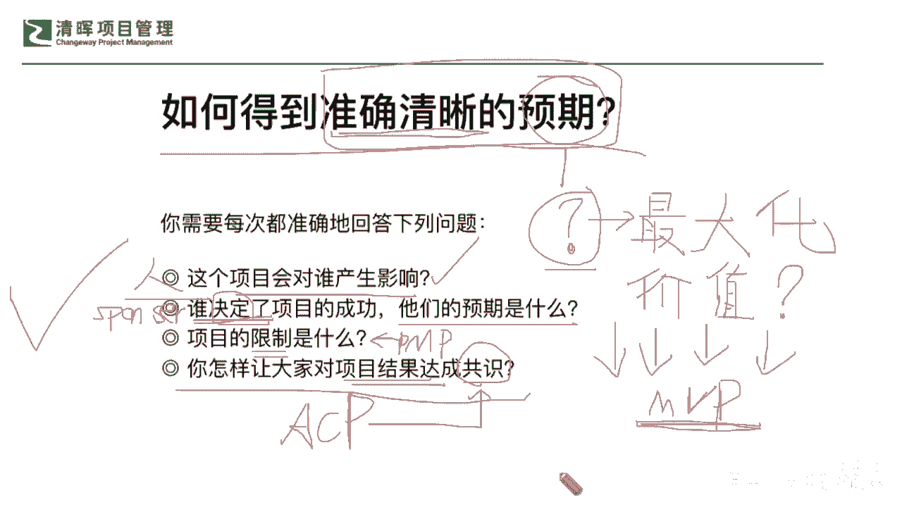

# 🚀【实战干货】解锁《高效项目管理100法》，让你的项目速度飙升！ - P6：1.如何得到准确清晰的预期 - 清晖大讲堂 - BV1CS411c7Vs

好我们各位线上的伙伴们，同学们，大家晚上好，我们又相聚在这个周一的晚上了啊，那么我们在这边呢也跟大家来去同步一下啊，因为咱们呢今天也是一个星期一的晚上，我相信很多同学啊，就是啊会有这样的一些。

这个时间的一个紧张程度啊，也就是说大家都在工作日啊，刚刚下班，也许还在路上，甚至还有在加班，也有在家里面的，那么务必也要注意安全呢，同时呢，我们在今天晚上的两个小时的分享里面啊。

因为也是严老师线上沙龙的一系列的，这个话题之一啊，那一如既往，那严老师希望大家呢能够多多把你们的想法啊，把你们的一些这种紧张放下来啊，我们来去听一听，聊一聊，互相讨论讨论。

让大家呢能够轻松愉悦当中能去收获一些，也许啊咱们在读书啊，咱们在这个平时工作当中的这种啊，大家可能有包袱说出来的一些问题啊，那我们今天呢也可以放松一点来去讨论讨论啊，那我们线上我看到有很多同学也在。

陆陆续续上线了，那么啊应该是声音和屏幕，这个画面都是比较流畅的吧，啊因为我这边看起来网络都是比较良好的，那么如果大家啊也在线，也能听得到，看得清晰的，也在评论区给闫老师一个响应吧。

让闫老师知道你们已经在线了啊，来扣个一或二吧都可以啊，我看到有同学已经提早进来了，也有同学反映说没声音是吧啊，没声音可能重新再进入一下看一下啊，那么对画面如果也有一些卡顿的话，也稍微可以啊。

这个退出一下再重新进一下啊，因为这个网络啊从严老师这边看是非常好的啊，我不知道各位可能如果是通过无线网，或者是你们的手机，也许啊可能在某一个这个区域范围之内，可能会有一些这种问题啊。

那重新进入一次应该就很流畅了啊，好那我们线上的陆陆续续的各位啊，上线的伙伴都举个手啊，让闫老师看到你们在线上啊，同样我们所有的分享，闫老师还是希望大家能够闭环啊，我一直在强调的两个字就是闭环。

就是希望跟大家虽然咱们隔着屏幕啊，但是咱们还是有一些这种头脑风暴的互动的，也就是说我知道大家在线，并且也知道大家在听，而且更加知道大家在思考，这是一个非常有必要的一个闭环啊。

因为我们都清楚沟通最忌讳的是什么呀，就是push是吧，就是一个劲儿老师在讲，但是我不清楚你们到底有没有在听听，有没有理解，那理解之后或多或少啊也要给一些响应，是不是啊啊。

所以再次跟大家来去做一个小的建议和要求啊，大家任何的问题，或者是你觉得在听这个啊，严老师在讲这个分享的时候，有哪些点触及到你个人的一些这个想法啦，或者是你的一些问题啦，也都可以开诚布公的啊。

没有任何偶像包袱的啊，把你的一些想法分享在我们的评论区，那同步呢，当然你有什么这种难解的问题，也可以简化的描述一下，放在评论区，因为我们永远都是在什么别人的问题啊，包含我们互相之间发生的问题。

也许这些问题都不是个性化的问题，他一定是能够彼此互相借鉴和赋能的，也就是说你能够把它反映出来，你是最大的收获者，那同步呢我们线上的各位同学，如果在这方面是非常有经验的一些。

这个同学也能给你更多的一些回应和建议啊，因为我们知道这个三个臭皮匠，还顶个诸葛亮呢是吧，所以我们一定要利用好，甚至可能还要多多的去用到，咱们清晖在线学堂的这个资源啊。

那包含今天我们可能在这个线上课堂的这个，系列沙龙分享里面，严老师也会一如既往地，收集大家的一些问题想法，甚至你个人想去听的哪些课啊，所以可能在这个里面，也请大家能够，非常清晰的能够给严老师一个回应。

给我们在线学堂的老师一个回应啊，就是你们有什么样的一些想法，能够愿意把你们的问题啊讲出来，回应出来的，那么我们就希望啊，可以让大家非常非常明确的来，去把这个啊整个的学习的这个路径和资源平台，把它打通。

那也就是说在我们整个的管理思路上，包含我们的落地实践的思路上，我们就希望这是一个成系统，成体系的一个过程是吧，所以也就是说我们不仅仅是听了知识，我们还要把它用起来，用起来之后还要检验检验这个管不管用。

如果还在当中还欠缺了一些部分啊，我们还有哪些技能，也许还要再学一学，才能更好地解决这个问题，那咱们再去在学习的平台当中，再去搜寻这样的一些知识点，因为在线学堂本身就是各种的一些什么，实践性的微课。

是不是啊，所以我们在这样的一个学习的不断升级的一个，闭环当中呢，其实又更好的给大家提供了这样的一个，查缺补漏的机会，因为我们在整个执行过程当中的监控和落地，以及快速响应反馈来去找到自己的需求。

这也是非常非常有价值的一个平台啊，那么我们同样今天要跟大家去分享的这个话题。

我相信啊，一部分同学也是非常非常愿意去花点时间，琢磨一下的，为什么，因为大家如果稍微有点印象的话，那当然今天呢咱们既然是在线的沙龙分享啊，我也会跟大家再去回忆一下，严老师之前分享过一本书。

跟这个标题很像，大家如果有印象，在我们的严老师在线讲项目沙龙啊，我们应该是在去年还是前年啊，分享过一本书，应该反复有提及过啊，我们有一本书叫做这个高校项目管理100法啊，那今天我们也会简单的回顾一下。

当然不仅仅限于这个，我们还会补充更多的一些内容给大家，来去扩充我们的一些认知啊，所以呢今天这个话题我相信是实践性，甚至可能在对于升维的这样的一个理解上，应该是能够给大家一个比较啊，这样的一个宏观。

甚至可能有一些细节会萎缩到微观上，再给大家一些这种反思啊，所以我相信今天应该会听的比较有意思啊，所以我们整个的这个分享当中，我也希望咱们各位同学啊，一定要集中大家的注意力啊，也啊不管隔了多少的屏幕啊。

隔了多远的距离，咱们还是把咱们的问题反映出来，把咱们感兴趣的点找出来来去，做到花了时间在这儿花了两个小时，咱们也听了一些有意思放松的唠嗑，也吸收到了一些知识，那咱们就回去用一用啊。

也把你们的结果告诉严老师，看还有哪一点上，我还能再给你们提供一点炮弹的啊，那么首当其冲的。

其实我一直在强调，咱们一定啊不要把学习当成一个非常制式化，非常功利性的一件事情，其实大家都听过一句话叫做什么真传一句话，假传万卷书，这句话大家应该都听过啊，或多或少应该是耳熟是吧，那实际上啥意思呢。

也就是说真真实的，我们的整个的学习的一个提升，你的能力的提升，它不在于说你真正比如说啊，这种自我感动式的读了多少本书，甚至我们可能从一开始啊，因为啊我们严老师另外一个专栏叫做这个线上。

这个项目管理读书会是吧，那么这个专栏也已经3年了，是吧，3年我们每个月一本书，也读了36本书了是吧，将近那么可能在这个过程当中啊，也许有些同学会觉得唉哟怎么才36本书啊，我们不是一年有的这个挑战。

说一年能读到50本书的嘛，啊实际上啊我希望也给也给大家有一个非常呃，咱们就是呃非常这个沉淀下来，真实的反馈出我们自己真正需求的一个角度，来去想这个读书这件事情啊，除了我们在学习阶段，在大学呀。

在读书阶段可能这个读什么什么样的书啊，读多少本的一个沉淀，这些是可能是会被老师去规定，被考试所规定是吧，甚至可能还出于一定的学历提升要求，你必须要去读到多少多少的书，但是到了职场之后。

这个读书啊就更加变得被大家理解，为什么我需需要什么，我才去学什么，或者说从另外一个角度，我真正是碰了壁了，或者是我需要去晋级提升，我发现我自己可能并没有达到这样的，一些要求的时候。

我们才会想着去读一些书，甚至我们可能还会陷入另外一个误区是什么，就是我在比我到底一个月能读多少本，你能读多少本，那当然量是一个可以被拿出来去讲的一个数字，但是真实的啊不不会自欺欺人的一个点是什么。

就是你真正学到什么东西是吧，所以我们不一定是要求大家一定要去读多少，多少本，但是我们读的书一定要经过遴选，是对我们真正有帮助的，经典的一些书籍啊，也就是说我们不需要花太多时间，再去读一些口水书。

什么叫口水书啊，其实上一次严老师的这个讲产品的这个分享会，也提过，我们不建议大家读很多口水书，比如说什么样的口水书，标题党是吧，我们就是读了很多非常有意思的，但是可能实际上我们再去读那本书的时候。

你会发现啊，我们有很多讲项目管理的书，好像看起来是非常非常啊西金，但是你仔细去读完和品完之后，你会发现它整个的框架和偏僻没什么差别，只不过唯一一点就是PMP是比较什么啊，比较干料的，比较干货的。

它是个框架是吧，但是可能我们的这个其他书籍，它里面会增加了一部分的著作者的经验，或者是理解，但是他内容框架是没差太太多的是吧，所以实际上我们就要学会，毕竟职场人时间精力可能都很受局限。

我们就要知道怎么去做这样的选择，那么返回到我们的项目管理当中，我们再来讲什么叫做有效率的项目管理，什么叫没效率的项目管理，也就是说我们如果按照最简化的一个思维框架，我们一直拿到很多项目管理的一些技巧。

工具，流程方法这些东西，但是真正想让项目管理成功，我们是不是只要抓住一个主轴和一些关键点，就可以了呢，啊这个目前我们开篇也跟大家讲啊，这句话不是严老师来杜撰的啊，这句话也是我们在啊这本书上啊。

就著作者自己来去讲出来的，也就是说在这个娓娓道来，高校项目管理100法这本书里面去讲出来的，那么我们在读书会的时候，我们可能没有这样诠释，但是今天呢我换一个转述方式啊，来告诉大家，其实我们的这个著作者。

他进一步想让大家去掌握的，这所谓一听起来哎呦，100法哎呦这么多是吧，但实际上它万变不离其宗的一点，它的关键要素都是围绕在从头到尾，这些整个流程环节上的要点来展开的，那么什么样的要点呢。

那大家记住这句话，真传一句话，假传万卷书，那这本书或者是我们读过的所有的著作，里面要点到底是什么呢，那严老师先问大家一个问题啊，先问一个问题，大家先来思考思考。

互动一下啊，当我们啊蒙上眼睛，把我们自己或者是他人带到这个户外去，蒙着眼睛啊，你拿一个这个这个蒙眼睛的这个布条是吧，蒙上自己眼睛把大家带到户外去了，那么这个时候发现了我们整个的一个路径。

和我们整个的一个地图，发现了一个盲区的时候，那你怎么样能够让大家沿着这个直线往前走，如果你蒙着眼睛的时候，你会做出什么样的选择，好各位各位伙伴啊，线上大家各位伙伴可以来给出你们的一些想法。

如果今天让你闭着眼睛，把你眼睛蒙起来，让你说哎好，那现在请你去对着前面那个目标往前去走，直到达成你最终的那个你想要的那个成果，如果是这样子来走，你可能会走出什么样的一个路线呢，大家有没有过这样的经验啊。

我相信应该可能在低幽灵的时候，是不是都玩过这样的游戏，比如说在这个大家蒙着眼睛捉迷藏的时候，是不是你以为你在走直线是吧，但实际上你可能一一解开你的这个眼睛上的布，会发生什么样的问题啊。

有可能会走成什么样啦，是不是跟这个图上非常非常的形象的，一个点是什么，你其实就是在各种各样的什么走弯路，根本不是一个直线，那么问大家为什么呀，为什么你能蒙上眼睛之后，你就走不了直线了呢。

大家有没有去想过这个问题啊，如果各位小伙伴还没有去试过的同学哈，你不妨自己这个很有趣的啊，你到户外去尝试，在安全的区域去试一下啊，如果你被蒙上眼睛，你是一定走不了直线的。

也就是说每个人都是一模一样的状况好，那为什么大家有想过为啥这件事情吗，其实我们讲所有的道理啊，万变不离其宗，其实它的道理都是非常质朴和统一的，也就是说为什么他不能蒙着眼睛走直线呢，首先有一点啊。

人的五官我们就通常讲什么叫五官，眼耳鼻舌口是吧，我们整个这些感受感觉的器官，触觉的器官，你的所有的听力其实是有什么误区的，也就是说今天你大家也知道，我们不不断的在企业当中。

不断在团队当中说我们的目标是什么，大家要多长时间才能达成，那我在这个过程当中一定要及时同步，一定要及时反馈问题，为什么项目经理总在这么苦口婆心地在说，这个事情，就是因为我们是会有天然的误区的。

你以为即便今天你睁着眼睛走，你有可能都是走的是弯弯路是吧，所以何况是蒙着眼睛，你没有目标的情况之下，所以在这样的一种情况下，大家要承认承认的一个事实，就是我们想要做到高效，项目管理。

先不讲它有多少种方法，想要从不高效变成高效，想要从不走直线变成走直线，更加有效率，就得把我们的无感打开，并且要快速及时的去同步校正，你的这个什么目标，也就是说你这个大目标太关键了。

如果一开始这个目标都没有，那请问你在走什么呢，那我们就讲走到哪看到哪，永远不是一个高效率的事情啊，所以可能看到这个部分的时候，那我们不仅又给自己啊，清江同学说这个走几米直线啊，可能几米都长了吧。

是不是啊，那我相信你这个应该是感官非常的敏锐，你才能走到几米的直线，一般来讲可能就是跨过两步，两步，两三步之外就开始走弯了啊，好那么我们看到这样的一个情况的时候，我们不仅要去提问了。

说我们既然想要走直线，那么我们就知道项目管理哪有这么简单，项目哪有这么简单，是不是我们一堆的这个干系人要去伺候是吧哈，我们一堆的需求还要去挖掘，甚至可能需求还在不停的变。

然后甚至我们自己团队的一些资源呐，我们的一些这种实际的这种风险管控啊，都在发生很大很大的一些变化，那么在这个过程当中，我们怎么能做到高效呢，那么多的变量是吧，一看到这种弹性的东西。

变量大的东西大家就会true是吧，这个true是什么意思，就是说我们实际上它就是这么一种情况，因为项目管理它本身就是在不确定性当中，并且不断地渐进明细来去跟客户来，去把未来更加不确定的东西。

一点点把它要梳理出来是吧，所以他一定是一个极其复杂的一个过程，并没有那么理想当中的这种直线，但是我们也跟大家啊也去讲一个点，就像我们一直在讲说，项目经理最重要的就是沟通技能，就是软技能。

甚至可能我们项目经理的这种软技能，都远远高于他这种技术，这种硬技能的一个重要性，那我们很多同学就说了，说我这个不善言词啊，我性格比较内向啊，我不太是不是不太适合当这种领导者。

那我们之前也跟大家讲这个软技能沟通的时候，也特别跟大家去提到过这样的一个议题啊，首当其冲严老师是否定了这样的一种论述，说我自己是不是内向一点啊，我不太擅长于跟别人去，像有些这个特别会说话的是吧。

那我不太擅长这方面，是不是就不适合当leader，那答案一定是否定的，因为能不能适合当一个好的领导者，不完全取决于你是否善于就是滔滔不绝是吧，这个talkative也许是一个优势。

但是它不是一个定性的这么一个重要的因素啊，那么从另外的一点啊，那么在我们所有人在看到的一个状况之下，我们也再跟大家掰扯，另外的一个理解概念的误区，也就是说我们项目虽然是非常非常的庞杂是吧。

有出现各方的干系人的变化，需求的变化，环境的变化，但是万变不离其宗的一点啊，也给大家吃个定心丸的一点，就是我们的项目管理，其实套路是那个定海神针，它并不会因为你项目复杂了，他的套路就有大的变化。

甚至可能说他的项目管理的这种逻辑和思维，只要你一旦具备了，其实不管你去做小项目，小规模的项目还是大规模的项目，复杂项目还是简单流程项目，其实都没有太大的一个什么逻辑上的差别好，所以可能在这点上。

可以跟大家非常明确的来共享一个理念，就是我们的项目可能是复杂的，但是项目管理不复杂，它是一定能够去产生更好的一个什么，高效率的输出，只要我们用对了正确的方法，只要我们有更多的这样的一个过程是吧。

所以我们知道了这样的一个状况呢，我们不仅又给自己啊提到了，比如说我们会有一些在过程当中的一些坐标，是吧，那这个坐标就是我们的目的。

那目的又是怎么去定出来的呢，目标又是怎么去定出来呢，那实际上在这样的一个情况之下，我们就会看到我们的项目预期，其实就是围绕着一个个的小目标去不断地校对，不断地对标，甚至不断地去应对当中的变化。

来去管理好每一个这样的一个不确定性，最终达成一个大目标，1。1点累积起来的，就像我们今天在讲我们所有的地图，它为什么要有里程碑，为什么要有路径，其实所有的你不可能一下子就到达终点，是不是大家道理都懂。

但是做事的时候就急呀是吧，我们在看到说这个东西我们能不能这样子，那样子就规划了一大圈之后，就是没有细化这些目标，没有细化这些做法，那这这样的一个情景呢，其实就是复杂化了项目管理，那管理只要有一点。

刚才我提到的一个词啊，提到一个闭环，我看有这个是刚才是糖唐程同学啊，谢谢你啊，谢谢你作为一个补充分享给大家，一个闭环的这个概念的链接，那么闭环很重要，这是一个管理者必须有的思维，什么意思。

今天不管你去管什么东西，从开始到结尾到复盘到升级啊，请注意啊，这个闭环思路不是仅仅是把事情做完，把目标交付了，而是要闭环在你下一个新机会的开启，建立在一个更高的台阶基础之上，这是一个迭代闭环的一个概念。

什么意思，也就是说我们要不断的去提醒我们自己，提醒我们自己，怎么样从一件事情的一个做法上来去，lesson learn之后，有响应，有反馈，有总结，有复盘，有提升，第二次在迭代的时候。

站在一个更高的维度上，每次不求这个台阶过高过大，而是要切实的一步步的去提升，这才叫一个迭代闭环的思路啊，也就是说，我们不仅仅是只是追求一个finish是吧，那么在闭环思路之外呢。

另外一个就是非常非常重要的一点，就是我们需要去什么阶段的一个对标，也就是说大家一定要承认的一点，所有的大管理一定都要被切分成小管理，才能去落地，也就是说你的这个大目标再喊，就像我们一直在讲的。

大家如果是一个这个啊，大家刚步入职场，我作为执行端的一个项目经理，你会听到你的这个CEO说，今年我的margin一定要到达10%，20%，甚至喊到更高的一个比例的时候，你其实是无感的，是不是为什么无感。

因为跟你自己的那个细部工作，是没什么直接的对应，你不知道你的妈阵到达10%，20%，30%，对你一个执行层面的这个项目经理有什么影响，所以你的boss啊，就是你的项目级的经理，甚至你的项目组合的经理。

就会去做这个阶段对标的一个拆分，他要拆成你要做什么事情，大家要去做什么事情，你才能去对标到整个的上面的闭环的，一个一个的目标，所以这两个思路是绝对啊，不管你今天是不是这个非常资深的项目经理啊。

各位在线的这个伙伴，我们都可以记住这两个思路，一定让你后续能够提升的更快，因为你要清楚，大家在做事情的一个底层逻辑的正确性，它能够起到的一个非常巨大的一个，这种升级和赋能的作用，也就是说。

今天永远你没有办法去糊弄一个站起来的人，什么意思呢，比如说我们如果一堆的人，大家都是不断的干自己一亩三分地的事情，都是在蹲着，就像我们前面有一片雷区，是不是我们都在低着头在排雷，说我们非常非常重要。

前面有一个会阻挡我们前进和成功的一个雷区，那么这个雷区之外呢，我们就需要每个人去认真去找，把每一个这个地雷都排除出来，让保证我们这个人员的安全，我们能够按时前进，那大家都在低着头，一直在找。

但是在这个时候呢，我们的leader，你可能就要作为这样的一个什么站起来的人，什么意思，你需要去看到全局阶段，对标的一个隐含义是什么，就是你要有全局观，也就是说你没有办法低着头就能看到全局。

你必须要时不时地站起来，也许告诉大家，你其实站起来的时候，你已经看到了前方在某一些区域，它有密集的一些地雷，那哪一些区域不太清楚，需要去谨慎排查，但哪些区域看起来已经被人去，什么已经解决掉了。

那这种全局就更有效的能够帮助你去做好，这个阶段的一个什么对标，让你省时省力是吧，所以我们线上的各位同学啊，还是那句话，大家陆陆续续我看还有很多同学在上线了啊，我们还是那句话，跟上严老师的节奏。

我不是仅仅在念PPT和分享，某一些经典的一些摘抄的话，我是可能把它砸碎了，揉起来再把它拆开跟大家来讲，所以可能在这些点上，我是需要确保大家能够非常大白话一样的，把这个道理听听懂。

这才是最关键的一个获益啊，我们不是来仅仅仅研究学术的术语，有多少个模型，有多少个是吧，听起来非常高大上，也许啊我们在学的一些理论里面，这是非常重要的，有价值的内容，但是在实践当中，我们还是那句话。

你们要知道我们大家要知道自己的短板，也许我们在升维的一些机会点又在哪里，所以我们一定要听明白啊，听明白这三个字非常关键啊，好那我们有了这样的一个闭环和阶段对标，以及引出全局的这样的一个理念的加持之下。

那么我们首先来再次问到，一个比较深一点点的问题啊，叫做怎么样，大家都知道这个项目有交付的一些目标是吧。

那目标比较难定，又是各种不确定，各种模糊的，那么怎么样才能得到这些准确，清晰的一些预期嘞，所以可能在这个点上，我们能不能有一些高效率的做法，能帮我们快速收敛呢啊答案也是肯定的，一定有啊。

但是可能在这样的一个节点上，我们就需要知道你最快去提问，问哪些问题，对你是最能有这种高效率，收集信息的一个帮助的，也许你会有很多若干的细节问题，但是请大家稍微忍一忍啊，在前期我再来问一句啊。

问清清晰的预期，我们是就像今天我们来画这个素描一样，我们想知道这个预期，预期就是我们再转化一下思路，就讲他就是期望嘛对吧，期望就是在需求嘛，需求甚至可能就是他想要什么嘛对吧，就越讲越白话是吧。

那他想要什么，这个事情大家觉得容不容易，一下子就能够抓到很细的一些点呢，也许大家会发现什么能不能其实不太容易，为什么，因为我们各位前面就知道，其实我们的自己的干系人，他可能也是在边想边干的是吧。

也就是说他边想边做边干边去思考的时候，他对他自己的预期其实也是一个问号，也就是说他一定是在寻找一个什么样的预期啊，这个问号的背后是什么，大家学过第七版pmp pm book。

都知道第七版跟第六版最大的一个差别在哪里，一直在强调什么东西价值两个字，是不是啊，好那么在这个干系人问号的背后，它其实就是在想，怎么样去最大化它的一个什么价值嘛，也就是说我怎么做。

才能让我的这个获益是最大的吗，简单来讲是不是这样子，所以他也一直在去思考，再去斟酌，再去谨慎地考虑，到底哪一条路才能去更好实现他的这个要求，也许在这个过程当中，他还需要这个一些配合，什么样的配合。

就是要干什么，就是敏捷，为什么现在一直被推崇的一个根本点，敏捷里面有个概念叫什么，大家来回忆一下啊，我来提提问啊，看有同学知不知道MVP是什么意思啊，在线的各位同学在学敏捷的时候。

我们有个MVP这个这个术语，是不是啊，大家这个MVP怎么解释，来在线的同学也把你们的这个这个回答啊，放放在我们的评论区啊，来告诉袁老师MVP是什么啊，有没有同学把这个MVP，诠释为这个最有价值的球员啊。

哈应该有哈，是不是啊，这个这个也有这么叫法是吧，most avaluable player是吧，那么啊对非常好啊，严峰天兰同学啊，最小可行性产品很正确啊，唐诚同学说最小可用版本也有这么翻译的。

那于小龙同学说最小价值产品啊，这个最小价值产品，也许这个翻译可能呃，你是不是可能没有没有敲的太快了是吧，实际上FMVP呢，它是一定是讲你是在最小单元之内拿出来，可用的这个最小的产品的一个单元。

也就是说你拿出来这个最小细分这个单元，你交给客户的时候，它不仅仅是一个进度，他是个成果啊是吧，而且是符合他一部分要求的成果，就是他最召集那个要求的成果，所以它是最小可行性的一个这样的一个。

这个最小可用的一个单元，所以实际上这个最大化价值，它也是通过若干个MVP啊，若干啊，非常好啊，这三位同学积极的在听，也在思考啊，我们线上的各位啊，我也希望不仅仅是在push再听进去了啊。

因为我们这个沟通也像一个漏斗一样，今天可能严老师来讲出来的是100%，可能你听到的已经是90%了，等到你理解进去的时候，也就变变成80%，等你离进去之后再反馈给严老师，就会变成60%。

所以可能大家如果没有去反馈，甚至还没有再往下去沉一沉的，可能就会有更多的这个信息就loss了是吧，就像我们经常在讲好，我就讲一个比较有意思的例子啊，我们一直以前大家在课堂上的时候，老师最喜欢问。

甚至可能现在我们很多清辉的学员，都是非常非常这个资深的了，大家自己各自都有自己的这个啊小朋友啊，有家庭有孩子在教育啊，那么可能最多的被老师问到的就是一直在说说，你这个有没有听懂啊，是吧啊。

你有没有听明白，你这个有没有记下来是吧，有没有背下来，然后一直在问这样的问题，但是我们又讲，大家觉得这样的问题是一个正确的问题吗，比如说我问大家大家有没有听得懂啊，啊我相信可能大家在评论区给我打出。

听懂了或者是的这种有没有一个有益的答案，其实听没听懂什么什么来检验是最快的啊，哈实践是吧，实践是检验真理的唯一标准是吧，啥意思，不要问他听没听懂，你就让他去做几道题是吧。

就是做几道题能不能做对就行了嘛是吧，甚至可能我们在讲，你不是学MMPMP是不是啊，你学PMP，你说pp有没有用啊，没关系啊，大家不要去问这样的问题，你拿它去用一用，你试一下，你就知道它有没有用了是吧。

实际上可能在这个当中就是非常重要的一个点，大家不要问模糊问题，要问一些细节问题，就像我们一讲，你有没有背下来，你有没有记下来，你不要问他，你问他，他肯定就是或者是我记下来，或者是我没记下来。

你要怎么考验它，你就去什么听写它，默写它就好了对吧，那就是有没有背下来，有没有记下来嘛，所以可能这些就是，我们必须要去找一些这种落地的接口，把这个东西要提对，所以在这个点上，我们今天就得先问一个问题。

说怎么样去得到这个准确清晰的一个预期，那么我们刚才也掰扯了一下预期，预期的背后就是它自己也搞不拎清对吧，各种的这种想法，然后但他一个底层逻辑就是，怎么样最大化它自己的价值收益。

那同时他也期待着在这个模糊当中，我们不断的去这个交付给他寄个MVP，最小可行的这种这种价值的单元，让他们自己也能快速拿到反馈，能够快速去响应，是不是啊，所以在这里，我们建议大家。

可能需要去问四个最快速的问题啊，quick question是吧，问四个最快速的问题，我们不要去求全，一定要去问对问题，第一个这个项目可能会影响谁，这个其实是在问什么，这个问题是在问什么。

各位各位同志啊，干系人是不是，也就是说你这个项目对谁产生影响，重要不重要，当然重要了，你先要什么，拜码头，你先要知道这个站起来看到的这些，所有受影响的全局在哪里，所以这个问题是一定要先问的。

因为我们知道管理的人，财务人是在第一位的是吧，那么第二个谁决定了项目的成功，他的预期是啥啊，我知道了这个这个人的群体了，为什么还要去问这个谁有决定权啊，这个人叫什么人，这个人叫什么。

我们一般这个讲的叫什么sponsor是吧，sponsor叫啥，翻译过来发起人非常好啊，用户3206的这位同学啊，我看得出你是用手机拨进来，但是你听的很认真很仔细啊，给你点赞啊。

所以我们sponsor这个点要非常非常呃，这个注意为什么啊，韩军说申办方没错啊，就是发起人sponsor赞助者是吧，为什么为什么还要了解谁决定啊，就是因为他什么，我们通常俗一点叫他叫什么。

金主爸爸是不是谁给这个这个资源，谁给资金，谁就是爸爸是吧，那可能在这个过程当中，我们必须要知道谁是那个有最终决定权的人，先要搞清楚这个关键干系人的这个预期，是不是啊啊非常好，决定了项目的最终成功是吧。

韩军同学啊，那么这是第二个要问的问题，那第三个要问啥，第三个你不妨去问一下这个项目有哪些限制，这个限制是啥意思，大家不要宽泛的理解，为什么说哎，我这个限制是不是就规定我有多少时间呀，多少钱呢，是不是。

这些可能就是你的一个这种计划面的限制，是不是，但除了计划面，还有什么，大家学了PMP了，都知道有十大知识领域呢，是不是啥意思，你的质量，你的环境是不是我们学的那个那个项目，环境因素。

里面有这个事业环境因素和组织过程资产，是不是都可能会有限制啊，尤其是什么事业环境因素通常来自于外部的，会带来消极影响的是吧等等，这种还有什么会限制，甚至你内部的团队资源也会限制啊，你的风险的意识啊。

是不是啊，整个你的甘心参与啊，这不都是关键的限制吗，所以不仅仅是三大基准的限制啊，所以大家学过pip，应该要有掌握一个基础的一个这个思维逻辑，这就是学它的价值，对不对，就很多同学说哎我考完试了。

我感觉怎么就帮不上自己呢，这不是帮不上自己，你需要一个桥啊，这个桥在哪啊，就是在线的各位同学，你们应该慢慢的已经在摸到这个桥了，因为至少严老师所有的微课，我们都是在搭这个桥，我们没有跟大家再去赘述。

这些非常学术的东西，我们都是在以落地的视角来去跟大家讲，这个东西啊，我相信你一定能够听得懂，也能够快速反应，回去再去用啊，好这是第三个问题，你要多问问限制都有哪些。

它可能会需要一个PMP全面的一个评估是吧，那么第四你怎么样让大家对结果达成共识，这一点我相信啊，因为我之前做过一个初步的一个这个调查，我问了我线下沙龙的一部分的同学啊，我们也会知道在线下沙龙。

我们需要让大家非常明确的一个点，就是怎么样能够让干系人都满意，而且怎么样能在产生各种各样变量的同时，大家都能知道这个变变，更这个整个的一个啊各种各样需求的变化，该是人的一些变化。

其实它是有利于我们去实现最终最大化价值的，一个这样的一个必经阶段，你怎么样去让大家不要抱怨是吧，愿意同步戮力同心一起来做啊，其实这个东西很容易被大家给什么miss掉，就是遗漏掉了，为什么。

因为我们一直都觉得这个东西，我们不就在做计划的时候，大家只要签了一纸一纸这个军令状，说我们大家都OK啊，以这样的项目计划来，我中间就不需要一直在不停地跟大家去，这个值共识的，这个挺麻烦的。

一直要跟大家去谈，是不是，但是恰恰相反啊，我们大家要非常清楚一点，我们在学，CP的时候大家也非常清楚，我们一直很在意一个东西叫做什么，冲刺评审是吧，啥叫冲刺评审，还有同学想的起来吗。

啊不要仅仅为了学理论而学理论啊，你要get到那个中间的要点，核心的那个底层逻辑是什么，为什么ACP一直在讲究，我们冲刺完就要立即去show一个demo，秀一个样本，秀一个可用的单元给到客户。

并且要不断的去跟客户收集一些，他后续的一些需求信息，为什么他其实就在不断地做这个事情，叫什么，不断地对阶段性的项目成果达成共识，也就是说这个就是它的一个核心的一个价值点，那么可能我们问了这四个问题啊。

不一定覆盖掉所有的完整的全面，但是你至少能够抓到那个key，我们通常来讲啊，化繁为简，书越读越薄，这才能产生你自己的智慧，而不是读了越多越糊涂是吧啊，记了一堆的术语，记了一堆的这种流程啊。

时不时可能跟自己的团队成员，还说一些这种特别学术的一些词，人家听也听不懂，有什么用呢是吧，你不能用到实处去的，都不是你的问，都不是你的一个智慧，也就是说你今天虽然有的同学啊靠背呀，靠一些东西努力。

你是能通过考试，但是最紧要的你要快点把这些别人书上的东西，别人的术语变成你自己的东西是吧，所以不妨啊你下次也试一试，你记住严老师提出来的四个问题，你下次自己问一下是吧，自己问一下。

那么可能在这样的一个共识当中，我们就能快速的再去给自己，一些关键的核心信息，来，去让自己产生更多的这种啊，有价值的一些这种调整和碰撞，那么在这里呢，杨老师也想再跟大家来提，非常有意思的两个例子啊。

两个例子，那么在这个过程当想要知大家平时啊，大家平时怎么样去做我们的一个，这个工作的拆解呢，也就是说我们今天非常明确的一点，我们要把这个事做细，我们要去实现我们的这些点。

那么我们怎么样去达到这样的一个目标呢，实际上我们还会有非常非常有意思的，一些不同的想法，那么我们首先来看啊，大家来看一看我举的这两个例子，提了一些问题，大家也在评论区给一些响应啊。

比如说你现在有这个A啊，A就说这个计划变更了两次了。

