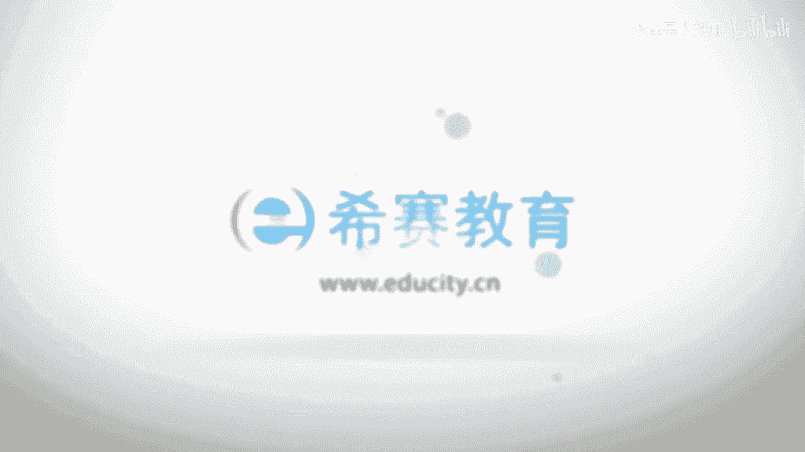

# 【2023敏捷】花了150元薅来的《PMI-ACP 认证考试视频教程》且看且珍惜！ - P2：02 敏捷和ACP项目管理的定义（上） - 狐狸是丿妖耶 - BV1yP411U74D

我想。

那么我们接下来的话再来看啊，敏捷和敏捷项目管理的这样一个定义啊，呃那么这里面的话，其实呢敏捷的话其实它是应对啊，一种啊这种不确定啊，或者说高风险的一些工作啊，那么这一点的话，其实呢我们在刚才的话。

已经和大家是是提到广啊，这里面呢其实这个高度的不确定和相对比较，确定的工作呢，其实它还是有一些差别的啊，为什么呢，比如说像像确定的一些工作项目啊，它一般来讲都有明确的这样一种目标和流程啊。

那么同时呢在类似的这个项目当中啊，被证明是行之有效对吧，大家还记得这个之前的话，我们讲过经验成本这样一个概念啊，那么为什么这些成本在有些场景和项目当中，它是ok的啊，或者说它是嗯可以去用的，对不对。

因为他在以前的这种项目当中啊，唉被证明是可以的，而且我的这个项目和以前的项目啊，相似度还不小，那么这样的话是不是，我就可以直接把它套用过来，对不对，那么所以这种经验呢就可以复制啊。

它所带来的这种不确定性和风险就会比较低，ok所以其实这个的话是一种这个哎呀，这个不一样的一种模式，对不对，那么同时呢我们再来看啊，对于一些新的设计或者说一些问题啊，他有可能都是一种探索性的。

那么这种探索性呢就要求我们那些专家，我们的团队应该什么叫携手携手合作啊，其实我们后面会讲敏捷的话，其实核心来讲呢就是一种群体决策，而不是说要依靠单个人的一些或者说专家的，这这个叫什么叫经验判断啊。

那这样判断的话，其实刚才我们也讲过，其实他的这个成本呢，在一些啊探索性和创新性的项目当中，是比较高的，对不对啊，那么所以呢新的问题啊，或者说比较复杂的一些问题，就需要专家进行携手合作啊。

去解决这个问题啊，创建这个解决方案啊，同时那么因为高度的不确定性啊，它的这个项目变化速度比较快啊，那么复杂性和风险就会比较高，o那么你会看到传统的预测的方法，就是我看我们讲的这个瀑布式的方法啊。

他的目的就是预先把大部分的需求，把它确定好啊，留有一部分的可变量啊，你不能隔断太多，但是你会发现这个我们敏捷呢是什么，是一开始先要把这个什么一部分需求，把它确定好啊，因为你只能确定这部分啊。

大量的需求我们是确定不了的啊，我们必须要去什么进行这种这个拥抱啊，那么所以你会看到传统的预测系统方法的话，我们在前期确定了大部分的需求之后啊，后面呢通过这个变更的请求变更控制流程。

去把那种小部分的这种可变性控制住，因为这种小部分可可可变性的话，它并不影响大局啊，但是到了一种探索性创新性的项目之后呢，它的这样一种这个可变性就成为一种主流了啊，你如果还想把它控制住的话。

那其实就是适得其反了，对不对，ok所以的话我们要用用敏捷，所以敏捷他的方法的出现呢，其实目的就是为了，在短时间之内去探讨这种可行性，因为它是一种探索嘛，对不对，到底是a正确呢还是b正确呢，还是c正确呢。

ok这是一种可行性的探讨的问题啊，没有人经历过啊，前面的话这有可能就是万丈深渊啊，那我也不知道，ok所以这是一种探讨啊，那么根据评估和反馈快速进行调整，如果我用探针，你把后面我们会讲到这个概念。

我们用探针探出这条路线，前面就是一个万能深渊，ok我们就马上指路，那么马上停止，然后就探这个a和c是不是，ok所以你会看到他的这个工作的思路啊，就是在短的一个时间和之内，去探讨这样一种可行性啊。

从而呢根据评估和反馈进行快速调整啊，这就是敏捷啊，这是敏捷啊，非敏捷的话，你会发现它的这个啊所应用场景的话，恰恰就是这种高度不确定的一些工作，那么与传统的绿色型的话，应应对这种高度。

或者说相对确定那些这种场景场景呢，还是不太一样的啊，下面呢我们来看一下啊敏捷的商业目标，敏捷的商业目标呢它是啊有这么几个啊，那么第一的话它是什么叫持续创新啊，因为敏捷的话他的这个啊目的啊是为了产品啊。

包括一些探索性的一些项目的创新的啊，所以容易看到他的商业目标呢，首先强调的就是一种持续创新啊，那么这里面的话他也是提到啊，呃一个观点啊，什么观点呢，创新的想法其实呢在这种权威的结构化的啊。

这种环境之下的啊，是比较难以产生的啊，你比如说像为什么我们讲一，些体制内的一些企业，另外像一些大型的一些央国企啊，呃他们的执行力啊相对来讲是比较高的啊，但是呢他的这个创新的啊。

这样一种能力呢啊会比较低啊，那么相对来讲比互联网的一些公司啊，包括一些这种科技类的公司呢，啊他的这个创新力啊啊会比较低一点，那么究其原因啊，其实啊就像刚才我们讲的创新的想法呢。

在一些这种叫权威性结构化对吧，这样一种环境之下呢，其实他还是比较的啊，这个啊难以产生的啊，嗯我们都讲啊，其实执行力呢有时候的话和这个创新力啊，啊有时候它是一种矛盾的啊，你说执行力的话。

我们都是说要啊从上到下呢，还是要去听话对吗，或者说这个啊指哪打哪啊，那么但是创新力的话，其实它需要有一点容错精神和一些啊，容许一些不一样的想法的啊，所以啊那么创新的想法的话。

其实在这种适应性的文化当中易于产生，那么这种适应性的文化的话，其实究其核心还是在于我们去能够去适应环境，那么包括在这样一种环境之下呢，我们需要对团队呢是要有一种包容的精神啊。

啊你比如说我们举个很简单的例子啊，就是像大家都知道这个3m的话，就是一家创新力比较强的一家公司，那么这家公司的话其实它有一个传统啊，什么传统呢，它是容许员工的话有一些叫空余时间啊。

而且专门给员工在下午留了一个这个，这个这个所谓的空运事件啊，干嘛呢，就是希望你能够去发呆啊，哈哈就开玩笑，发呆的话当然是开玩笑的话，其实他是希望能够激发员工呢，有一些不一样的想法，那么他认为呢。

如果你的员工的话，是百分之百的都在执行领导交给的任务的话，那其实没有任何的时间去什么去进行创新的啊，那一定是你只能是领导来自己去创新啊，对不对，ok那么sam的话这样一种做法的话。

其实在很多的一些这种互联网公司，包括一些这种科技类的公司，他们越来越认可啊，因为啊创新呢必须要留给这个员工，一些叫空白的事件，ok所以你不能指望员工的话执行力又强，然后创新力又强。

其实有时候的话他是有一点相悖的啊，所以这里面的话他也是提到，为什么想创新类的想法，他反而在这种适应性的文化当中易于产生，因为适应性的文化的话，它是啊能够容许这个我们团队啊，是啊有一些不一样的一些想法啊。

有一些不一样的一些风格啊，那么有一些这个这个不一样的啊，那么一些观点啊，那么这些的话其实在啊，我们上午的话讲过传统型的项目管理的，这个啊风格，或者说这样一种体制之下呢，其实啊呃还是会有点相悖的啊。

因为我们讲传统的项目管理的话，其实它更讲求一种权威的文化，一种一种执行的文化，一种监督的文化，对不对啊，所以其实啊敏捷的话恰好是相反的啊，所以这种敏捷的这个啊这种啊体制啊，它是适合于持续创新的啊。

那么第二个啊我们来看一下，就是一种产品的适应性啊，产品的适应性啊，那么产品的适应性呢是敏捷呢非常看重的啊，因为啊我们讲过，其实敏捷的话它的很重要一点呢，是来侧重于产品创新啊。

那么所以他是希望能够打造一个啊，能够不断的去适应客户需求变化，市场环境变化的这样一个产品，所以这个需求的这样一个适应的变化，它不单单是指我们当前的需求啊，更着眼于我们未来的需求啊，我举个例子啊。

什么叫未来需求啊，其实啊有很多的一些领先企业啊，他们的这样一种产品的啊，领先其实是一种超前的啊，啊没说像华为啊，或者说像这个阿里对吧，腾讯啊，那么这些公司呢他们每年的话都会推出一些啊。

你可以叫他叫噱头对吧，也可以称之为叫一些这种啊，领先市场的一种简单性啊，那么它一定还是不仅限于我们当前的这样一个，你看得见的一些需求，那么对于一些所谓的一些啊，叫看不见的一些需求。

那么他认为呢也是需要去不断去适应的啊，那么所以呢它把它定义成，这叫未来的客户需求啊，你比如说我们现在炒的比较热的这个a r，或者说人工智能啊，那么大家都知道百度的话。

像是花了很多的一些资金去研究无人驾驶啊，那么包括阿里的话也是在投资于ai这个方面啊，啊那么其实这个ai的话，我们相信呢目前这个阶段的话，其实很多的一些应用还是停留在概念，或者说实验室的阶段啊。

但是为什么像百度，阿里，包括谷歌对吧，他们仍然愿意去花那么多的一些，精力和时间去研究，因为他们相信这些需求的话，不仅仅是要去适应当前的情况啊，而且是要去挖掘未来的客户需求，ok那么第二个就是降低成本啊。

和开发过程的这样一个整体性啊，那么变更成本的话，其实呢在这个啊这种预测型，或者说我们传统的项目管理当中啊，其实它是比较的看重的啊，我们讲过其实传统的商务管理啊，它本质来讲就是为了去啊。

尽可能的去降低这个变更成本啊，使得我们的这个整个的风险啊比较可控啊，啊那么变工成本不能太高啊，因为我们刚刚也是讲过啊，那么预测型的项目的话，其实它是什么，它是尽可能的把大部分需求都能够预测。

或者说定义清楚，然后呢留有一定的这个啊余量或者说可变量啊，去进行什么，进行相应的这样一种这个控制啊，通过变更程序的话进行控制啊，那么所以其实他的这个最根本的话，就是为了去降低这个变更成本啊。

那么其实对于敏捷呢，他在这方面的话，其实更大的是为了降低我们的这样一种产品的，研发或者创新的一种不确定性，包括它其中的一些风险o啊，那么所以这部分的话是啊一个很重要的方面，那么提啊，另外一个的话是什么。

要去提升开发过程的这样一个总体性啊，开发过程的整体性啊，因为在整个开发过程当中呢，我们的这样一个产品的整体性是非常重要的，那么产品的整体性它是通过什么来打造的呢，啊包括我们的开发测试集成，对不对啊。

我们啊刚才也是讲过啊，那么其实我们在瀑布式的模式当中的话，其实你会发现它的啊，这样一种整体性是比较弱的，因为它很多的一些工序的话，是一个顺序串行的状态，而对于我们的这个敏捷来讲的话。

它是需要有一个整体性，需要把这个相关的一些工作啊，进行看成一个这个整体啊，来这个进行整合，那么从而使得我们的产品的话不再是啊，那么各个这个环节的单打独斗啊，而是能够形成合力，形成协同的啊。

这样一种啊这个这个合力啊，从而去提升我们产品的，对于我们整个客户的一种竞争力啊，ok那么还有呢就是这个技术卓越，我们讲过基础职业的话，其实它是能够提升敏捷度的啊，正因为有不断地追求卓越技术的啊。

这样一种态度啊，那么才能够去不断的去提升我们的一个敏捷度，ok好的，那么这是第二个啊，产品的适应性，那么我们看第三个啊，是缩短产品的这个交付速度啊，其实我们听过一句话啊。

嗯现在的话其实这个在目前的商业环境之下，我们追求的很多都是一种快的速度啊，啊尤其在中国的这个商业环境呢，如此多变的情况之下呢，啊大家都是为了快啊，那个有句话叫什么叫天下武功，唯快不破，对不对啊。

那么其实这个块当中的话，就蕴含着一个对这个市场竞争的这样一个，这个判断啊，那么所以呢我们对于这种开发或者说项目的话，是要去缩短这个交付的进度的啊，尽可能去缩短这个交付进度啊，那么因为什么呢，第一啊。

我们很多的一些行业或者说一些产品的话，大家都有这个市场窗口呢，我们的这个市场窗口如果一旦错过的话啊，我们其实很有可能就比这个竞争对手呢，要要落后很多啊，呃很多的一些这种产品。

或者说这个公司的话都在追求什么，都在追求把我们的产品成为啊客户的初恋啊，成为客户的初恋啊，啊这个像有这个虽然是一种开玩笑的话，其实我们原理是这样的对吧，哎那么一旦成为触电的话，它又很有可能能够伴随终生。

ok所以其实都在养成用户的一种习惯，什么习惯呢，能够去把我们的产品当成一种啊适应的常态啊，一旦它能够接触你，然后形成一种粘性，那么它就很有可能会对你产生依赖感，ok那么所以的话市场窗口是一个非常重要的。

要求把握的一个关键点啊，所以现在很多的一些项目和产品的话，都是要去把握这个市场窗口啊，就我们知道有个名词的话叫他to market对吧，就是上市时间，上市时间一旦错过的话啊。

那么啊这个其实这个这个这个你要再去追的话，实际上是很不容易的啊，尤其在一些互联网的一些行业啊，我们知道互联网行业的话，他想有一个原则或者叫法则吧，那才叫赢家通吃啊，赢家通吃的话其实就是什么意思呢。

就是我们的这个排名前二名的这些啊公司啊，品牌产品啊，其实它是能够去整合大部分的一些资源，为什么啊，因为啊他已经养成了啊这个客户的一种习惯，客户对他非常依赖了，那么这种规模效应越大啊。

它能够聚集的资源就越多，所以其实这种市场窗口啊，由此可见是非常重要的啊，那么所以的话其实敏捷的开发里面的话，它非常重视一个指标，什么指标呢叫投资回收期，ok那么这一点的话，其实和我们传统的瀑布式的模式。

他们经常追求ri是可能是不太一样，r i的话其实是另外一个角度啊，叫投入产出比啊，大家可以想象一下，就是这里面的话，其实它是啊还是不太一样的两个角度啊，r i的话是叫以小博大啊。

我尽量的以小的投资去产生大的回报，而投资回收期呢往往是什么，往往是希望能够快啊，能够快速的去啊，这个有这个回报，为什么，因为小公司啊往往来讲的话，他的这个叫我们讲这个成本比较小嘛。

或者说这个叫啊这个本小小本生意，对不对，那么小本身的话，其实呢他就需要从这个我们的产品当中啊，去快速的去进行现金流的反补啊，反补，然后呢获得我们的现金流，然后去什么啊进行补贴。

下一个这个产品或者说下一个业务线啊，所以他耗不起啊，他不像这个大公司或者大项目啊，他能够去叫放长线钓大鱼，对不对，这个的话，其实在很多的目前的一些这种行业当中啊，互联网或者说开快消品啊，或者说零售业啊。

很多的一些这种行业当中啊，其实他是追求的是赚的是快钱，而不是赚的是大钱，呃大钱越来越难赚嘛，是不是，那么所以这里面的话我们可以看到啊，投资回收期啊，其实在敏捷项目里面的话啊，这尤其在这个商业文证里面呢。

是一个非常重要的指标啊，呃所以这一点的话请大家要注意，因为在考试里面的话，它有这方面的一些题目啊，尤其像这个投资回收期啊，净现值对吧，这些类似于这些财务指标的话，大家要明白它其中的一些原理啊。

那么像投资回收期的话，其实他是来啊，测评我们的投资的这个回收的速度，所以它是越转越好的啊，它不像投入产出比，投入产出比的话，其实它什么它是要越大越好啊，因为越大的话就说明我们投资可能会越小。

然后就回报越大对吧，我们净现值也是一样，经验值的话就是一个现金流的状态，ok那么也是越大越好的对吧，ok所以其实啊，我们讲这个投资回收期要求加快啊，提升这个投入产出比，然后呢把握住我们的市场窗口。

把握住我们的少时间啊，那么同时的话第二的话是叫什么，减少边际收益功能啊，减少边际收益功能，ok什么叫边际收益功能啊，我们都知道在这个经济学里面的话，是有一个叫边际效应的概念对吗，边际效应是什么概念呢。

那么主要是它是一条曲线，对不对，这个曲线的话它是到了一个顶点之后，它会下降啊，那么这个的话我们在中国里面有句古话叫，过犹不啊，这是什么意思呢，你比如说啊你吃一个美食吧，对不对啊，长沙有很多美食啊。

那么美食的话那总归你要有一个限度吧，啊你不可能这个什么，你你把长沙全部的美食都给我吃一遍是吧，而你可能吃第一道菜的时候，你觉得还是非常的开心，吃第二道菜的时候也是很开心，第三道菜的时候就有点不行了对吧。

你以为什么你已经饱了，ok所以其实每一个啊项目啊，其实也是这样一个原理啊，那么它的产品或者它的收益的话，他一定会有一个边际收益点，一旦突破这个边际收益点，它就会呈现边际收益下降，而不会说递增啊。

所以我们其实要去减少一些边际收益的一些，这种下降的一些功能啊，尽可能的让我们的功能的话，是聚焦在我们的一些啊，能够给客户带来持续价值的边际收益递增的啊，那些点上啊，那么所以这一点的话。

其实呢它是要靠什么去把握呢，要靠我们对于客户需求的理解啊，对于市场的理解啊，那么啊其实才能过去准确的准确的找到啊，我们刚才讲的一个边际收益递增的那个点好，ok然后第三个啊聚焦于增值活动啊。

减少为了标准化的一些活动，ok那么实际上在经济里面啊，因为大家都知道精益和敏捷的话，他有说的话是什么，是这个一个一个一个流派啊，相互包含的关系啊，那么在经义里面的话，它其实有一个名词啊。

这个名词的话是什么呢，那么叫价值流程图啊，又被称为叫价值流图，这个的话是经里面的一个非常啊，这个典型的工具啊，那么这个的话在我们的这个新版的敏捷的标准，里面也是有这样一个工具的一个术语解释的啊。

那么你会看到价值流图或者说精益啊，它最核心的是什么呢，是要去发现一些在环节当中啊，产生浪费的一些点，ok他认为什么是浪费呢，ok浪费的话，他认为呢只要有一些活动啊，或者说有一些这种这个啊流程啊。

那么不能够啊给我们的客户带来value，不能够带来价值的话，那么他认为这个的话就是一种不增值的活动，不增值的活动是需要去什么尽量的去减少的啊，不增值的活尽量去减少的啊，那当然如果有有可能改进的话。

最好改进，对不对，那么所以我们敏捷的这样一个项目，或者产品的话，是始终你要聚焦于叫增值活动啊，就at value啊，能够去增加给我们的客户带来价值，而那些不能够带来价值的活动。

是要去毫不留情地进行优化或进行削减的，那么这个的话其实也是精益和敏捷里面的，非常核心的一个理念啊，所以这句话就是意思说，我们要聚焦于增值活动啊，尽可能的减少为了标准化的一些活动，什么意思呢。

那么你们想想看，我们刚刚的话也是提到过，其实在预测型的项目周期里面啊，就是项目的这个过程里面呢，啊它有很多的一些啊这个标准化啊的一些活动，比如说他要写大量的一些文档，对不对啊。

这个的话我们探讨过这个问题啊，那么啊他有可能是为了什么目的呢，哎为了检查，为了向领导汇报对吧，或者说为了去审计，ok那么这些活动的话，在敏捷看来，他是为了标准化而去标准化的一些动作。

那么这些动作的话是要尽量去减少的，因为这些动作呢他给客户不能够带来价值对吧，大家听明白没有，所以像这些活动的话，其实他认为就是一些所谓的，为了标准化的一些活动啊，是不能够去啊这个这个去去增加的啊。

要求减少啊，所以你看到它的核心的话，其实还是聚焦在我们的叫增值活动当中啊，那么第四个啊，第四个的话就是什么，他要选择和发展对项目具有合适技能的个人啊，那么在敏捷里面的话，其实他对个人和团队的重视度呢。

是非常之高的啊，这笔预测型的项目的话是啊，这个应该说高了很多啊，因为我们探讨过这个问题对吧，预测性的这个项目的话，其实它的一个核心是什么，它是叫重流程，它是要重流程啊。

因为重流程可以什么可以产出好的产品啊，这个我们探讨过的问题，对不对啊，为什么要做流程呢，因为预测型的这个项目啊，他的目标需求相对来讲呢是比较的确定的啊，而且呢啊我们讲就是他的这个啊。

这个这个这个整个的环境变化也会比较少啊，所以呢我能够把这个流程把它把控好，一般来讲我们的产品就不会差，对不对，那么但是对于一些动态的探索的，创新的一些产品或者项目的话，你会发现光用流程不够怎么办呢。

依靠团队啊，团队是敏捷里面的这个灵魂啊，团队好，我们的产品才有可能好，因为他做的是一种创新型的工作，所以他在这里面的话是什么，要特别强调，我要去发展团队，我要去选择具有合适技能的团个人组成团队。

那我们接着往下看啊，那么敏捷的核心的商业目标，第四个是人和过程的这样一种适应性啊，那我们知道啊，就是其实为什么敏捷的话称之为叫适应型的啊，生命周期，那么关键一点的话，它其实要去什么。

要去适应这样一种需求和环境的变化，那么所以呢快速响应产品和业务的变化啊，是敏捷里面非常关注的一个点啊，因为我们这个啊之前的话讲过，对不对啊，我们的这个目前的商业环境产品啊，包括业务。

包括商业环境是多变的啊，所以啊作为敏捷的这个项目的话，必须要去快速适应啊，那么同时的话是什么，是变化为整个的动态的商业环境中啊，所必需的啊，所以必须的啊，那么这里面的话其实有一个点啊。

我想和大家去探讨一下，前期你会发现呢，在预测型的这个项目的生命周期当中啊，它的这个变化的啊一个看法实际上是什么，是抗拒的，我像是要抗拒这种什么这种变化，ok为什么大家要抗拒这种变化呢。

因为是啊这种预测型瀑布式的模式的话，他把这个整个的这套系统，看成一个非常完备的一套系统，我不希望有太多的一些变化去冲击它，因为一旦冲击的话，就会带来意想不到的一些这种风险和成本对吧，所以它是抗拒变化啊。

我不需要你对吧，我不需要变化，ok但是敏捷不一样，敏捷他认为变化是什么是必须的，他是要什么，反而需要去拥抱变化对吧，然后呢要去把这个变化呢是什么，从心底里面要去期待他，因为有变化才有商机啊。

才有可能去产生更多的啊一些啊机会啊，ok那么所以的话这种这个变化啊，是这个动态商业环境当中所必须的，这是一个敏捷里面的非常重要的一个观点啊，那么通过这样一种态度，通过这样一种快速响应能力。

去提升人和过程当中啊，这样一种适应性，那么第五个我们看一下啊，是一种可靠的结果啊，那么这样一种可靠结果的话是什么呢，它是能够去支持我们的商业发展和盈利的啊，那么这个可靠的结果究竟是什么啊。

我想和大家呢去啊明确这样一个问题啊，那么其实这个可靠结果的话，就是指我们的产品质量啊，就是指我们的产品质量啊，虽然敏捷它是要快的，但是快的话绝对不能够去牺牲产品质量啊，为前提，这一点请大家一定要注意对。

所以在敏捷里面的话，其实你会发现它有很多的一些指标呢，去监控产品质量的这样一个什么，这样一个高低啊，比如后面的话我们会谈到像漏网缺陷啊，这些名词啊，我们的啊这个后面会不会弹啊。

那么其实你会发现它是通过监控这个产品质量，去达到给予客户的一个可靠的结果，因为客户的话希望能够得到的是一种什么，是一种有保障的啊，啊，能够去实现我们的客户价值的一些这种成果啊。

ok那么同时的话你会发现啊，我们像敏捷的一些这种探索类的，眼镜式的这种项目的指标啊，它不再是与这个以前的叫范围，时间成本范围时间成本这个东西的话，请大家注意啊，它一定是什么。

它一定是一种仅仅关注这样一种啊，静态的过程的，那那么范围先成本我们后面会讲啊，你会发现，他为什么先把这个范围作为第一要素啊，因为他认为范围的话是能够先把它确定下来的，一旦范围能够确定下来啊。

那么我们才能够去什么进行时间和成本的预估，才能够去建立我们的一个，稳固的项目基准结构啊，大家想想是不是这个道理，对不对，但是对于探索型和创新类的项目的话，千万千万不能以静态的啊。

这样一个啊这个指标啊为参考依据啊，恰恰相反，他要什么，他要以愿景，这个愿景到底是以什么愿景呢，这个愿景的话，其实它是以客户价值为导向的一个产品愿景啊，我们的这个产品愿景未来是要构架一个蓝图。

那么这个蓝图的话是，到底能够给我们哪一部分的细分的客户，细分群体产生价值呢，ok那么这里面的话，其实啊它是有它的这个啊愿景的承载着，那么同时的话进度和成本啊，你会发现其实在敏捷里面的话。

它是把它看成是一种相对固定的一个量啊，那么而不是把这个我们刚才讲的范围，看成一个相对固定量啊，这个后面我们会详细去讲啊，所以其实探索类的这个项目的，这个测量指标在发生变化，一从原来的这种静态的范围。

时间成本的框架变为愿景进度和成本的啊，这样一套这个机制啊，应该说是不一样的啊，所以你会看到啊，我们的啊这个敏捷的核心的这个商业目标，我们把它总结一下啊，那么这里面的话其实呢敏捷的核心的商业目标。

它其实啊着重在几个大的点上啊，那么dna的话是什么创新啊，我们的敏捷就是为了要不断的去创新的，那么只有创新才能够使得我们的项目啊，我们的产品啊，能够不断的去什么去创造客户价值啊。

那么第二的话是一种适应性啊，适用性的话是什么呢，要去适应这种需求的变化，环境的变化啊，唯有保持这样一种适应性和灵活性啊，才能够使得我们的产品和项目呢啊能够啊，这个有更大的一个竞争优势，对不对啊。

那么同时的话是要快啊，要快要去把握市场窗口对吧，ok那么这样一种快的速度，其实不光是这种方法上，也是在这种团队上，对不对，ok啊，那么还有呢，是这个我们讲把对变化的一种态度啊，对变化的一种态度啊。

那么变化的话在敏捷看来的话是一种必须的，而且是要去期待的，ok那么最后一句话就是啊可靠的产品的质量，ok所以这五个方面的话，其实是敏捷里面的商业目标，所以大家呢能够把握住这个商业目标的话。

其实就可以理解啊，敏捷里面的一些精髓的一些东西啊，好的那么我们再来看一下啊敏捷的这个起源啊，那么因为敏捷的话，其实呢它是经历了一个发展过程，那么这个发展过程呢，它是应该说呢并不是一蹴而就的啊。

它是有它的一个啊这个step by step，对不对啊，就是一步一步的这个发展的这么一个历程啊，那么他从原来1950年啊，就是19世纪50年代开始啊，美国的这个航空航天局。

就开始采用迭代和增量的开发方式啊，去进行项目的开发，产品的开发啊，那么啊迭代和增量呢，其实这两种模式啊，啊它其实是已经是比这个预测型的啊，生命周期啊啊他是要近了一步了啊。

那么后面我们会讲这个生命周期的时候呢，会详细去讲什么是迭代，什么是增量，这两者有什么区别，它和敏捷又有什么区别，它和预测型有什么区别啊，那么所以的话在迭代和增量的这样一个，开发模式之下呢。

其实他是啊去看到了啊，那么预测型的管理模式呢它的一些弊端啊，那么到了这个19世纪60年代呢，开始应用这个眼镜式的项目的管理的模式啊，我们知道啊，其实在pp里面的话。

它是已经蕴含了这个方面的一些模式的思想，比如说大家所熟知的像滚动式规划，对不对，像这个啊就刚才我们讲ring well planning，对不对，还有呢就是像渐进明细啊。

那么所以其实这里面的一些这种思想呢啊，恰恰是源于像眼镜似的项目管理啊，就是evolutionary project management，ok那么是一种眼镜式的啊，那么这种眼镜式的话。

它的核心是啊这个这个他的思想是什么，它就相当于把这个我们的产品啊，看成是一个原子啊，你比如说你有很小的一个一个内核，对不对，我们先把这个内核打造出来，ok然后慢慢的去滚，你会发现这个这个球啊会越滚越大。

对不对，也越滚越大啊，那么这个滚动的过程当中的话，它会不断的去吸取什么周围的一些input，一些意见的反馈，然后环境的一些对他的一些这种啊，这个这个看法，ok然后呢不断去进行把滚动啊。

分析师这个眼镜式的项目管理的话，它是柔和的什么，这个刚才我们讲的这个啊反馈啊，ok，所以其实这个的话，在我们的这个这个项目管理的这个标准里面呢，其实已经蕴含了相关的一些思想啊，那么到了19世纪70年代。

丰田的经济思想啊开始大行其道啊，那么这个背景我想和大家呢稍微的说两句啊，呃应该说丰田的几家公司呢是非常了不起的啊，他能够创造新意的这样一套体系啊，呃应该说在当时的话是一个划时代的意义啊。

我们可以联想一下啊，就是啊当时的一个背景啊，那么当时的话其实啊我们知道啊，日本的话是一个战败国啊，而且是唯一一个受到核打击的国家啊，其实当时的话那个当时的一代的日本人的话，是非常的勤奋的啊。

那么这才是诞生了很多的日本的，一些叫经营或者说管理的啊，一些天才人物，或者说一些这种经典人物，对不对，大家都啊这个非常熟知的，像这个像松下幸之助，对不对啊，啊那么其实还有写活法的啊。

那个啊这个这个作者对不对啊，那么包括丰田，其实他们啊这一代的日本的话，他们是承担了一个职责啊，什么职责呢，他们要把日本仅仅花一代人的时间啊，能够去从我从这个叫什么一个这种战败国啊，这么一个废墟啊。

这么一个经济的条件之下，然后迅速恢复，然后通费啊，那么所以的话就是丰田的经济思想，恰恰是在这样一个历史背景之下所产生的啊，你会发现为什么精一啊，刚才我们讲到过他的核心思想，其实就是一句一个一个啊。

一句话叫什么叫消除浪费，ok消除浪费，那么其实销售浪费的这个思想的话，放在当时的历史背景之下去理解的话，就会非常容易理解了啊，因为日本的话，第一他当时是一个战败国对吧，他的资源本身就非常缺乏啊。

所以呢他是想方设法的话，能够用最少的资源去创造更大的价值，ok所以这套消除浪费，然后始终非常专注地去为客户去增值的啊，这样一套这个执着啊，这样一套理念，其实在当时的话是获得了非常大的成功啊。

非常大的成功啊，那么我们知道丰田的话，其实啊他创造了丰田神话对吗，后来的话是不仅打败了在啊本土的这些啊，美国的这个一些汽车啊，那么同时的话把丰田的话，甚至于到到这个啊美国，然后也打败了这个美国。

在呃这个应该说这国内的啊，他们的一些汽车的一些行业的巨头啊，啊是非常了不起的啊，那么所以这套经济思想啊，应该说是也是敏捷里面的非常重要啊，也是非常宝贵的一部分的精神财富啊，那么到了1990年啊。

软件互联网软件开始兴盛对吧，大家心想一定要联系，联想到这个这个当时的一个时代啊，那么在当时的话，其实呢啊随着软件的形成的话，你会发现呢，很多的一些软件的开发方法开始新生啊，那么像squ啊，swm的话。

大家很多人都很熟悉对吧，squam的这个开发的理念，敏捷开发理念的话其实很多都是源于光啊，那么我们知道swarm的话，它是最早呢是源于这个美国的橄榄球运动啊，那么sram呢。

其实材料里面的话有一个叫sprint对吧，就是冲刺的概念啊，冲刺的话其实就是源于这个啊，橄榄球里面的就是要不断的去啊，去去去去去去不威胁的去冲刺，对不对啊，那样一项运动啊，那么还有呢极限编程啊，xp啊。

水晶啊，还有动态的系统开发方法，那么这些的话其实都是源于软软件的一些，开发的方法啊，那么这些啊方法呢，后来的话慢慢的成为了一些流派啊，聪明一些流派啊，所以你会看到啊。

这个我们的这个敏捷的这样一个起源和发展，历史啊，啊，可以更加清楚的看到，敏捷是如何一步步走过来的啊，他也是可以更加啊深刻的理解啊，这个思想它是一步步的如何去啊，到今天的这样一个规模。

那么所以你会看到像精液里面的话，它是带有浓重的啊，其实包括这个啊，为什么他是里面有像看板的一些方法啊，是因为它是源于制造业啊，所以他是要进行实时的监控，消除过程浪费，因为硬件的浪费啊，对吧啊。

那么像squirm和这个啊xp啊或者crystal的话，它里面的话，其实为什么他有明显的叫时间的概念，因为在软件开发的这个领域的话，时间是一个非常非常重要的参数啊，它不像啊在制造业。

其实时间啊倒不是那么的关注他，反而是关注库存，对不对啊，关注这个库存成本啊，那么所以这里面的话其实还是有它的一些啊，不一样的一些点啊，所以啊从这个米的起源当中的话。

我们其实确实可以体会到其中的一些这种啊，这个它里面的一些精髓啊，那么我们看一下啊，就是其实敏捷这门学科，确切来讲它的这样一种诞生啊，并不是因为像squm，像xp或者说像精益的诞生，恰恰相反。

那么到了这个90年代，90年代呢，我们刚才讲其实随着这个软件行业啊，他们大量的应用于啊这个敏捷的一些思想啊，啊诞生了很多流派，所以我们讲呢敏捷宣言才是啊，这个我们整个的这个叫什么敏捷学科的啊。

它的这样一个诞生的标志啊，因为刚才我们讲过啊，那么到了90年代的时候呢，啊随着软件开发啊，他的一些这种啊兴起啊，然后呢应用敏捷的一些方法啊，所以当时产生了很多流派对吧，那么像squ，像sp啊。

像这个crystal，对不对啊，像动态的系统的开发方法呢，呃他们都觉得自己是真正的啊，这个这个叫仲宗啊，敏捷仲宗啊，就像这个什么就像叶问啊，这个和嗯呵呵呵呵，另外一个叫什么敏捷的宗师啊。

然后争夺敏捷正宗一样啊，啊那么其实啊他们当时的话这种争执啊，我后来这个有的一些这种研究呢，发现了其实非常有价值啊，因为什么呢，呃比如说com的话它是有它的这个一些优势，而s p的话有它的一些优势。

对不对啊，那么这些优势的话在增值的过程当中的话，大家发现呢，其实啊没有哪一个学科才能够真正的去代表敏，捷，敏捷恰恰是因为这些流派的一个整合，ok那么这种整合的话，后来的话它是啊导致了啊，在2001年啊。

大家记住这个时间啊，2001年的时候呢啊有17位啊，当时有17位敏捷的先驱啊，对还是先驱啊，不是先烈啊，嗯这些人的话大部分都还健在啊，ok然后呢，他们一起在美国的犹他州，一个滑雪场的木屋里面啊。

那么就起草了一份宣言啊，你疫情宣言的话，其实在敏捷行业里的话，那么它是一个纲领性的文件啊，正因为有了这样一个文件啊，才导致啊我们敏捷学科的诞生，所以这份宣言它是非常非常重要的啊，请大家务必要记住啊。

一定要熟记啊，熟记啊，因为围绕这个训练的话，他会有很多考题啊，当然他不会傻到直接考这个题目，这样的题目的话不是说没有，但是很少啊，呃但是确实也有，题目的话是直接考你的这个四句话啊。

那么就考你的四句话的一种理解啊，但大部分题目的话是根据一些场景，然后呢考察你对这个敏捷，它的一种价值观的理解啊，所以其实每年宣的话就是一种核心的价值观，所以呢我们首先来看一下这四段话啊。

我们正在通过亲自开发和帮助他人开发，发现开发软件的更好的方法，通过这项工作，我们开始更加重视啊，个体和互动，而不是流程和工具工作的软件，而不是详尽的文档，客户合作，而不是合同谈判，响应变化。

而不是遵循计划，下面有句话其实讲的还是挺不错的啊，那么也就是说用来用的是哪些呢，就是这些叫流程和工具，详尽的文档，合同谈判，遵循计划，幽栏当中的项目固然有价值，但是我们更加重视左栏中的项目，你看到没有。

可以索栏就是指指这个四个，对不对，个体和互动啊，工作的软件，客户合作响应变化啊，你会发现他这个话说的很艺术啊，那么而且确确实实也是事实啊，也就是说右面的这些对吧，流程工具啊，相信文档和合同谈判。

包括遵循计划，这些的话并不是没有价值，但是在敏捷看来，左边的这些更有价值，因为左边的这段话，更加符合软件开发的一些方法对，所以你看从这个点中的话，我们就可以体会到几个点啊。

那么第一的话其实啊敏捷宣言其实是什么，是从软件的啊这个一些这种原则和流派当中啊，把它提炼出来，所以他其实用于软件开发，用于像一些啊这种啊，这个互联网产品的一些开发其实非常好啊，那么同时的话他也是什么啊。

并不否认以前预测型的一些啊方法啊，但是他有自己的一套理念，ok啊，那么所以这个的话其实就是啊敏捷宣言，其实敏捷宣言呢有在这个行业当中啊，啊有很多人的话，他认为呢啊并不是一种方法啊。

恰恰相反他认为是一种什么，是一种态度，或者说是一种思维啊，那么在我看来的话，其实敏捷的话更像是什么哈，更像是武侠小说里面的武功心法，无功戏法啊，我是比较喜欢读武侠的啊。

金庸的武侠我是这个啊这个14个天书哈，其实都没有漏掉，全部都读了一遍啊，那么其实你会发现啊，咱们举个例子啊，因为金庸的武侠小说里面的话，有很多的一些很厉害的武功，对不对啊，你比如说像什么啊。

降龙18掌是吧啊，看到这个那一掌下去就跟那个什么机机关，就有点像个炸弹一样是吧，ok啊还有那个什么叫一阳指六脉神剑啊，一个个那个都是跟那个激光枪一样啊，未来的话其实就不需要什么未来战士了对吧。

哎呀一下子就这就这个激光枪嘛啊开玩笑啊，还有什么葵花宝典是吧啊，欲练自宫啊，欲练神功必先自宫啊，对不对啊，那包括这个什么这个即使自宫未必成功，哈哈这开玩笑，ok所以这里面的话。

你会发现有很多的一些叫武功招数，但是这些武功招数的话啊，他有一个非常这个呃大的特点啊，就是他必须要源于一套武功心法，你比如说阴阳指也好，蛤蟆功也好，或者说降龙18掌也好。

我们知道他的武功的这个心法是什么，就是一个叫九阴真经的刑法，对不对啊，所以其实心法是一个相对内核，或者说相对于这个精髓的东西，而武功招式可以不一样啊，武功招式我可以有很多的一些变化，对不对啊。

但是心法都是一样的，所以敏捷宣言这四句话，这个四宣言其实就是一个什么，就是敏捷的核心的心法啊，所以大家一旦掌握了这个东西的话，就掌握了最高的武功的心法啊，这个掌握了九阴真经啊。

对那么我们分别呢来解读一下这四句话啊，因为这四句话呢其实还是很重要啊，我们还是嗯希望大家能够深入的去理解它啊，不光是理解，我觉得用一个词比较合适啊，叫咀嚼他啊，或者说反思的啊，那么因为这四句话的话。

是不仅是考试的一个重点，即使在实践当中，也是你判别一个啊做法是否是敏捷的，非常重要的标志啊，那么我们看一下啊，首先呢我们第一句话叫个体和互动，而不是流程和工具，那么在这里面的话。

他为什么那么强调个体和互动啊，因为啊我们讲过啊，就是敏捷的话啊，我们还记得刚才我们讲过的，这个敏捷的主要的商业目标其实很重要，一点的话就需要创新对吧，那么要创新的话，就需要去什么，要去把这个个体啊。

他的一种潜力把它激发出来啊，你很难想象，如果这个个体这个团队都是一群叫听话的团队，他有什么创新力啊，对不对，所以一定要去什么进行啊，这种激发，那么激发的话，其实核心的话什么能够让这个团队授权啊。

那么其实我们知道啊，在国内的话有很多的一些公司啊，或者说一些团队他讲求授权啊，我说啊有授权了啊，其实真正的授权并不是那么容易的啊，它是一种，它不光是一种这个啊做法上的一种转变。

更是一种领导者的态度上的一种转变啊，呃我个人的看法的话，其实你会发现咱们国内的很多的一些领导者，管理者的话，其实都喜欢那种管人的感觉，啊哈啊管人很爽啊，这个的话将是这句话，并不是我说的，这句话的话是呃。

我辛苦听到一个高管高管跟我讲的啊，管人不要太爽啊，哈哈哈啊，所以其实你很难割舍那种感觉，但是在这样的一个环境之下，你必须要去割舍啊，因为你如果始终啊去以管人为乐啊，不能够去激发团队个人的话。

你很难想象这些人能够有这样一种创新力，去激发出来对吧，我们知道华为的话，这个老板任正非，他有句名言，什么名言呢，叫让听得见炮火声音的人去指挥战斗，其实核心的意思的话，让一线的人能够参与到角色当中啊。

所以这个的话恰恰就是敏捷里面授权啊，这个这样一种含义啊，所以观察一个团队是否真正的被授权，就是要看他是否有做决策的权利，是否这个做决策的权利的话是下放给团队的啊，那么所以的话敏捷里面的话。

它是有一个名词叫自管理团队，自适应团队，所以自适应自管理团队它的核心啊，就是能够自我决策啊，能够自我决策啊，这一点特别重要，如果这个团队连自我决策的这样一个能力，和一个范围都没有，很难想象啊。

它有它的这样一个浓浓性，有它的一个创新力啊，不可能的，对不对啊，呃我们知道啊，就是我们举个例子，这个例子的话，这个其实并不是开发开发这个行业的啊，我们都知道这个海底捞对吧，海底捞的话其实呢大家都知道啊。

他的这个服务员啊，呃脸上总是充满着微笑是吧啊，就跟打的就是鸡血一样是吧，有的一些餐馆啊，你去就餐啊，你就觉得哎哟我是不是你欠了你800吊，是不是啊，从始至终啊，就是那个脸就板着对吧。

所有的一些这种啊这个这个这个研究的研究啊，那么为什么对吧，这个饭店就欠了800吊，而这个海底捞的话就什么，就是呃欠了你800吊啊，这开玩笑啊，这他没欠你钱啊，就是说明他的这个这种由内而外的一种喜悦。

对不对啊，有的人就研究过，而且还写了一本书啊，啊我相信有大家的话已经读过这本书，叫什么叫海底捞，你学不会啊，其实在我看来的话，这个原因呢啊其实挺简单的啊，嗯怎么简单的，第一的话。

其实他在选人的时候就选了人家就爱笑的人啊，这开玩笑啊，这个并不是爱笑的人，其实选人的时候其实就选这个啊，容易啊，这个期望容易被满足的人，对不对，你看他选的话，一般都是那种农村出来的。

而且这些人的话往往都是什么，都是一个村里面的人，其实这种社会化的啊，这样一种这个需求是很强烈的啊，啊你要是长期隔离在一种环境之下的话，他就很容易去继续去开不开心，对不对，或者说很容易脾气不好啊。

ok这是第一个，那么第二的话你会发现啊，啊海底捞的这些员工的话，他有很大的一线的决策权，对不对，很大的一线角色选啊，那么可以说这个有个说法，如果这个客户啊对这个饭菜是不满意的，情况之下。

这个服务员完全有能力，什么有这个啊这个这个这个权利去免单，这在一家一些饭店当中的话是很难想象的，对不对啊，因为免单是只有店长或者老板才有这个权利，ok而一线的人就有这个权利啊。

所以我想解决例的话是说明什么叫资管理团队，什么叫资信团队，核心就是能够授权授权的标志就是什么，一线的人能不能做做决策，对不对，他有没有决策的这样一种范围啊，你没有决策的话，很难想想象啊。

就是这个他有这样一种创新力，和由内而外的一种这个这个潜力把它激发出来，对不对啊，ok那么第二个，那其实这个的话是相对于什么，相对于我们破布式模式来讲的，普模式当中的话，它是强调啊。

那么管理者的话是需要进行管控的啊，那么为什么管理者的话是需要去管控的啊，我们想想看以前的时候啊，啊应该说这个p m p或者说这个瀑布式模式啊，他的一种管理思想更多的是源于什么，源于泰勒的科学管理原理啊。

那么泰勒的科学管理原理的话，我相信了解啊，过的这个这个朋友的话，大家都知道啊，他其实是源于什么呢，源于对体力劳动者的这样一种管理的模式，ok那么体力劳动者呢，他的这样一种模式呢是什么，是一种计件制度啊。

太容易疲劳对吧，所以呢对于体力劳动者的话，他是什么，他需要他就是认为这个人生来就是懒惰的啊，啊我是啊不愿意去出力的啊，不愿意去出活的啊，那么但是呢啊对于这个像啊敏捷啊，所用的一些环境。

他很多的一些都是一些叫创新者啊，其实就是这个叫彼得德鲁克所说的，叫knowledge worker啊，知识工作者，ok知识工作者这一概念的话是1969年啊，彼得德鲁克所提出来的啊，他认为像知识工作者。

创新工作者其实就应该被充分的尊重，其中村充分尊重啊，有一个很重要的标志啊，就是管者不应该每天干预他们，而是应该什么相信他们，尊重他们，ok那么所以呢管理者呢在敏捷看来，最重要的是要提供团队。

一个免于外界打扰的环境啊，这一点很重要啊，ok消除创造产品的障碍啊，你是为了去什么给别人去扫除障碍的，而不是为了去什么添麻烦的，对不对啊，那么我们是为了去高高在上做爷的，做大爷的啊，相反什么相反。

人家团队成员是大爷，对不对，那开玩笑没有什么大爷的说法啊，那么只不过说什么，后面我们会讲到一个名词叫服务式领导，仆人式领导啊，所以其实他是把这个身价把他低下来了，要为团队去服务啊，ok还有一点敏捷团队。

他认为比较好的组合是什么，叫通才的专家，这个名词是敏捷里面非常特有的名词啊，叫通才的专家啊，为什么是通才的专家，而不是说我要强调这种专家，你看在预测型的这个，或者说瀑布型的模式当中啊。

这些人每个人都是一个小单讲啊，我们还记得刚才我们讲的啊，每个人其实是被什么被隔离的啊，这种隔离其实并不是说他故意用造出来，而是这样一种划分，就是营造了一种隔离的感觉啊，引导一种隔离的安全啊。

你比如说我是做开发的，我是做测试的，我开发我也不懂测试对吧，我测试我也不懂开发啊，哈哈啊，那么这两者的话其实要老死不相往来啊，那么每个人各干上自己的事儿啊，啊那么在敏捷看来的话。

其实这个的话其实是不合理的啊，他认为呢专家是可以，但是不能够说什么，我完全不懂另外的团队成员在干什么啊，所以要去成为一个通才的专家啊，通财专家，通财专家，意思是说我们既有专业能力，又能够叫通力合作啊。

通力合作这一点的话是很重要的啊，那么在敏捷里面的话，它有很多的一些这种啊，这个团队成员合作的方式啊，你比如说叫结对工作，结对编程啊，那么这些的话其实就特别需要，这个人不仅仅熟悉他所在的这个领域。

反而还是应该能过去什么去熟悉其他的领域啊，所以这个人呢他的这个啊这种啊这个技能的啊，这样一种特点是什么叫t字型人才t啊，t的话就是什么这个大写的这个t对不对，一横，然后一竖对不对。

而我们在预测型和瀑布模式的话，我们称之为这个专家，这个人才叫什么叫i型人才，就大写字母的i h i的i，对不对，i的话你会发现就是很很瘦嘛，对不对，一条线下来了，对不对啊，那么在这个敏捷里面呢。

它还有个名词叫汤从，这个汤从啊，这个汤总的话什么意思呢，c罗啊，c罗啊，大家记得有没有看过那个什么，就是神探夏洛克或者说福尔摩斯的啊，那个你比如说像以前英国的那个什么那个啊，绅士的那个房屋啊。

它都有一个很高的烟筒，对不对，ok很高的烟筒啊，高烟囱的话就是那个烟筒的话就是一直往上的，对不对，ok每一个的话都是什么没有，就是没有和这个其他的一些这种啊相相通的啊，ok这就是汤从当中啊。

唐总的意思的话就说什么，他和其他的一些这种环节没有任何的交集啊，那么70敏捷的话不需要这样的专家啊，他希望的话能够你在这个领域能够专精，同时的话能够和其他的领域能够能够衔接上啊，能够有bridge。

能够有桥梁，ok从而实现这种通力合作啊，那我们来看一下这个过程和工具啊，呃其实这个流程和工具啊，就刚才我们讲其实也并不是说没有价值，而是它的价值的话是敏捷，所应该说这个更加不看重的啊。

啊因为我们之前讲过，他是更加看重于叫左边的价值，而不是右边的价值，对不对啊，所以你会看到啊，他这里面的话说这个有一个呃，这个这个观点啊叫什么呢，过程和工具要需要合适的人，对不对，需要合适的人啊。

所谓的合适的人的话，其实还是要去借助这个团队的力量啊，因为团队啊才是能够去产生好的产品的，一个什么一个源泉啊，这个的话我们之前在啊这个敏捷啊，处理动态需求和目标的时候，他已经讲过这个观点啊。

那么过程和工具的话它有价值，它的价值的话，其实可以帮助团队去思考最佳的路径啊，就是他的这个roadmap，对不对，是可以用这个啊工具啊，工具和过程的话去进行梳理的啊。

啊去啊帮助团队去实现解决问题的一种能力啊，啊但是呢团队成员并不能够因此而产生面对面，那么也不能够去替代对话o，所以其实你会发现啊啊工具固然重要啊，但是人与人的这样一种沟通还是要通过什么。

还是要通过这样一种互动啊，通过这样一种互动啊，才才能去实现啊，那么这种互动的话，在敏捷里面的话是啊特别强调什么，特别强调像面对面的沟通啊，像这种对话啊，conversation对话。

ok那么这样一种面对面的沟通和对话的话，其实才能够去实现信息的啊，更加啊高带宽的这样一种沟通啊，那么后面我们讲到像高带宽沟通啊，渗透式沟通啊，其实都是敏捷所提倡的啊，所以我们这里面的话要注意啊。

啊在敏捷为什么那么强调这种个体和互动啊，而不是流程和工具，因为他认为啊，第一的话个体的话是需要去激发的，那么第二的话是什么，我们的这样一个啊这种互动，它是能够带来更多的一些，更高带宽的一些信息的啊。

所以是很重要的一个点，那么我们再来看啊，工作的软件高于详细的文档，那么这里面的话大家请注意关键词啊，什么关键词呢，就是工作的软件是项目状态的一个什么，最终的啊量化结果啊，这个所谓的工作的软件啊。

工作软件啊，那么这个词的话，其实呢啊它的词它的英文是什么呢，叫workbo，workable product，啊workable product，ok是可供的软件啊。

那么这个可供的软件其实它是有含义的啊，什么叫可控的软件核心啊，核心是什么，它是能够带来value的，啊它是能够带来value的，带来这customer value，ok那么所以我们的这样一个啊产品。

唯有能够带来我们的客户价值，才能够把它称其为叫可工作的软件，那么可供的软件才是我们项目状态的，最终的量化的这样一个结果，而不是什么，而不是文档，ok那么所以呢敏捷的话是特别反对。

在前期花太多时间去捕捉细节，那么这一点的话其实是敏捷非常反对的啊，那么同时啊啊因为这个我们讲过啊，敏捷的话它的这个需求变化是很快的啊，那么文档呢是相对比较静态的啊，所以这里面的话很容易就产生一种负担。

什么负担呢，文档是疲于去进行更新啊，但是我们的这样一个需求变化又太快，对不对，变化也太快啊，所以呢这里面的话就会产生一个偏差啊，我们不得不去为了去更新英文的，而去更新文档啊，那么这一点的话。

其实呢还是啊这个敏捷所不提倡的啊，那么我们讲传统的项目管理呢，其实它是一种线性工作啊，很少什么交互和反馈啊，而敏捷它是鼓励交互的，它是鼓励交互的啊，我们都知道这个文档的话，其实呢它是什么。

它是一种单向的啊，你把这样一个文档传递出去之后呢，啊其实很少啊，这个这个能够得到实时的反馈，一般来讲的话就是一种异步式的沟通，对不对啊，所以呢敏捷的话是啊提倡一种叫同步式的沟通。

这种同步式沟通的话就是什么，它是有这种及时的互动和反馈啊，所以这样一种方式能够得到更多的一些信息啊，从而能够使得我们的这个产品啊，包括一些迭代啊。

