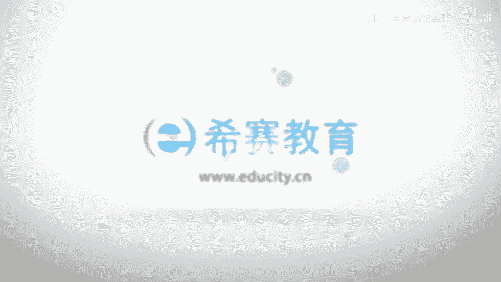

# 【2023敏捷认证】全新PMP考试ACP敏捷知识点精讲视频教程！ - P1：01 为什么需要敏捷 - PMP项目管理那些事 - BV1oP411S7xp

大家好，欢迎大家来到西赛网专业的在线教育平台，我是今天的主讲老师于兆鹏，很高兴能和大家一起来分享敏捷项目管理，ACP的认证培训啊，那么也是欢迎大家来参加啊，呃收看这样一个培训。

下面呢我想呢给大家介绍一下啊，敏捷项目管理啊，ACP的这个认证啊，那么我的介绍呢啊分为四个部分啊，那么第一个的话是什么呢，是这个认证的价值，那么第二的话是这个认证啊，这个考试呢啊他的一些题目的设置。

那么第三的话是这个题目啊，这个考试的一个难度的问题，以及第四个啊，我们讲的是关于啊认证一旦拿到的话，他一个虚证的问题啊，我相信这些的话都是大家的啊，非常关心的啊。

就是关于这个啊ACP认证啊相关的一些话题，那么首先是这个认证的价值啊，那么AACP这个认证呢，它是2014年啊引入到中国大陆的啊，应该说到目前为止的话已经是历时4年了，嗯在在4年当中呢发展的非常迅速啊。

应该看到的我们每年的话都是成倍的提升啊，这个ACP的这个持证人数，那么这就反映了啊，我们目前啊这个应该说组织，包括我们的这个社会啊，包括对我们的这个贝雷斯啊，我们的商业的话。

其实对于我们敏捷的这样一种啊认可啊，也是越来越啊这个大而且是越来越重视啊，那么这就意味着我们学习敏捷啊，并且去考试持有敏捷的这个认证啊，是非常有价值的啊，那么这也为我们日后的这个职业发展呢。

应该说是叫有很多的更多的啊这样一个准备啊，那么还是那句话啊，那么机会总是给有心人啊，事先准备好的人啊，那么有更多的一些青睐啊，所以呢大家呢如果去学习，包括去考这个ACP认证的话，无疑是一个非常好的啊。

一个职业发展的一个开端啊，那么这是第一个啊，那么第二个呢我想说呢来看一下这个敏捷啊，ACP认证啊，他的这个题目的设置的情况，那么AACP认证呢，它的题目的话一共是有120道题目啊。

那么这个题目呢都是单选题啊，大家都知道啊，这个pm的话通常是有这样一个啊，这个设置的方式的，也就是说有20道题目的话是不计分的啊，但是你并不清楚啊，这20道题目的话到底是哪20道啊。

那么根据以往的经验来看啊，那么啊通常达到70%的正确率啊，我们的这个ACP认证通过是没问题的啊，呃那么我们在平常的做题的时候呢，希望大家还是以80%的正确率的，来要求自己啊。

那么这样的话我们在平时啊这个加强刻苦，加强练兵啊，我们在实战的过程当中啊，啊就会这个更加的得心应手啊，啊那么呃考试的难度方面啊，第三个的话我来讲考试的一个难度啊，应该说考试的难度呢啊在近两年啊。

这个过程来看啊，啊基本上和PMP的难度啊啊，持相当的啊这样一个水平啊，里面的场景题还是比较多的啊，那么敏捷呢啊它的场景题啊，呃其实比较多的是啊，就像哪个方面呢，比如说我们对于敏捷思维的理解啊。

啊我们如果同学的话，认真听我的这个视频课的话，你会发现我会比较多的去讲敏捷的价值观，敏捷的12原则啊，包括敏捷实践里面的一些什么，他的思维的一些精髓啊，那么这些的话其实呢是在场景题里面啊。

啊尤其是呃你会发现有些题目对吧，他的这个可能觉得啊两个三个答案都对啊，其实往往是因为你对他的这个思维的精髓，把握的不够啊，这个深要理解的不够深入啊，那么所以大家一定啊，还是去加强对于敏捷的核心的价值观。

对于敏捷的这个原则，包括敏捷实践里面的，他的一些这种精髓的思想啊，这理解啊应该说掌握了这些啊，包括辅以啊我们的这个啊对于标准，对于我们啊这个啊课程的深刻的一个啊，理解之后啊，应该说不是什么太大的难事啊。

啊所以呢它的难度基本上和我们的PMP相当啊，场景题啊不在少数啊，那么概念题确实也有，但是场景题的话，现在呢啊确实反映下来的话也是逐年代递增啊，那么最后还有一个问题的话，就是这个持证的问题啊。

那么一旦考过我们的PMP，AACP这个认证之后啊，那么你可能会关注啊，我们在多长时间之内需要积满多少个PDU啊，那么可以跟大家说啊，那么一般来讲呢，也是在3年的时间之内，挤满30个pd就可以了啊。

这个的话是不同于啊像这个啊PMPPGMP啊，包括PBA啊啊，那么这些的话，其实呢他们往往是基于要积满60个PDU啊，所以对于敏捷来讲的话，其实还是啊应该在这方面的难度呢。

或者说他的一个这个这个挑战没那么大啊，啊持证一旦有这个证的话，这个啊PDU的积累的话还是比较容易写，那么以上呢是啊我给大家介绍的啊，关于这个PMPACP啊，敏捷的这个认证啊，相关的一些事项啊。

也相信呢也都是大家比较关心的一些问题啊，那么希望呢啊能够给大家有所帮助和参考，那么首先呢我做一个自我介绍啊，那么大家也相互的啊认识一下啊，呃那么大家可以看到，在右边的话是个人的一个呃职业发展线啊。

从最初啊中国联通开始做起啊，那么在99年呢我就参加工作了，那么当时第一家公司呢叫国信寻呼啊，寻呼机呢对大家来讲，应该说已经是一个啊非常遥远的历史啊，呃那么在2000年的时候呢。

中国联通的话把国庆巡回收购啊，那么我也是成为中国联通的第一批员工，那么从啊，中国联通的这个系统工程师开始做起啊，包括也是做过大户经理，那么后来的话也是啊，这个先后参与了。

像海尔和一中集团的大型的这个项目啊，也是认知项目经理，包括啊在海尔的话是做这个SBU啊，就是战略企业单元的项目，那么像一中集团的IP的项目，那么04年呢是到上海啊，那么先是在一家日企啊。

叫n t t data啊，那么相信大家呢，有的朋友的话也是听说过这家公司，那么也是从软件工程师开始做起啊，包括先后也是做一些大型项目的，这个项目经理啊，那么当时我从事的这个项目的话。

是关于这个数据分析软件和这个财务软件的啊，那么后来05年的话是到了这个啊惠普啊，中国惠普啊也是任职像惠普的啊这个care manager啊，知识管理经理啊，项目经理啊，部门经理啊。

那么也是先后参与了多个这个啊惠普内部的啊，包括和这个一些啊global全球的一些这种项目啊，那么在10年世道携程啊任职携程的啊，知识管理中心的总监和项目，管理委员会的主任啊。

那么这两年的话是到一家金融的央企啊，也是在做金融的啊，项目管理的培训和咨询相关的一些事情啊，那么这个的话是个人的一个职业发展经历啊，那么将近呢啊有20年的这个从业经历啊，那么在呃项目的这方面的话啊。

差不多是有这个17年啊啊，那么大家可以看到左边呢啊，是个人的一个专业发展线啊，那么也是有幸的啊，成为大中华区啊首位PMP的认证大满贯专家啊，那么包括今天和大家一起分享的ACP，敏捷项目管理啊。

那么包括后面的话大家有兴趣的话，也会这个一起来学，像这个PBA啊，那么商业分析啊，那么PCPMP大家已经是非常熟悉了，对吧啊，像这个PGMP啊，项目管理啊，PMP啊，项目组合管理。

包括也是啊国家外专局首批的啊，NPTP新产品创新的认证专家，那么想想也是荣啊，这个荣获了有一些称号啊，包括在03年呢啊，荣获中国的这个十大优秀项目管理培训师啊，那么包括这2011年啊。

中国的这个知识管理人物啊，所以你会看到那个人的话在专业方面呢是啊，非常的应该说费市场的这个这个专注的啊，那么主要在三个方面啊，那么一个的话，就是我们今天分享的这个项目管理啊，那么应该说呢。

敏捷是项目管理当中的一个分支啊，那么还有呢就是这个啊知识管理啊，KM应该说呢km的话，知识管理呢和项目管理的这样一种结合度呢啊，可以说是越来越高啊，所以你会看到包括我们的这个P6啊，第六版。

还有我们的这个这个这个商业分析要敏捷的话，其实你会发现他们都有一些和知识管理相关的，一些内容啊，那么我相信在未来的话，这个项目管理和知识管理呢，将会结合的越来越紧密啊，那么还有一个的话就是产品创新啊。

那么产品创新的话也是早在惠普啊，05年的时候呢，呃我就在开始做这个产品的这个架构师啊，那么所以的话这三方面是个人的一个啊，这个专业的翻翻的方向啊，那么这个的话是个人的一个这个这个专业和职。

业的一个发展背景的一个介绍啊，呃那么下面呢我想呢，首先还是从啊一个背景开始讲起啊，那么这个背景的话，其实也是在新版的敏捷标准里面呢，他所提到的啊，那么他也提到呢，在呃我们当今的这样一个社会啊。

那么为什么敏捷啊越来越受到关注啊，越来越受到这个大家的这样一个啊热捧啊，那么其实它是有原因的啊，那么它背后的话是有一些这种，社会的发展背景啊，经济的发展背景啊，那么在新版的敏捷标准里面呢。

他提到了几个点啊，包括我们现在啊大家所熟知的互联网架啊，包括啊这个后面我们会讲到云计算啊，包括像大数据，对不对啊，像这个啊很多的一些行业，其实他们都在应用敏捷啊，那么其实这种背景的话。

恰恰就说明了我们现在学敏捷啊，第一是非常有必要的啊，第二的话也应该说，大家也都是非常有前瞻性的啊，那么因为敏捷的话是我们项目管理这个行业，未来的一个发展趋势机，所以我们首先的话来看一下这个背景啊。

那么这个背景的话，我想呢，首先呢还是先从互联网加这样一个话题开始，说起啊，那么互联网加呢这样一个话题的话，其实啊我们知道啊，他的这样一个这个这个重要性是不言而喻的啊，那么早在2014年的时候的话。

发展的纲要啊，呃那么其实互联网加的话，对我们的这个社会生活产生了，非常大的一个影响，这也导致了我们的这样这样一个社会，包括我们的这样一个商业环境，发展的也是越来越快，越来越多变啊，那么我们看一下啊。

其实互联网加呢它在几个方面呢啊，都是对我们的这个商业啊的一个价值的传递，包括创造的一种方式啊，产生了深远的影响啊，应该说无论是线上和线下啊，那么我们的这样一个啊商业本质啊，它是永远不变的啊。

呃你会发现原来的话我们都喜欢逛实体店啊，现在的话这个呃我们尤其年轻人，对不对啊，那么特别喜欢网购啊，那么去通过线上的方式啊去进行啊采购啊，支付啊，或者说这个去去啊改变我们的生活啊，那么所以这里面的话。

其实这个我们刚才讲，无论这个互联网加发展到什么地步啊，那么它的商业本质是永远不变，那么这个本质的话，恰恰也是我们企业和项目的本质啊，那么这个本质到底是什么呢，OK其实就是创造用户价值啊，创造用户价值。

那么这个本质的话是永远不会变的啊，那么无论我们的项目多大啊，无论我们的项目都快对吧，无论我们的企业啊，你的品牌，你的产品是什么，我相信这个点是永远不会变，我们永远是要给我们的用户和客户创造价值啊。

其实从经济学的角度来讲的话啊，我们的啊这样一个企业或者项目的行为啊，其实就是一种利他而利己的行为啊，因为我们是给予我们的客户啊，给予他人啊，那么更多的一些价值，那么我们啊客户的话才啊。

更多的去认可我们的一个价值，OK那么所以的话这个商业本质创造用户价值，这个点是永远不会变的，那么变的是什么呢，其实互联网加的话给我们的这样一个社会啊，它是产生了这个两方面的影响啊，那么第一方面的话。

它是在做互联网的这个加法啊，那么这个java的话，包括啊像设计领域和制造领域啊，都在做这方面的一个啊互联网的加法嗯，大家也知道现在的话很多的一些这种啊设计啊，包括一些智能的设计，智能的制造啊。

那么现在都在用互联网加的一些这种手段啊，去进行一些数据的分析啊，包括啊那么去啊，大规模的去这个引入我们用户的意见的参与啊，大家也知道啊，像这个国内的话有一家企企业啊，非常有名叫海尔啊，那么海尔的话。

其实它原来的话是一家啊，比较传统的一个制造业的企业，那么这两年的话开始转型啊，那么他是从2014年的话，提出了阿米巴模式啊，包括后面的话，他也是引入用户的这个设计的思想啊。

那么去让用户的意见参与到这个设计和制造的，过程当中啊，那么这样一个参与的过程啊，本身来讲的话，其实也是让用户呢能够透明化的看到啊，这个整个的一个产品的制造和加工，包括前期的架构的一个这种过程啊。

其实这个的话其实还是一个，非常高明的一种策略啊，因为它可以使得用户的这样一种满意度啊，那么不断去提升，OK所以的话其实在这个创造价值方面，尤其在一些这种设计和制造啊，那么互联网的话是做加法的啊。

它是把原来的传统的一种设计和制造的过程啊，通过互联网的一些数据和手段啊，引入更多的一些这种意见的import，一些意见输出啊，那么从而产生这个互联网加设计，互联网加制造的啊这样一些过程。

那么还有一个方面，还有一方面的话，其实你会看到互联网的话它是做减法的啊，其实我们经常讲互联网加互联网加啊，其实他的这个互联网呢并不单单是在做加法，还有一部分的话是在做减法啊，那么这些做减法的过程的话啊。

是在哪些领域呢，包含三个角的方面啊，一个的话就是这种信息流，第二的话是物流，第三的话就是资金流啊，呃我们一个月来说啊，那么以信息流为例啊，其实并不是很遥远的事情啊，我们大约就是在这个78年前啊。

那么其实大家获取信息的主要的方式，可能还是报纸，电视广播这些相对比较传统的方式啊，呃我记得呃在这个上海的话，其实地铁里面啊啊有一个叫时代报啊，其实当时的话时代报是发行量非常大的啊。

那么有很多的一些啊这个上班族啊，那么他到地铁乘坐地铁时候的话，必须要拿一份时代报，因为时代报的话是第一是免费的对吧，第二的话它可以帮助这个上班族，可以快速的获取啊这个相关的信息啊。

打破这个坐地铁的时间啊，那么但是你会发现时代报的话在啊，从2015年开始，慢慢的就什么就没了，开始消亡了啊，大家的话也不再去取悦报纸了啊，那么这里面的话再发生了一些悄然的变化，什么变化呢。

获取信息的方式啊，你会看到无论是这个年轻人好，包括一些社会老年人也好，他们开始都是拿着手机啊，那么他们都拿着手机来获取这个新闻啊，现在像腾讯新闻，对不对，像这个新浪的新闻其实不要太方便啊。

通过手机的方式啊，可以立马获取到这个你想要的一些这种新闻的，这个的内容啊，那么所以你会看到这个在信息流的方面啊，那么互联网的话相信他在做减法，那么这个减法的话，其实就是在于把中间的一些环节给缩短了啊。

以前的话其实它是通过一些纸质的媒介啊，那么来获取信息，那么现在的话是把这个时间大大的缩短，而且呢可以啊因你的需求而去订阅啊，你的这个新闻的内容啊，那么所以的话信息流刚才我举的例子的话，仅是一个缩影啊。

那么我们再来看一下物流啊，物流的话你会看到啊，像马云为什么那么的这个去大力的去打造，像菜鸟网络啊，它有一个口号，什么口号呢，就是希望未来的中国啊，快递的话是在24小时之内必达啊。

任何的中国的A点到B点啊，大家听明白啊，是日中国任何的A点到B点，OK那么啊你会说这个其实从长沙到株洲，其实也是A点到B点，对不对，OK那我觉得是OK的啊，那么但是其实你设想一下。

如果从海南到乌鲁木齐的话啊，到伊利的话，那么这个A点到B点其实是不得了的啊，那么这就是菜鸟网络的这样一种梦想啊，那么马云的话后来又说了，我希望参加网络的话，以后的话，发展到在全世界96小时之内必答啊。

96小时之内必达，所以你会看到啊，现在的话这个物流的技术发展的非常的强啊，包括京东的话，现在的话也是在各地的话去发展它的仓，这个仓库的技术，对不对啊，那么目的的话，就是为了让我们的这个互联网加啊。

这种技术对我们的物流实际上是在做减法，那么还是啊哪方面做减法呢，就是物流的这个运动的时间啊，它的效率大大提升，但是它的时间大为缩短，那么我们再来看一下资金流啊，资金流的话。

其实我相信大家感动是非常深受的啊，因为像现在像微信，像支付宝云闪付啊，那么很多的一些支付的方式，包括很多的一些银行啊，第三方机构，他们都在去开发这样一种线上的支付方式啊。

以前的话我记得最早的话还是用啊这个存折，对不对，存折的话现在已经很少见了啊，当然在这个农村市场啊，或者说在一些这种小城镇市场，其实可能还有存折啊，因为啊满足了一部分的需求。

因为他觉得存折的话是有一点什么，有一点这个可见，然后比较踏实的感觉啊，因为那个上面的话是印了这个，这个有有记账记录嘛，OK那么但是现在的话，大部分的一些这种啊城市啊，其实都是用线上支付的手段。

其实它就是一种数字货币啊，那么德业资金流啊也是被互联网加去啊，不断的去做减法啊，那么它中间的这种减法的话，也是一种效率的提升啊，所以其实你会看到包括信息流，包括物流和CD流的话，都在做这种减法啊。

所以这个解法的话，那么恰恰是什么是在传递价值方面啊，所以其实你会看到这个商业的本质啊，那么刚才我们讲的他是在创造用户价值，那么这个创造用户价值的过程的话，其实它又分为两个环节啊。

一个的话就是这种啊真正的去进行创造啊，那么这是被互联网加去做plus去做加法，那么还有的话就是在做减法，就是什么，在这个传递价值方面，那么传递价值方面的话，我们刚才讲到了，其实在信息流。

物流和资金流方面的话都在做这种减法，OK那么其实还有一部分啊，我们讲随着这个用户的价值的创造的一种，互联网加和传递价值的一种减法啊，那么还有一部分的话是在这个用户价值的这个，这个点上。

那么在用户价值的互联网化上面呢，你会发现它有三个方面，那么一个的话是在做个性啊，第二个的话是做体验，第三的话做功能啊，怎么理解，OK那么其实你会发现现在的消费的群体，它的一种个性化需求越来越强啊。

那么为什么这么强呢，啊，因为啊应该说新生代的消费群体，和像7080后的消费群体，其实它的这个消费诉求是有非常大的不同的啊，你比如说以一瓶水为例啊，一瓶水为例的话，可能在对于七零或者八零的这个。

消费的群体而言的话，可能更多的是要解决口渴的问题，对不对，解决这个基本的刚需啊，但是对于九零后的话，或者说零零后的话，他可能除了这个解决这个刚需的，这个需求之外呢，他可能还是特别希望。

那么这瓶水最好能够去啊，有一些我的标志对吧，就是能够彰显出和别人不一样啊，大家都知道这个像有一个品牌的话，叫可口可乐昵称瓶，那么可口可乐的话为什么推出这个昵称瓶，是大受年轻人欢迎，因为这个昵称平啊。

他有很多的一些身份的一些这种标志啊，你比如说像男神啊，男神这个这个昵称平啊，还有的话叫女神，还有叫学霸，对不对啊，那么其实这里面的话啊，那么都是一种什么啊，年轻人的话在买这个昵称瓶的时候的话。

不光是为了喝里面的可乐啊，其实还有一部分很大的一种数学的话，是为了获得一种身份的认同，所以其实你从这个例子当中你会看到啊，那么这种产品的个性化的诉求，是越来越强烈了啊，那么这就是一种这个叫用户价值。

互联网加化的啊，其中的一个特征，那么第二的话是什么呢，就是一种体验啊，那么我们现在知道的话，这个用户的体验是非常非常重要的，尤其对于一些互联网的产品，有，如果啊，如果你的用户的体验。

没有达到一个比较好的水准的话，你会发现啊，你可能就没有机会了啊，你只有第一次机会，一旦第一次机会没有被抓住的话，那么你就后面就没有机会了，OK所以现在的话，很多互联网公司都在大力的去啊。

加强和这个去去去啊，这个啊提升啊它的产品的体验啊，你大家都知道，像这个腾讯对不对，像阿里其实他们有专门的这个产品体验师啊，去专门去研究啊，那么用户的他的体验的这样一种啊人体工学啊。

包括从我们的这个人种学的角度的话，去观察和体会啊，用户的体验的这个诉求点在什么地方啊，那么所以这种体验呢，其实是一个非常重要的方面，那么第三的话就是一种功能啊，那么功能的话其实呢我想说呢。

其实和我们以前的这样一个，单纯的强调产品的这样一种啊，我有什么用，其实它是很不一样的，那么这种功能的话，其实还是基于用户价值的功能，那么用户价值这个东西的话，它一定是一种啊。

相对来讲呢是对每个人可能是不一样的啊，所以功能呢现在是一种高度定制化的啊，所以现在的话很多的一些啊，这个行业都在研究这种定制化的功能啊，那么这种定制化的功能的出现的话啊，那么就使得啊互联网加啊。

那么它的意义就会非常之大啊，因为以前的话可能都是一种标准化的产品啊，标准化的生产流程，那么但是现在的话这个我们的啊消费群体啊，希望我的功能是基于一种定制化的啊，那么所以的话我是更多的啊。

那么希望能够有一些功能围着我转啊，那么对于这个商家来讲啊，对于产品的开发者来讲啊，其实他的遇到了一个非常大的挑战，就是怎么能够去啊，分析我们的这个用户的这个啊诉求啊。

那么同时的话去更好的去匹配他的需求啊，那么还有呢就是更加去啊快速敏捷的去进行，这个用户需求变化的一种反应，OK那么所以其实你会发现啊，啊这里面的话这个互联网加化的啊，他的一种特性啊。

恰恰就是啊预示着啊我们的这个敏捷，未来的话是会被越来越多的企业和行业所接受，那么这是这个刚才我们讲的互联网加啊，那么接下来的话我给大家也讲一讲，就是这个教育业啊，那么教育的话其实呢也是啊。

在这个敏捷的这个实践和应用方面的话，有非常多的一些啊拓展啊，那么你比如说像啊利用这个敏捷技术啊，去进行重要的工作的啊，优先级排序啊啊大家也知道，就是说从这个去年开始啊，那么很多的一些知识的啊，付费的啊。

知识的这个一些这种供给啊，就是这些这种产品啊开始出现，那么大家的话其实对于这种知识付费呢，越来越能接受啊，那么所以教育业的话现在是越来越多的啊，要去考虑人们的这种定制化的知识的需求。

那么既然也是一种定制化的这种秩序的话，他必然要去进行啊用户价值的分析，因为刚才我们讲用户价值的话，其实对每个人都是不一样的啊，我认为经济学就是有价值的，对我来讲是有价值的，OK那么可能另外一个人的话。

他认为数学对他非常有价值，Ok，那么还有人的话认为项目管理，对他非常有价值啊，那么所以每个人的价值点不同的话，就意味着啊这样一个优先级不同啊，那么所以这样优先级的话，那么就导致了在我们的这个产品开发方。

必须要利用像敏捷的技术区域，对我们的工作优先级进行排序啊，所以你会看到在教育行业的话，也是提倡这样一种叫敏捷型的学习，它的本质就是用我们的敏捷技术啊，去给我们的这个用户啊，这样一种这个不同的。

或者说定制化的学习的这样一种诉求啊，进行我们的工啊，这个价值定义包括优先级的排序，OK那么所以像很多的一些方式，包括像面对面的交流啊，包括像所谓的有意义的学习啊，什么叫有意的有意的学习呢。

其实每个人的话，刚才我们讲，其实学习内容的话是有可能是千差万别的啊，那么我所谓的有意义的话，有可能对他人是不一定是有意义的啊，那么所以这种有意义的学习的话，其实还是要啊。

基于我们的这个用户价值的一种判断啊，包括自组织的团队，以及增量式和迭代式的学习啊，其实他们所背后应用的啊，恰恰就是我们今天所讲的这个，敏捷里面的一些原则啊，所以你会看到在教育业啊。

敏捷的话也是在大行其道啊，那么啊有很多的一些这种，包括这个我们的用户，也在用这种迭代式和增量式的学习的方法啊，去为自己去充电啊，那么所以这是两方面都是相互的对吧，一个的话是我们的这个用户啊。

那么第二的话是我们的这个小，这个叫学习产品的，这个产品开发方都在用敏捷啊，那么下面的话我们再来看一下，这个所谓的颠覆式技术啊，那么这些的话其实最新版的敏捷里面的话，他也是提到的啊。

那么有哪些DNA复制的技术呢，比如说像云计算，比如说像大数据，对不对，那么这里的话可能大家都是比较熟悉的啊，你比如说像云计算，云计算的话，其实它是倡导是什么，是一种啊即付即用的啊，按需付费的机制啊。

以前的话这个啊这种啊计算的服务，或者说这些内容对吧，让我们都知道，这个有一些是所谓的云服务的内容，对不对，那么以前的话都是什么，一股脑的把这个内容推给你啊，现在不是了，现在的话都放在cloud上面。

都放在语音上面，你按照自己的需求，OK你按照自己的需求去进行这个啊索取，那么非常像这个一些订阅服务啊，那么所以啊，这些订阅的服务和按需付费的这样一套机制啊，那么增量的一种发布的一种方式啊。

那么就决定了我们的这个啊产品方，或者说我们的一些开发方啊，那么必须啊要去啊，通过我们那些敏捷的一些技术啊，迭代的去进行更新啊，因为你并不知道下一秒用户可能想要什么。

但是你可以通过一些大数据的分析去进行预判，同时的话他如果有序的话，可以去什么啊，实时的快速的去进行反应和变化啊，所以的话你会看到在云服务，或者说这个云计算这个领域的话，也是大量的在应用敏捷。

它的核心的话就是一种迭代式和增量式的，一种交互的方式啊，那么他的目的话就是什么能够快速的去应变啊，去我们的这个用户的需求，OK所以这一点的话是一个非常啊，应该说质的一种革命啊，Ok。

所以这是这个刚才我们讲的这个，颠覆性的技术啊，那么接下来的话，我们再来看一下这个客户的体验啊，客户体验呢敏捷呢，其实他是把客户体验呢，放在一个非常非常高的位置，他是把它放为最高要求啊，那么客户满意啊。

那么所谓的客户满意的话，其实啊从体验的角度来讲的话，还是要具备一个非常良好的体验，才有可能实现啊，我们的客户的满意度啊，那么那么这里面的话其实也是我们去打造啊，我们使得客户满意的。

这个产品和服务的一个关键啊，同时的话这里面怎么能够让客，我们的客户满意啊，其实这里面的话还有一个非常重要的原则，就是能够让我们的客户实时的啊，快速的进行反馈啊，同时把他们的一些反馈的意见。

纳入到我们的产品和服务当中啊，这样的话客户的话大家的一种参与度提升啊，就啊使得我们的这个什么长相的，产品和服务的话不断的去进行更新，而且呢随着这个社交媒体的一些广泛应用啊。

那么客户的反馈的循环啊越来越透明化啊，越来越快啊，那么现在的话其实都是在比啊，我们的这个啊客户的反馈还哪个更快，那么哪一个更快啊，那么我们的产品和服务，更新和迭代的速度就会越快。

我们就很有可能比我们的竞争对手，去领先半步啊，那么这半步已经足够了啊，已经足够能够在我们的市场上啊，去征得我们的竞争优势了啊，OK那么所以其实刚才我们讲啊，为了保持我们的竞争优势啊。

我们很多的企业和组织的话，都在关注客户体验啊，它的内在的本质的这样一个啊这个原因啊，就是在于啊那么敏捷，其实他就是把我们的客户满意度，作为最高的要求啊，那么而这个现在的话。

这样一种这个快速的一个客户的循环，恰恰就是获取啊，客户满意度的这样一个，非常非常关键的一种方式啊，那么刚才呢我们也是通过啊三个方面啊，一个的话是什么，一个的话是刚才我们讲到的啊，这个互联网讲。

那么第二的话像一些颠覆式的技术对吧，像云计算大数据，对不对啊，那么同时还有那个，刚才我们讲了一个客户体验啊，以及我们讲了一些啊，行业的一些这种敏捷的一些应用，比如说像这种教育业。

你会发现敏捷在很多的一些行业啊，都开始有了广泛的一些应用啊，那么这背后的一个原因啊，恰恰就是因为像互联网家啊，像这个云计算这些技术啊，使得我们的商业环境变得越来越多变啊，越来越这个快速啊。

所以从企业方从项目方这个角度来讲啊，他们必须要有新的管理模式啊，请大家注意啊，那么敏捷的话实际上它是一种新的管理模式啊，后面呢我们会讲到啊，其实它是不同于以前比较传统的管理模式的啊。

那么尤其像对一些行业来讲啊，敏捷的模式是非常非常贴切他们的啊，你比如说像刚才我们讲的互联网页，像软件一样啊，其实还有很多行业啊，那么啊一些轻资产的一些行业，他们都在应用敏捷啊。

那么去快速的去获取客户的反馈啊，同时的话去啊不断的去优化他们的产品啊，非这一点的话你会发现啊，它是一个啊，我发生在我们身边的一个非常重要的一个点，所以我们学习敏捷是非常有必要的啊，OK那么我们看一下啊。

我们这个课程啊，其实它是分为一共十个部分啊，那么啊第一的话是我们首先呢去分析一下，为什么需要敏捷啊，那么刚才的话，其实也是从一些大的背景的角度去啊，说明了这一点啊。

那么接下来呢在为什么需要敏捷这个点上呢，我们会继续把这个视角去下沉啊，那么刚才的话是一个整个的社，会和商业的大背景啊，那么接下来的话我们在这部分的话，会讲到在企业和项目当中啊。

尤其在项目当中为什么需要敏捷啊，敏捷究竟能够给我们带来什么价值，究竟能够给我们带来什么优势，OK其实这个道理和原因很简单啊，那么恰恰就是因为啊，那么敏捷能够给我们的企业啊啊往大里讲的话。

就是社会经济代理优势，对不对，包括给我们的企业啊，下一代的优势啊，我们每个人学习敏捷才有价值啊，对不对，OK所以这个的话都是一脉相承的啊，OK接下来的话我们再来看敏捷和敏捷，项目管理的啊。

他的definition定义啊，那么这些定义和概念呢啊，应该说呢都是非常重要的啊，也是考试呢它的一个啊，这个考的比较多的一些点啊，因为你会发现啊很多的一些场景题也好，那么他的这个考点。

无外乎就是考察你对概念和定义的这样一个，理解的深度啊，那么还有呢，就是我们敏捷项目管理的价值和原则啊，我们等会儿我们会讲到，其实敏捷的话核心是有四原则12元啊，这个四宣言12原则啊。

那么这里面的话呃我们所讲的啊，那么敏捷很多的一些流派啊，像QUAN啊，像SP啊，像这个lean精益，对不对啊，像这个crystal水晶，那么这样的话里面的话其实有很多的流派啊，但是这里面的话。

其实你会发现它是万变不离其宗的啊，所以呢啊我们会和大家去讲到这个敏捷的啊，核心的原则啊，核心的价值观，OK那么这个的话是所有敏捷流派啊，他的一个精髓和核心，OK接下来的话我们再来看啊生命周期的选择啊。

其实包括啊像现在很多的一些商业啊，这个项目管理的一些标准啊，那么包括像商业分析，包括像PMP，像PMP啊，像PMP也好啊，那么他们都会在反复强调一个事情，现在的一种项目啊，尤其像单项目管理。

已经远远不是像以前仅仅关注啊，我们瀑布式模式就可以了啊，现在的话有很多的一些这种生命周期啊，所以在这一章的话，他会啊去帮助大家去理清楚，我们在项目管理方面啊，在项目方面有哪些生命周期可以去选择啊。

你比如说像啊，这个刚才我们讲的一种什么瀑布式啊，你还有什么这种，刚才我们也提到这个名词叫增量式啊，还有叫迭代式，还有叫敏捷式，那么这四种的话到底有什么不同呢，啊到底在什么场景之下。

应该选择怎样的一个生命周期呢，OK那么在这一章将为你揭晓答案啊，那么这张的话，其实也是在很多的一些场景题当中啊，考的比较多的一些点啊，因为他要去考察你对不同的生命周期啊。

所应该选择的一种管理模式的一种理解，OK那么还有呢，我们再来聚焦于这个敏捷的实施啊，敏捷实施敏捷实施的话，其实是这里面的一个比较重要的一个点啊，那么敏捷数字化在标准里面呢，它是分为两个部分。

第一他认为敏捷实施，首先要去创造一个好的环境，如果没有一个好的环境的支撑的话，你很难想象我们的敏捷是能够成功的啊，其实啊有一个事情可能是比较悲催的哈哈，我相信也是这个很多的一些实施敏捷的，这个朋友啊。

尤其你如果担任敏捷教练的时候，就会发现啊是非常痛苦的，什么什么事情比较痛苦呢，就是你对敏捷非常的热衷，甚或于你是啊觉得生命里面不能没有敏捷O，但是你会发现你的老板啊，你的干系人啊，对敏捷毫无感觉啊。

OK敏捷是什么啊，敏捷是不是我上了敏捷，我的速度就可以加快一倍啊，是不是我就可以砍掉一半人，OK你听到这些话的话，你是不是觉得有点想吐血的感觉，OK那么所以这里面的话就说。

创建敏捷环境是一个非常非常重要的方面，因为它给我们的敏捷实施啊，有了一个比较好的土壤啊，我们都知道土壤的一个重要性啊，如果没有这样一个土壤文化环境的话，敏捷的实施你很难想象你会做得顺。

所以我觉得在这一版的这个，新版的这个敏捷的这个标准里面啊，它是讲得非常非常好的好的，那么还有呢就是在敏捷的这个实施的环节啊，那么我们讲就是敏捷的这个环境当中，如何去进行交付啊，那么在这个章节当中呢。

他介绍了大量的一些技术啊，这些技术呢也是考试的一些重点啊，那么这些技术呢相对来讲考题不会特别难，但是它非常的繁杂啊，所以要求你对这些工具和知识点，有一个比较清晰的一个了解和区分啊。

所以这是它的一个这个一个重点啊，那么同时呢这里面的话，我也是给大家这个啊加了这么一个敏捷，项目管理的过程的框架啊，那么通过啊你对这个框架的理解，你更加好的去理解敏捷怎么去实施啊，怎么去操作啊。

那么其实在这个我们的新版标准里面呢，他讲的呢是按照知识点去讲的，那么在这一部分的话，我想和和大家去探讨啊，如何从一个时间顺序，如何从一个流程顺序去实施敏捷啊，那么这两套我相信呢也是非常啊多的啊。

就是我们这个注重实战的朋友呢，啊你们所啊比较关注的内容啊，那么还有呢就是在叫关于项目敏捷性的啊，组织考虑因素方面啊，我们知道这个敏捷啊啊其实这个也是一种什么，也是一种成熟度啊，啊有很多的项目的话。

其实它的这样一种敏捷性啊，相对来讲是比较高，那么如果比较高的话，他就容易去什么，容易去拥抱变化，容易去接受需求的这样一种多变性啊，从而能够更好的去适应环境啊，当然如果反之。

你的项目敏捷性的话是比较弱的啊，那么怎么办呢，那么很有可能你的这个啊，相关的这个我们的这个叫什么啊，适用于啊这个我们客户的一种需求变化，环境变化啊，都会比较弱，那么如何去提升这个项目敏捷性呢。

啊他这里面的话是提到了几点，组织的考虑要素啊，应该说啊讲的都是非常到位的啊，那么这部分的话也是考试内容之一啊，那么还有呢就是敏捷的各流派的框架介绍啊，那么刚才我们一直讲，其实敏捷的话它是一个什么。

它是一个流派的一种集合啊，啊我们所熟知的像这个SQUAM，那SQUAM的话其实它出现的比较早啊，那么它在一九啊，这个19世纪90年代就已经出现了啊，那么像SP啊，极限编程啊。

那么像crystal水晶很多的一些流派，那么这些流派的话，他的一些这种区别联系啊，包含共同点在什么地方，OK那么这里面的话，我们专门给大家来讲解这部分，这部分的话。

其实有时候的话也是在考试内容会占这个啊，好多题目啊啊那么所以这部分的话是啊，也是这个我们要去重点讲解的一个部分啊，那么最后的话是敏捷的一些术语啊，那么你可能觉得敏捷税的话不重要啊，但是我想跟你说呢。

其实敏捷的话它考察的就是一种你的理解，你的一种思维啊，那么这种思维的话其实很多的啊，很大的一部分的话，是在于你对他的一些概念的理解啊，所以术语是概念的精华，那么这个敏捷的术语呢它不多好想跟大家说啊。

敏捷的这个术语啊，其实可能只有PMP对吧，偏僻术语的这个1/3左右啊，但是这1/3的术语的话是往往考试的啊，这个见得比较多的或者比例比较大的一些点啊，所以请大家呢一定要把这部分啊，去好好的去理解啊。

那么好好听我的这个讲解啊，那么反过来的话再去啊，对照我们的新版敏捷标准里面那些书友表啊，那么仔细的去揣摩体会啊，啊那么这样的话，其实呢你再去考试和我们的这个场景，答题的时候呢，会有更加游刃有余的感觉啊。

OK那么所以的话就是我们所涉及的这个，十部分内容，那么这里面的话我想还是要强调一点，就是我所讲的一些内容的话，第一我是基于新版的敏捷标准的啊，所以大家在听我的课的时候。

一定一定还是要去对照我们的新版的这个，PMP的新版的敏捷标准去看，那么来结合我讲的这个视频的内容啊，应该说学习效果是更好的，首先我们来看第一部分，为什么需要敏捷，那么我想呢从这个几个品牌开始讲起啊。

那么这个几个品牌呢，我把它称为叫正在被遗忘的品牌，大家请注意啊，并不是消失了，你会发现这个品牌我们都能见到，但是呢可能慢慢的被大家所啊，有可能这个想的不多，对不对哈，有可能这个你压根就忘了他了啊。

那么这几个平方我们看一下啊，微博诺基亚对吧，然后柯达啊这些品牌呢曾经都是啊，至少我是非常熟悉的，而且我也是用的比较多啊，呃你比如说像我之前的话，有一部诺基亚手机呢整整用了10年啊。

我认为诺基亚手机的话可能就会伴随我终生啊，但是我错了啊，你会发现后来的话我们都在改用苹果对吧，OK那么所以像诺基亚的这样一个产品的话，是一个非常好的例子，呃它的产品质量应该说是非常过硬的啊。

我们的呃这个随便拿出来一个诺基亚手机的话，它不仅能够打电话，而且还可以砸核桃，对不对啊，这个开玩笑啊，可以防身啊，可以这个恶狗来了的话，你可以什么一个诺基亚砸过去，然后比砖头都厉害啊。

OK那么但是为什么诺基亚现在的话用的人啊，越来越少啊，那么包括像微博啊，微博的话为什么啊，在之前是风生水起啊，但是这两年的话是慢慢的这个被人所遗忘，尤其是当微信出来之后，对不对，微信出来之后的话。

后来抖音出来之后啊，那么你会发现他慢慢的，这个这个这个用的人还是越来越少啊，呃包括我啊，有一些专职做营销的一些朋友，以前的话都是啊，非常的去热衷于说用微博做营销的，但是现在的话他都跟我讲。

现在的话都在转上微信啊，后来转到抖音上面啊，抖音营销，微信营销，OK所以这里面的话一定有他的一些内在道理啊，包括像柯达，柯达的话，我们都是公认的啊，但是胶卷这个行业的这样一个霸主啊。

但是为什么已经是风光不在了啊，那么现在的话大家都是在用这个数码相机，对不对啊，已经很少有人有人用这个叫什么胶片相机了啊，照片的话可能啊我觉得有可能是一些这种啊，摄影的发烧友可能还在用啊，但是你会发现。

在身边已经越来越少的人去用这个斯柯达了啊，那么所以这里面的话一定有它的原因啊，我们就探讨一下，为什么为什么微博诺基亚和这个柯达会失败啊，我不能叫失败啊，失败这个词的话有可能不一定很非常确切啊。

但是呢它一定有它的一个道理，对不对啊，那么其实这个呃为什么会被人遗忘吧，对不对，那么我想说话呢啊我的一个观点啊，那么我想把它抛出来啊，大家可以一起来这个探讨一下啊，我认为他们的这个被人遗忘的一个。

关键原因就是什么，他们还是在坚持，他们认为所谓正确的一个商业模式，那么拒绝变化，那么从而失去了这样一个创新的原动力，OK那么这项那么这实际上是什么啊，实际上是这个有很多教科书里面，都是这么写的啊。

那么有可能不是我最先说出来的啊，所以你会觉得这个光是依靠这句话的话，其实并不能说明它内在的一个本质原因啊，我也这么认为啊，所以呢我们进步的把它剖析下去啊，那么其实你会发现啊，现在的这个产品开发呢。

它面临着巨大的变革啊，为什么面临巨大的变革呢，那么第一然后再举几个原因啊，第一啊你会发现啊，现在消费者的诉求不一样了啊，就像刚才我们讲的新生代的消费者的诉求啊，那么它不光光是啊要求一种功能的满足对吧。

就像刚才我们讲的这个例子啊，啊那么喝水的话不光是为了喝水，而且是为了一种身份的认同啊，你其实在以前的这样一种消费者的心，理当中的话，你是觉得难以接受的对吧啊，我为什么要花了那么多钱。

去获得一个身份的认同啊，但是现在确实是这样，现在的话越来越多的一些这种消费者，并不是价格敏感者啊，以前的话可能都是为了几毛钱，或者说啊剩回几分钱是不是啊，但是我们父辈的时候的话，可能几分钱也是钱啊。

去跟人讨价还价啊，OK那么所以产品这形态啊，面临着非常大的一些转变，用户的诉求需求面临非常大的一些转变啊，那么同时你会发现那么产品开发的一种变革，也是因为商业环境的一种变化啊，商业环境怎么变化。

那么我们刚才讲过，像互联网加啊，像一些现颠覆性的一些技术，使得我们的商业环境变得越来越多，越多变复杂啊，越来越快啊，我们现在啊，中国融入全球化的这样一种经济一体化，对不对啊，啊其实是这个越来越多越深入。

随着像一带一路，随着像WTO的这个深入的这个，这个这个改革啊，那么其实我们的这个产品啊，面临着啊这个巨大的这样一种变化啊，包括啊互联网的冲击，包括啊像这个外界的啊。

包括我们外来的这个一些产品的一些冲击啊，那么现在很多的一些行业，包括像生物制药R7智能的自动化，新型的房地产啊，精益制造啊，那么这些领域的话，其实它是要求持续的创新的啊，那么经验成本啊在持续增长啊。

经验成本在持续增大啊，那么这句话呢其实他是很有意味的，那我想和大家一起探讨一下，这个经验成本这个词，什么叫经验成本，OK你会发现啊，在PMP里面呢，它有一个非常了不起的技术啊。

这个技术的话叫万能的专家判断，对不对，就是expert justment，OK那么expert justment的话，这个技术啊，为什么在PMP里面的话用的如此广泛啊，大家有没有想过这个原因啊。

其实你往深层的去想的话啊，那么专家为什么那么的重要，因为专家的经验它是可以被复制的，为什么可以被复制，因为PMP所适用的一些项目的场景，往往是什么呢，以前的这个项目的经验，其实可以几乎是七八十%。

甚会八九十%的，可以挪用到现在的项目当中，对不对，大家可以想想这到底是不是这样，OK所以其实他的专家经验是非常宝贵的，我们设想一下另外一个场景啊，那么你现在做的一个项目的话。

是和以前的项目有非常非常不一样的，一些地方啊，有可能之前项目的话根本就没设计过，你比如说以前的话，我们的这个国内就没有人开发过微信啊，你现在如果开发一个像微信的这样一种，一种社交的一种工具的话。

你可能就没有任何的一些潜力可循啊，那么有一些所谓的一些经验啊，有一些所谓的专家的说法，反而有可能会成为你的一种障碍，如果你遇到的是这样一个场景，那么经验成本就会上升，所谓经验成本的话。

就是以前的经验在照搬，挪用到现在的一个项目和场景当中啊，它的成本会提升，那么这个的话就是这种经验成本，OK那么所以的话就我们讲啊，其实这个随着产品的开发的一种巨大的变革。

随着我们现在很多的一些行业开始啊，朝着这个一些创新的模式去发展啊，那么我们的管理模式必须啊要和以前不一样，你会发现如果还和以前一样的话啊，我们的这个成本，或者说我们意想不到的一些风险就会加大。

大家认为是不是这样，Ok，那么所以的话市场，或者说我们的管理模式也需要进行转变，那么这个转变最核心的就是什么呢，要从原来的预测性转化成我们现在的叫适应性，OK什么叫预测性，什么叫一适应性啊，预测型呢。

其实本质来讲，就是我们以前所惯用的PMP的模式啊，所谓的PMP模式的话是什么呢，我们用几个关键词啊，要不再总结一下，那么第一个啊前期啊我们需要比较详尽啊，繁重的计划啊，因为什么呢。

因为之前计划啊叫所谓的谋定而后动嘛，对不对啊，所谓计划比较详尽充分之后，我们做的才会有章法，我们做的才会心里踏实啊，那么但是啊我们现在很多的一些创新的工作，你前期的一些计划你可能就啊想不到啊。

或者说你计划了也是白计划啊，因为他可能面临非常大的一些这种变化，OK所以其实从原来的这样一种计划呢，开始朝这个什么朝适应变化的角度去转变，OK所以其实你会发现预测性和适应性的。

在计划的角度的话就会有非常大的变化，对不对啊，那么还有的话你比如说像什么啊，像啊交付的方式，以前的预测型的话都是什么，都是项目啊，或者说我们的工作都是串行的，但是呢现在呢我们的这个无论是客户也好。

和我们的这个一些消费者也好，他们的耐心越来越低啊，他们要求这个产品更新的速度越来越快，对不对啊，这个是事实吧，OK那么这样的话，你就不能用成年老套的那种管理模式了，你就必须什么要快速交付啊。

快速的给到客户，给到我们的消费者，然后呢是这个这个产品的重现，但是这个产品责任的话，这个我们的这个什么我们的消费者和客户，其实它的期望值也会比较低了，因为你是频繁交付的。

所以我只希望你每次交付给我的这个产品，只需要那么有一点点改进，OK我就很满足，但是这一点点改进的话是我所期望，是我所想看到的啊，所以你会看到我们交付的方式也会发生啊，比较大的变化，对不对。

我看其实还有很多的变化，你比如说像团队管理的方式发生变化啊，我们后面会讲啊，预测性的方式的话，其实它的管团队管理模式的话，更加像一个叫什么专家团队的一种组合，而我们的这个适应性的模式的话。

其实它是有一种叫乐队的组合啊，哈交响乐队的组合，OK所以他也是非常不一样的飞，总而言之的话，我们的这样一种管理模式和市场的一种转变，就要求我们必须要从预测型到现行的一种转变，那么才有可能去避免。

像刚才我们讲的这些品牌的一些这种啊，这种这个被遗忘，或者说失败的这样一种啊这种可能啊，那么去积极的去迎接变化，积极的去迎接变化，而不要去拒绝啊这个我们新的一种商机啊，所以你会发现为什么啊。

那么我们是要从这个，预测性到适应性的一种转变，那么这是刚才我们探讨的啊，从微博对吧，像诺基亚啊，像这个刚才我们讲的这个啊柯达对吧，去探讨出来的啊，我们的管理模式实是要去发生变化的啊。

只有变啊才有可能取胜出啊，就这么简单啊，那么谈到那个诺基亚的话，我想再引用一些手机的例子啊，去和大家去进一步探讨一下啊，那么这是三部手机品牌啊，啊其中有一个的话叫白马牌啊，大家有没有听说过白马牌啊。

啊其实不光你没听说过，我也没听说过啊哈哈，OK其实斑马牌就有可能是一部山寨机了，对不对，那A牌呢你会看到它的形状特别有点像苹果，对不对啊，那么S8的话有点像黑莓是吧不对，白马牌的话其实可能四不像啊。

哈那么白马牌的话有可能就是一部山寨机啊，其实山寨机的话，在这个我们国内有很多的一些市场啊，有非常大的市场份额啊，那么为什么山寨机，我们有些人的话认为他low逼啊，哈认为他比较low啊。

但是他仍然那么的受一些客户的消费者的欢迎，一定有他原因对吧啊，就像黑格尔所说的，存在即是合理啊，你不能质疑这个他这个low逼，它就不能存在，对不对，这个其实不是这样的啊，那么一定有他的存在的理由啊。

OK你会发现啊，山寨机的话它有什么一些特点，OK第一便宜对不对啊，它的性价比比较高，第二它的功能全因为它什么它都是抄袭的啊，我不需要什么一些所谓的设计，我不需要设计，我就是抄袭。

OK第三呢有一个非常要命的，或者说品牌机也非常头疼的一个点啊，就是他推动速度特别快啊，那么有很多的一些品牌机，然后呢它是研发了很长时间啊，才推出来，但是像山寨机的话，它非常快的就推出来了。

所以其实山寨机的话是特别硬，这句话就更快更好更便宜啊，确实是这样的，对吧啊，既然是啊又快又好又便宜的话，那么我们有一些嗯我就是不看重low b的，这个的话我为什么不选呢，对不对，所以你会发现啊。

就是这里面的话，这个就有这样一种尴尬啊，那么这种尴尬的话，其实我只是想用手机这个行业的话，做一个这个隐身而已啊，有很多行业的话，其实它的产品开发就面临这样一个问题啊，什么问题呢。

我辛辛苦苦的这个研发了半年，或者研发了一年啊，这一个月已经算很快了，对不对啊，大家知道有的一些行业的话，你比如说像药品它的研发的周期的话，往往是10年20年，对不对，我辛辛苦苦的研发出来这个产品的话。

发现一上市就已经远远落后了，竞争者为什么，为什么，因为竞争者比你快啊，竞争者比你敏捷啊，所以这个道理的话再显而易见不过了啊，那么我们并不是为了去立贞节牌坊对吧，我们也不是为了去说明我们有多么的高大上啊。

别人low逼，人家就不能活啊，我们高大上，我们就必须呃昂首挺轻的活着，没这道义，市场都是残酷的，市场都是公平的，对吧啊，那么消费者的话，其实呢，他们所看重的就是谁能够给我带来价值啊，我就愿意用谁。

OK就这么现实啊，那么所以这里面的话，其实呢啊对于我们的这个产品开发者来讲啊，我觉得产品解决方案的话其实就一个就是什么，就是要创新啊，就是要创新好，那么这个创意的话，你可能会说这样一段话啊。

你说的很好听啊，创新啊，但是创新很难啊，啊为什么难啊，因为这个理想非常丰满，但是现实很骨感啊，对不对，为什么理想很丰满呢，因为比如说像我们举个例子，像诺基亚，诺基亚的话，我刚才说了啊。

他的这个产品质量我觉得是非常非常OK的，大家有没有这个感觉，对不对，你比如说有个诺基亚手机的话，我我刚才真的说啊，我觉得10年都可以不换他啊，除非你觉得他已经有点有点low了，对不对。

有点这个这个因为更新换代太快了，对不对，我拿出去可能有点面子问题了，对不对，但是就凭这个产品质量来说啊，其实诺基亚的手机质量真的是非常OK的啊，那么诺基亚的这个手机的这个产品的研发呢。

它往往确实就是按照这样一套模式，什么模式呢，就是如期如止，如预算啊，大家听明白了，对不对，就是我按照项目的时间，按照项目的预算啊，按照项目的质量要求啊，去交付的产品，OK那么这个产品的这个开发的流程。

或者说项目管理这样的流程呢是非常严格的，而且是非常的完备的啊，如果没有经过啊一个阶段，这个达到这个某个阶段的一个条件之前，我是不能够进到下一个阶段的啊，当然知道这个它的产品产品的质量过硬的话。

真的是一步步的严控出来的，所以他并不是偶然的，但是你会发现，这个时代已经不需要这样的产品了，对不对啊，我按照严密的一个这种产品控制流程，和产品的这个研发流程，这样的一个产品的话。

其实现在越来越多年轻人他不喜欢了，因为他喜欢什么呢，他喜欢新的东西，他喜欢个性化的东西，他喜欢有好体验的东西，OK所以其实现实就是这么骨感啊，什么骨感呢，现在其实有很少的这个产品服务啊。

可以叫如期如纸预算的啊，去四平八稳的去交付啊，那么更多的是什么呢，这个生命周期啊越来越短啊，为什么越来越短呢，就是刚才我们讲的消费者和客户的啊，他的这样一个这种啊，这个这个耐心越来越小啊。

我期待这个产品的话不断地去推陈出新，这是以现在的人的消费者的一个正常的心态，对吧，我觉得你听到这句话的话，你也认为很正常，OK啊，那么所以啊既然是这样一种常态的话，既然生命周期越来越短的话。

那么是不是传统思维啊，合作法就需要改变一下了啊，怎么改变呢，就不能四平八稳的，去按照我们的这个叫什么范围，时间成本对吧，去进行这个我们的交付，而是要紧盯着紧盯着需求，紧盯着变化，什么需求。

客户需求什么变化，环境变化，OK所以这一点的话，其实呢是目前很多的一些产品开发者，和我们的项目团队，包括我们的企业啊，我觉得应该说是一个唯一出路，所以这就是凸显出某敏捷的一个重要性了。

因为敏捷恰恰能够解决这个问题啊，解决一个创新的问题，尤其能够解决产品创新的问题啊，所以你会看到这个敏捷的话，它是很多都在探讨这个产品创新，那如何让我们的产品啊更快啊。

那么呃应该说在一定的这个范围内叫更好啊，把它推出来，所以你会发现啊，我们的新产品呢，其实它存在着很多的一些问题啊，什么问题呢，有31%的这个项目的话，会在完成前就取消掉了，Ok。

那么实际花费的话会是以前的预计的，189%啊，这个数字已经很高了，将近200%哦，对不对，也就意味着是将近是以前预算的一倍啊，对不对，我看那么所以其实这个问题这么多啊，我们的这个复杂度啊。

项目复杂度的话强也是越来越大，那么这个复杂度的话，其实他体验了很多的方面啊，你比如说像现在啊，我们的客户和我们的消费者啊，要求我们更快的交付实用的产品啊，所谓的实用产品实用主义啊。

OK那么还有一个是什么呢，我们的客户，我们的消费者其实他越来越说不清楚，道不清楚他们的需求了，嗯所以这种需求越来越含糊不清啊，越来越模糊，OK那么还有呢，这个我们的产品面临着更大的一种。

不确定性和风险行吧，这个认同吗，OK那么还有呢就是你会发现啊，在运用底层技术的时候啊，现在的话，很多的一些这种厂商都是什么，进行这种合作的啊，那么因为这种专业化的分工越来越强，我如果什么都做的话。

其实我什么都做不好啊，所以的话就是有的一些厂商连呃，一些底层技术的一部分啊，都把它外包出去了啊，所以其实现在有很多的话，直接复用现有的这个组件，对不对啊，现在的组件OK哦，在使用。

OK那么飞跃其实对于一些产品开发者来讲，这些直接封印的部分的话，往往就是一个黑盒，既然是黑河的话，我们做过产品，做过技术的人的话，都知道他就面临着风险，因为它不是白河，它不可见你在输出问题的话。

什么你只能去依靠你的厂商，OK是不是啊，所以你其实这里面面临着更大的一些风险啊，所以这个复杂度的话从这几个方面来讲啊，包括这个需求，包括这个啊这个这个一个刚才讲速度对吧，包括风险啊。

包括刚才我们讲的这些技术的这个一些，这种不透明性啊，那么这些方面的话，其实都使得我们的这个项目的复杂度，越来越高啊，那么所以一个结论啊，什么结论呢，我们的这个传统的啊项目管理。

其实是已经不能够满足我们的需求了，那么这里面的话，我们就要去啊反思这样一个问题啊，为什么为什么传统的项目管理的话，不能够去满足我们新的问题了，OK好的，那么要回答这个问题的话。

我们不得不去来反思一下对吧，我们的传统的项目管理到底是怎么样的啊，OK好的，那么我们首先呢，还是从这个传统的项目管理的第一步啊，当然你会说第一步的话有可能是什么，是有可能是启动啊，对我同意啊。

哈是启动啊啊，那么我们能不能先从计划开始讲起，好不好啊，那么计划的话是什么呢，在传统的这个啊项目管理当中啊，我们可以讲啊，他有一个非常繁重的一些计划，他要做一堆的啊，这个所谓的这个计划呀。

或者说一些文档啊，那么这些文档呢我希望大家都不陌生啊，包含什么商业论证，包括这个什么这个项目章程啊，包括这个合同啊，很多啊，那么这里面的话你会发现有很多的话，你会似曾相识，对不对啊，那么都要去做啊。

呃你会说这些文档的话，其实我们都有必要，OK我承认啊，那么其实你会发现，这个并不是说我们啊这个这个文章不重要，或者说他不需要啊，那么这些文档的话，很有可能在我们的这个项目当中啊，都是有必要的啊。

但是是不是你会发现有的一些行业的话，他是觉得这些文档并不是都是这个在一些场合，这个需要的啊，你比如说我们是不是项目管理计划的话，不需要在啊那个时间点就显得那么的详细，这个对吗。

OK其实如果你有这样一种感觉呢，我就说明啊你现在已经开始反思到啊，传统项目管理的其中，他有一些这种这个B端了啊，那么我们并不是说这个PMP，或者说这个传统项目管理不好，而是说他其实后面我们会讲。

它其实都有它的适用场景啊，那么在这种繁重的前期的计划方面，其实它确确实实有一些弊端，尤其是对一些行业来讲对吧，对哪些行业呢，刚才我们已经列举了一些行业啊，你比如说像这个啊互联网啊，或者说这个RT啊。

对不对，软件开发呀，这些行业其实你会发现前期这么多的一些计划，你做了之后啊，后面好像很少去详细的去参照它，你基本上还是看什么，看这个实际发生情况是什么，然后呢我们再来应对啊，你基本上就是看我们的领导。

它所关注的是什么，然后我们再去什么再去跟进，你基本上就是看我们的这个客户抱怨是什么，然后我们再去什么再去匆忙的救火，我说的对不对，如果你觉得我说的是对的啊，那其实你就承认这个我们的前期啊。

其实并不需要这么繁重的计划，对吧啊，因为有时候我们的项目的话，并不是像搞这个航空航天的项目啊，并不是想像这个造一个航母投项目，对不对，OK这个项目真的是不一样的啊，后面我们会讲为什么不一样。

OK所以传统的项目管理有一个弊端是什么，前期的计划有时候确实过于繁重了，繁重到我们其实不太需要它啊，其实这里面我承认并不是所有的这个啊文件啊，都是这个这个没用的啊，有些文件的话我觉得可能都有用啊。

但是是不是啊一定要这么繁重，我们实际上是要打个问号的，对不对，那么同时的话这个对于客户来讲啊，客户来讲，客户的话其实呢啊对于传统的项目管理的话，它有一个非常非常不合理的地方是什么呢。

客户的要求在啊这个签字的时候，就要把完整的需求把它确定下来，这个是很难的啊，尤其像现在的话，这个商业环境这么复杂啊，那么你期望客户在一开始就把需求，想的很明白吗，不可能吧，对不对，他又不是神，对不对啊。

因为什么，因为他面临是一个复杂的市场啊，因为他面临的是一个动态的竞争对手啊，对不对啊，那么所以我们的这个客户的话，他必须也要看市场变化来决定他的需求吧，你说这个我觉得有道理吧。

OK所以其实你如果在前期就希望他的需求，就确定下来，这是很不合理的，那我们知道其实在瀑布式的模式当中，在传统的PMP当中的话，我们就是这么干的，因为你这么干的话，对于乙方的这个风险很小嘛，对不对。

然后的话乙方的话可以按部就班的话，你比如说你需求确定是不是确认之后的话，我就可以做到BBS了，除了w vs的话，我就可以在做项目的一些这个一些这种进度啊，或者说一些这种什么时间的估算了，哎。

OK然后再去按这个，按照我们的这个既定的计划去做吧，其实哪有那么理想啊，是不是啊，那么还有我们再往下看啊，需求收集后啊，需要制定详尽的这个什么时间表，那么这个时间表的话，其实你会发现啊。

就比如说这个干头图啊，啊那么真的我们都是完全按照干的图去做的吗，未必吧，其实我就不是啊，对不对，你会发现以前我就是严格按照PMP的方式，后来我发现在软件开发的行业。

去严格按照这种方式去做的时候非常痛苦啊，客户需求确实在变，你变了，智慧的话，你怎么说啊，你必须要去改这个所谓的进度啊，因为改进度的话是为了给老板要求，这个去交代嘛，OK但是所以的话这样就造成双重负担。

我一方面的话要去赶这个客户的需求，一方面的话又要去什么给老板去不断的去更新，这个文档啊，这个文档的话反而成为我们一种负担了，这个我说的对不对，OK所以你会发现啊，那么其实它有很多的一些不合理的地方啊。

我们接下来再往下分析，接下来就是系统的这个分析和设计啊，再往下啊，包括啊变更，其实在瀑布式模式当中的话，它是需要严格的变更控制流程的，为什么，其实当时的话，我们觉得这个变严格的控制流程的话。

是一种非常合理的，而且有时候是一种天经地义的，但是后来的话发现你仔细分析一下，我觉得不太对劲，因为什么呢，因为有很多行业的话，尤其你如果做一个互联网的产品，对不对，它的变化是一种常态。

你每天的话如果没有发生了什么变化的话，你就觉得你好像不对劲儿是吧，你又觉得你好像没有干什么工作，OK所以其实有一些行业，它的变化是常态的情况之下，那么严格的变更的控制流程。

这样一套模式其实就是不合理的了，那么PMP的这套模式的话，它是目的荷载，我给大家讲一下，其实他们最大的目的就是为了去防止风险的，而且这个风险的话，恰恰就是为了防止变更给他带来的风险啊，为什么会这样。

后面我会讲啊，OK好的，那么我们再往下看啊，你会看到客户其实一直在等待他所要的产品，那么等的心焦啊，等的心急啊啊等了一年半年之后，终于出来了，客户一看这个产品OK了，什么表情。

大家这个以前都是做过项目的啊，你你会觉得是什么表情，OK我我是看到过这部表情，对不对啊，有的是你会期待这个客户，是非常惊喜的一种眼神，但是客户给你的表情是非常的惊讶啊，而且有时候是愤怒，对不对啊。

这这个其实我说的实在话，有时候客户不想不打人就不错了啊，你你就烧高香了，你已经那么，所以其实这里面的话就会存在这个问题，对不对，我们辛辛苦苦的研发那么长时间啊，整天啊加班加点，我们觉得自己很冤啊。

自己也很辛苦啊，啊那么但是为什么客户的表情差异如此大呢，为什么为什么，哈哈哈对，当时的话我想说实话，这个有一整夜没睡着啊，就第一次的时候啊，我的第一次啊，我的意思就是被这个客户蹂躏的时候啊。

啊一一宿没睡着，因为我觉得我个人的话还是非常敬业的啊，但是客户给我的表情的话，显得好像显得我要么不能，要么我是食指啊，那我相信啊这个经历过这个场景的话，这个这个项目经理啊，包括这个咱们都有这样一种。

感同身受的一个体验啊，所以我就反思这个问题到底为什么啊，那么后来的话，这个讲的是也是和一些同行专家聊了一下，或者后来的话这个学历敏捷之后才发现，确确实实是这种现象，并不是你个人的错啊。

也很有可能是这个什么机制，对不对，OK这个机制有可能是用错场景了啊，那么所以他被最本质的原因的话就是什么，客户和开发团队实际上是被隔离了，被隔离是导致了我们客户和我们开发团队，所呈现的差异是天差地远。

如此之大，OK那么我们来分析一下为什么被隔离啊，所以这个的话逻辑的关系都是一层一层的，我们来分析一下为什么被隔离哈，那我们看一下，其实一个比较啊，通常的这样一种景向的话是什么。

我们的客户把我们的需求解释给项目经理，对不对，是这样的，他并不是给我们的团队解释听的吧，OK好那么其项目经理的话是给我们的需求的话，再解释给我们的团队成员，是这样吗，那么团队成员如果有问题的时候的话。

他是什么，他绝对不会直接找到客户啊，那我现在说的都是以前通常的一些场景啊，我相信大家的话，对这个的话都是非常的感同身受的啊，OK他是把这个问题一定是反馈给项目经理的啊。

那么项目经理呢再把这个问题的话反馈给客户，OK客户哎，我给你解答问题啊，然后呢那么再把这个问题的话，什么项目经理再传递给我们的这个团队成员，OK是这样，OK所以呢开发者的话什么我们腾出来的话。

根据项目经理给我们的解释哦，是这样啊，那OK我来根据你的说法，跟你的指示来什么进行产品的开发啊，哈加油加油干，加油干啊，加油干啊，但是那but哈哈哈，对不对，但是这里面的话发现了车有蛮大的问题啊。

因为这里面客户和团队就已经被隔离了，对不对，中间的话有一个角色在起着，一个我们称之为叫纽带的作用啊，这个人是谁啊，OK就是项目经理啊，就项目经理项目经理的话，把这个过程的话。

其他是承担了一个叫翻译的工作，OK那么我提一个问题，你觉得项目经理在这个过程当中的话会出错吗，一定会出错，一定会受挫，是人就有错，对吧啊，这个你看这个呃长沙嘛，对不对啊，然后的话这个我们长沙的话。

对不对，更何况我们这些凡夫俗子啊，对不对哈哈对不对，所以项目经理的话一定会犯错啊，那么所以这种需求的误读，需求的这个这个这个解读的失误失真啊，这个都是太正常不过的事情了。

那么一旦有这种呃这个信息的一种失真啊，或者说这种误读的话，开发者它的开发的这种产品，它一定会不一样的对吧，这个承认法OK他一定和我们之前的那个什么啊，这个这个我们讲就是，Q和E的初衷是不一样的啊。

更何况有时候客户所解释的未必，那么就是他什么就是他想要的，这个我们这个做长项目的话，我们都知道这个道理对吧，有时候他哎我明明说出来是这样，但是他心里想的哎，我心里想的可能还真不是这样对吧啊，OK好。

我们这个在上下看啊，其实刚才的话我们讲过，这个，其实项目经理呢是把客户和团队把它隔离的，那么同时的话其实团队之间也是被隔离的，为什么给我们看一下为什么团队是被隔离的啊，其实项目经理的话把这个时间表啊。

啊根据集时间表的话，把这个任务的话是安排给开发人员的啊，跳人员呢，你看啊每个画都是什么独立工作，对不对，然后呢偶尔问一些问题啊，他们之间的话实际上是相对相对来讲的话，是比较少去沟通交流的对吗。

OK那么为什么，因为其实在传统的瀑布式模式当中的话，我们培养的是什么专家人才，每个人其实就是一个螺丝钉，对不对，然后呢，只需要去负责做好他的这块事情就可以了，别的事情第一他不关心，第二就算他关心。

有可能也说不上话，对不对，因为人家做的事情的话，人家自己心里明白啊，是不是啊，OK所以的话，其实他们之间的相互的交流是很少的啊，所以你会看到其实团队其实是被隔离的，那么测试比如开发完了之后的话。

就要测试，测试和集成之间也是比例尺的独立工作，也没什么交流啊，这是什么，开发完了之后给测试，测试完了之后给继承，集成完了之后给发布啊，对其实这个就是一个什么，从这个我们的这个啊破布式模式当中啊。

他就是把这个工作流本来做好，做好之后呢，你这道工序做好之后啊，你就扔给下一道工序啊，这个的话有道有个名词叫扔栅栏嘛，从那个栅栏当中哎扔过去，对不对啊，把它扔过去啊，那么所以你会看到不光是团队之间啊。

就团队就是比如说这个测试开发集成，这个的话就相当于这个团队和团队之间的啊，团队和团队之间也是什么也是不交流的，或者说很少交流，那么这里面的话就会出现这个问题了，对不对，什么问题呢。

既然客户和这个团队也是被隔离的，团队和团队之间有没有隔离的啊，那么他的信息一定是不畅通的，那么信息不畅通的话，那一定做出来的东西的话一定不是什么，唉，一定不能说百分之百的，就是能够去符合他的要求吧。

是这样吧，OK所以其实这个问题我们就已经找到了啊，传统的项目管理的话，其实它在啊他在这个这种隔离的环境之中啊，所做出来的东西的话一定是相对比较封闭的啊，那么客户的话，那么在半年之后或者一年之后的话。

发现这个东西对吧，是和我所想要的天差地别对吧，我觉得已经是不足为奇了啊，那么所以这里面的话我们就要去分析啊，分析它内在的这样一种本质啊，那么什么本质呢啊这个的话其实是两种模式，一种模式是什么呢，啊。

我把它称之为一种呢叫容易理解的，静态的问题和需求啊，什么叫容易理解静态的这个问题和需求啊，比如说我们生产一个零部件啊，这个零部件就长这个样是吧，哎你比如说这个什么啊，四川发生地震了。

我这零部件还长这个样对吧，哎OK然后呢，我这个什么，这个外部的这个商业环境发生变化了，我至零部件还长这样啊，建造一栋大楼啊，大家举例子的话，什么用这个加农炮啊，去击一个静态的目标啊，击一个飞船。

那么所以他这些问题的话是什么，本质上来讲的这些问题，第一相对比较好定义，比较好理解，比较好理解啊，那么第二的话是什么呢，问题不太变化啊，比较静态啊，同时呢啊是一个可预测的。

就是我基本上可以按照你的这个流程啊，预测到你下面会发生什么，对不对，那么还有一个问题，它把它称之为叫动态演进式的领域啊，那么需要动态化的这个学习，你比如说登山啊，你并不太清楚下一秒可能会发生什么对吧。

那么包括这个什么，你如果用导弹定位系统啊，去跟踪一个这个喷气式啊，这个喷气式飞机，那么这个喷气式飞机呢它是什么，它是一个动态，它这个不不断移动的一个bug，对不对。

OK所以这两个的话就是它是两类不同的问题，那么这两类不同的问题呢，它的这个这种模式，或者说啊我们的这个观点是不一样的啊，第一种呢我们认为啊是什么呢，呃叫有一个好的过程，就会产生一个好的产品。

那么第二种的话是什么呢，我要有一个好的团队，才有可能去产生一个好的产品，OK你认为哪一个队啊，你想想看你认为哪个队啊，给你给你差不多五秒钟时间啊，你想想看，OK啊其实两者都对啊，其实两种都对。

为什么两种都对呢，第一个一个好的过程，一个好的过程的话，其实对什么，对于这种静态的问题和需求，它是非常的有必要的，因为这个需求和目标相对来讲比较啊，静态啊不发生什么太大的变化。

那么所以呢我就需要把这个工作流，把这个项目的过程把它梳理好，那么这个东西但梳理好的话，我就可以什么不再依赖于某一个人，我可以把这个事情进行标准化，那么这个适用标准化的话，我们的这个质量啊。

包括这个步骤啊，生活都可以标准化，那么我们产生的这个产品啊，这不会特别差对吗，但是如果对于一些动态化的啊，高度创新的，高度探索性的一些这种产品或者项目的话，你会发现我们光有过程就不一样了。

因为这个过程它不可预测，对不对，OK所以的话我们需要这个团队，需要发挥这个人这样这样一个能动性啊，发挥团队的这样一种协作的啊，他的力量，OK所以的话我们需要这个打造一个好的团队，那么一个好的团队。

一个高技能的啊，有高度协作精神的这样一个团队，他很有可能产生好的产品啊，所以这是两者呢非常不一样的这样一个点啊，所以呢我们来探讨一下为什么需要敏捷啊，我们其实可以把它总结一下了啊。

那么敏捷的话其实它有几个大的优势啊，比如说我们看一下啊，可视性啊，灵活性，短期的预测性和长期的愿景啊，这个名的话我想来和大家解释一下啊，什么叫可视性啊，可视性的话。

其实在敏捷里面的话是非常重要的一个特性啊，他是把一些相关的一些进度啊，包括一些问题啊，都把它暴露出来，而在这个瀑布式的模式当中的话，其实这一点呢它还是相对来讲是一种黑盒，为什么讲黑盒呢，比如说客户的话。

其实他是看不到这个生产过程的，他是看不到这个研发过程的啊，他是直到这个我们的这个叫什么，我们的这个产品出来之后才发现诶，这个不对了对吧，但是所以敏捷的话，但是倡导把这样一种产品的研发过程。

也把它暴露出来啊，通过什么方式暴露出来呢，通过比如说像一些叫信息发射源，通过一项把一些项目的进度啊，这个实时的可视化出来，那么通过什么方式把它可视化呢，OK通过信息发射源，通过一些这种可视化的图表。

或者说一些工具啊，把我们的问题也好，进度也好，项目的状态也好，全部把它暴露出来，暴露出来不要紧啊，其实就怕什么，就怕你问题藏着掖着对吧，问题暴露出来，我们就可以一起想办法啊，我们的干系人对吧。

我们的相关方啊，我们的这个客户其实可以一起和团队去干嘛，一起想办法去解决问题，同时可视性呢，其实还有一个非常非常关键的一个作用，什么作用呢，就可以营造一个所谓的一个词叫信任，信任啊。

这个词啊这个年头特别稀缺啊，我说这些话的大家认同吗啊，很稀缺啊，你看就是那个你想这个敏捷啊，很重要一点啊，就是要去建立什么，和客户和我们的相关方之间的一种信任，一旦这样一种信任关系建立起来之后的话。

其实有很多话，有很多的一些这种默契就可以建立起来啊，让我们知道这个和一个朋友啊，那么你如果这个其实缺乏信任的话，你有些话的话，你就可以，你要学吗，还有斟酌再三对吧，才能说出来。

如果是是一个很好的朋友的话，你有很好的信任的话，其实有很多的一些这种沟通成本就可以降低啊，就因为他省去了很多的一些磨合成本，对不对啊，所以可视化也是这样一个道理啊，那包含我们现在消费者的话。

也是非常崇尚这样一种可视化啊，啊比如说我们现在的话都是喜欢到一些叫什么，叫一些所谓的叫生产过程透明的一些饭店啊，你比如说这个台湾的话，有一家有一家餐馆的话叫四海游龙，那么四海游龙这家餐馆的话。

其实它的一个特性啊，就是什么，就是把这样一个生产过程把它可视化是吧啊，就像你看到这个厨房他们在做什么啊，包括你看有很多的一些餐馆都在用这种模式啊，广东啊，我有很多的一些餐馆都在这，用这种可视化的模式。

那么目的话就是什么，拉近和客户之间的一种距离，让你放心，让你对我产生一种信任感啊，这样一种信任感，其实是有时候是这个金钱和时间他是换不来的，对吧啊，它确实确实需要一些这种方法。

那么其中可视化就是一个非常好的方法啊，那么第二灵活性，那么为什么要灵活呢，因为这个团队和项目的话，只有灵活才有可能更快的更好的去拥抱变化，那么怎么能够提升这个灵活性呢，后面我们会讲啊。

其实原因啊这个这个最重要的手段就是什么，提升这个叫敏捷度啊，或者说敏捷性啊，那么其实这个敏捷性的话，它有很多的一些方式去提升，比如说像什么，比如说他可以把这个啊技术啊，那么用更好的技术啊。

那么因为信息技术的话，可以使得我们的这个产品开发的这个过程啊，叫事半而功倍，对不对，那么他可以去进行架构的优化啊，那么这样的话也可以提升这个敏捷性啊，啊消除技术债务啊，这么这些名字的话。

其实我们后面会讲啊，所以大家在这个时间点呢就可以记住啊，就是我们的这个灵活性，其实它是有助于迎接或者拥抱变化，那么这个团队一代善于拥抱变化，其实这个团队就不得了啊，因为他就可以。

什么可以比别人活的这个生存的更好啊，生存的更好呃，为什么这么讲呢，我想呢在这里讲的话还是举一个小例子啊，那我们这都知道啊，就是说其实很强有力的啊，啊生物未必是能够活得好的啊。

你比如说我就举一个强有力的生物的例子啊，啊恐龙恐龙绝对要强要有利，对吧啊，你看那霸王龙长得比一个楼都和都高，对不对哈，然后呢，这个几乎就是那个时代的一个，什么地球的霸主了，对不对啊。

但是你会发现恐龙的话什么很早就灭绝了啊，和恐龙同一个时代的还有生物啊，人家现在都活得非常的滋润啊，嗯这种生物呢在南方还是多一点啊，尤其在一些潮湿的地方啊，大家已经猜到什么生物了，对不对啊。

对就是小强啊哈那么小强其实我在这儿呢，说句话，小强其实他是非常具有敏捷性的啊，哈哈非常具有敏捷性的，所以我们要学敏捷啊，像像要像小小强学啊，我们要成为小强啊，为什么小强的话他就敏捷性。

因为你看小强他别的本事没有，他就善于什么，善于适应环境，那么恐龙的话非常的强有力，但是它不能适应环境啊，那么据说有一个数据啊，是什么数据呢，就是这个恐龙，比如说我用一把刀啊，在这恐龙那个尾巴上砍了一下。

哈哈砍了一下，砍了一下之后的话，这个呃大家猜一下啊，这个大约有多长时间啊，这个会这个疼痛啊，会传递到这个什么，这个这个恐龙的脑脑袋当中啊，因为这个恐龙很大嘛，很长嘛，对不对啊。

这个有一些古生物学家研究过啊，嗯大约可能会是在8分钟啊，8分钟8分钟的话，这个疼疼痛啊，这个感觉才会传递到什么，传递的这个恐龙脑袋当中，这个实际是你觉得好玩，但是很可怕的啊，那么因为他反应速度太慢了。

那么既如此，反应速度慢的生物的话，它不灭绝谁灭绝啊，对不对，所以其实你要活得更好，生存的这个更加的这个这个空间更加广阔，对不对，其实就要提升这种灵活性啊，灵活性相是敏捷一个非常非常重要的特征。

OK我们再接着往下看，叫短期的预测性，那这个词很有意思啊，它为什么不叫长期的预测性，而是强调叫短期的特性，OK我给大家在这里面的话，我想一起探讨一下啊，比如说我们现在的话，都说中国是呃一年一个变化啊。

有很多去国外的啊，我身边有很多朋友的话，但是常年就是什么，就是这种国外和这个国内两头跑啊，但是在国外，国外这个相对待的时间比较长一点啊，因为它是叫驻外的啊，驻外的那个那个那个代表处啊。

那么在国外呢加了一段时间之后的话，你会发现啊，你可能不适应，那为什么呢，在中国的话其实有很多的一些这种便利，而且中国现在确实发展的很快，尤其是像沿海的一些城市，对不对，发展的不要太快啊。

真的是日新月异啊，一年一个变化啊，你比如说让我去预测，或者不用说我了，对不对，我这个就不是什么这个这个所谓的这个，著名的经济学家了，对不对，你比如说让一个经济学家呀，或者说一些这个所谓预言家吧，对不对。

来说哎那么下一年中国可能会发生什么事情啊，或者未来的这5年会发生什么事情啊，预测要准，你这东西是什么，挺难的啊，真的很难的啊，但是我如果说让你预测啊，下一个周对吧，哎然后我们这个团队发生什么事情诶。

有可能什么有可能你就会预测的标准，对不对啊，所以其实敏捷的话就是这个原理，它实际上是比较强调叫短期的预测性，因为短期我们的预测性才会比较精准啊，我们的预测的这个，这个这个叫准确度才会比较高啊。

那么所以它是强调这种短期的，那么相对来讲呢，还有一个的话是什么叫长期的愿景，为什么预测性是短期的，而愿景就是一个长期的呢，因为长期的愿景是一个方向啊，我们一旦确立了我们的这样一个vision对吧。

我们的方向之后呢，我们的这个方向啊，轻易来讲是不能够去随便去改变啊，那么这个的话其实就有点像一个灯塔一样啊，有的专家说啊，敏捷的话就特别像在一个啊漆黑的啊，漆黑的一个一个一个海上，然后呢哎去航行。

想象它是一种探索对吧，探索未知的海域，OK那么前方的话有一个明亮的灯塔啊，那么在灯塔的话，虽然现在来看呢，它是一个远处非常远处的一盏微弱的灯光，但是这个灯光的话就是我们的vision。

那么这个vision是轻易不能改变的，因为这是我们的目标，我们可以在途中啊，去预测下一秒是不是会碰上暗礁，然后下一秒的话会不会碰上美人鱼啊，哈哈在开玩笑啊，那么这个的话就是一种短期的预测性。

正因为我们短期，我们不知道下一秒会发生什么声音，所以我们要去坚持什么，我们长期的这个方向啊，那么这一点的话，其实也有点像什么一个一个相互的对立，统一的矛盾体一样啊。

因为这四点啊是敏捷的非常重要的四个特性啊，就是可视性啊，灵活性，短期预测性以及长期的愿景啊，长预言景啊，所以建议从这四个特征来讲的话，你会发现它其实是比传统的项目管理，更加适合于一些动态化的啊。

或者说一些这种探索性的演进式的啊，这样一些需求的场景啊，那么因为在那种场景之下呢，我们的啊有很多的一些这种风险和，未知的一些情况，所以我们需要敏捷这样一套管理模式啊，去帮助我们去降低风险。

去减小这种不确定性，这就是敏捷啊，当时他所产生的这样一种初衷啊，所以敏捷对于我们的啊，我刚才我们讲啊，就是对于尤其像我们现在的这样一种这个社会，经济的啊，或者企业的这样一种环境是真的特别需要啊。

因为像互联网加啊，包括像我们现在很多的一些这种发展，使得我们的这样一个商业的这个生态啊，真的是非常复杂多变啊，你真的不一定知道你下一秒可能会在何处啊，那么所以的话特别需要敏捷的这样一种方式。

去探索式的眼镜啊，那么所以还要用以前的瀑布式的模式，去进行应对，可能已经不能够满足需求了啊，那么这就是为什么我们需要敏捷，那么我们需要敏捷的话，我们刚才的话也是从几个方面对吧，我们稍微总结一下啊。

啊第一的话是从大的背景对吧，互联网加颠覆式技术向云计算，大数据对吧，像这个客户体验的这样一种，这个客户的需求的一种心态，新生代的一种变化啊，那么包括像这个一些行业，那么刚才我们BH的教育啊。

一些一些例子啊，继续去沿用啊，这个或者说深度应用这个敏捷，你会发现敏捷的话，其实在我们现在的这样一个这个环境之下呢，是很需要的一种管理模式，那么我们就讲了，就说我们在这个企业或者说项目当中啊。

为什么需要敏捷啊，我们是通过与这个传统的PMP的模式相对比，你会发现其实传统的项目这个项目管理啊，它是有很多的一些弊端啊，当然这种弊端的话，其实它是在特定的环境当中显现出来的啊。

你比如说它是前期有非常繁重的一些计划对吧，它的变更控制过于的严谨啊，他的这个客户和团队是被隔离的啊，信息没有很好的去交流畅通，包括团队之间信息也是被隔离了，OK所以这就导致了我们的这个啊PMP模式啊。

在一些这种快速演进式，探索式创新式的一些环境当中啊，不能够发挥它的这样一个啊作用啊，那么所以的话就需要敏捷的这样一种新兴的啊，这个管理模式，所以刚才我们也讲讲，这个新兴的这种管理模式啊，它有一些特征啊。

比如说像刚才我们讲的一种可视性啊，比如说像这种灵活性啊，比如说像这种短期的预测性，以及长期的愿景对吧，所以这些特征的话，使得我们的敏捷的话是能够更好的去啊，这个应对啊这种快速需求的变化。

场景的变化以及我们周围环境的一种变化啊，使得我们的组织和项目的话，那不能够啊适应这样一种变化啊，在这种啊这种这种这个复杂多变的啊，这样一种环境当中啊，去输出啊，所以我们需要敏捷啊。

我们这个每一位啊这个观看视频的同学的话，你们选择学敏捷，说明你们是非常的英明的啊，所以接着呢再学啊。