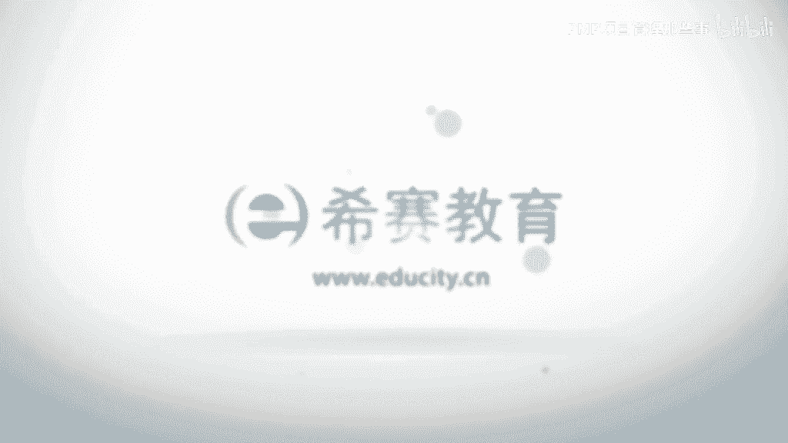

# 【2023敏捷认证】全新PMP考试ACP敏捷知识点精讲视频教程！ - P4：03 敏捷项目管理价值和原则（上） - PMP项目管理那些事 - BV1oP411S7xp

我想。

ok那么我们接下来的话，再来讲一下这个第三部分啊，敏捷项目管理的价值和原则啊，那我们一起来看一下啊，那么这里面呢啊我们刚才讲过啊，敏捷啊，呃其实它的最核心的是什么呢，是这个叫敏捷的四宣言，对不对。

敏捷的这四个价值观啊，那么敏捷的四个价值观的话，它是一个什么，它是一个核心，你比如说我们这个的话是一个内源，那么还有另外一个的话什么，就是敏捷的12原则，我们马上就要讲到啊，敏捷的12原则。

再画语言的话是什么，敏捷的相关的一些实战，ok所以这是一层层的啊，一层一层的这样一个关系啊，那么首先的话是敏捷的价值观，敏捷价值观的话，就刚才我们所学的敏捷的这个四个宣言，对不对。

第二的话是敏捷的12原则啊，接下来我们马上就要讲到对吧，第三的话是敏捷的这个实践，这些的话包括刚才我们讲过的啊，精益看板对吧，swarm sp对不对啊，光ban对不对。

ok其实很多的一些敏捷的时间和流派啊，都是基于什么，基于12原则的，就是刚才介绍我们就要讲12原则的话，其实是基于这个价值观的，所以你看到我们为什么讲价值观那么的重要，敏捷宣言是心法对吧，是内功心法。

你用了这个内功心法，你就有什么，你就有这个根基了啊，你这根基的话，你就可以去学这个，就像那个之前那个武侠小说里面的，对不对，你修炼了这个易筋经啊，你打出的少林长拳才有力，是不是啊。

你就可以学这个波波长得也好，或者说什么大力金刚指啊，对不对，这些的话其实都是外面的招数嘛，对不对，ok所以其实12原则的话，其实也是一个非常重要的一个啊枢纽啊，我们一起来看一下啊。

那么这里面呢想要这个12原则呢，我希望大家也能够去把它记住啊，最好能够记住啊，那么啊如果记不住的话，我觉得其实很重要的一点，要达到目标呢，就是提出来这一个原则，可以马上的去什么联想到它的关键词。

所以这里面的话，我想呢也是给大家呢去把这些关键词，就把它画出来，便于大家能够什么更好的理解啊，ok那我们看一下第一个选择一，我们的最高目标是通过尽早的，那一定要选出来啊，这是关键词，ok持续的交付。

有价值的软件来满足客户，o这里面的话我想稍微的来讲解一下啊，就每个原子的话，我想呢这个稍微讲解一下啊，先让大家对这个原则准则有一个初步的认识，后面我们会有专门的讲解啊，那我们我觉得还是要先讲解一下啊。

那么尽早的其实我们讲过啊，就是为什么要去尽早的啊，因为尽早的交付价值啊，可以更好的去什么给我们的客户带来竞争优势，好带来经济优势啊，啊，因为我们还记得我们之前讲过的一个这个指标，叫什么叫投资回收期。

对不对，但大家还记得吗，ok回回收期的话是什么，我们需要把这个钱啊，成本尽快的回收回来，现在的话，随着这个商业环境的这个什么速度不断加快啊，其实大家都喜欢什么赚快钱，而不是说赚大钱，对不对。

还记得这句话吗，对不对，所以的话其实你越早的给客户价值的话，客户的话去越能够啊越早的去获取到这个什么，这样一种这个价值和收益啊，他能够把这个加速的话去用到，比如说其他的产品线。

或者说去和竞争对手去进行比拼啊，去获得这种竞争优势，ok所以的话今早的是一个非常关键的一个词，第二的话是持续的啊，我们的这个交付的过程必须是一个持续的，而不是一个什么有断层的，因为在交付的过程当中啊。

我们的这个这个这个交付的行为的话，其实一方面的话也是什么，也是给客户一种营造信任的过程啊，所以这样一种过程不能够有断层，那么同时的话这个价值呢也是需要什么，你需要有一个连续的一个啊一个一个流啊，价值流。

ok，那么这样的话才能够给客户呢更大的竞争优势，ok那么包括我们的产品和我们的软件，必须是要有价值的，必须是什么客户能够用的，能够给客户带来收益的，对不对，ok所以这三个词啊是三个关键词。

大家一定要把它掌握住，把它圈起来啊，ok那么第二个欢迎这个词很关键，欢迎对需求技术提出变更啊，那么即使在后期也不例外，敏捷过程要善于利用啊，需求变更帮助客户获得竞争优势，好ok这里面的话我想解释一下啊。

你看到这个敏捷呢，它是要欢迎提出啊，而不是说像瀑布模式啊，他什么也讲过，他什么他是拒绝的，对我是要去拒绝这样一种变化，对不对，ok那么拒绝的原因我们之前讲过的，因为他什么通过拒绝这样一种变更。

去控制这个风险，但是对于敏捷来讲呢，为什么他要去欢迎变更，因为变更变化就意味着商机变化，就意味着我们有更多的一些价值的一种呈现，对吧，ok即使在项目的后期也不例外啊，也是要去什么拥抱这种变化的。

为什么啊，大家有可能有这个疑问啊，呃你比如说我觉得这个不应该在项目的后期啊，也在去拥抱变更啊，你为什么到项目后期的话，我们都知道对吧，它的变更的成本会成指数增加，对不对啊。

那么这个的话我们都学过那个什么那张图啊，就是在pp里面的话都知道那张图，那么这里面的话我想请大家要注意一个点啊，啊大家还记得我在讲那个产品代办事项的时候，其中有一个点大家还记得吗。

就是说产品代办事项里面的这个需求啊，并不是所有的都要去，什么都要去实现的，对不对，还要在这个点吗，那么所以说我们在项目后期需求啊也是什么，这种变化也是要拥抱的，那么这个拥抱的话是什么，实际上有可能啊。

有可能这个需求会影响到整个医院里的排序，那么我们实际上是指是什么盯着客户，他的这种什么这种投入产出，比这个基准线之上的对吧，这些价值去实现它对不对，所以呢其实对于我们的这样一个敏捷来讲啊。

是要有这样一种底气，即使在项目的后期也要去拥抱这种变更啊，羽毛这种变动的啊，o那么所以这一点的话实际上是非常重要的，和这个我们之前所讲的啊，就是p p里面的那套模式是非常不一样的啊，那么敏捷的话。

其实是他是善于利用这样一种变化啊，这种变更啊帮助客户获得竞争优势，京东优势这个词啊非常之重要啊，那么他怎样去获得这种竞争优势，因为就是什么，因为就是利用这样一种需求变化，不断的去给客户他想要的那个价值。

一旦客户得到他想要的价值的话，那么客户的话，很有可能就获得了这个竞争优势啊，那么准则三准则三啊，就是要经常交付啊，经常交付可用的产品，ok可用的软件啊，周期从几周到几个月不等，切越短越好啊。

所以这里面的话有几个关键词对吧，首先呢我们交付的软件必须是可用的啊，什么是可用，我给大家解释过，对不对，所谓的可用就必须要给客户带来价值，如果不能够带来价值，那么说明我们的这个软件啊，我们的这个产品啊。

那是不能够交付的，ok，那么第二点呢就是什么，我们的交互的这个周期啊要越短越好，因为时间越短啊，那么客户的话，什么他就越能够从中获取到这个价值，越能够越早的获取到这个价值的话，就意味着我们的这个客户啊。

他能够什么，他能够去从中呢去获取到啊，我们的这个竞争优势去比我们的竞争对手啊，领先一步，领先半步，对不对啊，所以这一点的话其实也是很重要的一个点啊，那么指的是啊，项目实施过程当中看成都一样。

业务人员和开发人员必须始终通力合作，大家请注意这几个点没有啊，业务人员和开发人员，业务人员和开发人员的话是指什么呢，业务人员是指客户方啊，业务方对不对，开发人员就是什么我们的开发方，对不对啊。

我们的团队这两者必须始终啊，始终啊这个词啊，不是说我今天合作了，明天就不合作了啊，还是在整个的一个过程当中啊，都要去进行通力合作啊，所以大家叫通力合作，所以大家还记得那个词吗，我们的这两组的话。

是要去建成一种什么伙伴关系啊，不是一种生意关系啊，不是一种利益关系，而是一种事业关系是吧，事业共同体啊，我们目标很一致，我们都是为了一个更高的客户价值，商业价值而去奋斗对吧。

那么这样的话在这样一个环境当中啊，它能够营造的一种信任感，能够产生的这样一种合力是非常大的啊，所以这一点啊啊大家请注意啊，就是一定要需要强调啊，就是这两者业务人员和开发人员啊，要形成这样一种伙伴关系。

那么这两者的话始终要进行通力合作啊，产生合力，那么我们再来看一下这个准则五，要善于激励啊，基于项目人员，所以我们讲过啊，对于这个敏捷型的这个人员啊，啊敏捷团队里面的这些人员呢，其实他把他看成外人。

对不对啊，那么需要去什么，需要去尊重，还记得这个什么ok需要去尊重啊，那么要相信他一定能够做好啊，那么其实相对于pop的模式呢，你会发现他的这个啊，这种这个这个这个管理人员的方式呢，就不是说要去激励他。

而是另外一个词叫什么，管控对不对，那就管控啊，那么它更多的是把它看成是一个人，对不对啊，我要去管你，我要去控制你啊，那么因为我认为你可能就会偷懒，我有可能会认为你是不求上进，但是呢对于这个敏捷型的人啊。

因为他是要去激发每个人的一种创新性的啊，所以呢要去进行项目人员的这种激励啊，那么给啊他们所需的一种环境和支持，并且相信你看这词的话，其实都用的非常贴切啊，相信他们能够完成任务啊，给予他们挑战。

然后呢从里面是一种trust对吧，这种信任，啊因为我们讲过这种信任的关系的话，其实在名义里面的话是非常难能可贵的啊，非常重要的啊，ok所以这是选择五啊，选择六，无论是对开发团队啊，还是团队内部。

你看这个的话，一个是内部，一个是外部啊，ok信息传达最有效的沟通方式是什么呢，面对面的沟通，面对面的交谈啊，那么这里面的话我想解释一下啊，其实内部是指什么，团队和团队成员之间对吧，你比如说这个什么。

一个是开发者，一个是测试者，ok这两者啊他们鼓励啊，都是要什么面对面的沟通，哎那么第二的话什么就是团队的外部，它的外部的话是什么，比如说客户和团队相关方和团队相关方，指哪些呢，比如说智能团队对不对。

投资人对不对，那么这个这些的话其实他都是啊鼓励呢，都要用面对面的沟通，为什么要有面对面的沟通呢，因为我们学偏僻的时候没学过，对不对啊，其实这种好oral language，对不对。

这种口头的语言所能传递的信息呀，可能只能占到多少啊，我觉得是可能连这个50%都不到，对不对，40%多啊，那么这种大量的信息的话，其实都是通过什么的一些这种方式去传递呢，比如说像保底单轨制对吧，肢体语言。

你比如说现在的话，这个什么我正在给你暗送秋波啊，就像赵本山所讲的什么，就是送了一个秋天的菠菜啊，这开玩笑啊，那么所以这里面的话其实是什么呢，是有很多的一些这种肢体语言，所以面对面的沟通呢。

其实可以让很多的一些这种肢体语言去呈现，从而产生更大的一些沟通的信息量啊，那么所以这种面对面的沟通是敏捷，非常的崇尚的啊，它不仅仅是信息啊更丰富那么简单，还有一个非常重要的特点。

其实人与人面对面的沟通非常容易，或者更加容易产生叫信任感啊，产生信任感，这个的话我相信大家都有这样一种体会啊，你打个电话ok或者发邮件啊，这样的话其实不如你面对面沟通一次啊，真的是这样啊。

所以大家一定要去注意他的准则里面的话，其实它还是蕴含了一些深意的啊，ok好了，那么我们看选择七啊，那么可用的软件啊，可用的软件是衡量进度的首要衡量指标啊，大家请注意这些关键词啊，可用软件我不再解释了。

对不对，一定是能够去传递价值给客户价值的软件啊，你给我用的对不对，那么它是衡量进度的首要衡量目标啊，这个是和什么相对的，大家还记得在敏捷宣言里面有一个一句话，叫什么话，ok叫可工作的软件，对不对啊。

高于什么，高于详尽的文档，所以文档的话其实是瀑布式模式里面啊，就是想你的文档是瀑布，是模拟模式里面的一种弊端，你看在pos模式里面呢，它是用文档来进行流转，对不对啊，进流转啊。

那么这个流转的话其实有没有他的好处呢，有啊，但是这样一种模式的话，其实更加适合于像稳定的工作流，比较明确的目标之下呢，比较好比较好用啊，但是呢对于敏捷式的模式，其实客户更加看重的是什么。

更加看重的是value，对不对，重要看的是价值，那么这个价值到底是通过什么来体现呢，ok好通过刻度软件的提升，那么你文档做的再好，做的这个哎呦，这个什么就是这个这个做得非常像个艺术品，那也没用，对不对。

因为我们的这个价值是通过软件和产品，去承担的啊，去承载的，对不对，所以的话他一定是一个叫首要的衡量指标啊，所以这句话的话，其实呢啊，这个准则呢也是和我们敏捷宣言里面啊，我们叫第二句话对吧。

它是非常有这种对应关系的啊，ok那我们看一下这个准则八啊，有的八里面是讲啊，敏捷过程提倡叫可持续的开发，那么项目发起人，开发人员和用户啊，应该保持步调稳定啊，这里面的话其实呃讲的非常棒啊，这句话啊。

这个我给大家解释一下这个里面的一些含义哈，什么叫可持续的开发啊，可持续的开发其实就像刚才我们讲的啊，squall的话，大多数啊它的一些这种方法呢，都带有明确的时间性啊，你比如说像com像xp对吧啊。

他都有带有它的时间性，我sp的话通常是1~2周啊，那么sque的话是一个月啊，那么刚才大家是否还记得我讲的这句话哈，那么一旦确立了这个时间的啊，长度我们轻易是不要去改变它的，为什么呢。

因为你要去保证这个什么啊，这个这个我们的这样一个可持续的开发节奏啊，而且呢这个可持续的开发节奏啊，它不应该被轻易的打破，它里面最重要的，或者说这最精髓的一个思想是什么呢。

因为你是不是要想要团队产生一个好的产品，可靠的结果产品对不对啊，这段话就像是我们讲过这个词的，对不对，ok那么这个可靠的产品它到底是怎么产生的，它实际上是要通过一个什么，我们通常知道这个词叫一种专注性。

一项工作对象，产品保持强有力的一种专注，才有可能产生好的结果，这个大家认同不认同，那么现在的话有一个时髦的词叫什么词呢，叫降匠人精神，对不对，ok那么这个词啊其实是什么，其实就意味着我们对一个工作。

或者说一个产品要有这种专注性，那么这个专注性的话实际上是什么，我们轻易不要打扰这个团队，要让他保持这样一种专注性，那么不打扰这个团队啊，他是一个非常重要的一个这个点啊，就是要什么。

保持一种可持续的这样一种开发的节奏，而且他这里面的话说的非常好，什么发起人，开发人员和用户都应该有这个责任，去保持这个步调的稳定，为什么他特别强调这三者，这三者其实在这个我们的敏捷里面。

是非常是三个非常重要的角色，项目发起人一般来讲就是谁啊，我们的老板对吧，ok那么开发人员就是我们的团队，还有呢用户的话实际上是什么需求的，这个这个这个很多需求的提出方啊，那么老板呢不能轻易的说。

我要想要加什么就加什么，你要加东西不要紧，没关系啊，那么等到下一个迭代啊，因为什么我们的这样一个开发节奏，不应该被轻易的打乱，用户也是一样啊，开发团队更要是这样，开发团队的话。

他需要去根据自己的这样一个什么，根据自己的这样一种速率，去调整自己的这样一个节奏和步伐，所以这三个角色对这个可持续的开发节奏，都负有非常重要的责任，来保持开发团队的这样一种专注性。

从而保持这个什么最终是可靠的产品，可靠的结果的产生，所以这是里面的一个生意啊，这是里面的生意啊，那请大家一定要正确理解啊，就是这里面的这个准则里面，所包含的一些意义啊，ok那么我们再来看啊。

准的九ok对技术的精益求精啊，以及对设计的不断完善对吧，将提高敏捷性啊，先提高敏捷性，敏捷性呢我们记得啊讲过这个词，当时的话还记得是和哪个词区联合起来想吗，ok叫灵活性，敏捷的敏这个敏捷性提升啊。

一定是能够什么提升啊，这个敏捷团队的一种灵活性，敏捷团队灵活性一旦提升的话，他可以什么更好去拥抱这样的变化，拥抱讲变化，然后的话是使得我们的这个啊，快速应变的能力比较强啊。

那么这样的话能够给客户的价值就会比较快，对不对，那么敏捷性是通过什么方式去提升呢，它这里面提到两个关键要素啊，第一的话是技术精益求精，我不断的去追求好的技术，因为好的技术可以使我们的什么。

我们的开发叫事半而功倍啊，那么设计呢要不断去完善啊，为什么要去不断完善呢，因为我们知道啊设计的这个架构啊，它如果设计的很烂的话，你后面要需要花很多的，开发和维护的成本去弥补它，相反呢这个设计啊。

他如果能够比较的啊良好啊，然后呢，我们的这个后续的这个，什么一些叫额外去工作啊，都会比较少啊，所以这个敏捷性的话，其实在这两个方面体现的非常的关键，那么准则十啊，简洁，啊简洁啊。

尽最大可能减少不必要的工作，这是一门艺术啊，这是一门艺术啊，我解释一下啊，简洁简洁呢其实他的理解啊，就在敏捷看来的话，他的理解的话，其实它是源于什么，源于经历的思想，精益思想的话，我们讲过。

其实他什么尽可能去减少浪费，那么这种浪费是源于什么呢，源于一些叫不增值的活动，所谓的增值和不增值完全是看谁啊，ok你答对了，看客户对吧，所以我们这里面的话，尽量的去减少一些不增值的一些活动。

把一些不必要的工作砍掉啊，然后呢保持系统，保持我们团队这样一种简洁性啊，让我们是一个什么，所以加的或者说最增值的一种状态，去给我们的客户交付价值啊，那么这里面他为什么说这是一门艺术呢。

因为我们的这种价值这个东西啊，它是什么，它是跟着客户去走的，他需要去什么理解客户，他需要去懂客户啊，他需要去客户的话不断的去进行沟通，所以这个的话本身就是门艺术啊，其实你会发现其实不同的啊团队啊。

他对于这个同样啊，比如说这个工具和流程可能都一样啊，你比如说都给他一个叫加气流图啊，这样一项工具你去做吧对吧，但他们其实做的效果可能不一样，原因就在于每个人或者每个团队，对于这个价值的这个懂的程度。

对于客户的理解的程度真的是不一样的，那么这样一种理解和懂得程度，真的是会啊去这个影响到啊，我们对于价值这个字的，或者这个这个这个它的一个定义的理解，从而导致我们对于哪些不增值，哪些增值的活动啊。

有一个非常到位的理解啊，这一点的话基本上是一个蛮重要的啊，对我们看准的11啊，我们讲叫最佳的架构，需求和设计出自于叫自组织的团队啊，我们讲过这个自组织啊，四组织呢它的一个本质啊实际上是什么呢。

他是要去进行自我的组织和管理的啊，那么什么是自我的组织和管理团队呢，这个我们讲过这个概念，对不对，一定是要去看什么，看是否有授权，那么怎么叫有授权呢，授权的话是什么呢，授权的话本质的一个看的是什么呢。

是看他是不是有什么决策权，一线的决策权，那ok啊，还是那句话对吧，要让，听得见炮火声的人直播战斗啊，那么这些人这些团队既然你赋予它一个目标，这个目标就是一种探索性创新的目标。

那么他必须要有这样一种一线决策权，没有这样一系列决策权就无法谈授权，没有这种授权，你不可能就谈这个所谓的四组值，所以他这种自组织呢一定是无领导的，啊一定是无领导，我们以前的这样一种项目经理啊。

或者说这样一些角色呢，更多的还是当前之前我们讲过，他是一种仆人式领导，他是要去服务团队的，servant对吧，servant啊，服务团队啊，其实呢啊是自组织团队啊，它是非常重要的一个特点啊。

那么只有四组织团队才有可能产生最佳的架构，需求和设计，你领导自上而下拍下来，绝对不可以，也绝对不可能产生我们所讲的一个什么最佳的，所以最佳的这个词的话，其实它一定是什么团队要一致达成。

这里面有一个暗含的一个意思啊，叫团队一致，团队一致啊，团队一致的一个达成的一个意见的话，才是最佳的，那么这里面你会发现啊，后面我们会讲它有很多的一些定义啊，啊他和这个团队意志是有关系的。

比如说像d o d，完成定义对不对，完成定义啊，那么我们的工作怎么样才叫完成，怎样啊才能够去啊去收尾了，这个的话一定是团队自己去决定的，达成一致，包括团队的什么任务的分配，我们团队接下来要到何处去。

这些都是团队自己达成一致所决定的，而达成一致所决定的，这个状态才是能够产生最佳的架构，需求和设计啊，所以这一点的话大家一定要注意啊，那么准的是二团队要定期反省，怎样做才更有效并相应地调整团队的行为。

那么这里面的话，我想结合一个敏捷的事件来讲啊，就是这个反省呢，其实和大家是否还记得这个技术叫回顾啊，其实敏捷在我们的这个每一个啊，每一个的这个迭代当中都会有一个回顾。

他的回顾的话其实不等同于像啊叫这个叫什么，我们叫pp模式，pop模式的话，它是在最后对吧，我们的这个项目的这个收尾的时候呢，才做一次叫经验总结啊，然后呢包括这个啊一些这种啊组织过程，资产的一些沉淀。

对不对，那么敏捷呢他是说呢要进行定期的判刑，这种定期就是什么要进行啊，这个啊短阶段的短时间的一些反省，一些回顾啊，因为它是一种学习行为，通过这样一种动态化的学习对吧，动态化的学习。

不断的去进行我们团队行为的一种调整啊，这样的话才使得我们的团队行为更加符合啊，我们的这个什么啊，我们的这个客户的预期啊，我们的这个产生最佳产这个价值和产品啊，它的一种最好的方式。

所以呢啊这里面的话这个12原子啊，我首先呢是给大家呢把一些关键词把它画出来，大家一定一定啊先把握它里面的一些关键词啊，那么我们呢把它稍微总结一下啊，12原则呢其实它是什么。

它是这个我们讲敏捷宣言价值观的，这个核心价值观的一种延续，正因为有啥原则，我们后面的话才扩张到我们的这个，多个敏捷实践啊，那么这12原则呢我们看一下啊，在第一个选择里面，关键词尽早持续与价值，对不对。

然后选择二一定对需求的变更啊，是欢迎态度，即使在呼吸也不例外，对不对，那么同时呢善于利用这个变更给什么，给客户获得叫竞争优势，那么准则三我们交付的是什么，是一种可用的软件，周期越短越好。

因为周期越短的话，就什么我们的这个竞争优势就会越早的去获得，越早获得竞争优势的话，客户就会什么更有这样一种竞争力啊，市场竞争力啊，那么只能是业务人员，开发人员必须建立一种伙伴关系。

保持一种通力合作的态势啊，只能五善于记人员，而是而不是要去管控他对吧，给予他们支持，相信他们啊，要有一种信任啊，我能完成任务对吧，总得六，无论是团队内部和外部，我们最有效的沟通方法就是面对面的沟通。

因为面对面的沟通啊，我们讲过第一是信息量丰富，第二能够产生信任感啊，那么选择器可用的软件是衡量进度的首要指标，这个的话其实还是什么，和我们的这个这个敏捷宣言里面，第二条它是相对应的对吧，不是文档。

而是可用的产品啊，9x8啊，我们的敏捷过程提倡可持续的开发啊，保持这样一种步调稳定，而且这样一种保持稳定的步调，这三个角色都有非常大的责任，项目法指开发团队和用户，对不对啊，因为这样的话它是能够什么。

能够保持一种专注性，对不对，这个讲过了啊，专属性的话，保持的话才能过什么，产生可靠的产品质量，产能可靠的产品质量的话是我们的是什么，我们的这个敏捷开发里面最重要的一个目标，对不对，所以大家还记得。

我们之前讲过的一个敏捷的商业目标，对不对，其中第五项就是可靠的结果啊，那么存在九对技术的精益求精，和对设计的不断完善，可以提高这种敏捷性，敏捷性一旦提出的话，这个提高的话。

他就可以提高这个敏捷团队的灵活性，可以去快速的进行应变，对吧啊，准的时简洁，尽可能减少不必要的工作，所谓的不必要的工作的话，就是一些不增值的工作，对不对，那么这是一门艺术啊，这是一本书。

关键的一点的话是对于对价值的理解，对客户的理解，对需求的理解，对不对啊，准的c一啊，c加的架构啊，一定出自于这个自组织团队，我们讲过自组织团队，它的本质是在于能够进行自我的决策，有授权。

那么这样的话他才能够产生团队一致的意见啊，这样才有可能保证最佳的一种架构啊，那么包括选择12定期反省对吧，然后动态的进行学习和调整啊，那么这样的话，才有可能使得我们的团队更加的优化。

更加的符合我们的客户预期。