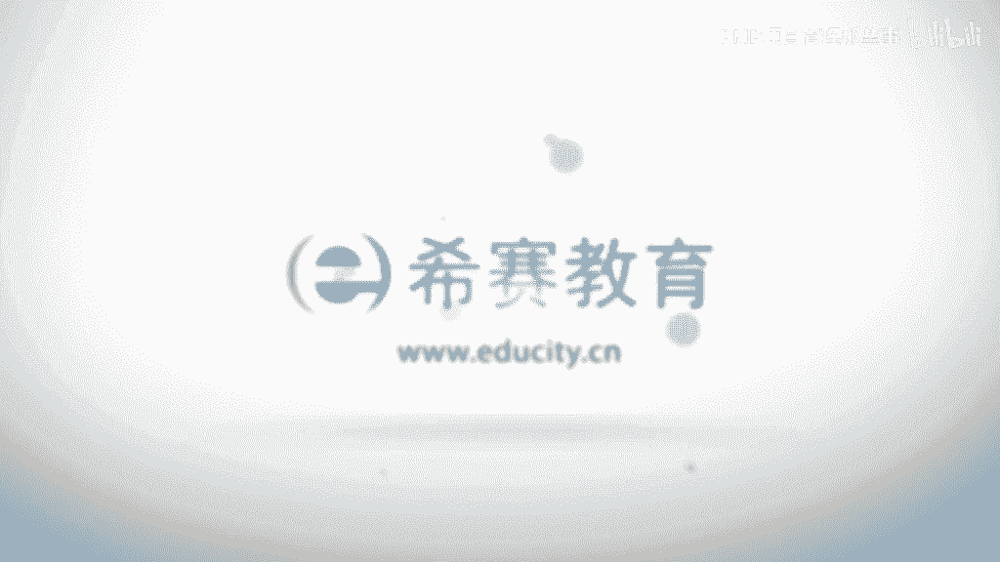

# 【2023敏捷认证】全新PMP考试ACP敏捷知识点精讲视频教程！ - P5：03 敏捷项目管理价值和原则（下） - PMP项目管理那些事 - BV1oP411S7xp

下面呢我们来看一下敏捷的价值观，原则和实践当中的一些关系啊，啊那么这里面的话这个我们知道啊，敏捷的四宣言其实他是最高的敏捷心法，你如果掌握了敏捷的这个心法啊，你就是啊。

相当于掌握了敏捷的这个主要的思维的精髓啊，那么啊之前的话没人讲过啊，就是这个敏捷的12原则啊，也给大家画了这个重点了啊，那么关键词我相信大家还是记忆犹新的啊，那么这个12原则的话，其实它是什么啊。

他是啊我们敏捷宣言里面的一个延展啊，那么他是这个进一步的去解释啊，我们的这个敏捷宣言啊，啊那么基于这个12元的话，这个实践啊，你会看到它是什么，产生了大量的一些敏捷事件，你比如说像精英啊，像啊sp。

像squirm对吧，像看板，ok，那么这些的话，其实呢它都是基于我们的四价值观，12大原则啊，然后呢不断去进行拓展的，ok所以这是这样一层关系啊，那么我们呢还是啊，把这个杀原则来进一步的去诠释一下啊。

呃首先啊我们来看一下啊，就是这个准则一啊，准则一呢其实它的核心是在于啊，关于价值交付的啊，其实每一个准则的话都有它的一个主题啊，我们要把握住它的一个主题啊，那么我们也是了解了它里面的一些关键词啊。

但是这里面的话其实呢我相信啊，就是还是需要花点功夫啊，大家能够去记忆的，所以把握住它的主题的话，其实啊无疑样，可以帮助我们去强化这样一种记忆，所以大家请记住啊，那么关于准则一的话是啊。

一种这个有价值的交付啊，那么这里面的话关键词呢是啊有三个啊，之前我们讲过对吧，尽早持续有价值啊，我们也是啊解释过啊，微分要尽早，因为要让我们的客户尽早地获取到竞争优势啊，获取到这样一个价值。

那么持续对不对啊，那么持续的话其实也是什么，我们要有一个持续的过程啊，不能够有间断，因为有间断的话，可能会影响到我们的价值的一个交付，同时也会影响到我们的客户的信任关系啊。

那么同时的话我们的这个啊你会看到这种价值，其实啊它是一方面的话是啊，决定了我们的产品和我们的这个软件，必须能够使给我们的这个什么，给我们的客户的话带来商业价值，对不对，带来客户价值。

ok那么其实呢这种价值的话呢，在我们的p m p v里面啊，其实也是有相关的一些定义的啊，大家也注意到了在啊pmbok第六版啊，那么他也是明确说了啊，商业价值啊，其实要给到什么，给到我们的这个发起组织。

包括我们的客户啊，要有效用啊，效用啊，要有收益，ok那么有效用，有收益的，这样一个产品和软件才能够带来真正的价值，那么这里面呢还有一方面呢这个价值啊，它一定是要有一个优先级的排序的啊，原机的排序的啊。

那么给客户啊啊带来啊，这样一个这个优先级最高的价值啊，我们还记得啊，之前的话我们讲的这个产品的代办事项对吧，产品待办事项里面的话啊，其中有一个非常重要的一个特征啊，是什么，我们的产品待办事项。

必须按照优先级进行排序啊，必须按照一分集进行排序，那么优先级最高的这个我们的需求啊，或者说我们的这样一个这个产品的特性啊，必须要放在什么，必须放在产品单反摄像的一个顶端按，那么正因为它放在顶端的话。

才能够去优先进入到我们的迭代的代办事项，里面去进行实现啊，所以呢这个优先级一定要去注意啊，因为有一些急啊，那么才能够去什么才能够去啊，交付给我们客户，他认为它重要的一些东西啊，这一点其实是非常重要的啊。

那么所以价值这一点的话，其实刚才我们也是进一步的去解读了啊，那么解读的话第一个方面，那么他一定能够带来收益和效用对吧，这个大家要记住这样一些关键词啊，那么第二方面的话，其实呢就是什么给客户带来优先级。

最高的价值啊，最高的价值啊，那么这一点的话，其实客户的话始终在认为他是交付这个，他认为最重要的东西啊，这种感觉是特别棒的啊，那么我们从这个角度啊，在交付的方面啊，刚才我们讲了，其实这个主题它是交付价值。

对不对啊，那么在交付的这个方面呢，其实它存在的和一个合规的啊，这样一种折中关系啊，那么什么叫合规啊，合规啊，其实我们也知道啊，他是有很多的一些这种规范，那么这些规范的话啊，他可能有什么有这种行业规范。

有政府的这个法律法规啊，可能还有我们组织内部的一些规范，ok那么这些规范啊在敏捷看来并不是啊，并不是可需啊，可有可无的事情，相恰恰相反啊，那么我们的这个规范必须要进行什么，必须要进行遵从啊。

你可能会问为什么啊，那么为什么我们在之前讲的啊，我们的这个文件啊，文档其实这一工作的话，我们叫什么，我们不需要太多的去繁重，但是为什么到了规范的这个角度的话，我们反而要去什么，反而要去这个进行遵从呢。

其实这里面的话它有它的一些背景的啊，那么啊比如说在一些行业当中啊，美国曾经发生了一些事情啊，那么他发现了一些从业者啊，那么绕开了啊，这个政府和行业的一些法规，导致了一些这种恶性事件。

比如说像一些欺诈的事件啊，比如说像一些不诚信的一些事件啊，那么啊从而导致了这个美国的话，出台了一些这个相关的一些法律法规，专门就针对于合规的事情去强化啊，我们都知道美国的话它是一个这个叫什么。

就是一个注重商业信用的社会啊，那么我们的这样一个p m i a c，p的这个背景啊，也是基于那样一个啊啊环境啊，基于那样一个这种啊相关的这样一个啊，遵从商业性的一种规范啊而演变过来的。

所以这点的话请大家一定要注意啊，那么对于我们的必要的这种规范，必须必须啊是不可或缺的啊，而且它流先级是比价值更加的什么更加的大啊，所以这一点啊是和文档类的工作啊，他的理解是不一样啊，所以请大家注意啊。

就是关于我们的一些政府的法规，关于行业的一些规范啊，包括我们的啊一些这种啊，包括组织的一些规范，其实都是不可或缺的啊，这种不可或缺性啊，就导致了啊我们的这个交付啊，必须先遵从我们的规范。

再去考虑我们的价值交付的事情啊，那么这一点的话呃，我想还是要好好的去和大家去强化一下，这个概念啊，ok那么所以的话就我们看就是昨天的话，所以的话我们也是提到过啊，就是敏捷的话首要的目标的话是什么。

交付价值给我们的这个客户啊，啊，那么同时的话，这里面的话也是存在一个什么，和文档的一个关系，那么文档的话是既不能太多也不能太少啊，那么他提出了一个这个概念叫刚好够啊，刚好够啊，那么刚好够呢。

什么叫刚好够对吧，什么叫刚刚好啊，那么这个的话其实它的这个定义是很难把握的，对不对啊，你可能觉得啊啊五个文档就是刚刚好，那么另外一个人觉得的话，就是十个文档可能是刚刚好啊，你的感觉是对的啊。

那么其实这种刚刚好啊，它的一个意味在什么地方呢，其实还是我们之前讲过的，一定是什么，一定是团队一致认可的啊，一定是团队一致认可的啊，那么这样一种团队的一致认可性啊。

就决定了我们的这个文档刚好够的一个标准啊，不能够去什么，不能不能够去生搬硬套啊，我们比如说瀑布模式可能有多少规范，我们比如说像极限编程里面有什么规范对吧，它并不是说是因啊一些规范而去制定的。

那么这一点的话恰恰是什么，从我们团队的角度去考虑问题，团队要达成一致啊，团队的话其实要和我们的这个文档啊，啊他的一个标准啊，那么能够达成一种默契啊，那么这一点的话，其实呢呃刚好够的一个啊定义啊。

请大家注意他是和这种自组织团队的，他的一种一致是相关的啊，那么我们看一下准则二啊，准则二呢是关于拥抱变化的啊，刚才的话我们像这个选择一的话，是交付价值对吧，那整个二的话就是拥抱变化啊。

那么这里面的话我们啊先前也提到过啊，那么传统的项目管理啊，p m p啊，或者说这个瀑布式模式呢，其实它是什么，它是尽可能的去啊控制和影响导致变化的因素，因为他是不希望变的，他内心的话是要去拒绝变化的啊。

因为这个的话是他的啊，这种条件和环境所形成的啊，那么因为变化的话对啊，我们之前讲过他的这个风险和啊，一些这种这个成本会比较高啊，所以呢他要去控制这样一个风险和成本，对不对啊，那么但是敏捷的话。

其实呢它是要去期待这种变化的啊，我们知道变化的话，其实它就会意味着商机啊，意味着有新的这个opportunity，对不对，有新的机遇啊，那么这种机遇的话恰恰是什么，恰恰是我们的客户，包括我们的团队呢。

他们要去追求的啊，所以这一点的话，其实他是啊角度是非常不同的啊，那么拥抱变化，那么他也是提到了即时代项目的后期啊，那么同时的话这些变化的话，其实它是能够什么能够给客户竞争优势啊，竞争优势这个词的话。

其实呢啊是一个非常关键的一个词啊，那么在考试的时候呢，也经常提到这个词啊，一旦提到这个词的话，大家一定要去有一个敏感性啊，那么啊竞争优势呢，其实在这个啊这个经济学里面啊，其实它是源于经济学的一个词啊。

啊那么有的翻译成叫比较优势啊，有的是翻译成叫竞争优势啊，那么比较优势其实是什么，顾名思义的话就是我们的这样一个优势，它是有别于其他的一些竞争对手的，所以其实我们的这个敏捷最核心的。

要给我们的这个客户带来一种差异化的优势啊，带来一种差异化的优势，那么这种差异化的优势的话是什么，是客户啊所非常看重的啊，因为现在的这样一种商业啊，社会的一种竞争啊，很多的都是一种差异化的竞争。

你有别人所没有的一些东西啊，那么这些东西的话，其实呢它是能够给客户带来这个市场的一些份，额和一些啊，我们讲一些粉丝经济当中的一些这种认可的啊，ok那么所以我们说啊就是敏捷的话，其实呢它是要去快速的啊。

那么去拥抱这样一种变化对吧，那么这种变化的话，是其实是客户和团队一起去寻找的啊，其实他这个变化的话，它里面有这样一种生意的啊，他是客户和这个团队一起去寻找的，以前的话其实是什么呢。

客户的话是啊这个单打独斗对吧，那么我们知道后来的话是我们的这个敏捷的话，他的这样一种思维啊，是希望能够和客户一道成为伙伴关系啊，我们啊也成为他的这个啊这种什么业务的啊，这样一种发展的啊，一个非常重要的。

不可或缺的啊这样一种啊伙伴啊，那么和他一起去找寻这样一种能够给他带来啊，竞争优势比较优势的这种变化机遇啊，所以这一点呢，其实请大家呢还是要去再深刻的去理解一下啊，那么所以我们讲这个啊拥抱变化的这个主题。

当中啊其实核心啊啊敏捷，他是要去期待这种变化，因为现这种变化的话，是能够带来这种什么新的机遇啊，那么这种机遇啊这种变化其实是什么，我们的这个团队和客户一起去共创啊，一起去寻找的啊，那么啊最核心的啊。

其实是要给我们的客户带来竞争优势啊，所以这点的话其实是很不一样的一个点啊，那么选择三准则三呢，其实它的这个主题是关于交付周期的啊，关于交付周期啊，所以你看到准则一的话是关于我们价值交付啊。

要交付有价值的东西对吧，ok准则二的话，刚才我们已经谈到了，就是拥抱变化对吧，准则三的话就是关于交付周期啊，交付周期啊，你会看到就是说其实敏捷的流派当中啊，交付周期呢啊它有一些区别啊。

你比如说像com的话，它往往是一个月啊，那么sb的话极限编程呢它是1~2周对吧啊，那么其实在这个我们的这个选择里面的话，他也提到过这个交付的周期越短啊，那么可以越早的给予我们客户价值。

那么客户越早的得到这个价值，其实呢他就得到了这种先机对吧，那么他的这样一种啊优势就能够凸显出来啊，那么这是从客户的角度去讲的，其实还有一个角度啊，因为这是两方面，一方面的话是给客户有什么好处。

另一方面的话其实呢啊我们的团队啊，这个发展方面的话有什么好处啊，那么这个发展方面的话，其实呢它是能够去强化一种意识的，强化什么意思呢，强化团队要去持续关注客户价值的，这样一种意识啊。

那么这样一种意思的话啊，实际上啊对团队的发展是非常的棒的啊，那么我们知道啊，就是敏捷的话，其实是非常强调团队的啊，他并不是说那么的看重过程啊，那么这个的话先前我们已经一再强调过了啊，这样一种观点。

那么对于团队的打造，其实它是从多方面的啊，那么包括我们的团队的技能，包括我们团队的这样一种合作精神，其实也包括了团队的一种什么，他的一种专注性，它的一种持续性啊，那么持续关注客户的价值。

这一点啊其实是一个优秀的敏捷团队啊，他应该具备的这样一种素质啊，那么恰恰我们的交付周期啊，啊那么缩短能够啊去发展这样一种，或者提升这样一种素质，为什么啊，为什么这一点的话，我想把它讲的再透一点啊。

那么因为我们都知道啊，就是一个人的话啊，他的这样一种这个啊这个这个耐心啊，或者说这样一种这个做事的节奏啊，啊它是会因外界的变化而变化的啊，那么你比如说如果给他一个月的时间啊，给了一个月的时间啊。

那么这个事情的话，他可能很有可能啊是什么拖到这个啊，一个月后面的第一啊，这最后一周可能再去考虑啊，很有可能啊，这假设我们的这个工作量的话，它是什么，它是叫只会画一周多点的时间啊，只会花一六多的时间啊。

当然你如果工作量太大的话也不行，对不对啊，它是关于这个工作量的平衡的问题，ok那么这是人之常情，对不对，这个的话有专门的专家的话还是研究过啊，就是它有专门的这样一种定律和法则啊。

那么人的话它是有一种惰性的，ok他一定会拖到这个什么啊，这个月的最后那一周才会考虑这个问题，那么但是呢对于你给他一个周的时间啊，他就会什么，他就会马上去考虑这个问题，而且呢可能会什么进行想办法啊。

然后呢去在一个周之内去完成这个工作啊，我们想要都有这样一个经验啊，那么带团队的也好，或者说如果你是成员一这个团队成员啊，你可能都有这方面的经验，所以这样一个什么短的交互频率，短的交互频率啊。

其实是可以什么，让我们的团队去进行这样一个意识强化的啊，因为我们的时间有限，所以我们必须要去交付最重要的东西，给我们的客户啊，所以呢他就会什么去非常仔细认真的去考虑，到底哪些对我们的客户才是最重要的。

哪些的话东西的才是真正有价值的啊，那么所以的话较短的迭代周期，它确确实实能够去强化这样一种意识，提升这样一种素质，什么素质呢，就是强化啊团队持续关注客户价值的啊，这样一种素质啊，这样一种意识啊。

那么这样一种意思的话，其实对一种啊一个优秀的这个民间团队的话，是啊非常的宝贵的啊，ok那么我们再来看第四个啊，第四个的话是关于这个，业务方和团队方之间的关系，那么这个关系的话，其实呢啊。

这个在敏捷里面的话说的是非常的清晰啊，简洁有力啊，那么这两方面的话必须始终通力合作，对不对啊，这个的话我们先前的话已经给大家画过这个啊，这个这个重点了啊，所以你会看到必须啊始终通力啊。

这些词的话都说的特别棒啊，那么这个的话恰恰是有别于啊，在以前瀑布式的模式当中啊，那么这两者的话是被隔离的啊，现在的话我们是讲过这一点啊，为什么被隔离啊，因为啊中间的话有一个所谓的项目经理啊。

来起到翻译的作用，那么这里面的话很可能会发生信息的失真，也非常有可能是什么，导致两方面的这个信任的下降啊，那么所以呢你看到他是被严格分开，那么啊在敏捷里面，他认为这个的话是一种过程的不合理啊。

那么他需要把这两方面的人员啊，那么能够紧密的把它合在一起啊，那么让他们去做彼此擅长的事情，但是他们是一个什么，是一个team，是一个团队，那么既然是一个团队的话，就需要去进行这个协作啊。

那么在彼此做这种擅长的事情呢，啊这个前提之下啊，那么又去啊这个目标朝一个地方去努力啊，历朝一处使啊，那么它的效果是最好的啊，那么同时的话在一些这种环境和一些这个啊，这个条件方面啊。

尽可能的去啊去创造这样一种环境，什么环境呢，他们一定要在一起集中办公啊，金融办公，那么也是有一些研究过啊，集中办公的效率是非常非常高的啊，那么因为什么呢，他的沟通的这个时间和工作成本是非常之低啊。

如果你呃业务方和团队方啊，分散在啊这个两处生活又分散在这个多处啊，其实大家给大家带来的一种隔阂，或者说一种这个不方便啊，是啊应该说这个这个成本是非常大的啊，那么所以呢敏捷啊。

他是提倡啊啊业务方和我们的这个开发方，最好能够什么在一起工作，集中办公啊，那么你可能会问这样的问题啊，其实我们现在的话集中办公啊，这个有很多的一些条件之下呢是达不到的啊，这个承认确实是这样的啊。

你比如说啊很有可能像那种跨国的团队啊，呃不用说跨国了，跨省的，对不对，跨省的话，其实呃如果我们的主要的一些业务的话，在这个全国的分散的各个地方啊，那么也是很难达到这一点啊，确实是这样的啊。

啊那么tm的话其实在这个敏捷标准里面啊，他也是专门提到了一些方法啊，你比如说他建议用现在的一些这种啊社交的啊，或者说一些这种软件去建立，虚拟的集中办公的场所啊，啊啊虚拟的这个什么作战室啊。

那么我们知道这个其实有的一些敏捷团队的话，他其实都是要建立专门的作战室，那么多战士的话给人的一种感觉啊，它是什么，它是能够去有一种紧张的氛围，有一种合作的氛围，对不对啊，那么现在的话随着这个软件。

包括互联网的一些技术的发展啊，虚拟的作战室啊，其实啊已经不是什么这个啊难做的事情啊，你完全可以在网上，或者说我们的这个公司的局域网内啊，去建立一个虚拟的作战室啊，虚拟的作战式的话。

其实呢它并不单单是什么把人集合在一起啊，其实后面我们会讲到他是要去配合啊，这个敏捷可视化的一些工具和方法，那么怎么可视化呢，我们可以想想就是我们真实的作战史，它是怎么样的啊，真实脱单式的话啊。

我们彼此呢这个办公室啊，首先它是没有隔阂的，另外不像这个有的一些国企的话是什么，我们要要有这个啊隔板，其实这隔板的这个东西的话，其实啊虽然说能够保护一定的个人隐私，但是他对于沟通的成本和效率啊。

一定是什么，一定是能够降低的，那么所以我们讲其实在这个作战室里面的话，它是什么没有相应那些隔板的，而且呢东南室里面啊，就是我们的这个墙上啊，一定是贴着我们的这个叫信息发射源啊。

那么后面的话我们会讲这个名词啊，信息发射源的话就是什么，就是把我们的一些项目的一些啊，比如说像燃地图，我们的累计流量图，对不对，我们的项目的一些这种状态啊，进度啊，包括问题啊，充分的把它什么展示出来。

那么这个展示的话，其实呢使得我们的这个开发方和业务方，其实包括我们的一些相关的一些啊，相关方，对不对啊，那么它一旦能够纳入到这个环境当中呢，就马上能够看到所有的这个是吧，相关的一些信息。

那么这样一种可视化的项目的呈现啊，其实是作战室里面非常宝贵的东西啊，那么它是能够去营造这样一种紧张，和一种通力合作的一种氛围，那么所以在网上的话，我们完全可以利用一些软件的技术啊。

去把这些东西把它展示出来啊，那么所以啊敏捷啊，他提倡在同样同一个地方一起集中办公，但是确确实实也是考虑到一些现实情况啊，那么刚才的话有视频，大家呢也是讲了这个他的应对方法啊。

那么所以他们的目标的话是共通的啊，那么这一点的话其实呢啊我们讲过啊，他是把原来呢啊我们的这个这个相关的，这个什么相关的这样一个态势啊，把他转变过来了啊，那么这个态势的话就是什么，我们还记得啊。

那么原来的话就是说我们的开发方，我们的业务方分别是在我们的两边啊，一方面的话是一个的话充当甲方的一个角色，另一个的话是充当乙方，那么在敏捷开源的话，其实呢我们不应该有这样一些区别啊。

那么这个区隔的话是只会导致我们的啊，这种啊隔阂啊，那么所以它把这个右方啊把它拉到同一边，那么为什么要拉到通讯边呢，因为他们是有共同的目标，对不对，那么这个共同目标的话就是我们的value。

就是我们的价值对不对，那么所以的话其实这种共同目标的寻找的过程，也也是我们的这个双方合作伙伴关系，建立的过程，所以这一点的话其实是一个非常重要的方面啊，所以我们讲这个准则四，它的主题啊。

就是业务和我们的开发啊，那么他是要去什么要去合作的关系啊，那么这是这里面的一个主题啊，那么选择五只能五的话，其实呢它是什么关于如何去管理团队的啊，如何去管理团队，那么这个管理团队的这样一个命题啊。

啊其实戴敏捷啊，他是啊经过了深入的一些探讨的啊，呃那么有专门的一些啊这个敏捷的书籍啊，他是来啊去这个聚焦在如何去进行敏捷的，这个什么教练如何去进行激励啊，这个项目的团队。

让他能够去充分的把这个他们的一些，这种经验和潜力激发出来啊，那么所以这点的话其实是很重要的，之前的话也讲过啊，就是啊一定要避免微观管理，微观管理啊这个词的话怎么理解啊，那么如果你每天的话去进行他的一些。

这种工作的干预啊，那么啊一些状态啊要求他去进行这种汇报啊，那么其实呢就已经在做微观管理的事情，那么微观管理的话，其实它有别于什么，有别于叫宏观管理，对不对，其实呢啊对于敏捷的这个。

我们的这个什么这种团队来讲呢，啊更重要的是管理结果，而不是要去管理过程，那么这是微观管理的一个核心的定义，那我们知道其实对于这个以前的模式的话，它往往习惯于把这个监控过程，为什么呢。

因为这个过程是pop是模式当中啊，他非常赚的一个方面，因为有好的过程，因为有好的过程往往就能够产生好的结果对吧，这个大家还记得这句话，对不对，ok所以其实在瀑布式模式当中的话，它确确实实需要去盯过程啊。

因为过程的话恰恰是我们啊防患于未然的一个，非常重要的方面，但是对于敏捷团队啊，不能这样做啊，因为我们的目的并不是为了要去做监工啊，为了去要去盯进度啊，恰恰相反，我们是要有给什么。

给我们的这个团队成员留有一定的空余时间，要留一定的那叫留白，对不对，要要留白啊，留白啊，那么这个留白的话是什么，那么大家还记得这个什么，我们讲过的这个啊3m的例子，对不对，所以你看就像3m啊，3m的话。

他一定是给员工一定的空余时间去干嘛呢，去进行思考啊，去啊思考，或者说进行一些创新的事情，那么我们的敏捷的话，其实他的目的啊也是一样的，对不对，大家还记得敏捷里面商业目标，其中第一个就是什么。

ok就是创新，对不对，就是创新啊，那么所以的话，既然你想要他去做一些探索性和一些啊，这种创新者的工作，那么就必须什么就必须要给他留白，那么留白的话就尽量的什么避免这种微观管理，所以要关注结果。

而不能关注过程，那么这是微观管理的一个什么精益，ok那么还有呢，我们要去建立一个强有力的团队啊，所以这句话的话实际上是这个词非常关键的，为什么强有力的团队，或者说强大的团队是非常必要的。

因为敏捷呢恰恰是因为我们要去关注结果，所以呢对于这个团队成员的啊，无论他的一个技能，无论它的一个自律性，无论是什么，它的这样一个啊合作的精神，都是要求非常高的啊，所以大家请注意啊，就是他其实强有力的话。

它是包含三个方面啊，那么第一个的话是什么，ok那么必须有专业技能skill，那么很难想象，如果你没有专业技能的话，那么我们的团队的话，是非常难以去胜任这个工作的，ok那么第二的话是什么呢。

ok那么就是这种啊合作精神啊，那么我们之前也讲到过，就是敏捷团队的话，他一定不能成为一个啊这个仓桶，对不对，一定不能够成为c罗啊，避免这个c罗啊这个词的话，后面我们会讲到对吧，成为孤岛，成为汤总啊。

那么双方老死不相往来，对不对，这种的话现象呢是一定要去避免的啊，那么第三个啊，第三个我们的这个什么我们的这个啊团队啊，必须要有这种自律性，啊必须要有自律性，那么这种自律性呢是一个团队成熟的一个。

非常重要的一个标志啊，那么因为我们啊这个整个的一个敏捷啊，它是关注结果的啊，所以呢啊在过程其实它不设一些监控点的，那么这就完全要求什么，要求我们的这个团队啊，它要具备这样一种自律性啊。

要去从一个更高的角度看待自己的工作，把自己的工作啊看成是啊，要去达成了一份事业啊，达成了一份事业，ok但是他这里面的话也是有一些手段啊，去啊促成或者说去提升这样一种自理训对吧，包括我们啊。

后面包括那个之前的话也提到过对吧，其实它就是一种啊这种团队的仪式感啊，能够让我们每个人在这种公共的场合之下，去进行什么曝光对吧，曝光什么不光你所做的事情，不管你接下来要做的事情。

曝光你的这个遇到的问题对吧，其实还有一些很重要的一些方面对吧，因为啊时间长的话，大家对于这每个人他的一些这种啊叫能力，心里都有都有数，对不对，所以其实每个人的话他的这样一种承诺啊，那么是公诸于世的。

对不对，那么这样的话其实呢啊反而是能够什么，加强这个人在公众当前啊，就是这样一种监督和约束啊，ok所以自律性是一个团队啊，他是一个非常重要的方面啊，那么自律的团队呢，他第三句话也说了啊。

一定不是一个自上而下的指令就能够达成的，一定是什么自下而上的，自下而上的啊，所以的话敏捷的话是非常反对这种top down的，就是从上到下的这样一种啊管理啊，就是比如说领导来训个话，对不对啊。

或者说这个哎这个领导来指示一下这种现象啊，在敏捷里面一定一定要去避免，一定一定要去避免，因为对于团队的这样一种打造啊，是致命伤啊，这一点的话请大家一定要注意，那么在考试里面。

一旦出现这种啊这个方面的意识啊，包括这方面的一些这种倾向啊，那么这个选项一定是不对的啊，一定是有别于或者是有别于我们的敏捷的原，这个准则的，对不对，所以这里面的话，请大家呢这个啊还是要深度去理解他啊。

我们的12原则啊，其实米的12原则的话，他是把这个宣言啊进步的去延长化了啊，讲的非常的透啊，所以大家也需要去花点时间去进步的理解它啊，ok那么所以刚才我们讲其实自律团队的话。

它是一种自下而上的形成这样一种文化啊，把它培育起来的，是不是，ok那么所以这里面呢我们也提到啊，就是敏捷的话，其实它是啊要去不断的去打造一些共享的空间，共享空间呢它是特别有利于我们团队的啊。

这样一种啊包括自律，包括合作啊，他这样这样一种这个文化的培养的，尤其是对于合作的精神啊，尤其对于合作精神啊，合作精神呢啊是敏捷团队啊，里面非常重要的一个点啊，是区别于传统的项目管理非常重要的一个点啊。

那么这样一种合作的话，你会看到它通过一些技术手段啊，那么啊增加这样一种可视性啊，那么就就像刚才我们讲的，在作战室里面，这个四面的墙上都会贴满了，我们的信息发射源啊，去啊把他的一些工作公诸于世啊。

比如说张三对吧啊，这个今天的话是做了什么事情啊，那么他就会标注在严禁图当中，那么李四啊，你这个问题是否得到解决，ok那么他就会这个去啊，这个这个暴露在这个风险的什么调整，未完项里面。

ok那么所以这里面的话，这个啊空间它是营造了一种啊，这个我们那些状态问题都可视化的啊，这样一种氛围啊，那么同时的话也是强化了我们是一个team，我们是具有一个啊目标的啊，具有一个共同目标的。

有共同价值观的啊这样一个team，ok所以这一点的话，实际上是一个很重要的一个点，那么还有最后一个的话是什么，要给团队自由事件对吧，要给团队自由事件啊，因为这样一种团队自由时间呢，它是能够去什么。

能过去让我们的团队更加有这样一种探索精神，更加有这样一种创新精神对吧，那么这样一种精神其实是敏捷，非常非常看重的啊，因为敏捷它最本质的目的就是为了啊，去不断的去进行这种创新，尤其是讲一些产品创新啊。

我们是为了产生好的产品，我们是为了给予客户价值，而不是说我去培养出一个听话的团队啊，你要去培养一个听话团队啊，你你不要搞这种对吧，你搞什么搞军训对吧啊，你把他这个培养成一支军队嘛，对不对，服从命令啊。

服从命令，军人是天职啊，对不对，ok所以其实他的这个嗯角度是不一样的啊，你想要培养一种创新团队对吧，培养一种这个像乔帮主啊哈这个这种人的话，那么一定是要给他一些自由时间，尊重他，相信他啊。

然后呢让他呢给他留白对吧，然后呢有这个创新的一种火花和氛围，就会慢慢的去孕育出来啊，千万不要去什么这个嗯紧盯在屁股后面去，什么去盯对吧，哎你今天有什么想法，明天有什么想法，我把它记录下来。

千万千万不要这样让团队自己来做啊，那么这一点的话，其实呢我觉得呢是特别是啊，有很多从这个瀑布式模式当中转变过来，一种管理思维啊，特别难以接受的啊，那么瀑布模式，其实这种管理者呢。

他天生他就是这就是监工的料对吧，哈哈就是监工的料，那么这一点的话，其实在敏捷团队里面是行不通的啊，ok那么第六个第六个是关于沟通方式啊，沟通方式呢啊在原则里面讲的非常的清楚对吗。

我们还记得它里面的关键词对吧，团队内外啊，这是关键词啊，所以他强化了无论是在团队内呃，内部还在团队外部，最有效的方式就是什么面对面沟通啊，就是面对面沟通啊，那么这里面的话是实际上它是有些对比的啊。

那么首先的话是什么呢，在传统的项目管理里面啊，它是更加注重这种啊，formal formal communication对吧，重视的股东啊，ok那么就像这个书面沟通对吧，其实，正式的沟通啊。

在这个push模式当中啊，他是啊应该是比例比较大的，那么为什么啊，pop模式当中的话，正式工作那么大啊，因为pop模式当中的话它是非常讲究程序的啊，我要有一个流程办事啊，那么这个流程办事的话。

其实呢它要有一个啊这个相对复制的一个，沟通方式，我们知道一个组织，一个团队越什么越重视程序越严谨啊，那么他的沟通的方式就会越什么越正式啊，这一定是必然的啊，那么如果一个团队的话，它是什么。

它是更加注重这样一种探索精神，或者说创新精神，那么它一定是什么，一定是一种非正式的，因为他关注的是一种结果啊，关注的一种团队的一种打造，ok那么所以正式的沟通啊，在瀑布式模式当中啊，更加的多啊。

并不是说所有的都是啊一定比例更大一些啊，因为这一点的话，其实在一些选择当中啊，啊你如果看到这方面的一些这种信息的话，那么你就会判断他也很有可能，就是一种预测性模式，瀑布式模式，对不对。

ok那么非正式的沟通，那么在敏捷里面的话其实更加普遍，那么为什么非正式沟通的话是更加的这个普遍，因为敏捷里面呢啊它是要通过啊，那么这种非正式沟通有两个目的，对不对，第一个目的是什么。

传递更加丰富的信息啊，我们讲过其实非正式沟通啊，啊，他的这里面的话是更加的包含了一些这种bd language，对不对，是一件非啊语言表达函数的一些信息，肢体语言的信息啊，那么这些肢体语言信息的话。

其实它的这个信息含量会更大一些啊，那么呃我们这个之前的话也讲过啊，就是所谓的这个高带宽和低带宽的一些沟通啊，所谓的高带宽呢，其实就是什么要啊，这个把这个信息的这个这个负载量，把它扩土拓宽，你好。

脱坑的话，那么就不能仅是啊，通过一些所谓的这个啊书面沟通啊，啊那么这个非常正式的一些沟通啊，我们还是要承载的一些这种啊，这个更加信息量更加大的一些mod language，对不对。

肢体语言啊啊这种这个啊，那么是不是吃饭的时候也可以聊一聊啊，对不对啊，那么其实他的这个沟通啊，更加的丰富和灵活对吧，那么第二的话是什么呢，非正式沟通啊，特别容易营造信任感。

啊你比如说这个我相信大家都是有这个常识啊，对吧，你你有你比如说和一个人的话，一直什么非常客气啊，见了面的话就什么这个鞠躬啊，这个或者说这个跟他这个这个哎呦，给您请安啊对吧，那当然有开玩笑的话。

这个现在这年头很少有请安的了啊，那么这个的话一定是什么，一定是你和他之间的一种亲属关系，是不是很亲近的吧，对不对，那么如果很亲的话，这个诶哥们儿对吧，或者说兄弟啊，或者这个这个这个闺蜜。

是不是那么一定是这么想冲的，现在的话不是都流行叫亲嘛，对不对啊，那么所以其实我们这样一种正式的沟通啊，会让我们之间的这个，人类与人之间的距离拉远啊，因为它始终有一道墙带中间隔着啊。

那么这个非正式沟通的相对来讲的话，可以什么可以让我们的这个距离拉近对吧，我相信这个大家都能够理解，这个这个其中的道理啊，所以非正式沟通的话，其实它是能够营造团队之间的，一种信任感和亲密感啊。

所以啊反过来的话就是我们也说啊，他其实一定能够去什么，提升团队一种合作精神啊，因为你想想啊，现在的话这个我们经常讲，就说这个呃这个这个这个呃叫什么，所以我们经常讲，就是什么这个战斗队伍的战斗力很强啊。

那么那种兄弟脸对不对啊，那么这个这个其实他的战斗力是非常强的，因为他有非常高的默契啊，那么还有一点呢就是敏捷项目的这个沟通啊，都是公开的啊，都是公开的啊，那么都是公开的呢。

就意味着我们的这样沟通呢没有暗箱啊，那么当然这个暗箱并不是说，这个之前不偏僻性的模式啊，全是那个什么，不是这样的啊，ok他只不过说这里面的话，尽量有一些什么避免啊，黑箱的黑箱的一些沟通啊，一种信息啊。

什么叫黑箱的沟通信息啊，其实这个的话还是我们之前讲过的那套模式啊，去相匹配的啊，我们知道啊，像这个瀑布式模式当中，其实它有一个什么啊，他有一个沟通的这个枢纽点的啊，那么无论是我们的这个客户也好对吧。

包括我们的团队也好啊，包括我们的这个职能也好，对不对啊，ok包括我们的什么发起人也好啊，这个啊想我随便举几个这个角色啊，那么他一定是有一个沟通的核心点，就是项目经理，对不对，因为项目经理的话。

他是为这个项目去负责嘛，对不对啊，啊，那么所以呢他是要去啊，起到一个你这个叫什么沟通的一个枢纽，和这种啊过度翻译的一些工作啊，那么这个的话是我们所熟知的，在p m p的工作当中啊。

或者在瀑布式的模式的项目当中，模式当中啊，一定是这样的啊，所以我们之前讲过啊，pm的话，其实呢啊有很多信息就被叫固化在，或者封闭在它的这样一个这种暗箱里面，那么这个暗箱的话就是非常大的。

会有非常大的一些风险，对不对啊，因为这里面的话啊，p m啊啊对这个pm的人的这个要求特别高啊，那么呃他是不是能够把这个信息全部理解了，那么我传递出来的信息对吧，沟通出来的信息是不是都是正确的啊。

那么啊还有呢就是是不是能够及时的啊，有效的把这些这种信息要把它传递出来，对不对，这些都是问题吧，对不对，那么其实你会想到啊，就是说其实pm呢，它其实是一个真的是一个超人啊，真的是一个超人啊。

那么这个的话其实呢和这个美国的这个，应该说这个文化呢它是分不开的啊，它其实美国的文化的话，就是一种超级英雄的文化，对不对，我们知道这个美国的里面的大片啊，这个动不动就要去拯救地球，拯救世界的人，对不对。

哈哈啊，那么像什么钢铁侠呀，或者说这个蜘蛛侠呀，对不对，我讲一下美国的这个什么队长啊，这些人，而美国人也特别热衷于此啊，那么而且的话你会发现这个它的一些这种啊，视野啊，就是我要去拯救世界，拯救地球。

对不对，ok其实相比来讲的话，这个在美国的这个项目管理的标准里面啊，啊对pm的要求就没这么高啊，因为大家都知道这个美国的这个，它有一套项目管理体系，对吧，叫press啊，prince two，对不对啊。

那么其实prince的话啊，这个翻译过来的话，其实就是什么，它其实是一种受控环境之下的，受控环境之下的项目管理啊，那么所以啊他已经是在一个相对组织，能够控制的住的治理环境之下，去赋予pm相关的一些职责。

所以比对pm的一些职责啊，没那么大啊，反之的话没那么大的话，是不是那个要求就没那么高，是不是，ok，所以其实美国的和这个应该说，英国的这个项目管理文化啊，其实它是有很大差别的啊。

这个的话我们以后有机会可以再来谈一下啊，就是这个情况还是一个非常大的话题，ok那么回到我们这边来啊，其实啊pm他的这个作用啊，在瀑布模式当中是非常之大的，那么反过来的话。

也非常容易形成这个我们叫信息的这个黑盒，那么敏捷就认识到这一点啊，认识到这个弊端，那么在一些这种探索性，或者说这种创新性的项目当中啊，就一定不能够去留什么，留这个信息的死角啊，留这个黑河存在。

因为这黑河风险太大了，对不对，一旦这个点的话，这个失去它的效用对吧，失去它的这个这个应该有的这样一个作用的话，怎么办呢，整个系统就崩盘了，你说是不是大家想想是不是这个道理啊。

因为这个信息就是这个集中在一个点上吧，对不对，那么怎么办呢，敏捷的话就是想到了一个更好的办法，是他把这样它的模式哎，转化成这个叫什么哎网状结构啊，这个的话是每个敏捷啊非常聪明的一个地方啊。

你会发现这个每个人啊，都可以参与到这个什么网络的这个沟通啊，信息网络的沟通当中，而且这个信息网呢它是什么，它是公开的啊，它是公开的啊，我想我是可以和这个外界进行交互对吧，公开的啊，他怎么公开的。

你比如说之前的话我们讲过，就说它是有一些信息发射源啊，啊有一些这个定期的去进行，把信息的一些公布啊，实时公布啊，对不对，那么对于一方面的话，在内部的话是形成一种网络结构啊。

那么第二的话我们的公信息都是公开的啊，所以这样一套模式的话，其实它是能够大大的降低啊，信息沟通不畅的风险啊，你比如说如果这个节点失去了它的这个效用了，怎么办呢，没关系啊，你看这不还有好多节点嘛，对不对。

所以沟通网络里面的节点的话，都能够起到它应有的作用，所以这是信息沟通这个公开啊对吧，透明它带来了一个最大的好处啊，最大好处啊，当你会说哎这种这种这种模式的话，它效率比较低，这个我承认对哈哈啊。

凡事有利必有弊对吧，就看你想要什么，大家说对不对啊，凡事有利必有弊的啊，所以这样一个网络呢它确确实实啊，确确实实他的这个啊作用的话是什么，就是他的这个呃整个的信息啊啊是不留死角的，但是其实跟效率来讲呢。

一定是这个效率最高啊，因为这个效率的话是什么呢，这个效率的话它是起到一个中央处理器的作用，对吧，其实这个p m的话在这里面啊，就有点像一个cpu一样啊，这个说的这个形象点的话是这样的啊，cpu一样啊。

那么cpu的话如果高速运转的话，这个整个机器的这个什么，它的运转是非常棒的啊，但是这是个人啊，这不是一个cpu啊，对不对，那么这个人的话就会犯错误啊，这个人的话也有疲劳的时候啊，对不对。

ok也有这个风险的时候，那么他一定是有问题对吗，ok所以你看到这个他这里面的话，也提到任何的团队成员都可以自由的参与对话，这个自由这个词太棒了，非常棒啊，这个自由的话，其实一方面的话。

可以使得我们的这个信息的网络啊，更加的这个这个robot啊，这robot的话就是大家知道这个词对不对，就是更加健壮，玩家见状就是他不容易什么不容易损坏啊，就像一个人的机体一样对吧，一个人经常活动的话。

就是这个人的话就会比较健壮啊，那么一个这个网络也是一样，因为这个人和这个这个，你比如说这个网络项目啊，他都其实都是一个什么，本质上来讲都是一个系统，这是一个sister，ok那么这个系统越健壮。

他能够去什么进行系统崩盘，或者说信息的这个，这个整个的这样一个出现错误的，这个概率就会比较小，那么自由的参与对话呢，其实可以提升这个系统的这个这个robot啊，这个健壮性。

ok那么其实还有一个非常重要的一个呃，带来的一个价值啊，就是带来的一个什么啊，团队成员的一种平等感，一种合作感啊，一种主人翁的意识，ok那么这是自由理念还是非常重要的一个点，因为他这里面的话。

也提到了这个相关的一些技术啊，就是叫渗透式沟通啊，啊高带宽沟通啊，啊其实都是为了什么去啊辅助啊，去支持到，就是我们的沟通要去公开透明自由啊，那么那我再讲一讲，就是什么是渗透式沟通和高带宽沟通。

渗透式沟通啊，说白了是什么呢，啊比如说a和b讲话啊，团队成员张三和李四讲话啊，王虎无意当中听到了啊，王五听到的这个信息的话，其实呢就是一种渗透式沟通带来的信息，所以现在式沟通呢是什么呢。

是团队成员之间的一种沟通交流啊，无意当中啊这个这个沟通出来的一些信息啊，那么被第三方被第三者听到了啊，那么所以这里面的话其实你会发现啊，渗透式沟通的话，它的本质的含义啊，就是让我们的这个网络啊没有死角。

沟通网络没有死角啊，它是一种公开透明化的啊，任何人啊都可以在这个网络当中去啊，非常便利的获取到这个相应的信息，而不是说呃像这个新型的结构对吧，像p这个这个偏僻里面的这个新型的结构啊。

那么什么叫高带宽沟通，高带宽沟通啊，其实他还有一次就是叫低带宽沟通啊，低代还沟通呢一定是什么，比如说像这个原来的pop模式，它一定是一种低代环沟通啊，因为它涵盖的信息量太窄啊。

它可能仅是像比如说书面沟通，对不对啊，那么为什么没有双向的一个交互啊，一种单向的是吗啊，那么它含这个成长听力量的话，一定是比这种面对面的沟通要来的少很多吧，是吧，所以呢其实这种高贷款沟通呢。

它也是一种相对的含义啊，那么它的这个是指我们的这个信息量呢啊，会更大啊，啊更加全面啊这样一种工作方式啊，所以在敏捷里面的话，高带宽沟通啊，一般来讲呢就是指这种面对面的沟通啊。

那么它的这个信息量是非常大的啊，ok所以这是这个准则六，那么准则期准则期的话，它的主题呢是什么呢，它是关于如何去衡量项目的这样一种方式，那么这样一种方式的话，其实恰恰是和我们敏捷宣言里面的啊。

这个叫什么，第二条是相对应的啊，敏捷宣言第二条是什么呢，我们的这个叫什么，我们的可控的软件，那它既然是高于什么详尽的文档的，那么所以这里面的话他也是说啊，要去强化这方面的一些意识。

我们要去衡量我们项目价值交付的一个进度啊，那么最主要的方式呢不是看文档啊，不是说看这个什么我们的状态报告对吧，哎那么我给领导汇报一下啊，那么我们现在的话已经进展到70%了啊，ok这个下周的话80%啊。

再加90%啊，不看这个看什么，看软件，其实他这个软件的话在这个这个敏捷里面啊，可以泛指产品，对不对啊，泛指产品就可用的产品啊，我们都知道这个敏捷宣言里面的话，其实他最主要的就是一些软件开发者。

所去编写出来一套宣言，对不对，那么所以的话其实他的这个软件啊啊，你应该说可以去泛指产品啊，可能是产品，那么是主要的衡量指标啊，那么所以你看到传统的这个偏僻的啊，瀑布式模式当中啊，他非常纠结啊。

纠结什么呢，我们的这个文档的工薪的工作啊，和这个项目的实际情况，它有时候差异有点脱节，太大啊，那么会使得我们的这个项目的这个，文件的更新啊，成为一种负担啊，那么所以的话其实呢在敏捷看来啊。

我们的这个文档啊，就像刚才我们讲的，必须是叫刚好够啊，不能够太什么，不能够太去这个这个这个这个这个太多，对不对，当然也不能太少，对不对啊，所以真正的价值一定是通过什么，通过结果来表达的。

那么这个结果的话是叫可用的结果，可靠的结果对吗，这样的话我们是讲过这个问题啊，为什么叫可靠的结果，因为他是要去保证产品的质量，保证我们的这个产品呢，它是什么能够给客户带来价值的一种可用产品。

ok那么这个的话是一个衡量的指标，那么结果的话，就是通过这个可用的软件来呈现啊，跟踪软件来呈现啊，那么这里面的话，我们这个之前的话是讲过这个词对吧，可用啊，其实当时的话讲的呢应该说啊比较概率啊。

那么就是什么给客户带来价值啊，客户的话能够从中获取的收益和效用对吧，这样的话我们讲过这一点啊，其实你有没有存疑啊，就是可用这个东西或者是个标准，到底是谁来定义，怎么定义的，这个有没有想过。

如果你想过的话，我说明这个你还是非常仔细的来看我的，这个课的啊，是非常棒的啊，那么其实这个可用的啊，这个叫什么这个定义的标准啊，大家猜猜看是谁定义的，是团队定义的吗，还是客户定义的呢。

还是相关方定义的呢，ok你答对了啊，这个可用的标准一定是客户所定义，客户来决定啊，我们的这个产品是否对它产生价值，是否能够带来效用啊，是否能够带来收益，ok那么所以呢这里面的话就是大家所熟知的啊。

我们的呃其实不光是敏捷的项目啊，我们任何的项目的话，其实都有一个所谓的验收标准的问题，对吧啊，验收标准，那么这个验收标准的话一定是什么，一定是客户去进行定义的啊，他来决定我们的这个验收标准啊。

那么是怎么样的，那么团队的话必须要根据业务标准啊，去进行交付啊，如果不能够满足验收标准，ok那么我们的这个软件，我们的产品就不能够称其为教可用啊，所以这一点的话，其实一个啊应该说衍生出来一个点啊。

请大家呢也是要进一步的去理解它啊，那么所以在这个整个气当中啊，他这里面的啊，应该说这个主题啊啊如何去衡量对吧，它是有两个关键的这个信息点啊，那么第一个啊两个关键知识点啊，就是第一个的话是什么呢。

我们的这个衡量首要的啊，这个指标就是叫可用软件，而不是文档，ok这是第一个啊，第二个啊，第二是什么呢，我们的这个所谓的可用，他一定是通过什么，通过客户的这个验收标准把它定义出来的，我们的这个课啊。

这个我们的团队啊去交付我们的价值的时候呢，也一定要去什么关注我们的这个验收标准好，然后我们再来看这个准则八啊，准则八呢是关于可持续的步伐的，可持续的这个节奏啊，ok那么这个的话听他是这个英文的话。

是这个词，对不对啊，可持续的节奏或者步法，ok，其实在pos模式当中它很容易出现，就之前我们讲过的啊，就pop模式当中的话，这个资源的使用，比如说这个是这个resource，就是这个资源嘛，对不对。

这个是top这时间啊，那么它很容易出现什么这个这种情况，哎这种情况大家这个不陌生吧，这个我们在那个偏僻里面的话，有一个叫资源直方图，对不对啊，c n直方图啊，那么cn直方图里面的话进行回发现啊。

啊它实际上是有标明了什么，这个资源随着时间的推移啊，它的利用的这个什么情况，对不对啊，那么资源置换制度的话，其实呢，可以紧接着和我们的一些工具去相匹配使用，比如说像资源平衡对吧。

resource leveling对吧，resource leveling，这个的话就像大家都是比较熟的啊，我这个就不再赘述了啊，那么所以其实p p pp模式当中，很容易出现这种波峰，波谷叫不均的情况。

哎这种哎你看到这个这个资源的话，在这个时间啊，它是非常高非常高的话，大家想想看，他很有可能是发生什么事情了啊，对你这个应该是猜对了是什么，他肯定可能比如说ot了是吧，加班了，你好。

这个这个有可能就会猜到啊，这个日期比如说7月1号是一个上线时，时上线时间对吧，哎那么产品的上线时间的时候呢，哎这个我我加班对吧，之前的话可能就是一直没有怎么好好的干活，对吧啊。

然后加完班之后的话也又处于这个状态了啊，那么其实你会看到啊，在瀑布式模式当中啊，他的这个工作的强度，其实是很容易上什么分配不均的，这个的话是和他的这个模式是分不开的啊，因为有什么的一些模式。

有什么的一些这种机制，就会产生怎样的一些人的行为，对吧啊，就我们知道这个什么呃，国企央企体制内的这种这个行为和这个什么啊，你在私企和外企工作当中，那些行为肯定不一样啊，另外举个例子的话。

过气象棋里面的话，这个中午必须睡午觉，哈哈哈对吧，而且打个地铺睡啊，当然也不是说这个四九或者不睡啊，所以说其实在不同的体制下面，不同的这样环境下面，人的行为啊真的会有比较大的差异啊，那么所以你看到。

在我们的这个什么瀑布式模式当中，那为什么可能破模式当中啊，啊，会比较经常出现这样一种，资源分配不均的情况呢，因为我们的这个push模式它通常是什么，通常要过一段时间之内，如果一段时间才会去进行交付的。

所以这一段时间的话，那么这个过程其实有时候的话，这个要资源的利用率啊，有时候是pm所监控不到的啊，那么啊，很有可能出现这样一种分配不均的情况啊，那么所以的话其实敏捷的发现了这样一个弊端。

那么他认为的话其实应该把这个时间和，因为这个的话其实就是个时间的概念嘛，对不对，比如说这个的话是整个的是半年的时间，这半年时间之内的话，很有可能是出现我上线加呃，我上线的时候对吧。

产品上线的时候我去加班，那么其他线的话我是什么，我可能就是这个这个这个稍微的松松一点啊，所以波峰波谷啊，他的这个呃比较大啊，那么敏捷的话其实呢他是把这个时间呢，比如说半年啊，我把它拆啊。

拆成比如说六个一个月生活，又为什么我再拆啊，我拆成12个半个月，也就是说两周一次，两周一次，每两周的话就什么就把它称为一个迭代啊，那么这个迭代的话是这比如说啊，这个这个两两周一次，对不对。

一共是这个施工作日啊，时工作日的话，其实你很难什么，你很难说把这个你的这个波峰波谷啊，就分配的平衡不平衡的那么的大了，对不对，你肯定要什么，就是要去赶这个项目的进度，因为在每一个迭代里面的话。

它的目标是非常的聚焦的，所以敏捷的这个项目啊，其实他的工作强度往往会更高一些啊，尤其是像一些x p的这样一些方法，对不对，所以刚才我们讲，其实如果我们的这个迭代是1~2周的时候啊，他的工作强度啊。

是来的，比这个什么，我们传统的项目的话是要更高一些啊，那么这样一个时间和的啊，这样一个时间节奏啊，啊我们知道它将是有利于保持一个稳定的，可持续的进展速度的，那么这个进展速度的话是可以什么可以上。

我们的团队成员啊，不会再迭代的这个周期的尾端啊，匆忙的赶工啊，匆忙赶工的话就很容易出现这种情况，对不对啊，那么所以的话就说把这样一个什么把这个力啊，使云啊，我们这个迭代开始的时候。

我们就什么就尽力的去进行，我们的这个时间的，或者工作的这样一个啊完成啊，那么把它均匀地分配啊，那么一个人啊他一旦能够习惯这种节奏啊，一旦能够习惯这样一种节奏的话，其实他不太容易去什么，容易筋疲力尽啊。

那么啊相反呢就怕这样对吧，那么这个都是前一段时间的话，都是还非常的安逸的状态对吧，突然加班，然后这个什么脑细胞死了一大片哈哈是不是，然后的话又去放松到这个什么一种猪的状态啊，这开玩笑啊。

所以其实这个人的话是，怕这个这种大企打落对吧，但是对于一种恒定的啊，对于一种恒定的状态，其实它不容易累的啊，那么敏捷的话，其实就是把这样一种，把这样一种这个我们呢讲的就是资源啊，啊这种不均衡的状态。

把它均衡到一种水平线，那么这个水平线的话其实就是一个可持续的啊，稳定的这样一种节奏啊，那么所以的话就是敏捷呢，它其实对于这个开发的节奏啊，他比较理想的目标呢，是能够保持一种可持续的速度啊。

可持续的速度啊，就是这里面的话，这词的话后面我们会讲啊，一旦能够保持一种可持续的速度，我们的这个团队的生产率啊，就可以把它测量出来啊，生活已经把它估算出来，那么基本就可以预测我们啊这个团队呢啊。

他的这个开发的完成周期了，就是我们整个产品的开发完成周期了对吧，ok那么这样的话就说我们的团队呢，既不会感到过度的压力啊，也不会觉得啊临时去加班的一种精疲力竭啊，因为什么，因为这里面的话关键有一点。

它是有一个明确的预期，明确的预期啊，那么这个预期其实是啊一个人啊，如果一旦有了一个明确的预期之后啊，他就会调整自己的啊，这样一个这个这个这个节奏啊，那么去适应啊他心里的这样一种预期啊。

所以其实这里面的话，关键的就是这样一种预期的调整啊，ok那么我们看一下第九个，第九的话是关于技术卓越的啊，那我们知道啊，就是啊这里面的话就说啊我们讲过啊，那么敏捷它是需要一种灵活性的对吧。

那么这样一种灵活性的话是来源于什么，来源于这样一种敏捷性，啊敏捷性这种敏捷性的话，其实呢在这个敏捷的这个杀原则里面的话，它是啊也提到啊，有两个方法可以去提升这个敏捷性，那么第一个方法啊，这是什么。

要实现更加卓越的技术，那么第二的话是什么呢，就是让这种设计啊不断去完善啊，可以去提升这样一种敏捷性，那么这样一种敏捷性越高啊，它能够去应变的这种速度就会越快啊，就是所谓的这样一种灵活性就会越快。

ok那灵活性就会越快对吧，所以这里面的话是这个准则呢它的一个核心啊，所以这里面的话他也提到过啊，就是我们的稳定和优质的项目啊，比劣质的项目其实更加啊允许啊，我们的团队快速应对变化啊。

那么这个所谓的优质和劣质是怎么来评判的呢，就是看这个就看这个我们的项目的团队的，敏捷性啊是怎么样的啊，那么这个敏捷性的话啊，也是通过像之前讲过的这个几个方面啊，技术是一个对吧，ok设计是一个啊。

那么这两个的话不断的去什么进行优化，就可以去让我们的项目更加优质，那么项目更加优质的话，我们的敏捷性就会越强啊，明年越强的话，就会什么我们的灵活性就会越强啊，所以其实你会看到它是啊一条线啊。

这个把它串起来的啊，所以这个点当中的话，其实最主要的主题呢，就是关于这个敏捷性的主题啊，那么原则十啊，原则十的话是关于什么，关于简洁好简洁啊，那么这个原则的话，其实呢它是被所有的敏捷的方法所用户啊。

尤其是精益啊，尤其是lee对吧精益，那么因为我们的这个啊，我们之前也提到过啊，就是精英里面的话，其实呢它是一个非常重要的方面啊，那么啊这是什么，要去消除不增值的部分，啊这是不增值的部分啊。

那么这个不增值啊，它是通过什么来进行这个衡量的呢，啊那么后面我们会讲到它是通过这个价值流图，那么这个价值率图的话，其实呢它可以把一个什么，把一个我们的这个啊，这个相应的一个这个活动啊。

分为相关的一些增值和不增值的部分啊，比如说这个的话是不增值，这个是增值对吧，那么这个是不增值这个增值啊，那么这样的话就可以把这个时间把它算出来，那么这个的话是占了两分钟，那么这个的话是占了三分钟。

只有四分钟啊，这个六分钟啊就两分钟，那么这两个的话是叫增值的时间啊，增值时间的话其实把它加起来的话，就可以算出来一个什么，就是我们整个的价值流里啊，价值流程图里面的这个叫增值率啊。

增值率也就是说有多少的时间啊，有多少比例还是属于增值的活动啊，那么如果你的这个不增值的，这个比例比较大的话，其实我们的整个的这个流程它是有问题的，那又怎么办呢，那很简单啊，要不然就把这个砍掉呗。

啊或者说把这个能不能变成增值的部分啊，要去进行优化嘛，对不对啊，哎其实这个流程图价值流程图啊，这个工具的话是非常非常的这个有用的啊，那么它是精益方法里面啊，就是非常啊这个好用的一个工具啊。

所以它的核心就是什么，就是要去进行叫不增值啊，活动的这样一个发现啊，并且呢把它什么消减，那么所以他这个的话带来的一个啊，带来的这样一个这种结果啊，就是能够对我们的客户价值啊，保持一种专注性啊。

之前的话我们也提到过，那么这样一种素质啊，这样一种意思的话，其实是一个优质的啊，一个优秀的一个敏捷团队啊，他应该具备的啊保持对客户价值的一种专注性，那么所以你的这个增值的这个活动越多对吗。

不增值的活动越少，那么我们的这个什么，我们的这个啊敏捷的这个项目啊，它就会越简洁啊，所以其实简洁的话它的一个最核心的啊，就是要去把我们的一些啊不增值的活动啊，一些荣誉的活动啊，把它消除掉。

留着的全是什么，留着的全是有用的啊，说白了就是这样对吧，所以简洁其实说白了就是让我们的这些啊，这个活动啊，包括一些任务啊，留着全有用啊，全对谁有用啊，ok对其实核心还是对我们的客户，要有用对吧。

有什么有价值，对不对，ok you value，那么所以这个的话其实它是它背后的一个生意，是不是，ok所以只能说的话是关于这个你讲叫简洁啊，那么我们再来看一下这个准则，11啊。

整个11整个11的话是关于什么，我们讲叫自组织团队，自组织团队呢它是敏捷里面的一个核心元素啊，核心元素啊，那么我们讲过啊，那么这个其实它是有别于pop模式的，瀑布式模式的话，其实呢它更多的是一种。

自上而下的一种指令式的，对不对啊，自上而下的一种指令式啊，pm的话是把这个相应的任务啊给这个，比如说a b c是吧，d ok哎你们干去吧，这个人是负责分配任务，并且这些人干得怎么样，要去什么，要去汇报。

那么这个人的话，pm呢在什么再进行这个信息的把控啊，就是进度啊，我掌握了这个信息之后的话，再去进行把控啊，把控的话，那么有一些呃点的话任务没有达到预期的话，那么可能就有所谓的dep嘛对吧，偏差嘛。

对不对，我们可能要进行相关的纠偏啊，我们一定要采取相关的一些action措施啊，去使得我们的实际情况和我们的预期计划干嘛，相符嘛，对不对啊，需要符合我们的计划嘛，是不是，所以其实啊在这个pp模式当中啊。

这个呢是一个常态，那么这个的话其实就是一个非常典型的top down的，top down的结构，对不对，就什么就是自上而下的马，这种自上而下的啊这样一种模式啊，我们之前也讲过啊。

其实它是啊特别不太利于什么，不太利于去激发这个成员的，因为什么，因为成员的话觉得什么事都是被安排的嘛，对不对，你就像一个教育小孩一样，你你这个小孩的话，如果什么事都觉得是被家长安排的。

他有他有很大动力吗，不觉得吧，对不对，其实人的话都是这样的嘛，啊那么所以的话，其实呢它一定是能够去自主决定一些事情，才会有一种被激发的感觉啊，所以自组织团队啊，其实是什么是敏捷团队的一个核心元素。

那么怎么能够去判定这个什么自组织啊，这里面的话是什么，关键他自己能够去进行决策啊，自己能够去决策啊，那么这个决策的话，其实呢它这里面也提到了啊，那么第一的话是能够去啊，这个决定如何去分配，对吧。

第二能够决定有什么啊，谁来做对吧，这个分配的话其实是工作量的分配嘛对吧，这个谁的话是是一个责任承担的问题嘛，对不对，那么其实还有一个的话，这个角色啊啊他是当有一些这种啊。

这个这个一些不同的意见的时候对吧，不同的这个路线的时候啊，不同的路线它能够去决定这个这个路线图对吧，决定的那个我要去冲啊，去到何处去的这样一个路线啊，那么而不是说我pm的话来发来。

充分的去展示我的一种英明，对吧啊，我认为这个的话是一种啊很好的道路对吧，我们全体同语言全从这个路线去走啊，不是这样的，对不对，看那么所以的话这个路线啊分配以及谁来做啊，其实是这个我们讲一个自组织团队。

非常重要的一个方面啊，那么这个的话也是传统的这个项目和敏捷项目，最显著的一个区别啊，那么这个点的话其实大家要注意啊，啊确确实实呃，在一些题目当中，你要说啊，有哪个点的话是一个最显著的区别。

其实就在于这种团队的管理的模式方面啊，就是自组织团队啊，那么同时的话其实他也强调了啊，就是不仅是小团队可以自组织，大型的这种团队也可以进行自组织，那么你会讲大型的团队的话，怎么自组织啊。

我这考了什么这100个人或者1000个人，你让自己玩去吧，哈哈对不对，这个的话其实呢是不合理的，怎么办呢，这个敏捷里面的话其实也想到这个方法了啊，他想到的方法，它是什么，把这个大的画成小的。

啊马自达的画成小的啊，那么大的怎么可能小的呢，小的的话这个其实它有标准的，对不对啊，那么在这个新版的敏捷标准里面的话，其实他是提到过对吧啊，我们的这个所谓的这个小的团队的话是多少人，看到五个人是不是啊。

那么原来的话这个有一个说法啊，敏捷团队的话，其实它的一个比较好的一个规模的话，是七加减二，对不对啊，当然这个新版的敏捷标准里面的话，他是把这个团队规模进步的缩小了啊，那么也是意味着啊。

那么我们现在的很多的一些商业环境之下呢，都需要一些小微团队啊，你比如说现在的话很多的一些企业啊，都在推这种呃所谓的小微团队的模式对吧，国内的话这个大家都知道，像互联网公司的话，也都在推这种模式啊。

那么包括传统的一些企业开始转型，包括像海尔对吧，之前我们也提到过啊，他们从2014年开始，这个去搞这个阿米巴模式小微团队啊，那么像雷神对吧，就是这个啊从海尔这个涌现出来的啊。

这个这个一些小微团队啊啊其实就三个人，对不对，就三个人，三个人的话其实是一个非常典型的组合了啊，其他都是为了去打造这个创新产品啊，那么三个人的话可能有哪些组合啊，你比如说一个技术啊，一个市场啊。

再一个产品对吧，产品的话是负责这个整个产品生命周期，技术的话去管开发的啊，市场的话是什么进行这个啊，这个销售的对不对啊，营销的啊，那么所以其实现在的这种啊，敏捷团队的规模，也会也在这个这个不断的去缩小。

那么大的这个智能团队的话，完全可以什么完全可以把它叫化整为零啊，然后呢针对于小的团队再去进行自组织，小团队是可以进行自组织的，为什么呢，为什么你想大团队为不行呢对吧，因为小团队的话是什么。

它的人啊比较小，然后呢人的话都可以看得见对吧，那么这样的话，其实呢它的自组织的效率会比较高的，那么大团队的话其实为什么不行呢，1000个人你自组织完了之后，缺的一个人都不知道，对不对，哈哈对吧。

这样的话其实他是看不到人头的啊，那么你看不到人头的话，其实你就很难去起到这样一个自组织的，这样一个自管理的作用对吗，ok那么所以的话这个选择11啊，是关于自组织团队啊，可以把它总结一下啊。

所以你会看到这个自组织团队呢，第一他是这个敏捷和传统项目的一个，最显著的区别啊，那么同时的话啊，我们的这个四组织怎么去判定它，它才是真正的自主制啊，关键看什么他有没有这样一种自我的决策权。

那么这个自我决策权啊，通常啊咱们讲通常它是从这三个方面啊，去啊来看的啊，第一个就是能不能自己分配工作，第二是能不能去进行这个什么啊，决定谁来做这个工作对吧，这些的话其实原来都是项目经理啊，来拍出来的啊。

那么还有的话是自己决定啊，这个我应该去朝哪个路线去走啊，但是这一点请大家注意啊，路线虽然说是可以自己决定啊，但是方向是谁决定的啊，非常好啊，方向啊，大家这个一定要记住啊。

方向一定是客户和团队一起来决定的啊，啊后面我们会讲到，但是这一点的话，方向呢啊肯定还是这个客户网啊，把这个什么大的方向啊，当然团队的话就是他在把方向的过程当中，给予了一些叫参考意见啊。

至于说什么参考意见，后面我们会讲到啊，所以方向vision啊，之前的话我们讲过这个vision，对不对啊，愿景嘛对不对，项目愿景对吧，方向啊，那么其实这个方向的话一定是我们的这个客户。

他来起主导意见去把握的啊，至于说怎么走，ok团队c来决定啊，团队自己来决定啊，那么这个我们后面我会讲啊，他也通过一些方法，比如说像探测啊，探测啊，那么探测这个什么我们哪个路线最优啊。

这个东西的话其实呢要自己来决定啊，所以这三者的话是一个团队能够自我决策啊，最重要的三个方面的体现，ok那么一旦能够去进行这个自我决策，就说明他是能够自我组织，那么同时自组织的这样一个特征。

不仅仅是小团队啊，是能够去什么进行这个自主制啊，而且呢一个大的团队也配什么叫化整为零，拆成交的团队，然后小的团队再进行此组织啊，那么这是准则11啊，选择12，选择12的话，它是关键词。

它是为了去进行适应和学习啊，那么这是你的12呢啊它的一个主题，那么你们看到这个传统的这个项目啊，其实他也有这个学习的过程，他也有不断的这个是啊，这个这个叫什么反思的过程啊，但是这种学习啊。

相对来讲这个其实它的核心的问题是什么，速度太慢了，速度慢啊，速度慢的话，就什么你不能跟得上这种变化节奏啊，所以这是传统的这个项目啊，它一个非常大的一个问题啊，所以你会看到传统项目呢啊我们瀑布式模式呢。

它往往是在项目或者阶段完成的时候再去什么，再进行这种回顾总结啊，那么这种回顾总结的话其实有没有效的，肯定有效，但是和这种变化的这样一种这个速度啊，你脱节跟不上啊，你跟不上的话，其实它起到作用啊有限。

对不对啊，那么敏捷的话其实就相当于什么啊，把这个速度啊，学习的速度加快，学习的速度加快了啊，他其实通过一个一个的循环，一个一个循环，对不对啊，一个一个循环去进行学习啊，那么这个循环。

比如上个循环学习到的一个内容啊，比如这个学习的内容啊，紧接着去什么，去这个去输入到下一个循环当中啊，下一个阶段当中啊，那么下个阶段的话就什么我以前犯过的错误啊，我不要再犯，我有一些好的一些做法。

我继续发扬光大，对不对，ok其实在这里面的话有两点啊，第一的话是我做的一些这种坑对吧，不好的地方嘛，对不对，踩过一些坑不要再踩了吧，对不对，ok第二有一些好的做法我要保持啊，社会又要加强对吧。

ok那么这个的话迭代完了之后又要去学习，学习完了之后再去什么，再去这个优化到c2 迭代当中，所以你会看到他是把这个学习的速度，把它加快了啊，这是敏捷呢它的一个核心，和传统的这个学习的迭代速度啊。

啊它不太一样一个地方啊，就是速度快啊，那么所以呢敏捷的话是用这个回顾的方式啊，来完成这项工作的啊，那么在一个回顾的过程当中啊，他一般来讲的话是什么呢，他要去看这么几个点对吧，那么第一的话是查看。

查看上一个的迭代当中啊，已完成的工作和发布，那么第二个评估如何改进对吧，如何改进啊，那么如何改进的话，其实就在这对吧，那么这里面的话就说，尤其像对于一些经验教训啊，他实际上是要去提出一些啊。

这个叫什么一些改进的措施的啊，所以通常来讲啊，那么我们讲一些经验教训啊，那么他首先的话是要去进行什么，进行一些根本原因分析啊，那么这个欧美原因分析呢是有利于什么呢，有利于我们对于我们所做的所做的错事。

做的这个有待改进的事情，对不对，去做一些原因分析啊，哎那么这里面的话为什么是这样，唉我当时的话这个如果再换一种方式的话，会不会更好一些是吗啊，所以的话这个是如何改进呢。

也是这个我们整个回顾里面非常重要的一环啊，所以团队啊，这个整个的回顾的话是由团队来组织的啊，就是敏捷团队来组织的啊，因为他是这个回顾最主要的一个角色啊，那么同时的话这个每日站会啊。

每日站会呢也是一种调整方式啊，所以你会看到敏捷的话，大家实际上是有两种方式来进行，这种适应和学习啊，第一种的话就是这个定期的回顾啊，那么第二的话就是这个每日站会啊，每日站会呢每天的话碰头15分钟啊。

那么这15分钟呢其实他也是什么，它也是一种这个帮助团队啊去进行啊，协调方向对吧啊，这个自我评定和自我调整的一种方式啊，那我们知道这个每日站会的话，其实呢啊他都是通常会问三个问题对吧。

这个的话我们先前是和大家提到过，那么第一个问题呢是说我昨天做了什么啊，因为这三个问题的话，是每个团队同学都要去说的啊，那么第二的话是什么呢，我们啊就是我呢就是在今天计划做什么啊，然后第三呢。

那我有什么一些困难和障碍需要求助对吧，希望大家来进行这个帮助啊，当然如果没帮助的话，我纯粹一个问题的话，我要去解决这个也是非常有价值的啊，那么你会看到这三个问题啊，它其实是什么呢。

第一的话是第一和第二的话是什么，是一种工作状态的一种交流是吧，工作状态和工作计划的一种交流啊，那么这种工作状态和工作计划交流的话，其实呢啊，也是为了能够把自己的这个啊所做的事情。

和接下来要做的事情进行曝光对吧，那么第三个问题的话，其实呢大家的话是一个这种相互学习的过程的，啊，那么学习过程的话，第一个的话是唉这个问题是不是可以共享，因为有很多的时候的话。

这个问题啊啊一个人遇到的问题的话，他有可能是一种共通性的啊，那么第二的话是什么，那么问题的解决方式，解决方案是不是可以共享对吗啊，这个的话是啊，一个也是非常重要的一个点对吗，然后第三个啊，第三个是什么。

第三的话就是说我这个问题啊，我是搞不定啊对吧，我能力有限，我搞不定怎么办呢，那么这样的话其实呢就可以什么有资源啊，就不是说仅限于自己的一些资源啊，那么这个资源的话其实不光是团队内部的资源。

因为这个每日站会呢，有时候的话也是会有一些相关方来旁听的啊，你比如说啊这个客户方业务方啊，也是允许去旁听什么旁听这个每日站会的啊，他叫列席旁听啊，但是通常来讲呢它是不能够参与到这里面啊。

这我们后面会讲啊，就是它的一个原则是什么啊，就是我们的这个每日站会啊，他一定是团队，团队组织啊，团队参与不是在这个团队当中的人的话，是不能过去，什么不能过去发言的啊，不能够发言的啊。

那么这里面的话其实就是，这个是关于团队定义了，后面我们会讲啊，到底客户的话算不算这个团队当中的一成员，这个呢其实是因团队而异的啊，因团队而异的啊，ok那么所以这里面的话就是说，第三个就是刚才我们讲啊。

问题呢如果搞不定的情况之下呢，也可以去什么寻求资源啊，用资源啊，那么这个资源的话本身呢，它实际上也是一种学习啊，因为啊这个问题的话，将来的话就说我如果遇到类似的问题啊，我就想到啊。

其实当时的话有这么个问题对吧，当时是求助了怎样的一些专家，或者怎样的一些资源解决了对吧，ok所以其实这样一种这个学习啊，是一个非常好的这种学习的方式啊，那么通过每天的这样一个碰头15分钟。

所以你看到无论是这种回顾也好，还是每日站会也好哈，那么敏捷的话，其实呢它是一种非常动态化的社会学习过程啊，我把这个的话就把它写下来啊，ok啊，所以你看到敏捷的这样一种，这个不断的适应学习的过程啊。

它其实有几个啊非常关键的特征啊，第一的话它是一种动态的，第二的话它是一种社会化的啊，第三的话就是什么唉速度快，迭代快啊，这三个的话是敏捷里面啊，最重要的这个学习的三个特征啊。

那么为什么把它称之为叫社会化，因为动态的话这个大家看到了啊，就说它是每天你看每天的话都在做一些这种，这个学习回顾，对不对啊，那么其实他这个啊啊这个这个问题的出现的话，其实也是一种动态的过程对吧。

那么社会化的话其实是什么，他并不是自己去找问题，那么以前的话其实它更多的是什么，更多的是我找不到，我自己去先找问题对吧，我找不到的话，什么求助项目经理啊，上面真理的话可能再去协调资源啊，是这样的对吧。

那么但是的话现在呢，团队呢是一种更加高效的方式，是一种社会化的学习啊，社会化的学习，那么啊现在的话有很多的一些啊在这个教育啊，那么都在鼓励叫社群学习，其实社群学习啊。

啊他的这种思想和敏捷里面的这样一种思想，是非常非常像的啊，那么社群学习也好，或者说社会化学习也好啊，它的一个最本质的一个这个这个特征啊，是什么呢，就是它是什么嗯，他是把这样一个这个知识和问题呀。

放到这个一种社群当中啊，那么这个社群的话它会有这种扩散作用啊，他会有这样一种叫涟漪啊对吧，这样一种这个相互的影响，相互波动的涟漪啊，就像你投入一个小石块一样，拖到这个湖里面，它也吸是什么，会产生波纹。

是不是这个波纹的话，会产生这个什么一层层的这种涟漪，那么这个联谊的话是什么，就相当于我们的团队，这些人的话听到这个问题，他可能会引起他的一些这种思考，那么这些人的话和其他的一些相关方对吧。

相关方的一些这种这个相互的这种信息交流啊，知识的相互的分享的话，也会产生一些这种什么碰撞啊，那么所以这种碰撞的话，它是一种啊涟漪式的啊，那么所以这是社会化学习里面，非常重要的一个特质啊。

那么他和个人的学习对吧，自己去想哈哈，自己去这个琢磨啊，真的是不一样，那么为什么为什么敏捷，那么强调这种动态化的社会化的学习过程啊，而这个我们的瀑布模式反而是不强调的。

这个呢其实还是和他们的一个模式特征相关，我们都知道这个像瀑布式模式的话，它的这样一种特征啊，就是什么就是要去进行啊，我们的这个过程的严控，而且这个过程的话其实呢也是啊，更多的是什么呢。

更多的是从这个其他的这个类似的项目当中啊，那么包括以往的经验当中啊，是可以获取到的啊，因为项目啊，他的目标和这种环境变化真的不大对吗，ok所以你会看到在pop模式当中的话。

它的专家经验是起到一个非常重的作用，过往经验起到一个非常重要的作用啊，所以他不太需要这种动态化的社会化的学习，但是对于敏捷来讲，他做的是一种高度的不确定，高度的探索和创新的事情的话。

那么就特别特别需要这种动态，社会化的学习了啊，因为他需要发挥这种群众的智慧啊，发挥这种团体的决策啊，那么所以这点的话实际上是啊非常不一样的啊，也是和他的一个这种特质相关的啊，好的，那么我们刚才讲过了。

这个敏捷项目管理的这个价值和原则啊，那么我们把它总结一下啊，那么你会看到这个啊，这里面的核心的话是讲了12原则啊，那么这12原则的话，就是和我们的这个敏捷宣言里面的啊，那么四句话啊。

核心敏捷的这个核心啊，就是这个心法啊，他是啊一脉相承的，那我们我们也提到过，就是首先的话是什么呢，我们的敏捷的啊宣言啊，它是组成了敏捷的心法对吧，ok然后呢再次呢是延展开来的话是12原则。

再去延展的话就是我们的敏捷的这个时间啊，那么敏捷的杀原则呢其实是非常非常重要的啊，也是给大家的第一句话是缺了关键词啊，第二的话是每句话都做的解读啊，那么也是希望大家的话去深入的去理解。

然后呢好好的去学习啊，把我这个解读内容啊好好的去听一下啊，那么因为这一段啊，这个这个12原则和四宣言的这个东西啊，真的是很重要啊，那么每次考试的时候呢，占的考试比例啊都是特别大的啊。

