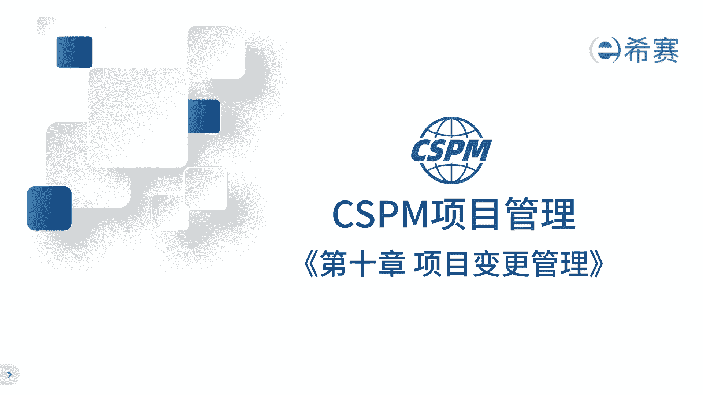
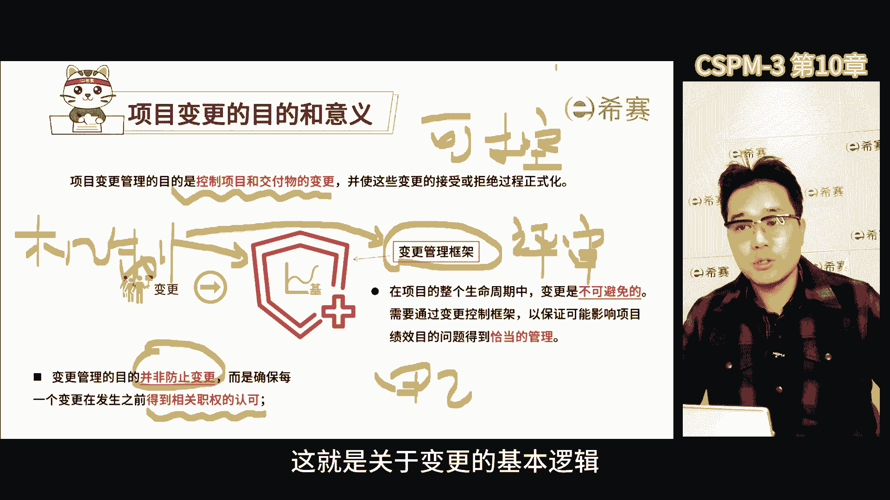
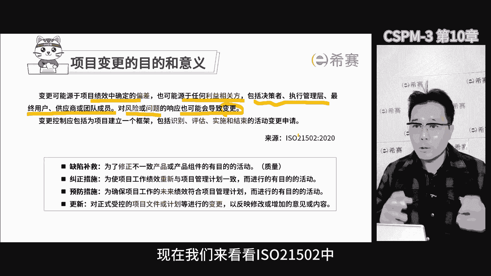
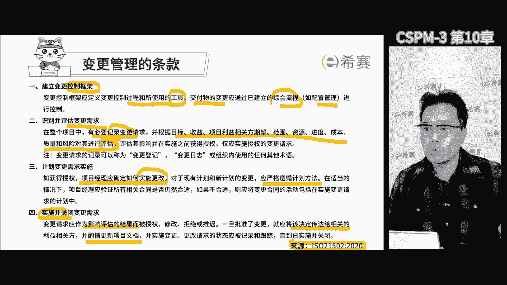
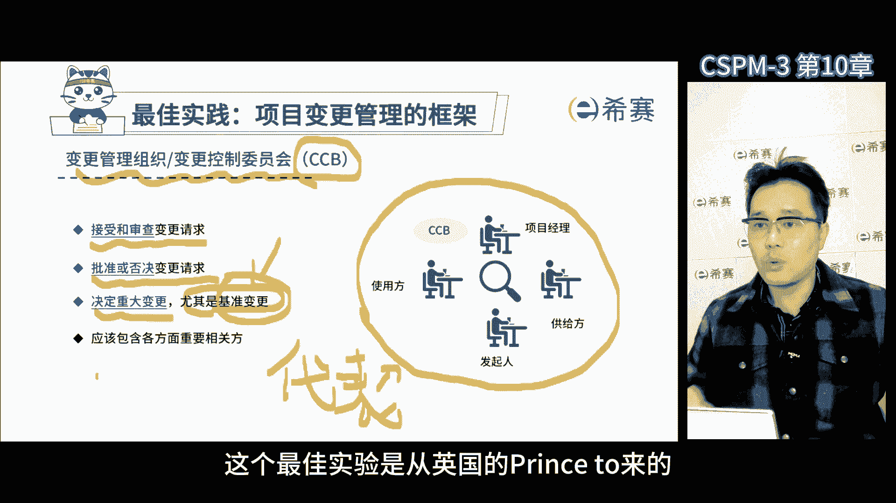
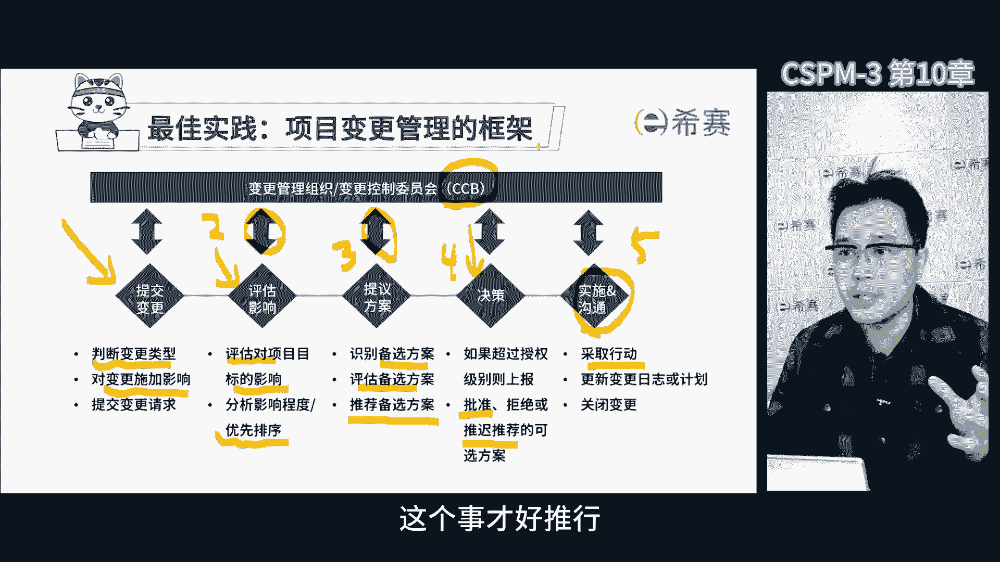
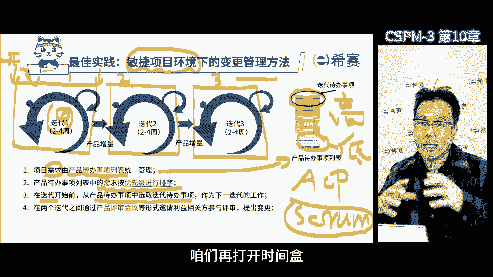
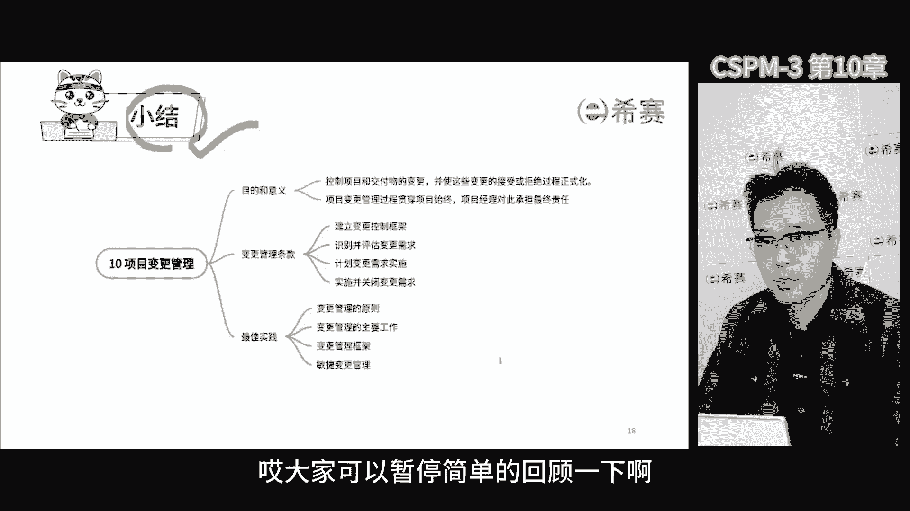

# 【2024年】CSPM-3项目管理认证精讲视频免费观看！比PMP更高级别的国标项目管理证书 - P12：cspm-3 第10章 项目变更管理 - 冬x溪 - BV1Y1421975P

第十章项目变更管理，说到变更管理，跟上一章的问题管理有关系，为什么会这样呢，因为问题需要我们去评估，去衡量它的优先级，看看他对我们有什么影响，如果问题很严重，结果可能会让我们偏离原来的目标。

并且短期内是没有办法去纠正的，那这种时候就会涉及到变更，所以问题往往会引起变更，那这样理解就能找到这两者之间的关系了，那关于变更管理呢，标准里面是这样说的，目的是控制项目和交付的变更。

也就是说我们要把变更控制住，让它变得正规化，从项目管理角度来看，我们不阻止任何变更，但是该变的地方变，不该变的地方呢，你就别瞎变，关键在于判断，要让大家达成共识，就需要规范化和正式化。

按照正规的流程和要求来办事儿，那换句话说就是要经过合适的人评审，大家达成共识，才能决定是变还是不变，如果没有正式化的变更，评审过程就会让项目经理特别头疼啊，原因在于这个变更不可控，所以对于变更管理啊。

一定要建立对应的流程，那这样一来啊，只要有变更就按流程走，让所有的相关领导集体决策，大家都同意了，就变那不同意就不变，那这样项目经理就没有那么多烦恼了，那最大的烦恼就是决策的烦恼。

那只要把决策机制刚开始建立好了，各方领导集体决策，项目经理的主要职责和任务，就是促成项目中不同相关方形成的集体决策，有些强势的甲方啊，他总是耍无赖，但只要我们把这个流程机制做好了，你按照这个来。

那就能更好的去应对他们这种情况，那咱们来说说项目哈，那甲方和乙方都有自己的领导，那这样咱们就能把项目搞好，那另外呢公司也得有个明确的变更流程，那这样我们才能更好的去管项目了，又有主体啊。

有变更的时候又由他们来进行评审和参与，最后集体决策，项目经理呢也得在这过程中发挥一点作用啊，不能啥都由着客户，那我们得有自己的规范监督机制，所有的变更都得走甲方，乙方双方共同的变更流程啊。

这样才是一个正规的做法，那如果不走流程，那就从制度上扣项目经理的绩效，那这么一来，项目经理他就有理由了呀，那咱们也得走流程啊，那如果双方领导都同意了，那落实也是正常的，最郁闷的就是什么呢。

自己的领导不同意，对方的领导非常同意，让项目经理做夹心饼干了啊，你特别难受，所以不要把矛盾放到项目经理上，不要总是让项目经理做背锅侠，一定要让矛盾双方都能做主的人来一起谈，促使他们达成共识。

那这么做咱们就没烦恼，这就是关于变更的基本逻辑。

再来看看条款哈，那变更源于项目绩效中确定的偏差，也源于每一个利益相关方，所以咱们得好好看这些条款，这样才能更好的去管项目，那项目里参与的人很多，执行者管理者啊，最终用户供应商团队成员等等。

咱们都有可能遇到问题和风险，这就需要改变原来的计划，但是你总是变来变去，这也不是个办法，所以我们需要建立一套变更的控制流程，把大家都拉进来，那谁要变更都得走个流程，在项目开始之前呢。

大家要共同确定一些规则，明确项目的要求和秩序，白纸黑字写下来，甚至说你要搞一个仪式感的承诺的活动，那这么一来大家就能明确自己的职责和任务，不会在项目实施过程中出现问题时互相推诿。

那这个规则不是只约束项目团队，相关方的领导和成员也要一起确定并遵守，这是为了避免各自为政，让大家都能更加关注共赢的目标要求和结果，所以啊，这个活动在项目实施之前就一定要搞好啊。

别等到大家都遇到问题了再去做，那就非常困难了，更费劲啊，现在我们来看看ISO21502中。

与变更管理相关的要求，这要求明确的列在了国标中，大家一定要去理解它，那国标中关于变更管理的内容，首先需要建立一个变更控制的框架啊，明确变更控制的过程和所使用的工具，交付的变更。

应通过已建立的综合流程来控制，比如说配置管理，第二在整个项目中应该记录变更请求，并根据相关方的期望范围，资源进度，成本质量风险对它进行评估，第三评估后呢，如果需要实施变更。

应该确定如何进行变更请求的实施，应该严格按照计划，第四一旦变更被批准，应将决定传达给相关人员和项目相关方，并更新项目文件，这些将来也会闹到我们国家的标准的规范里啊，无论是在甲方还是乙方，大家都要遵守。

这不仅仅是为企业的信誉啊，那更多的是为了确保每一个变更在发生之前，都要得到相关方的认可。

那除了这些要求之外，还有一些关于变更管理的最佳实践的原则，那其中第一条就是并非为了防止变更，而是确保每一个变更在发生之前，都得到相关职权的认可，第二条，在项目基准确定之前。

项目变更无需正式受控于变更关流程，就是你现在是个草稿还没批呢，你随便改，但是一旦确定了项目的基准，就必须要通过组织的变更流程进行处理，第三尽管可以口头提出，但所有的变更请求都可以书面的形式进行记录。

并纳入到变更管理和配置管理系统里面，也就是说必须要书面记录，即便是你这个事情比较着急，你先干了啊，可能电话打了打给领导，领导同意了，那最后你把这个流程也给补上了，第四在批准变更之前。

需要了解变更对于进展的影响，对成本的影响，在变更请求影响任何一个基准的情况下，都需要开展正式的整体变更控制过程啊，也就是说要对项目进行一个整体的评估，第五条，每一项记录在案的变更请求。

都必须由一个责任人批准，推迟或者否决，责任人通常是项目的发起人或者项目经理，需要把变更管理流程正式化啊，如果不正式化的话，就会出现一方总会耍无赖，只有把这东西正式化之后，谁都不太容易反悔了。

大家照章办事，这样反倒容易了，越是容易被耍无赖的地方，我们就越需要白纸黑字啊，越需要仪式感，越需要规范化，如果规范了耍无赖，他影响的就不是你了，它是影响了整个组织的秩序，组织的制度。

那到时候就会有很多人来制止，这就是我们把这个东西正式化的，一个很核心的原因，那就防止背锅啊，有了流程就要关注项目变更管理的主要工作，确保对项目中已记录在案的变更做综合评审，包括审查所有变更请求。

批准否决变更，根据目标收益利益相关方的期望范围，资源等等，对于变更进行评审，这里其实就说白了，你变更提过来，我要对它进行综合评审，有的时候一个变更可能看似只影响到了进度。

但是深度的评审之后发现成本也影响了啊，还带来了很多的风险，有可能还会耽误这个我们的验收，所以要进行综合评估，对可交付成果，项目文件，项目管理计划等进行更新，对变更处理的结果进行沟通，那这里需要讲的一点。

项目变更管理贯穿整个项目的始末，项目经理对这个过程要承担最终的责任啊，那我们要注意，项目经理承担的是变更管理过程的最终责任，比如说有没有提出对应的变更，有没有走正式流程，批准之后有没有去盯着落地。

注意它不是批准变更的最终责任，这两者要做好区分，它强调的是变更流程的正规性，说任何变更请求都会影响到项目的范围，产品范围以及管理计划中的任何组件或文件，在项目的任何时间，任何相关方都可以提出变更请求。

那如果需要的话，项目经理得核实相关合同是否合适，如果不合适，要在实施变更申请的计划里面，包含对合同的调整，那有一个最佳实践变更管理的框架，在框架里呢有一个变更控制委员会啊，也叫变更管理组织啊。

简称CCB，那这个委员会呢，差不多，所有的项目管理成熟度较高的一点的公司啊，他都会设立这个点，他是个正式的组织团体，负责审查评审，推迟批准，否决项目变更，还要进行记录和传达变更的处理决定。

那这个委员会是一个集体决策的组织，中各方代表组成，或者他们各自授权的人组成的，那专门代表项目管理委员会，对于变更评审的这个行为进行集体决策的组织，相当于项目管理委员会下面的变更专委会。

那变更这件事呢真的非常不简单哈，得有专人评审审查和批准，马虎不得大的变更，特别是基准变更，各方重要相关方都要参与进来，一起商定，这样变更管理流程才能跑得起来。

这个最佳实践是从英国的prince u来的啊。

为啥呢，因为他经常讲流程，流程讲的还挺不错的，所以给大家参考一下，第一步要收集变更，收到变更之后，要初步判断类型，初步的进行评估影响之后，第二步组织项目中的专家进行更严格，更严谨的评审。

对于项目的目标会带来哪些影响啊，并根据影响的程度给变更请求排个优先级，那如果搞不定的话，还要去征求CCB的意见，接着评估完之后，组织的项目团队，他得做好可选方案，因为变更影响那么大。

你得出个方案才能应对吧，然后把这个方案拿到CCB去评审，最后由委员会来拍板决定方案，团队呢这些小老百姓呢就等着听消息，项目经理不参与决策，但是他可以提供建议和影响决策，CCB1旦做了决定，那就有定论了。

能决定的就赶快快刀斩乱麻，不能决定的就留到下一个阶段再解决，决策之后，项目经理负责后续的实施，和跟所有的相关方进行沟通，你得通知到位啊，说批准了啊，还是否决了，还是怎么怎么着了，你得说一下好。

整个变更管理过程嘛，其中CCB可是起到一个非常关键的作用，所以这个组织非常重要，所以里面的人员啊也非常重要，你要把各个相关方拉进来，他们要代表各自的利益，最后达成一致，这个是才好推行。

那否则呢就有可能中途实施的时候出篓子，至于说敏捷环境下的变更态度，这跟我们传统的项目管理不大一样，也有人参加过相对应的培训哈，现在全球有非常多的敏捷流派，比如说AC p screw水晶等等。

那国内能建的差不多有五六种吧，但他们依然跟传统的方式是不太一样的，我们来看一下项目管理的历史，那项目管理早年是从美国的国防系统开始的啊，最早是因为军事需要才产生的，后来信息化转型时期。

英国说出了很多数字化信息化转型的方法，比如说prince啊，一个是政府，都是自上而下制定的，那么敏捷呢它是2001年的时候，当时成立了一个敏捷联盟，那这个联盟的成员呢，就是一些民间很有影响力的人。

他们的特点是呢是搞互联网模式，非常自由，大家都可以发挥自己的想法啊，敏捷的方法有很多的不同流派，每家都有自己的特点，也有一些共同点，但一直没有形成一个统一的方法，那现在国际标准化组织ISO也在考虑。

要不要把敏捷进行整体的提炼合并，我们国家走的比较靠前，8月6日正式发布了项目管理，敏捷化指南的国家标准，我们也是全球第一个，把敏捷上升到国家标准的啊，希望在未来的这个国际市场里面，能抢占一些先机。

这是敏捷的大背景，那回到今天的主题，变更管理，传统的变更管理，主要针对的是项目的目标基准进行调整，然后在敏捷项目里面，从一开始就没有严格的基准线，它一直是把所有相关方客户提出的这个需求啊，排个序。

决定哪个优先级高，哪个优先级低，那这个过程中就比较灵活了，不是一成不变的，他不断的会根据情况环境来调整优先级啊，大家应该也能去理解这个过程，就像我们平时也会根据紧急程度或者重要程度，来决定谁先做谁后做。

那我们以前讲的传统的管理模式呢，跟这个方法呢还是不一样的，那传统项目管理的基本逻辑是，一开始要想清楚为什么要做这个项目，定个目标，想清楚之后召集大家一起来评审，大家觉得可行，那就开干。

启动过程呢确定目标论证价值的过程之后，各方抽人手组成一个经营团队，那规划阶段，项目经理要带领大家制定项目的详细计划，分析过程中可能遇到的各种风险和问题，那包括如何实现项目目标啊，时间短，资源少啊等等。

最后确定实现项目目标的最佳路径，在收尾过程组中进行确认和验收，所有的文档归档变成组织工人资产啊，这样我们就把项目中获得的能力，变成了组织的能力，那还得给项目后面接手的团队赋能啊，啊有这些东西。

他们就脱离开我们呢，他们还能干事儿，然后我们需要给项目做一个评价，看做得好还是不好，这个评价关乎到项目奖金的发放，还关乎到项目经理和团队成员的个人绩效，我们得把他们在项目的表现，反馈到他们所在的部门。

那这可能有利于他们在原来岗位上的晋升，或者其他的好处，那这些都是传统项目管理的方式，比较注重的一次把事做好，然后在实践项目过程中尽量保持不变啊，也就是争取一次做对，那如果过程中有了变故。

就说明你前面的规划分析的不够透彻，得重新再来一遍，但是敏捷开发呢完全不是这个思路，在传统的项目过程中，我们一开始通过充分的分析和规划，可以确定未来不会改变的目标，这就是目标清晰。

但是敏捷开发刚开始面临的初始条件就不同，通常客户在开始呢，他也不清楚自己的需求，那我们作为实现方也不太明白，那这种情况下，我们就需要在项目中去摸索，去调整，如果我们在项目中没有实现客户的需求。

客户可能也不清楚我们做出来的东西是什么，那这时他们可能就会提出更高的要求了，那所以敏捷开发通常是适用于创新程度高，而且目标比较模糊的这种项目，在不大清楚的情况下，那同时对于时间要求也很高。

我们要尽快的去实现，虽然不知道具体实现什么，但是大体的方向还是正确的，那这种情况下，它就会直接选用敏捷方式来开发敏捷，各门各派的开发方法，几乎都借鉴了scare，它出现的比较早。

这种敏捷开发方法的基本逻辑是，把原来的整体拆分成不同的阶段啊，也就是说分阶段进行管理，每一个阶段跟前面的阶段它的区别在于，它是迭代式的，它是把整体的交付过程拆成了几个小的迭代，交付过程。

每一个阶段都要进行定义产品开发测试发布啊，这是一个完整的发布周期，他是为了加速过程哈，就把它们拆成不同的小的卷啊，通常是平均均分的啊，就是把这个整个项目生命周期，比如说我们拆分成十个不同的迭代周期。

每一个迭代周期都会把整体的交付一部分，拿出来进行定义，开发测试发布做完了，再把下一个部分定义开发测试发布啊，当然也可以进行整体迭代，先把一部分简单的产品，一部分简单的功能先进行定义，开发测试发布啊。

需求清晰了之后呢，再重新定义新的部分开发测试发布，那相当于他把这个整体的交付过程，拆成了不同的部分，分批次进行开发和交付，那这种方式使我们在目标不清楚的情况下，项目依然能够快速的推进。

边摸索边澄清目标也就边实现了，那如果换成传统的预测型项目管理，就相当于是我们要做整体的定义，整体的规划，整体的开发，整体测试啊，最后统一上线，那咱们把这个整体的过程走一遍，就通过这张图。

大家可能会更加清楚一点，首先咱们得广泛的收集所有客户的需求，那这些需求可能会被写进一个文件，这个文件叫产品代办时尚列表，那这个列表里面有很多很多需求，那各种各样的都有，那虽然收集了很多需求。

但是咱们项目的资源时间都是有限的，所以不可能完成所有的需求，这个时候我们就要对所有的需求进行，优先级排序，在排列之前先确定一个标准，这样才知道哪个需求重要，哪些需求不重要。

那这个标准咱们会征求相关方的意见，大家最后统一用这个标准来排列需求，标准定好了，咱们去把这个需求按照这个标准排个序，拍好之后，咱们就挑一些那些优先级高的，而且能在当前迭代周期里面完成的需求。

那这些需求就是我们这次迭代周期内的目标了，好接着咱们就组织团队完成目标，开始实施，我们称之为开始冲刺，通过冲刺的方式来实现第一阶段的阶段目标，完成第一阶段内的需求，在冲刺过程中我们不能被打扰。

所以在迭代周期内，我们不接受其他的需求，也就是说我们要封闭冲刺，以前有个叫法叫时间盒啊，就是我们现在看到的这个迭代的一个方盒子啊，我们开始冲刺之前，打开时间盒收集需求啊，并进行优化排序。

把优先级靠前的放到盒子里面去，当我们决定实施的时候，关闭盒子进行统一的冲刺，完成之后，我们交付第一阶段的成果，接着再次广泛地收集需求，在于大家确定新的优先级排序啊，因为这么一段时间过去之后呢。

大家可能的需求发生了变化，可能有新的需求啊，目标肯定也有所调整，那同时根据第一个阶段的交付结果，大家看到了，使用了有反馈了，对优先级排序也有一定的影响，那于是第二阶段，咱们再打开时间和重新收集新的需求。

再次确定优先级顺序，并把优先级靠前的，放到我们的新的实验盒里面去，我们又继续下一次的冲刺了，从而实现阶段目标，这个过程呢就这么一直重复下去啊，直到我们完成所有阶段的目标，那如果发现在几个地带周期之后啊。

需求没有完成啊，那也没关系，就不管了，因为我们只选择完成优先级最高的那些任务啊，这种工作方式有个好处，我们每个阶段都会与客户重新商量，并征求他的意见，让他们对我们的工作有更明确的认识，对于用户来说。

我们虽然有些需求我们没完成，但是他们通常也都可以理解，因为他们知道我们已经尽力了，那这种方式被认为是最符合用户和客户需求的，工作方式，因为我们一直在努力满足他的需求，给客户和用户提供便利啊。

让他们更容易明确自己的需求，那这点蛮重要的，那如果他们有调整，我们也跟着调，那这种方式很容易得到客户和用户的认可啊，特别是他们对于目标需求，也不是很清楚的时候啊，这就是敏捷开发的大背景了。

敏捷的变更可以体现一个思想，叫做价值导向，也就是说在近期阶段内我们做详细的规划，远期的阶段我们做粗略的规划，大的规划被分成了几个阶段，每个阶段完成一部分，大家评审一下，获得反馈，然后接着再做再评审。

在每次迭代开始的时候，鼓励大家对于之前的需求进行变更，把更有价值的需求提出来，每个迭代的工作哈，聚焦在优先级最高的需求里面去，最高级别就代表了背后它更有价值，那变更的目的就是把最有价值的一部分。

我们找出来，提高它的优先级，然后完成它那执行项目变更的时间点，推荐在迭代和迭代之间，那换句话说我们会在两次迭代中间进行变更，在迭代期间我们不会做其他的变更了啊，就像我们前面说的实验盒一样。

叠在做的时候把盒子关上，不允许变更啊，因为大家都在集中的进行冲刺啊，老是变来变去会影响到进度，敏捷的逻辑是如果大家的需求在变化啊，与其让它一直变啊，不如让它有阶段性的有节奏的去变，那至少在节奏期内。

我们先冲刺完成这些成果，那否则一直变结果啥也干不了，这就是敏捷环境下的变更方式，大家会发现跟传统的项目管理，尽量不让大家变不一样，敏捷方法是鼓励变更的，被我们称之为一种偏向于价值导向的方法。

所谓的价值呢就是大家不断的去协商，到底开发实现什么东西，对于大家来说最有价值过程中进行迭代的调整，这种方式其实是非常好的方式，敏捷团队最终的状态哈啊，就像我们国家追求的和谐啊，就是大家技能不同。

但是能一起合作，敏捷就是让我们一起应对变化，创造价值，团队里的人都是自驱的，有强烈的使命感，想做好事情，就是敏捷团队，也是项目管理的最高境界，在敏捷的管理过程中变更起来就不那么费劲了。

因为大家的技能都很成熟啊，容易达成共识，对外部感知性也很强，那敏捷团队组成呢有产品负责人，他根据内外需求确定交付物，由敏捷教练指导工作方式，还有技术成熟的团队，再加上其他的相关方。

就构成了整个敏捷的组织环境，那这里面核心点产品负责人负责收集需求，明确需求，还负责给需求排优先级，他们还会邀请内部或外部的相关方，参与需求的识别和评价，进行产品的评审，并提出变更的需求。

那还要确定交付的目标，他们会邀请团队和敏捷教练，共同评估变更的优先级和影响程度，以达成如何处理变更这个共识，这个过程啊，全网先邀请需求方达成共识，再邀请团队成员，敏捷教练一块去商量怎么改变啊。

以达成最好的效果，最快的速度和最小的影响，以价值为导向，非常的核心，好这一页呢是变更管理的模板，那这个模板里面首先要明确变更的原因，就是为什么有这个变更，再就是变更的内容具体要变什么呀。

好相关方优先级排列的分析就是变了，对哪些又有利，对哪些没利，然后评审批准写明这个变更能不能通过，最后后续跟踪，怎么知道这个变更之后的情况呢，都要记录下来，那为什么要用模板呢，因为我们希望不管什么变更。

都要走一个正式的流程啊，不管是敏捷预测，都要有个正式的流程，那正式的流程你就需要填表啊，所以就有这个模板，虽然敏捷鼓励我们做很多灵活性的改变，我们也支持主动变更，为了创造更大的价值。

但是我们还是需要把变更的过程规范化，正式化，不能让大家随便的乱提，那这样整个项目的节奏就被打乱了，那我们强调项目管理过程要受控，不是不支持改变，而是先把这个受控机制搭建好。

因为怕大家跨职能启动过程中节奏被打乱，虽然我们叫敏捷，要灵活，但是同时也要提出很多的规范，那这些规范的目的是，因为项目中不是协调一个人，你是跨职能的组织，整体学校这种学校能力啊。

一定是要求大家有共同的框架，要求秩序才能共同的协同起来，所以一方面我们要加强组织的管理，框架的管控啊，另一方面也对于目标的调整，我们可以临时随机应变啊，鼓励大家通过创新的方式去实现项目目标。

在项目管理的过程中，我们比较独特的管理方式是呢，叫做既要管又不要完全管，既鼓励大家变化，同时也要规定哪些地方不让变啊，因为这是一个团队进行整体敏捷调整的模式，这些就是关于变更管理的内容。

那这是一张思维导图，哎大家可以暂停。

简单的回顾一下啊。