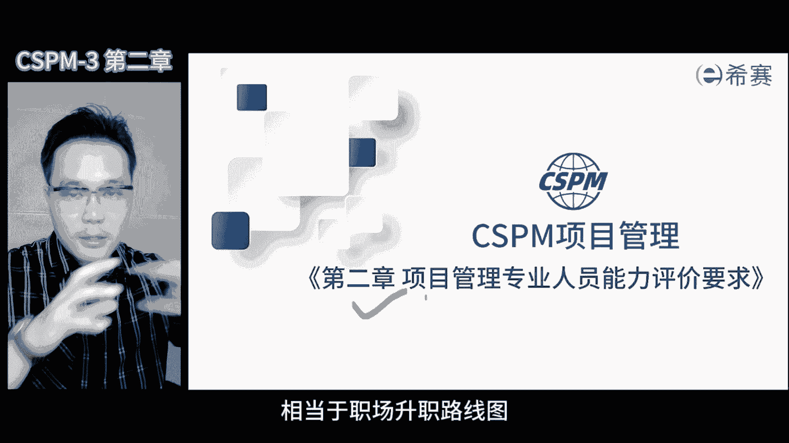

# 【2024年】CSPM-3项目管理认证精讲视频免费观看！比PMP更高级别的国标项目管理证书 - P4：cspm-3 第2章 项目管理专业人员能力评价 - 冬x溪 - BV1Y1421975P

同学们，今天我们来讲解cs t m项目管理的第二章，那这章内容呢对于我们专业人士来说，是非常重要的，是一件大事，等于咱们的职场升级路线图。

一共是两块内容，一起来看看哪两块，首先项目管理专业人士，包括了项目经理和PMO，他们的能力，经济的五个层次，需要知道一旦踏入到项目管理领域里面，能力会经历哪五个阶段。

其次我们重点要讲解第三集的能力评级要求，具体有哪些，来咱们接下来一起看。

我们首先要看的是国家对于项目管理，专业人员的能力评价标准，那既然要考这个证，那考这个资质，就需要清晰的理解国标中具体有哪些要求，理解得越清楚，努力的方向就越正确。

这个标准叫做项目管理专业人员能力评价要求，是一项国家标准，由国家市场监督总局于2022年发布的，该标准啊，规定了项目管理专业人员能力评级的各个方面，包括咱们的术语定义，能力评价维度以及能力的划分等级。

具体而言呢，项目管理专业人员能力被划分成五个级别，每个能力等级都有对应的核心能力要求，为了确保公正和准确，本标准还规定了能力评价的具体方法，并明确了能力评价结果的应用级别，这一标准适用于企事业单位。

机关社团等等各组织，对其从事的项目管理工作人员的能力，进行的分级评价，此外也可以作为各省市区县开展项目管理，专业人员引进啊，培养啊，以及咱们的职称评定任用等工作的依据。

实施，此标准有助于提高我们中国的项目管理的水平，使我国的项目管理能更好的和国际接轨，那简体要是国标，它一定会具备几个特点，第一普适性强，第二共识度高，第三理解难度大，接下来我们详细的讲解这几个特点。

第一腐蚀性强，适合很多地方，也就是说它具有指导意义，它的核心是高度概括的，所以你看他字数不多，字数少呢，原因在于它省略了很多业务场景，包括不同的行业，不同的公司背景等等。

这样才能够总结出背后的本质和规律，因为次数少，所以它适合大多数的行业环境，对于咱们的国标来说，它可以进行行业指导，也可以进行企业指导，企业的人员也能用起来，所以他就一个指导的作用，第二共识度高。

就是因为内容没写太多，不那么详细，所以它有一个非常大的一个特点啊，大家容易达成共识，因为内容比较简洁，各行各业都可以认可，如果写得非常的具体详细，那可能只适合某一个行业，某一个企业。

那其他行业企业就不一定认可了，那就难以达成共识，所以它的高共识特点是，因为表达了背后的核心逻辑而体现的，第三理解起来还真的挺难的，你看很多东西都是一笔带过，比较精炼，这就需要专业的机构来帮忙解读了。

那就像咱们的国际标准ISO啊，市场上有很多的机构提供解读，但是要把这些标准放到咱们的企业里面，还需要根据企业的具体情况来决定，那有些机构呢来解读，我们才能更好的去理解这些标准。

应该在什么样的环境下去执行，所以理解难了，落地也就更难了啊，这是三个特点，大家都会想啊，那我们要的就是落地啊，那如果我们能根据国标制定一个行业标准，那大家理解起来就容易多了，因为在这个过程中。

可以发现行业的一些特性需求被体现出来了，如果根据行业标准在制定企业标准，比如帮企业定义项目经理的这个人才画像，能力的要求去匹配国标五级相对应，那企业员工一看就明白，为什么呢，那这些具体的描述啊。

和他们自己的实际情况非常的符合，这些标准，之所以容易被理解，是因为我们在制定过程中，考虑了企业自身的要求和特点，行业的特点，但是对于国标来说，覆盖面不仅仅是各个行业，还有约束政府军队。

所以很多具体内容啊只能高度提炼，没有办法详细展开，那这样做的目的是适合所有的行业，企业军队政府基于标准里面的内容加入更明确，更具体的应用场景，就容易落地了，那实施中需要一层一层的拆解和细化。

我们要把这些内容传递给所有的小伙伴，这可不是一件容易的事情啊，那国标内容很少，往往只有几页纸，三两句话就说完了，但别小看这几页纸，大家要理解的都是非常重要的核心内容，咱们来看看什么是能力评价吧。

那通过这张表就能很好的区分维度等级的关系。

这里的行是维度，列是等级，首先看一下水平的维度，划分成了三个方面，那知识能力和经验，需要理解它们三者之间的关系，能力和知识经验完全不一样，知识嘛上完课考试过了就掌握了，没过就没掌握经验，你干过就有。

没干过就没有，但能力呢不管你有没有知识，有没有经验啊，如果你能把这事干成，拿到对应的结果，才能证明你有能力，再结合等级，咱们一起看一下。

如果只能干点辅助类的活，那就是辅助人员了，初级项目经理能搞定一般的这种项目，中级项目经理能搞定复杂项目，如果能独当一面，搞定一系列复杂的项目及项目群，甚至能在海外组织项目，那绝对是高级项目经理了。

第五集，那个专家级是啥意思，来光搞定一两个项目可不算专家，真正的专家在一定范围内，能组建组织级的项目管理体系，提升企业的项目管理的这个能力，规范优化各个项目管理之间的这个制度流程，搭建项目管理的平台啊。

培养一批项目管理人员，如果能在企业中营造这么有利于开展项目管理，组织的环境，这才算是专家级的水平，专家也分不同的级别啊，有企业级的，还有行业级的，国家级国际级别啊，不同的专家。

所以整体上第五层级是上不封顶的，前四个级别比较容易界定啊，但第五个级别就不好界定了，咱们从一级开始一层层往上走，第五级别呢刚说了上不封顶，所以我们可以一直朝上走，接下来我们就以职业发展路径来说说。

项目管理这个岗位。

他的晋级路径啊，可是长得很，从业余到专业分了好几个级别，在每个级别里面又有不同的侧重，比如说从技术，个人和咱们的环境这三方面来划分的，第一集，要求你自己会用工具和技术来完成任务啊。

到了第二集你就得教别人怎么用了，让大家能够多用起来，形成一种合力，第三集除了技术能力，更看重你的个人能力啊，就是搞定人的能力，这是第三集的核心要求，第四集和第五集更多的是看你的环境的能力啊。

不同级别有不同的侧重点，那123级注重技术力量，345级注重个人能力和环境力量，那这个我称之为借力模型，不同级别你需要借不同的力量。

现在我们来详细来讲解一下这五个层级了，第一层级认知改变，那啥是认知改变呢，啊就是从原来我不知道这个事怎么干到突然哇，我一直做的都是错的这种转变，那想象一下，你一直以为项目管理就是跟着阶段走啊。

学了一大堆的工具和技术，结果发现实际应用的时候根本用不上啊，是不是觉得有点崩溃啊，啊我想想都崩溃，好别急，那这就是认知改变的开始，只有当你意识到自己不知道才能开始改变，认知改变是质的起点。

只有通过量变的积累，才能达到质变的这个结果啊。

这个层级的关键在于学习啊，大家都知道，pp就像一个咱们的项目管理的大百科全书啊，里面啥啥都有啊，各种知识理论方法啊，就是让你知道原来项目管理的世界啊，就特别丰富多彩啊。

但是PMP可能不会手把手的教你具体怎么做，他只是给你打开了一扇门，还让你知道，原来还有这么多的一整套的方法和工具，学完pp你就像从一个终点又回到了起点啊，看待项目管理的这个视角就变了。

有一套管理的方法和工具，就算有了一个坚实的基石啊，再也不怕在项目管理这个海洋中迷失方向，考过P的同学也都能体会到啊，学完那啥，咱们也不能直接抄起项目管理大旗吧，那只是觉得这些东西特科学特别有用而已。

那这个时候咱们就脱离了，不知道自己不知道的迷雾，解决了这个状态，以前咱们没学，那真是不知道自己不知道，学完了才发现自己不知道的东西多了去了，但是这个层级是咱们项目管理的起点，也就是说。

你突破职业瓶颈的关键是一次重大的跨越，要是你一直处在那种不知道自己不知道的状态，你就没有办法成长啊，只有进入到这个层级，你才能处于知道自己不知道，然后开始持续的去成长，持续的去学习偏僻对于我们的帮助。

那最重要的就是让我们改变，我对项目管理的认知啊，就像小时候学了课本上的一些东西好，虽然可以拓展我们的知识面，改变了你的认知，但是学完之后要落地呢就没那么容易，专家判断，标杆对照等等。

这些方法你觉得很科学，很好用的啊，但是就是没法落地啊，没有流程，要是给你一个具体的场景，那你可能就傻眼了，虽然这个阶段有很多难落地的点，但他可是你获得能力成长的必经之路。

在这个环节中我们获得了认知和知识，所以考完pp之后，我们觉得自己懂了项目管理，但是干不成，这个时候我们的能力就需要升级了啊，还得在实际的工作中攒攒经验，就像学游泳一样，理论你学的很多动作做的很标准。

你总得下水游一游啊，呛两口你才能学得会啊，所以考过PMP只是开始，咱们还需要在实际过程中积累经验，才能真正的进入到项目管理这个专业道路上去，这个时候我们需要迈出第二步啊，是至关重要的一步。

那就是付诸实践，项目管理知识体系学完了之后，我们要尝试去实践，即使还没有完全掌握，也要勇敢去尝试，实践中我们才能体会到这些知识怎么应用，要亲身体会逐渐落地的感觉和反馈，不管是正反馈还是负反馈。

知识是系统化的内容，挺好啊，但是真正的落地需要从每一个细微的点上开始，1。1点去实现，我们可以先挑选一些容易上手的部分来运用。

先把这些我们能做主的事情先做好，至于说需要张罗组织大家共同完成的部分，还需要具备组织和协调的能力，那这个过程呢就像咱们爬楼梯啊，需要一步一步的往前走，1。1点的去积累，在这个过程中。

我们可能会遇到很多的挫折，也会失败，犯错误啊，但是只要我们能够从中吸取教训，总结经验，就能不断的成长，做对的事情，咱们也要总结经验啊，思考一下为什么会做对，然后记住这个经验，持续的朝这个方向去努力。

这个过程确实很辛苦啊，他需要时间，只有行动了才能真正的获得经验，也才能真正的在第二个层级里面，找到自己的位置，总的来说，这个过程呢是经验的积累，在实战中我们才能真正的成长起来好，对于这个层级的能力要求。

需要大量的实践，即使你在这个层级知道了很多，但如果你不落地不实践，那么你永远无法真正的掌握它，实践是检验真理的唯一标准，只有通过实践，我们才能做到真的知行合一，说了这么多，为什么想问大家一个问题。

这个层级里面的行动的核心能力是什么，大家可以思考一下，还是前面提到的那个借力模型啊，更多的是借什么力，这时你可能需要借助技术和工具的力量啊，虽然前两个级别呢都是借工具和技术的力量，但是区别很大。

第一层级是自己会使用这些工具和技术，以完成任务为导向，这个力是自己用出来的，第二层级需要不仅仅是自己会用，这些工具和技术，还需要让大家都会使用啊，借大家使用工具和技术的这种合力啊。

这是我们需要清晰的一个关键点，在这个层级里面，通过实践，我们慢慢的理解了项目管理到底管的是什么啊，以及需要什么样的能力去做项目管理，有了技术和工具的帮助，项目至少能推动下去，能动起来了。

那因此除了学习科学的专业知识，更重要的是要在这过程中去体会，和人打交道的这种方式，以获得他人的认可和支持，而促成双方合作，达成共识，好在这个层级呢做的项目一般是属于一种啊。

一般层级的一般性的项目没有那么复杂，然而随着项目的复杂程度越来越高，你会发现光懂技术是不够的啊，道理都懂，你仍然过不好这一生啊，这是因为很多事情需要别人的支持和配合，需要协同啊，需要共识好。

因此除了技术和工具的这个能力之外，还需要具备搞定人的能力啊，这会带你进入到第三个层级，借人的力量，我们要去借专家的专业能力，借领导的权利，借投资方的资金，借供应商的技术能力，只有善于借用这些人的能力。

咱们才能在第三层级里面立足，第三集，我们的定位是领导者，需要我们具备大局观，就像是一个指挥家啊，能够考虑到所有人的想法和感受，系统的去思考问题，123级啊，就像过关斩将啊。

前面两集是工具技术以及具体的实践，到了第三层级，突然加大对领导力的要求好，那么这个领导力的定位是什么呢，就是要能够应对复杂项目标的实践，并能够负责实现相对应确定的目标，在这种情况下。

我们不能只看问题的一个点，而应该看一个面，甚至一个体系，通过系统思考来完成，所以在这个环节我们需要有大局观啊，站在更高的角度去思考，想象一下，如果我们站在公司一把手的角度去思考一下。

如何看待公司众多重要事情中的某一个项目，那我的项目并不是孤立存在的，公司里面有很多的事情要考虑，只有站在公司整体的角度去看待，其中一个小项目的时候才能更好的去思考，然后再回到自己的位置上。

在推动项目的过程中琢磨，如何用这么一个小事引起公司领导的注意啊，并通过我们的项目，为整个大局带来有利的变化和影响，同时呢作为项目经理啊，你也是一个大管家，风格是咱们的普瑞士领导，原因是你没有什么权利。

你管的一帮比你权力大的人，专业能力比你强的人啊，资源比你多的人，那这种时候对于领导力的要求是非常高了，如果你是用权力去管，那不需要你管你的领导，权力比你大啊，他说一不二，底下人听啥干啥好，毫无怨言。

毕竟下面的人都是靠他发工资的，但是作为项目经理，别人凭什么要听你的，所以你的领导力，你的影响力在这里面就体现的淋漓尽致了，所以在第三级这个阶段，我们需要开始具备这样的能力，通过运用自己的技能和知识。

不断的提升自己的领导力，至关重要，发挥自己的影响力，为公司的发展做出更大的贡献，那明确了定位，接下来面临怎么做的问题，在这个层级解决问题，我们需要考虑的东西可多了，虽然技术和工具是个好东西。

能帮我们节约节约不少的劲儿，但是人的因素才是最重要的，咱们要深度的去思考，全面考虑，把点线面体这些系统化的东西要琢磨透了啊，而不是指定一个小点，你把它想的天花乱坠，其他方面考虑不周。

那这样下去其实没有办法胜任这个职位啊，千万不要一头扎进工具和技术表单啊里面，你无法自拔啊，这样大错特错，首先我们要站得高，看得远，从战略角度去思考，领导为什么要推这个项目啊，各个利益相关方。

对于这个项目的期望和诉求是什么，我们该如何做，才能让所有人满意，并支撑公司的战略落地，如何帮助相关部门的工作，这是我们在第三层面需要考虑的重要问题，想明白这些呢。

我们就可以与不同的相关方进行沟通交流了啊，他让他们关心的好，我们这个项目未来的成功，将如何为他们带来好处和价值，我们要讨论的是交换，为什么他们能够帮助我们项目解决这些问题，并带来更多的收益和价值。

在这个沟通环节，我们会发现对个人的能力要求越来越高，我们需要具备整合多样化资源的能力，简化复杂问题的能力，以及在明确规则下，促进复杂利益相关方达成共识的能力，我们能够促成共识的原因在于。

把每个我们认为对项目有影响力的利益的诉求，和咱们的动机都考虑了一遍，通过交流，基本上验证了他们想要什么，不要什么，我们站在公司的大局的角度，在他们之间找到一个平衡点，寻找一个多赢的解决方案。

就一定是一个平衡点，有可能他们之间是相互矛盾的，所以找到一个平衡点去解决这个问题，并用这个方案说服所有人，大家单独行动，可能一无所获，但如果求同存异，共同推进这个项目，将会有利于所有人，在这过程中。

我们的游说能力是关键，我们需要说服各方来支持我们的项目，而且项目所处的环境呢，呃也并不是一个常规的环境，而是较为复杂的项目环境，换句话说环境本身特别复杂多变，我们基于这种情况下为项目实现目标。

就需要明确各地消防方他们的职责好，为什么要明确他们的职责非常重要，咱们把这帮人拉到我们的这个事情里面啊，得在这个事情里面去定义，他们在项目中应该扮演什么样的角色，至于他们在原来组织里面啊。

单位里面是什么部门，什么岗位，什么职责啊，跟咱都没什么关系，现在组织大家齐心协力做项目，要的是你在项目中扮演的角色和你的职责啊，不用管你以前干啥的，就拿咱们乒乓球俱乐部这个事来说吧。

好参与到乒乓球俱乐部里的人啊，你进到我们的乒乓球圈子里面啊，你就得去认领各自在乒乓球里面的角，色和职责是什么，至于说你以前在原来的单位是什么局长，半毛钱关系都没有啊，咱们聚在一起是为了打乒乓球。

你以前那个职位解决不了乒乓球打得好的问题，也解决不了比赛能胜利的问题，对我们来说呢，项目的逻辑是用人所长，需要是每个参与到项目中了，他的能力，而不是他以前的职位和职责，当然了。

每个领导呢要的是你在项目中能做决策的能力，美国专家在项目中帮助项目，解决专业问题的能力，至于说你原来那个职位对于我们来说呢，可能用处不是很大，咱们可以借你原来的职位帮我们获取一些资源，仅此而已。

不过他在项目中不能老强调他原来那个职位吧，在项目中就是咱们项目成员的一部分嘛，啊我之所以让他成为项目成员的一部分，就是因为在原来组织中有一定的权利，有一些资源可以用，那如果他用不上。

我把他拉进来干啥来啊，用的是资源，这其实也是我们在项目管理中，需要思考的一个问题，因为大多数做项目经理的，都是做专业出身的人啊，他扭转这个观念比较困难啊，这也是为什么说第三集我们注重行为的改变。

行为改变的前提是你的思维方式的改变啊，这也是从专业走向管理中间，必须要经历的一个过程，这个过程确实很有难度啊，我也是这么过来的，这样做的目的是什么呢，这样做的目的就是为了，应对比较复杂的项目环境。

基于复杂的项目目标，我们要明确各自相关方的职责，借助组织中高层的力量，组织大家一起分解复杂的项目标，建立受控的项目环境，形成跨职能的执行力，好最终实现咱们复杂项目的目标，这样才能真正的把项目的事情做好。

把项目做成功，那这个层级第三层级咱们小结一下，在这个级别里面，项目经理需要转换角色，成为全局者，我们不再采用传统的自上而下的这种管理方式，自下而上的去攒这个局，这才是真正的领导者，在这个过程中。

项目经理呢人微言轻，没啥权利，就需要找到一些有影响力的领导，来支撑我们的行动啊，借助他们的号召力，把大家聚集在一起，我们的目标是让各个部门，或者公司的下一层级的领导，参与到这个项目中来，对这个项目负责。

推进项目进展啊，这样我们就可以拥有所需要的资金和专家了，项目中专家越多，工作就进展的越快，越顺利，越少走弯路啊，更容易把这个事情更快的干完，而且专家的工作效率高，资源消耗少，事情就容易多了。

让专家带头干活啊，能节约很多成本啊，简单来说就是把项目分解成不同的工作包，分工作包的时候，咱们按专业来划分啊，这样就能找到对应的专家，每一个工作包再分成不同的任务，那最好让这个任务能够并行。

哎这就是在项目管中缩短工期的关键了，想要这么干，为了让这些领导进入到小组，并为项目负责，要找到一个特别有号召力的发钱，让他把这些领导拉到项目中来啊，不是光靠我们个人的力量啊，我们将举着发起的大旗。

利用他的力量来组建跨职能的小组，好借助小组里面的力量来获得资源，帮助我们推动项目啊，这就是我们在项目管理中的基本策略，叫借人之力谋求大业好，这是咱们在这个层级里面需要解决的问题，大家现在应该知道吧。

咱们在这个层级里面需要什么样的人了吧，好咱们了解这些东西呢，都是为了更好地扮演这个角色，如果我们能够成功的搞定第三层级，迈进第四层级的门槛，那咱们就能在更高的维度上去磨练自己，迎接更大的挑战。

说到这个级别呢，我们就需要知道什么叫做更大，那就是战略层级的项目或者项目集群，那么到了第四层级，咱们就是对于项目的具体的战略目标实现，要负责了，这意味着咱们要以结果和收益为导向，需要具备战略解析的能力。

还有临危不乱的应变能力，在未来的这个未知环境中，我们需要迅速定位并控制风险啊，应对这些复杂多变的项目群组啊，根据项目的战略目标，策划和选择一系列对应的项目，咱们还要借助组织高层的力量。

把这些复杂的项目的相关方凝聚在一起，在这过程中，我们需要建立这种更大维度的，跨职能的统一战线的能力，并保持正确的方向，逐步把模糊的项目群目标慢慢变清晰啊，咱们要带领大家在这个混乱的这种环境下。

建立有序啊，并不断的去调整咱们实现的路径，最终完成战略预期的结果和收益，此外呢，当地环境有深刻认知和了解这种能力啊，抓取关键信息，能够协助国际人员开展项目管理啊，展现出国际市场的竞争力。

在多元文化的项目环境下，对于项目团队啊起到一个拉动作用啊，带头作用能够独立策划和引导国际项目，需要完成的任务有哪些呢，好为了支持国家一带一路的战略，我们的目标不仅仅是培养国内的项目经理。

还要把这些项目经理输送到国外去，目前国内的发展啊越来越卷，大家来考试，其实就能体会到啊，与其在国内卷呢，不如去海外打天下吧，很多时候咱们需要把事情引导到国际舞台上啊，这也是咱们在不断掌握国家标准的原因。

可以保护我们自己人，咱们自己人出去做项目的时候，最好能按照咱们国家的规则来用人，按咱们的认证来开展工作，按咱们的要求来认可老外，用自己的标准去约束老外，在开展工作过程中，他们才能配合。

这也是咱们从第四集开始，为了按照一带一路的国策所需要的一批，将去海外开展各类攻坚战，各类项目管理工作的精英人才，那么到了第四集之后呢，对于各位同学来说，能力要求会更高了，所以大家一定要做好心理准备。

到第五集，我们确实有那种行业专家的使命感，这种使命感是一份责任，让我们肩负起了推动行业发展的重任，那么这个使命感到底是从何处而来呢，啊到第五集，我们至少是行业的专家，甚至可以说是首席领导，好总裁呃。

专家学者等等啊，换句话说在这个领域里面，我们就是大名鼎鼎的人物了啊，一提出来呢，大家都知道我们是谁，专业能力，专业素养都获得大家的认可，我们不仅能成功地完成项目，还能解决大家都遇到了一些共性问题。

在这个过程中，我们逐渐的成为了令人羡慕的那些人，更重要的是我们不仅仅为自己奋斗啊，还要为行业为国家做出贡献，这是我们第五层级里面特别需要的，在第五集的标准要求中，不仅仅要能力强，还得对组织有贡献啊。

就像我经常分享案例啊，参加培训的授课啊，参与到行业企业的标准的制定中来，好这些都是在对组织对行业做贡献好，这个过程是循序渐进的，级别越高，能力越大，能力越大呢，你的责任越大，所以要对行业对国家做贡献啊。

所以同学们既然选择了项目管理这个领域啊，那就一定要具有使使命感，越早拥有越好啊，一直朝这个方向去呃，齐心协力，一起努力为这个行业，为了国家做出贡献，持续的去成长啊，这是我们整个西塞团队呃。

来学cs p m，希望大家对你们的期待，也是我们学习的目标，好了，让我们再给大家总结一下，关于第三集的那些事儿。

CSPM杠三主要就是以第三级为目标的，那基本要求，应对复杂项目，具有大局观，能系统地思考问题知识吗，首先要掌握这些内容啊，达到对应的级别啊，当然非常重要了啊，但是咱们更关心的是能力，从能力角度来看。

大家要努力提升自己的环境能力，比如说熟悉各种标准规则要求，还要锻炼自己的个人能力啊，比如自制力，自我反省，自我管理，诚信可靠啊，团队合作冲突，谋略谈判，以结果为导向，技术能力要求方面。

大家要懂得制定目标，时间管理，质量管理，资源管理，财务计划等等，还有更重要的相关方管理经验方面呢。

至少要有5年的项目管理工作经验，能够带领团队完成几个不同的项目好，如果是干pm的同学，需要参加三次以上项目管理流程的优化工作，对于组织有一定的贡献啊，做一些案例分享培训课程。

这些要求对于第三期来说是基本要求。

不高也不低，但我认为呢CSPM杠三，这是一个分水岭，从这里开始，大家要逐渐成为一个真正的专业的项目管理，高手了啊，这是我们对于人文的基本要求好。

大家一定要加油啊。