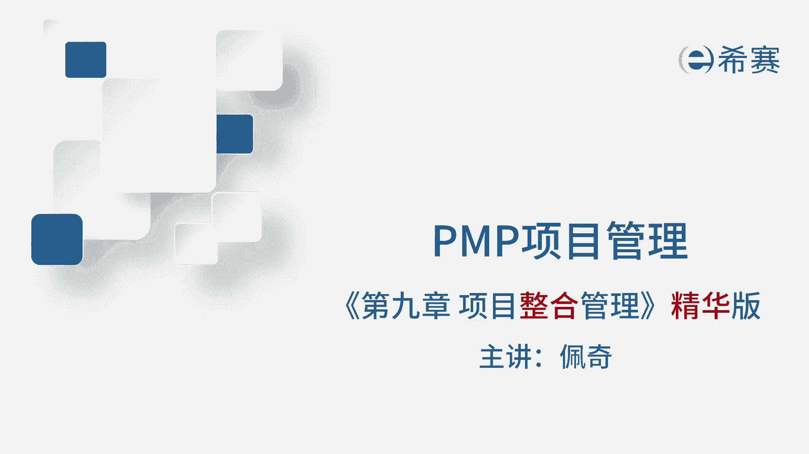
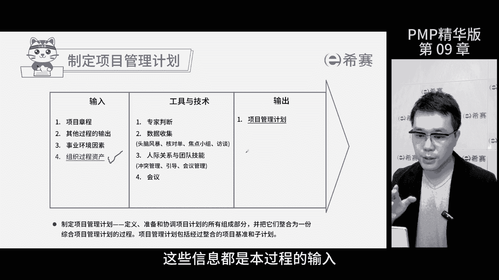
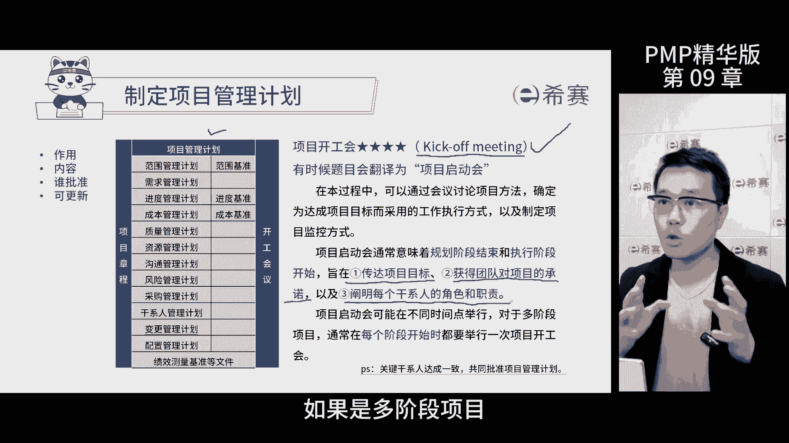
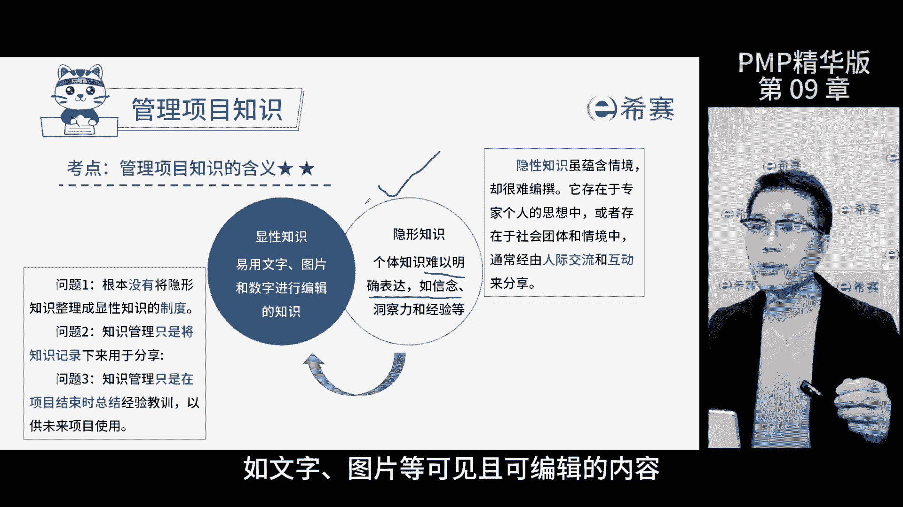
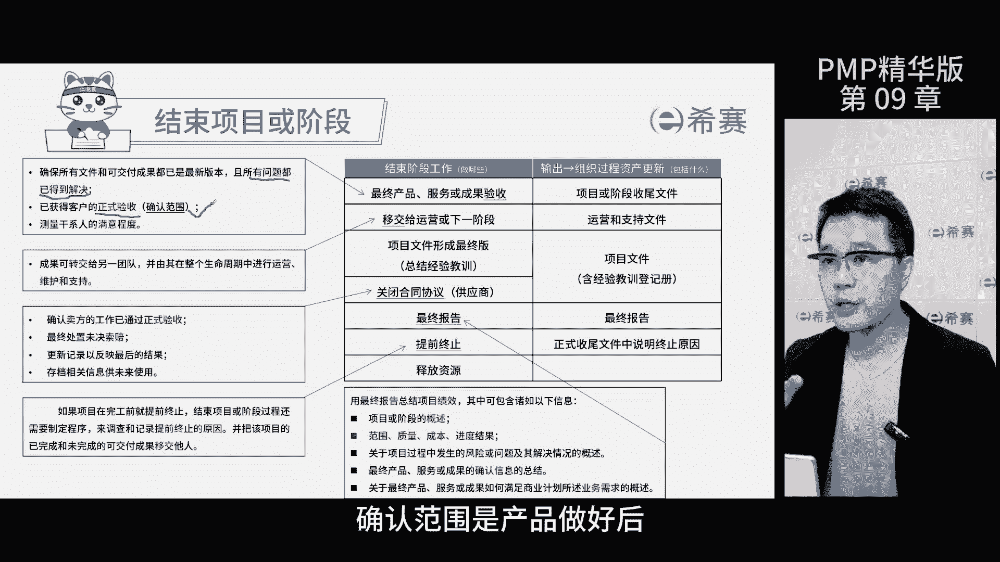
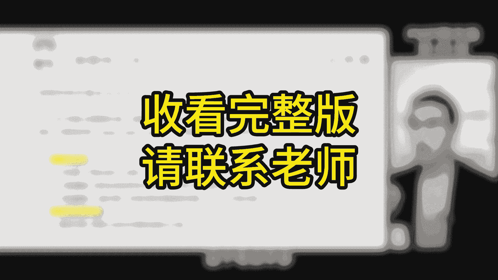
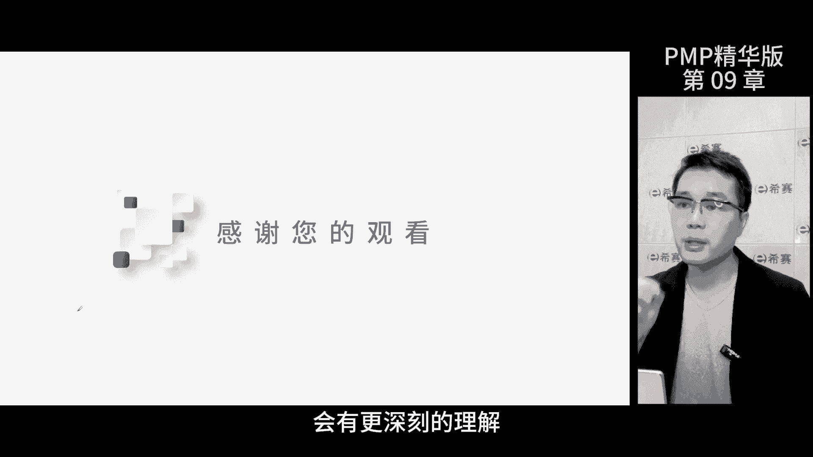

# 【2024年PMP】PMP项目管理考试第七版精华讲解免费观看，含预测+敏捷！ - P11：第09章 项目整合管理 精华版 遮挡 - 冬x溪 - BV1bD421A7em

我是佩奇，今天讲解项目整合管理精华版，我再跟大家说说精华版课程的讲解逻辑，正常课程是按时间的顺序讲解的，但精华版是为了备考复习用，所以按照考核重要性来安排，如果你直接看精华版，可能会觉得有点迷惑。

我建议你先听一遍正课，然后再用复习的方式来看进化版，这是本章的知识点，可以先自己回忆一下，然后再来听课，那这样对你的学习帮助会更大哦，咱们来聊聊今天的主题，项目整合管理，那啥叫整合管理，来举个例子啊。

比如工作和工作之间，工序之间，部门之间的协调谁先谁后，那这就是项目经理要负责的整合管理了，那在这张图里面你要明白一点，项目管理的五大过程组，启动规划执行监控收尾并不是线性关系，而是重叠反复的啊。

就拿启动阶段来说吧，你的规划执行监控可能也在进行中，说不定在执行阶段就会发现计划有问题，那需要调整更新修改，那就要把计划退回到规划过程操作了，所以这五大关组在学习的时候，虽然是先后顺序。

但是在实际的工作中，他们其实是重复的螺旋上升的一个过程，那只要理解这个项目管理就变得轻松易懂了，接下来咱们根据知识点的考评高低，来详细讲解一下项目整合管理的基本知识，首先我们要说一下整体变更控制。

那这个过程呢是审查所有的变更请求，对变更处理结果进行沟通的过程，那为什么要这么做呢，因为如果你不把关变更这件事情，项目的风险就会越来越大，所以在整个项目期间，我们要控制变更，降低风险。

提高项目成功的可能性，那这就是实施整体变更控制的意义了，再来看一下本过程的ITTO，在这里要了解一下变更管理计划，它作为项目管理计划的子计划之一，描述了整个项目期间如何评审，如何批准变更的信息。

那这是一份指南性的管理类计划，接下来我们重点聊聊变更请求，支持项目中的重要环节，变更请求是关于修改任何文件，可交付成果和基准的正式提议，任何项目相关人员，在任何时间都可以提出变更请求。

变更请求有四种类型，缺陷补救，针对于产品组件的质量问题，当需要调整质量时，提交的变更请求就是缺陷补救，纠正措施和预防措施，都是针对于工作绩效的，前者是针对于已完成的工作绩效，当绩效不好的时候。

就需要进行纠正了，后者针对于未来绩效的变更请求，需要提前预防，避免不良情况的发生，更新用于文件计划变更时，考试时呢题目会描述一个项目的情景，问你这是哪种变更请求类型，都要搞清楚他们之间的区别。

此外呢有变更走流程是非常重要的，流程如图，考试的时候可能会给你一个场景，然后问你下一步该做什么，这就是考流程了，结合实施整体变更控制这几个知识点，还会从事前事中事后这三个方面来考你。

比如说谁提交了变更请求，何时提交好，哪种变更类型以及事后记录等等，无论变更请求是否得到批准，都要记录在变更日志中，以便未来追诉责任，在紧急情况下，如台风来袭，像我们经理可以先执行变更。

但事后一定要补流程，给大家整理了一下啊，有变更走流程的常考点，这个一定会考，必须要掌握重点来看一下内外有别，基准变更和记录这三块，那内外有别呢，是内部人员要变更，先分析情况。

发现真的需要调整了才回去填变更申请，那外部人员要变更了，先填好表，正式提出申请，再组织人员分析，看是否真的需要调整了，有变更走流程，只要项目有变更，不管大还是小，一定要走流程，只是看流程走到哪个环节。

如果变更不涉及基准，走到项目经理这层就可以了，如果变更涉及到基准，就要走到CCB这个阶段，最后所有的变更都要进入到变更日志里，在我们管理过程中，各种项目的状态啊层出不穷，如进度干扰啊，绩效不佳啊。

意见不合产生了冲突啊等等啊，遇到这些情况呢，我们得先记录下来，问题日志就是这么一个记录和根据问题的项目，文件，包含了多方面内容，虽然这是一个五星级考点，但是考题不难，主要从三个角度考察。

第一流程出现问题，第一步做什么呢，没错，记录用佩奇的四部曲处理流程即可了，第二内容，那这些方面内容呢不用依据，只要知道有关问题的所有信息，都记载问题日志就行了，第三区分问题和风险。

问题是已发生的风险是还没发生，从提案中判断已发生还是未发生即可哈，判断出问题和风险之后，找到对应的文件，问题在问题日志，风险在风险登记册好放心，这个知识点90%考的都是流程，项目启动了。

首先要有项目章程，制定这个章程呢几个输入得了解一下，我们需要考虑商业论证，效益观计划，那商业论证和效益关计划呢就不多说了啊，之前已经讲过了，事业环境因素可是项目的一个大事，它会限制项目的各个方面。

所以在制定项目章程时得考虑这方面的因素，题目中问项目准备中，制定项目章程需要啥信息啊啊那就是考输了，看是事业环境因素还是组织关，资产是否客观存在，有的选还是没得选。

最后用对应的工具输出项目章程和假设日志，项目章程由发起人签字后发布，代表正式批准项目成立了，那此时开一个项目启动会，授权项目经理使用组织资源开展项目活动，那一句话藏了好多考点。

那首先项目经理呢没权利擅自编制项目章程，那除非发起人授权了，其次批准后，项目正式成立，有了合法身份，再次授权项目经理，意味着他正式上岗了，有权利推动项目执行，还拿着项目章程去要钱。

要人项目章程的内容呢包括项目的目的，高层级需求，高层级的项目描述，边界定义，可交付成果信息，整体项目风险也称之为高层级项目风险，而这仨加起来叫三高好记，还有项目的退出标准。

啥情况下可以关闭项目或者取消项目，那项目章程里面写了项目经理的决策和职责，也就是权限了，项目经理有权解决权限内的事情，题目说超出项目范围或者超出项目经理的权限，就需要上报发起人。

还有一个重要的输出假设日志，假设日志包括两部分，假设条件和制约因素，那这些会给项目带来风险和限制，对应项目章程的高层级风险，项目经理拿到项目招之后，就有权推动项目了。

那接下来你要组织团队编制项目管理计划，那这是一个四星级考点，那项目关计划是一份综合性文件，定义并协调了项目计划的所有部分，是项目工作的一份指南，本过程的ITT组织过程，资产要选对项目有帮助的。

也就是在制定管理计划之前，要了解公司有没有类似的项目，有没有相应的经验可以学习，这些信息都是作为本过程的输入。

这个过程的输出呢是项目管理计划，内容非常关键，包括各知识领域的计划，还有三大基准基准，就是关键干系人批准后的计划，项目管理计划由关键干行批准，而项目章程由项目发起人批准，项目管理计划批准之后。

就要开始项目工作，首先有一个里程碑事件，项目开工会议标志着规划阶段结束，执行阶段开始，有的时候考试会翻译成启动会议，其实不一样，正确的启动会议是项目章程批准时开的，那个会议，千万别搞混了啊。

所以此处要看英文，Kick off meeting，开工会议在规划阶段和执行阶段之间召开，三个作用，就是传达项目的目标，获得团队对于项目的承诺，以及明确各干系人的决策和职责，那如果是多阶段的项目。

每个阶段都要开一次开工会议，管理项目知识，这部分考的不多啊，那关键是掌握几个关键概念和作用，首先管理项目知识，总在运用现有的知识创造新知识，那贯穿了整个项目的生命周期，项目知识分为两类。

隐性知识就是你的想法，别人不知道啊，只存在于你脑子里，那项目经理要通过营造一个良好的团队氛围，把团队成员的隐性知识转化成显性知识，如文字，图片等。

可见且可编辑的内容，经验教训呢是总结出来的新知识，用于避免重复犯错或应用于类似的项目了，越早创建经验教训登记册，收集的经验就越全完整，项目经理呢要定期组织工作，总结会议和知识分享。

会把隐性知识转换成显性知识啊，塑造一个良好的氛围，打造一个成长型的组织，让大家相互信任，项目结束这个过程啊，要知道它主要有三个作用，一存档项目的信息，二完成计划的工作，三释放组织资源。

看这个过程的ITTO，这个过程啊可不容易啊，最后还要产出一些成果，那重点是组织过程资产的更新，那具体有哪些内容呢，要做哪些工作呢，我们来看这张表，看一下考试的重点，首先确保所有的问题已经解决。

以获得客户的正式验收，那为啥强调正式验收呢，因为这里说的验收叫做形式验收，而正式验收是指确认范围，这个过程确认范围是产品做好之后拉的。

客户确认没问题，已签字盖章，形式验收呢就是走个流程，之前验收的文件有没有遗留问题，如果没有了，然后告诉大家，项目结束了，就是这个里程碑节点，所以这两点要区分开，接下来把产品移交给运营或下一阶段。

这里的关键是责任移交，责任一降就代表以后出问题了，别找我，然后呢关闭合同，如果有供应商就要关闭合同，确保卖方的工作已经通过了验收，合同里面的索赔事项也解决掉了，那才能关闭合同，再然后完成最终报告。

报告里面要包括我们的项目的绩效呀，还有咱们的概述呀，结果呀，问题啊，分析啊，汇报给干前看，干前要对项目评分，这跟项目经理的奖金是挂钩的，所以也很重要，那如果项目是提前终止的，要记录原因。

把已完成和未完成的成果交给第三方，或者后续团队。

