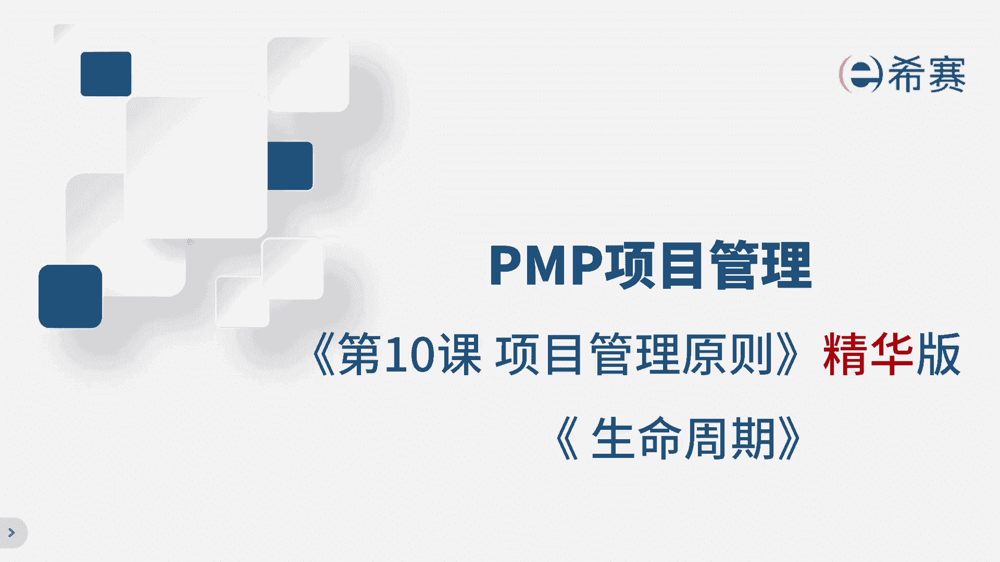

# 【2024年PMP】PMP项目管理考试第七版精华讲解免费观看，含预测+敏捷！ - P12：第10-1章 项目管理原则+生命周期 精华版 - 冬x溪 - BV1bD421A7em

我是佩奇，今天讲解项目管理原则和生命周期，第七版给了我们12大原则，太多啊，背不下来，我把它分成了三大类，那这样比较好记了，那这样一个类比法几秒钟就能理解了，咱们往下看，这张图呢就像是招聘信息。

首先最上面这一行是关键，你要明确定位你的角色是什么，你干这个活儿的目的为啥，然后对于你的要求和工作职责是什么，你应聘的是项目经理，核心就是第一条，也就是项目经理是管家，那这个管家是干嘛的呢。

你去公司是为了聚焦价值，创造价值，为啥要创造价值，是为了驱动变革，所以你得创造价值，推动组织变革，好接着哈，对你这类项目经理有要求吧，啊你得清晰的知道自己要干啥事儿，下面这部分告诉你，左边是对你的要求。

就是你做项目经理的能力要求，右边是你的岗位职责，就是你要做的事情，能力要求只有一条，你要有很好的领导力，体现领导力的行为，领导力具体表现在哪些方面呢，对内你要营造一个好的团队环境，对外你要有有效的管理。

干闲的参与，那还有一项重要的是整合能力啊，就是识别评估和响应系统的交互，在项目上，你的职责有这些，你要根据环境调整工作方式，不能死板硬套，你要把质量融入到产品中，最后交出合格的质量，项目复杂。

你要能够驾驭复杂性，优化风险应对，同时要有适应性和韧性，那综上啊，通过这种方式就能快速的记住这12条原则了，也可以按照这三类来进行划分，大家选择自己能理解的框架就好了啊，考试中只要违背这个原则就是错的。

我们来聊聊项目生命周期类型啊，把这个类型呢放到这个坐标系里面，看看它的特点，水平轴代表变更的程度，从低到高，纵坐标表示交付次数从低到高，那这么一划分，我们就可以大概看出四个大的象限了哈，左下角是预测型。

特点是范围明确，交付次数少，那范围明确，所以变更程度低，就像盖楼盖成啥样子的，设计的时候就已经明确了，那盖好了就交给甲方造型，那对角线的这个方向呢是敏捷型，与预测型正好相反，特点是范围不明确。

所以导致了变更程度高，需要多次交付获得反馈，比如说微信需求不断的变化，版本不断的更新，再往左边呢是增量型，就是每次的增量部分的工作是明确的，做完这个小增量就交付出去，所以交付频次高。

比如说做一个公司的资源系统，先做财务模块做好了上线使用，再做库存模块好了就上线啊，以此类推，右下角是迭代型，特点是范围不确定，所以要来回调整，导致变更程度高，交付频次低，比如说设计行业啊。

客户总是想修改啊，一次次的调整，那最后再交出去，考试的时候要学会区分这些类型，通过判断范围是否明确以及交付次数的多少，就能快速的分辨出项目的生命周期了，那今天的课到此结束。

