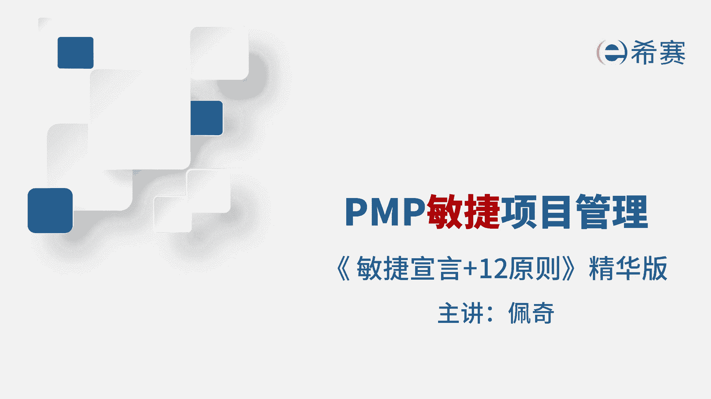
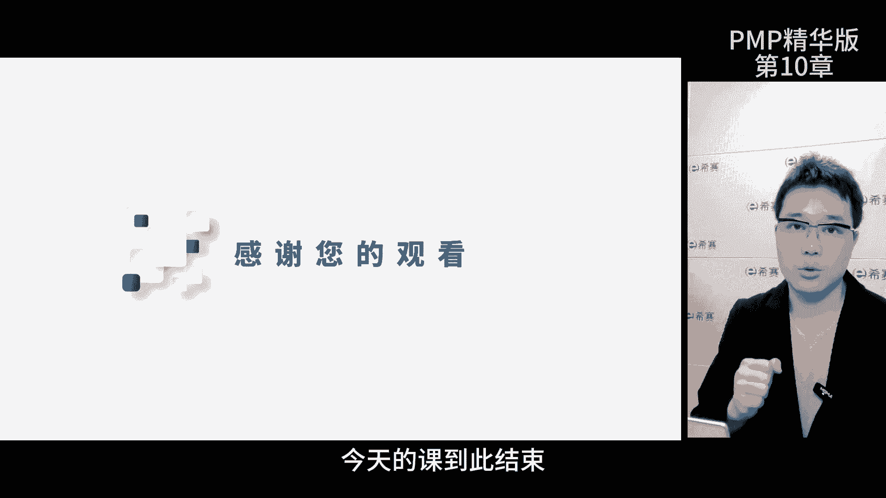

# 【2024年PMP】PMP项目管理考试第七版精华讲解免费观看，含预测+敏捷！ - P13：第10-2章 敏捷宣言+原则 精华版 - 冬x溪 - BV1bD421A7em

我是佩奇，今天我将带领大家探索一下，敏捷项目管理的进化版内容，敏捷项目管理在考试中呢，可是占了50%的内容啊，所以可得把它当成重点，敏捷知识的体系呢还不够，结构化考试难度呢也就水涨船高了。

咱们可以一边学习，一边对比敏捷和预测的差别，找出他们之间的联系，那这样学习起来就更轻松，那我给大家整理了考评目录，暂停回忆再继续，那咱们开始吧，首先呢你要知道敏捷是咋回事。

敏捷的核心理念都是在他的价值观里面，也就是所谓的敏捷宣言有三块，第一块强调敏捷，是从软件开发这个大背景下成长起来的，学习的时候想象一下开发软件的场景，那这样更容易去理解敏捷，敏捷管理呢有很多的好处。

现在很多非软件项目也采用敏捷，所以以后的考试中可能会遇到很多混合题型，第二块啊，来谈谈敏捷宣言的4G核心理念，首先项目中的个体和互动比流程和工具更重要，那尽管流程和工具在项目中是必不可少的。

但是关注每个人的参与和协作，能让项目更上一层楼，遇到问题的时候，别只是依赖于流程，要重视团队的合作，项目的成功最终是由人给出的，包括如何管理范围，如何定义成功，项目的工作也是由人来完成的。

每个人的协作和配合都是推动项目的核心，所以我们要通过团队的参与和互动，来更好地完成项目，其次可用的软件比完整的文档更重要，软件项目首要的任务是实现高质量的成果，为客户解决痛点创造最大的价值。

那这里所说的可用的软件，是指能给客户带来效果的软件，而不仅仅是能运行的软件，虽然详细的文档在某些情况下也是必要的，但没有可能的软件，文档的价值就无从谈起了，所以文档是必要的，必须的，但别过分关注。

够用就好了，再者客户合作胜过合同谈判，这意味着我们要更看重于客户的合作和沟通，而不仅仅是按照合同条款进行，通过紧密的合作，我们能更好地了解客户的需求，并及时的调整和改进，以建立更好的信任。

从而促进项目成功，我们需要包容和共赢，而不是死板和教条，最后呢应对变更胜过遵循计划，项目执行要按计划执行，但是环境市场客户的需求随时可能发生变化，那对于这种快速的变化，我们要学会适应。

任何计划都不可能一开始就考虑的特别周全，那如果我们固执地按照最初的计划去执行，可能会导致投入大量时间，做出无法适应市场的产品，那浪费的精力，所以要有拥抱变化的态度，随时欢迎改变。

那这样的改变是为了更好的去适应外部的环境，产出更有价值的产品，那这四句话就囊括了敏捷学院的核心理念，指导我们如何开展工作，再来谈一谈第三块儿，右侧的预测型的管理方式呢，确实有优点。

但是我们更看重左侧部分，因为它更适合敏捷环境，总结一下敏捷宣言的核心是以价值为导向，实现项目标，相比较流程工具文档和计划，我们要以人为本，实现合作共赢，面对环境变化，需求调整，我们要积极地拥抱变化。

在做题的时候，通过题干的信息判断选项中的行为，是否遵循这些价值观，如果不匹配，那就是错误选项，如果匹配，大概率下是正确选项，那我们刚才也讲完了敏捷宣言的内容，可能你觉得它有点抽象。

不够具体也不知道如何去实施，那官方也意识到这个问题啊，所以给出了12条原则，那每一条原则呢都对敏捷学员进行了细化，并且每一个原则都有其关键点，我已经把它标出来了，哎大家可以重点理解那12条原则。

记起来有点难度，所以我把它按照亲和关系分成了四大类，价值原则，工作原则，团队原则和沟通原则，那首先我们来看看价值原则，当你把这五个原则联系起来考虑的时候，你会发现他们真的相互关系和作用。

准则2378实际上是对准则一的深入解释，那首先我们追求的最高目标，就是通过尽早且持续的交付有价值的软件，来满足客户需求，这强调了客户满意度的重要性，同时也提出了持续交付的理念。

那早早的把有价值软件交给客户，团队，就能及时的收到客户的反馈啊，然后在开发过程中不断的优化和调整，满足客户的方法之一就是即使在项目的后期，也欢迎对需求进行变更，这就是我们的第二条准则，通过敏捷过程。

我们拥抱变化，帮助客户获得竞争优势，创造价值，那这个准则与第一条相互呼应，强调了团队对需求变更的接受和适应能力，团队要欢迎变化，拥抱变化，把它看作是帮助客户获得竞争优势的机会，通过持续的反馈和迭代。

满足客户不断变化的需求，那什么是有价值的软件呢，这是我们的第七个准则，可工作的软件是衡量项目进度的首要指标，这个准则与前面的准则相互支持，强调以可工作的软件为主要项目指标，通过持续的交付，可控的软件。

团队能展现出软件的实际进展和成果，而不仅仅是计划和文档的完成情况，接下来是如何交付软件，我们的准则三，要经常的交付可用的软件，周期从几周到几个月不等，越短越好，这个准则强调了多次交付，采用较短的周期。

团队就能尽早的把可用的软件交给客户，每个周期结束的时候，迅速地获得客户的反馈，以便及时的调整和改进，第八条准则是关于可持续开发的敏捷过程，提倡开发人员和用户保持稳定的步调。

这个准则强调了持续开发的重要性，也关注了团队的稳定性，团队应该能够以稳定的速度工作，避免过多的压力和劳累，确保项目的可持续性和开发人员的工作效率，那这五个准则啊相互依赖，共同构建了敏捷方法的核心价值观。

他们强调了满足客户需求，交付有价值软件，接受变化，尽早交付和持续改进的重要性，那遵循这些原则，敏捷团队就能更好地适应变化的环境，提高工作效率，提升客户的满意度，那接下来我们来聊聊工作原则。

原则九对于技术的精益求精，以及对设计的不断完善，将提高敏捷性，这意味着团队要不断的学习新知识，探索并应用最佳的技术和工作方法，这么一来呢，开发过程就会更加高效，质量也更高，同时不断的优化设计和架构。

就能确保软件好维护，也能更好地适应新的需求，所以团队灵活应对变化，快速交付高端产品，这就是敏捷开发，能够快速响应市场变化的原因之一，原则时说呢，做事要简洁，尽量减少不必要的工作，这是一门艺术。

这意味着敏捷开发要追求简洁和高效，避免无效劳动，降低工作复杂度，简洁就是用最少的步骤和资源完成任务，避免过度的设计和不必要的功能，这需要团队不断的去思考，探索优化，找到最简洁的解决方案。

剪辑的代码和设计更好维护，也更易适应变化，所以团队要始终保持简洁和高效的工作方式，原则12说，团队要定期的反省，找出问题，调整工作方式，这意味着团队要审查自己的工作方法，合作方式以及成果。

找出问题并改进，那通过反省团队可以发现工作中的问题和瓶颈，探索更有效的工作方式，那不断地去提升绩效和效率，那这种持续的反思和调整的过程，能让团队不断的优化工作的流程，增强学习能力和适应能力。

再来看看团队原则，原则四说项目经中，业务人员和开发人员要一直保持通力合作，这意味着，业务人员要了解客户的需求和市场动态，开发人员要负责实现这些需求，只有持续的合作和沟通，业务人员才能提供准确的需求信息。

开发人员也能及时的解决问题，提供可行的方案，那这种紧密的合作，有助于确保开发出符合客户需求的软件产品，提高项目的成功率，原则五说，要激励项目团队，给予他们所需的环境和支持，并相信他们能够完成任务。

那这意味着，敏捷教练要对项目的人员给予激励和支持，敏捷项目需要积极主动专注，有创造力的团队，通过激励，比如说认可奖励，提供良好的工作环境和资源支持，以及对能力的信任，可以激发团队成员的工作动力和积极性。

提高他们的表现和产出原则，11说了，最佳的架构需求和设计来源于自组织团队，这意味着自组织团队有权利和责任，决定如何完成工作，他们具备灵活性和创造性，根据需求和情景，自组织团队可以灵活地调整架构。

需求和设计，这种自主性有助于团队更好地适应变化，创造出高质量的解决方案，同时这也增强了团队成员的参与感和责任感，那最后呢我们来看一下沟通原则，无论大团队还是小团队，面对面沟通都是最有效的信息传递方式。

这意味着团队成员要直接及时高效地进行沟通，避免信息的误解，面对面的交谈，能够让团队成员更好地去理解对方的意图，分享想法，解决问题，建立更强的合作关系，那这种工作方式，有助于提高团队的协作效率和工作质量。

弄明白了这四个部分的关系啊，就能更好地去理解这12个原则了，考试的话，敏捷题目的出题方式一般都是最佳实践，所以你要把选项和原则进行匹配，首先看看选项是否符合12原则里的信息，如果不符合呢，直接淘汰。

然后在剩下符合要求的选项里面找出最佳实践，那今天课到此结束。

