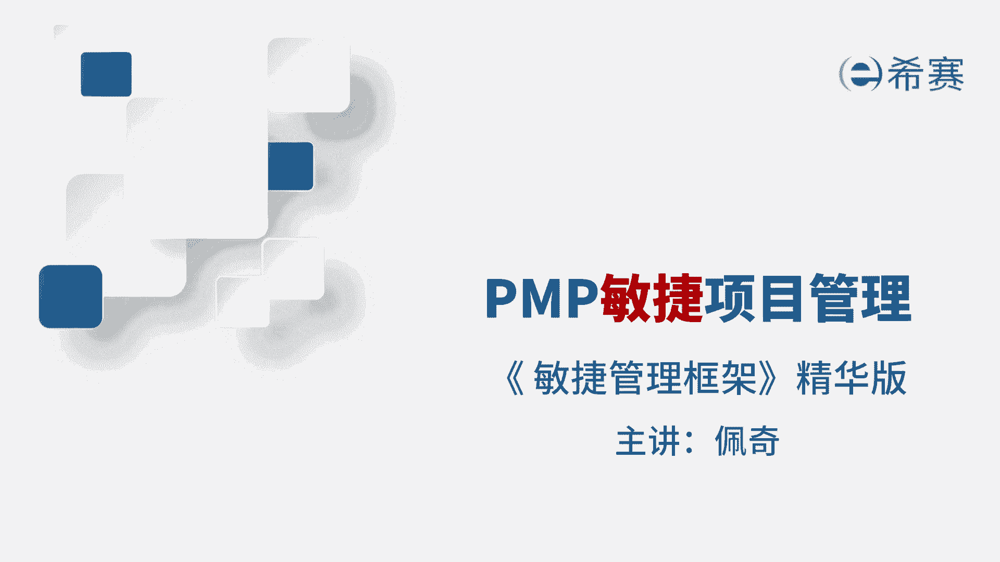
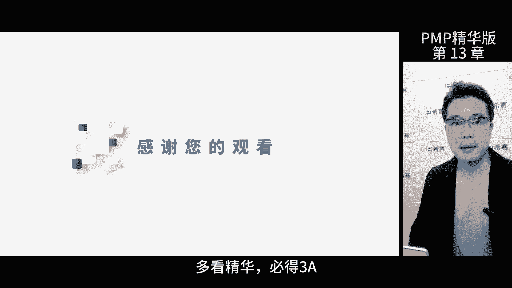

# 【2024年PMP】PMP项目管理考试第七版精华讲解免费观看，含预测+敏捷！ - P15：第13章 敏捷管理框架 精华版 - 冬x溪 - BV1bD421A7em

我是佩奇，本次讲解敏捷项目管理框架，这是考评目录，大家可以暂停回忆再继续，速度是衡量团队能力的一个指标，根据上一次迭代完成的故事点，来评估团队后续的工作能力，那当我们和干系人交流的时候。

可以用速度来展现已完成的功能，即将完成的内容以及预计完成的时间，团队可以在整个工作过程中测试速度，单位可以是小时天，故事点，刚开始的几轮迭代中啊，速度可能不稳定，但随着团队的磨合和协作会逐渐趋于稳定。

例如一个迭代中，团队原计划完成30个故事点数，但实际操作中发现无法完成，就会先处理优先级高的任务，在回顾会议上分析原因是过高的，估计了还是团队能力不足，然后根据原因调整下次迭代的故事点数。

那从而逐渐地达到一个稳定的速度，速度可以通过燃烧曲线来展现，燃烧曲线分为燃尽图和燃气图，都是用于客户沟通的展现已完成的项目工作，确保项目的实际速度，可视化，燃尽图它展现的是向下移动的一个过程。

显示剩余需要完成的工作量，多用于迭代内的展示，燃起图是以图形的形式，展现项目和团队多个迭代需求的累计完成情况，以及迭代之间他们的关系，相较于燃尽图，燃起图更能直观地展现。

项目时间与完成工作之间的变化关系，能体现对用户故事的增加和删减，所以更容易跟踪和理解，那因此啊目前大部分的项目都采用燃气图，然后曲线是衡量团队进度的一个重要工具，需要注意的是，由于项目的独特性不同。

团队的速度不宜进行横向比较，在敏捷开发中，用户故事是一种轻量级，更灵活的软件需求描述方式，能帮助开发人员和客户更好的沟通，让双方交流呢更加有效率，每个用户故事都有三个基本元素，角色需求和商业价值。

比如一个旅客想要注册成携程会员，以便使用网上预订房间的服务，这就是一个用户故事了，用户故事有三个原则，第一故事要写到小卡片上，起到交流提示的作用，那卡片只是载体啊，不是需求本身，即便是电子卡片。

也是要确保面对面交流的，第二故事是可以商量着定的，双方互动把决策推迟到后面，再确定细节，能减少一些浪费，这符合敏捷价值观的第一条，即个体和交互比流程和工具更重要，第三故事是可确认的。

包含了验收标准和环节，确保正确的实现，也就是卡片背后的do，那此项内容由产品负责人确定，那为什么要DOD呢，有时候团队对于任务是否完成有分歧啊，有人觉得编码完了就算完了没事了，有人觉得还需要简单测试。

确保功能的正常，还有人觉得要写完自动化测试并通过，那为了避免这种情况呢，敏捷开发中常用已完成的定义，来表示工作是否完成啊，就是d o d dd在用户故事编写时就要确认了。

最晚在执行前确认了解用户故事的属性哈，一共六个，第一独立性，每个故事独立的，便于开发团队的选择，第二可协商，挖掘客户的真实需求，故事可以协商，第三有价值明确需求价值避免无效。

第四呢可估计的估算有助于计划，确保成本的效益，第五小的小故事容易估算，避免过大导致估算不准，第六可测试的对过程监控重要，需明确验收标准，用户故事写好之后呢，就要放入一个待办列表里面。

那就是用户故事的待办事项列表，这个是可视化的，待办清单，能帮助我们按优先级安排团队内部的工作，同时它还能协助项目的协调，让团队成员对任务有共识，随着信息越来越清晰，待办事项列表啊，还可以不断的更新。

那里面有个叫故事点的单位，用来估算完成一个产品，代码商列表里面用户故事所需要的工作量，那之前说的速度啊，其实就是通过故事点来体现的，故事点怎么确定呢，这里给大家介绍几种方式。

宽带德尔菲计划扑克和理想时间，宽带德尔菲呢是德尔菲方法的升级版哈，它也具备一名多次达成共识的特点，计划扑克呢是用来估算用户故事的相对工作量，玩计划扑克的时候，每个成员发一副牌，每个牌上都有不同的点数。

产品负责人简单介绍用户故事，然后每一个成员选出自己觉得合适的牌，大家一起翻开盘，能看到对方选的点数，对于点数选择过高或过低的成员，有一次机会解释原因，然后团队讨论，直到估算值相近为止，也就是达成共识了。

那这里的扑克点数啊，是根据斐波纳切数列来估算的，那考虑了工作量，复杂程度和不确定性这三个因素，理想时间则是在没有干扰和意外情况下，估算某项工作所需要的时间，假设团队成员每天工作八小时，没有干扰。

一直干活，跟个机器人似的，虽然这种做法不现实啊，但有很多的优点，比如说估算结果容易向团队之外的人解释，那估算过程也容易启动，开发速度呢容易估算等等，这些优势在敏捷开发中，有时候会遇到迭代前工作量不好。

估计技术方案混乱等问题，那刺探是一种解决方案，它不是交付具体的产品，而是收集信息，寻找问题答案，安排最小的资源，最短的时间进行尝试，考试怎么考的，题目中出现技术问题，需要找解决方案或者找对应的风险。

直接选刺探就行，对于最小可行产品MVP和最小可售功能MMF，一定要做好区分，这张表哈可以很清晰地区分开这两者，考试的时候看清问题，问的是产品还是功能，基本上就不会选错了，用户故事怎么排序呢。

这里给大家介绍两种方式，第一种是莫斯科法则，它是根据必须做，应该做，可以做和不做这四个层次来排序的，必须做是这次交付必须要完成的任务，保证范围不会缩小，应该做是在实施过程中没有对外承诺，但有一定的预期。

属于应该做的，可以做是低于上面这两个层级的，不要做，就是这部分需求是不做的，确保范围不会扩大，那如果在过程中有新的需求加入，那就由PO来确定优先级顺序，第二种方式是卡诺分析。

它是一种对于用户需求进行分类和排序的工具，核心是将产品的品质分成了五种，魅力型，期望型，无差异型，基本型和反向型，魅力型是用户想象不到的品质，提供这种品质呢会大幅的提升用户的满意度。

期望型是被称为线性品质的品质，好用户满意度就高呗，那反之则低，无差异型则是无论提供或者不提供这种品质，用户满意度都不会变化，这种品质要尽量避免基本型是产品的基本要求，不提供这种需求。

用户的满意度会大幅下降，反向型是用户不需要的需求，提供后反而会降低用户的满意度，要做产品设计时候要避免这类需求，考试怎么考，选择优先级的方式，根据题干信息，在卡诺分析和莫斯科法则里面。

选在待办事项列表里面，产品经理啊需要将用户故事进行排序，那这里的排序原则，除了符合以价值为核心的排序，还要考虑风险，政治等等，在敏捷项目中，消极的风险等同于反价值，因为项目要付出资源，所以要尽早的处理。

那么在敏捷中，项目的风险排序是基于风险四象限，首先处理高价值，高风险的，接着做高价值，低风险的，再处理低风险，低价值的，而高风险低价值的就不要做了，当然并不是所有的风险都可以进行规定，或者减轻。

有些风险只能接受或转移，那对于这些呢可以主动的应对这些风险，那风险的应对措施，可以和需求一起进行优先级排序，当组合在一起的时候，就会形成风险调整，代办商列表，预测型项目管理的无关组，大家还记得吧。

启动规划执行监控收尾，敏捷项目管理也有这五个阶段，首先是构想阶段，搞清楚产品的构想，项目范围，项目团队以及团队的协作方式，然后是推测阶段，制定基于功能的发布计划，里程碑迭代计划，确保能交付构想的产品。

接下来是探索阶段，短期内提供测试过的功能，不断的降低项目的风险和不确定性，然后是适应阶段审核提交的结果，当前的情况以及团队绩效，有需要的话进行调整，最后是结束阶段，结束项目分享主要的学习成果，庆祝一下。

就这么简单，敏捷洋葱圈法则，能让团队为每一个计划选择合适的规划级别，那这个圈层的结构呢是这样的啊，第一层是愿景层，主要确定产品要解决的问题和目标，客户，有助于了解产品的价值，区别于其他同类的产品。

第二层是产品路线图，团队在这里制定一个长期的计划，实现愿景中的目标，路线图的内容会按发布层面分组，让更多的人更好的去理解它，第三层是发布计划，明确每个版本的特有功能，同时展现了上线的时间。

第四层是迭代级别的团队，挑选下一次迭代的用户故事，并制定迭代计划，最后一层是每日计划，团队每天同步进度传达第二天的计划，考试的时候问到产品路线图确定后要做啥计划，按照层级选择即可。

敏捷发布规划是团队如何实现项目愿景的过程，团队逐层的分解，把产品路线图一步一步落实到每日任务中去，与传统的规划方式不同，敏捷规划根据时间表灵活规划不同的层级，比如说先规划一年的目标。

在具体规划几个月的目标，实现战略，最后详细列出未来几周的执行步骤，在这个过程中，团队不断的迭代和完善计划，短时间内明确各自的责任，推动项目的目标实现，那今天课到此结束。

