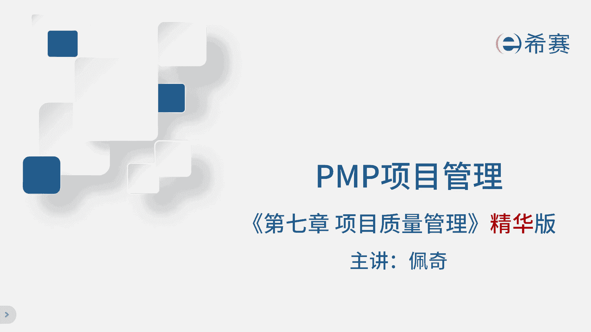
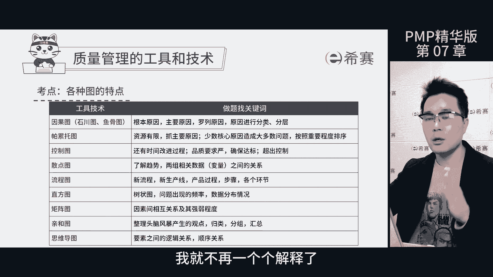
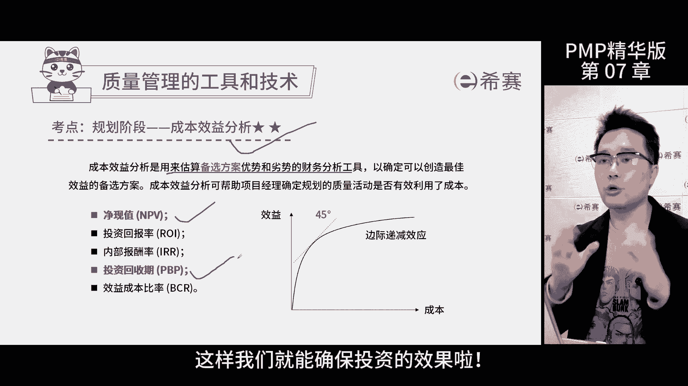
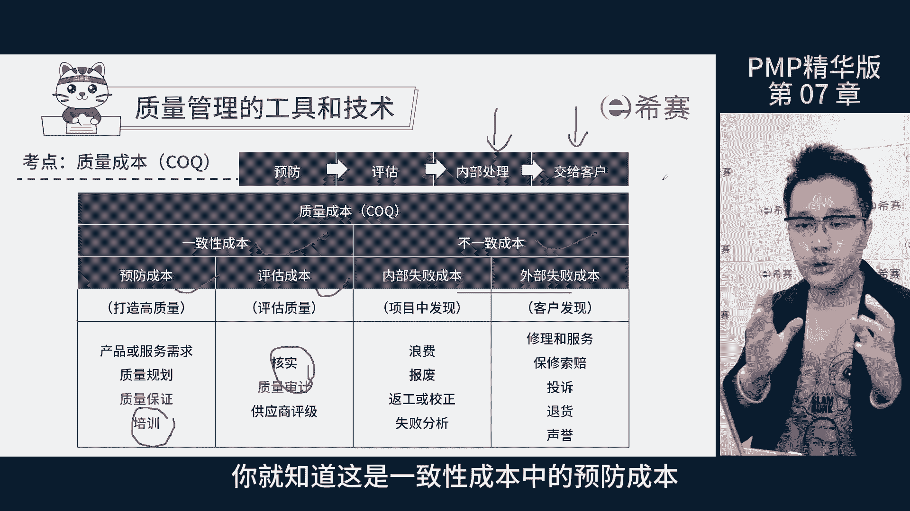
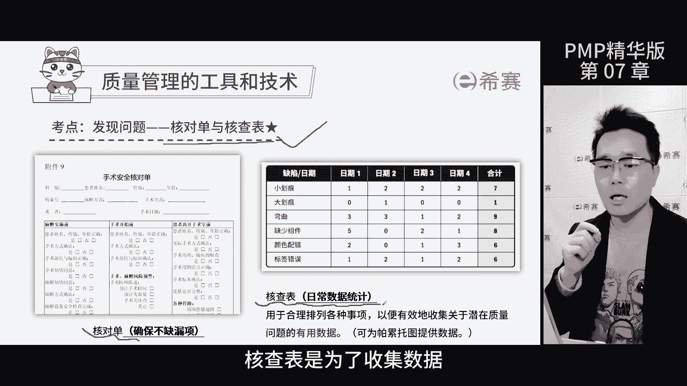
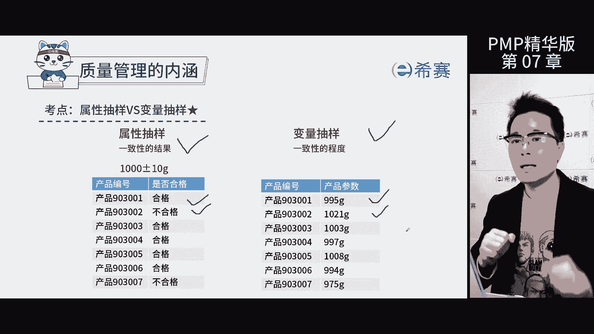

# 【2024年PMP】PMP项目管理考试第七版精华讲解免费观看，含预测+敏捷！ - P9：第07-1章 项目质量管理 精华版 - 冬x溪 - BV1bD421A7em

我是佩奇，今天讲解项目质量管理进化版啊，这是考评目录，咱们可以看到考得最多的是工具和技术，如何找出它们的区别是核心啊，暂停回忆一下，在质量管理中，我们会用到一个叫根本原因分析的工具和技术。

这个方法能帮我们看清问题的本质，找到问题的根源，然后系统地解决它，避免问题再次出现，怎样才能找到这个本质的原因呢，很简单，就用五外法，就是连续问五个，为什么像剥洋葱一样一层一层地剥开，看里面。

考试的时候，遇到题目问你怎样杜绝或者彻底解决某个问题，防止他再次出现，那就选这个根本原因分析来回答，这个方法其实在生活中也很有用，建议大家多练习哦，因果图咱们也常叫它鱼骨图，这个图呢。

就是用来帮我们找到质量问题的主要原因，和根本原因，避免问题再次发生，那它和刚才说的根本原因分析法有啥不同呢，啊其实除了能找出问题的主要原因，因果图还得把找到的原因进行分类，比如说按照设备问题，过程问题。

还有材料问题等等来进行划分，这样一来，我们就能更清晰地看到问题的根源在哪个领域，这就是因果图的特点了，帕雷和土名字挺唬人的，但其实好理解，就这样说吧，生活中我们常说的二八定律。

大部分的问题都是少数几个关键原因导致的，帕累托图就是按照这个定律，将原因排列个先后顺序，那重要的原因排在前面，考试的时候，遇到题干说资源紧张，时间有限，团队主要问题咋办，果断选择，怕了一坨土。

谈到控制图，关键就在于两个字，控制，你笑啊，图上有五根线，包括中心线，控制上限，控制下限，规格上限，规格下限，只要你的测量数据在这两个规格线范围之内，那你的产品就是达标的，但有的时候呢过程会出现失控。

需要注意有两种情况，第一种数据跑到了控制线外，但还没有超过规格线，第二种中心线单侧连续出现七个点，那这些情况就暗示着项目的过程可能失控了，一旦发现就要赶紧找原因，然后想办法改进，否则就会出现质量问题。

那考试的时候题目会说啊，客户对于质量要求很高，这种情况下项目不能有任何的质量问题，一旦出现就是预警信号了，就要开始关注，那一般这个时候还有时间去处理，就需要用控制图回归分析里面。

散点图能展示数据点在平面上的分布，那帮我们看清两个变量之间的关系，如果题目说需要对比两组数据，找变量之间的关系，那就靠三点图了，那这样看数据更直观，找关系也更方便，流程图就像是一份地图。

告诉我们一个产品或服务，从诞生到结束的每一个步骤，当某个产品出现了状况，但又不知道具体是哪个环节出了问题时，就需要借助流程图来找到答案，那直方图呢其实就是条形图，用来展现质量缺陷或者问题出现的次数。

不过考试的时候，这个知识点不经常被考到，帕雷托图是直方图的一种特例，那更有自己的特点，所以考它清河图和思维导图，都在头脑风暴收集信息后，用清河图是把信息按照远近关系分门别类。

思维导图呢则是展现信息之间的逻辑关系，好的，我知道这些质量管理工具图呢，可能让大家有点头疼啊，但是别慌啊，我给大家整理了一张表，只要了解每个工具的特点，再和题目的信息对应起来。

那选出这些答案就变得简单轻松了，现在大家可以暂停看看这张表，我就不一个一个解释了。

那说到底呢，质量章节的核心思想就是预防比检查更重要，审计就是体现这一思想的一种方式，就像是请外面专家来查账啊，看看你的工作有没有违反要求，那审计主要关注的是过程是否规范。

而测试就是通过运行程序检查已经完成的产品，看是否能找出问题或不足，是否达到质量标准，测试结果是客观的，行就行不行就不行啊，上一个是关注过程，这个是关注结果，这就是我们在做题的时候，需要重点关注的地方了。

质量管理计划呢，就是咱们做质量管理时的一个大方向，这个文件是一份指南性文件，就像一个地图，告诉我们质量要达到哪些要求和标准，它里面会告诉我们质量标准是什么，那万一产品出现了点问题，我们就要翻这个计划了。

找答案，至于成本效益分析呢，其实就是看看哪个方案更划算，我们对比看看投进去的钱和能赚回来的钱，哪个方案最合适，就选哪个，那当然了啊，赚的钱越多越好，投资的钱越早回来越好，那这样我们就能确保投资的效果了。

质量成本呢分成两种，一致性成本和不一致性成本，一致性成本包括预防成本，比如说培训评估成本呢，比如说核实和审计，那碰到题干里面有培训和审计字样的时候，就要选择对应的成本类型了。

关于内部失败成本和外部失败成本的区别，关键是看问题在哪个阶段被发现，一个是项目内部发现，一个是外部发现，考试就是考察你是否区分出这些成本类型，比如说公司突然加大培训力度。

你就知道这是一致性成本里的预防成本标杆。

对照就是找一个做得很好的目标产品，它做了受欢迎的功能，我们就学习一下，这叫识别最佳实践啊，说白了就是山寨哈，那要是他们做了不受欢迎的功能，我们也要避免踩坑，要知道产品是不是达到标准啊。

咱们得靠质量测量指标来说话，考试的时候，题干问通过啥文件来判断产品是否合格，这个时候选择纸张测量指标就行了，核对单和核查表名字很相近，但实际上作用不同，核对单是像手术前的清单一样。

确保每个步骤都做到位了，比如说手术时需要核对患者的名字，手术的部位，解剖之后要检查工具是否齐全，防止钳子之类的留在患者身体里面，那这就是核对单的作用，防止漏降，核查表呢像一个统计表记录常规检查的数据。

那这样如果后面需要分析了，数据都准备好了啊，非常方便，总结来说，核对单是为了避免遗漏，核查表是为了收集数据。

那两个工具各有所长，项目的质量管理它有三个子过程，首先要有个规划，那咱们要搞清楚质量如何管理，除了制定指南性的文件之外，还得明确质量的标准啊，这样心里面才有数码，然后我们要分清楚两个概念。

就是管理质量和控制质量，那这两个听起来其实差不多，那其实呢大有不同，管理质量是把公司的质量政策，用在项目里面做执行，而控制质量呢主要是看项目进展是否按照计划，有没有偏离轨道，如果有问题呢。

还得看执行出了问题还是原计划就有问题，管理质量和质量保证听起来也差不多，一定要做好区分管理质量呢落实计划中的行动，对于改进的部分要落实下去，是要思考如何做得更好，而质量保证就像是质检员。

专门负责执行一些计划呀流程，通过一系列的活动，保证项目活动都符合咱们设定的质量要求，简单来说呢，管理质量是大厨负责做菜，并思考怎么改进口味，让客户更满意，那质量保证是质检员负责检查菜做的好不好。

属性抽样和变量抽样有啥不一样呢，属性抽样就是检查产品是不是合格，他只关注结果行不行，而变量抽样呢就要看具体的偏差程度了啊，就是合格的程度，就像考试成绩属性抽样只看你过没过。

而变量抽样就要看你的具体分数是多少，那本节课到此结束。

