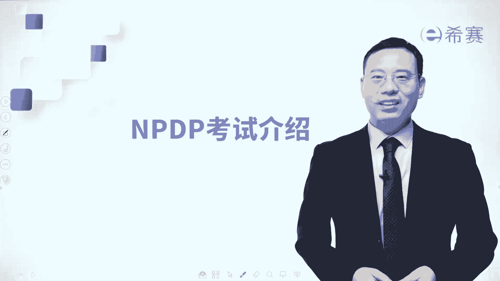
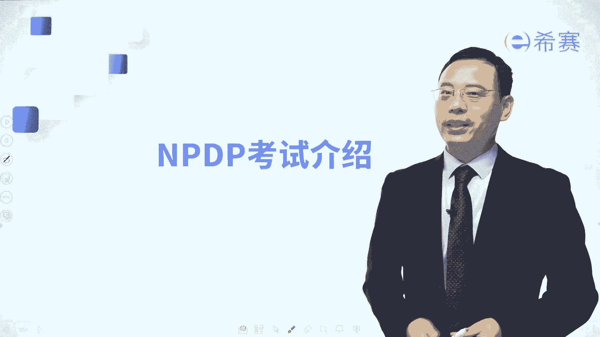
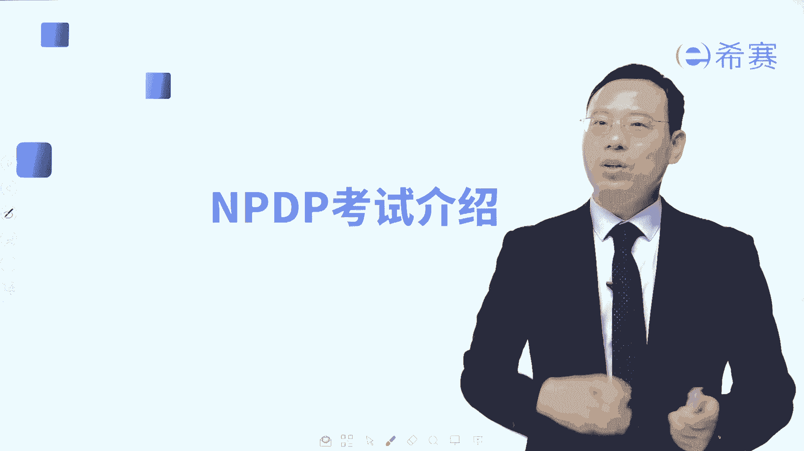
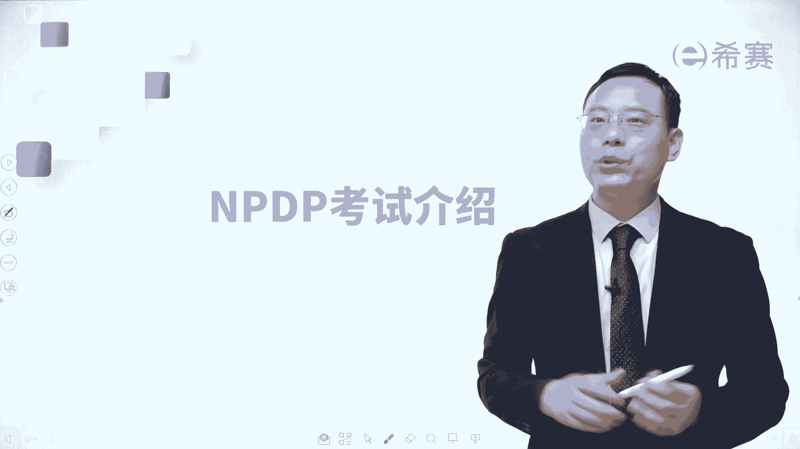
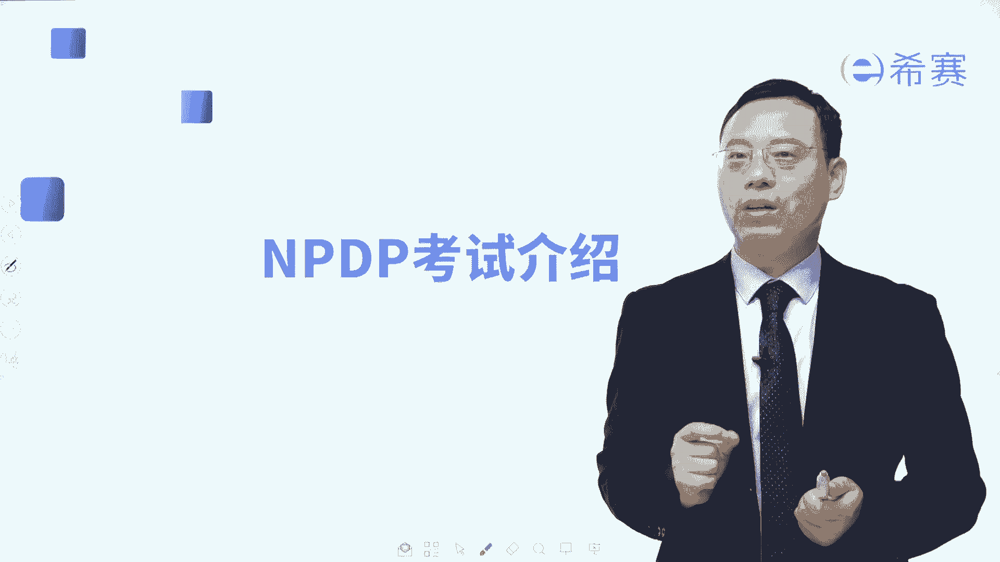
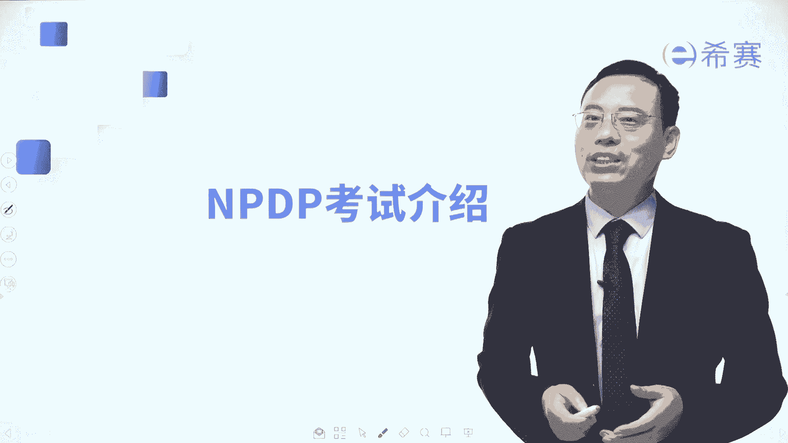
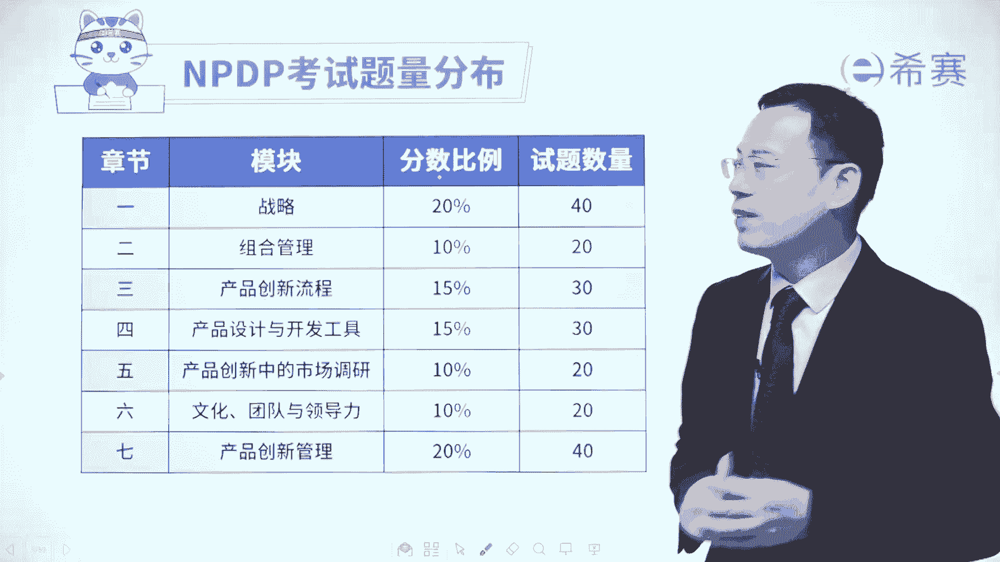
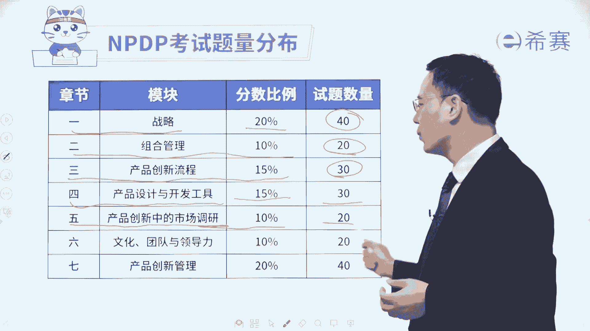
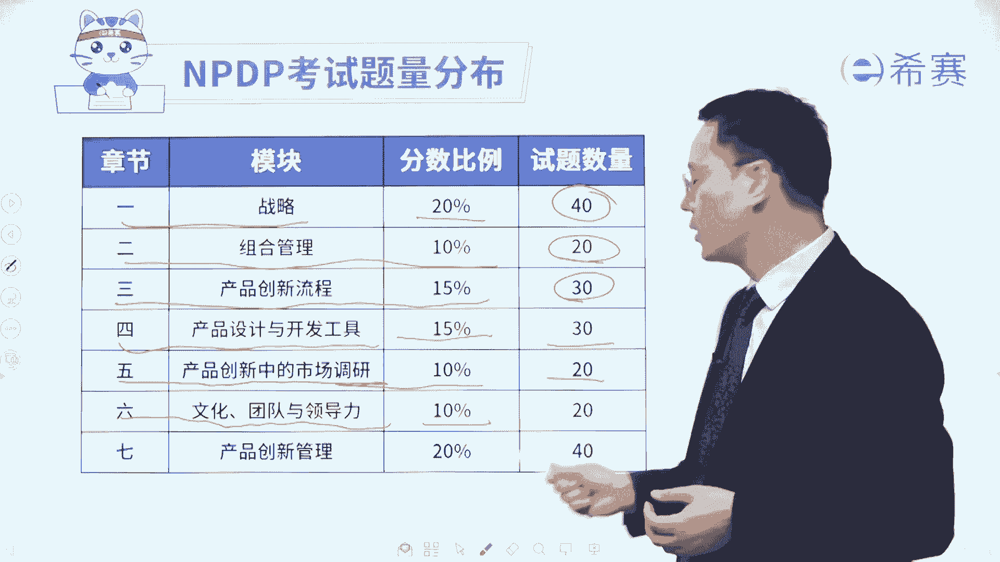
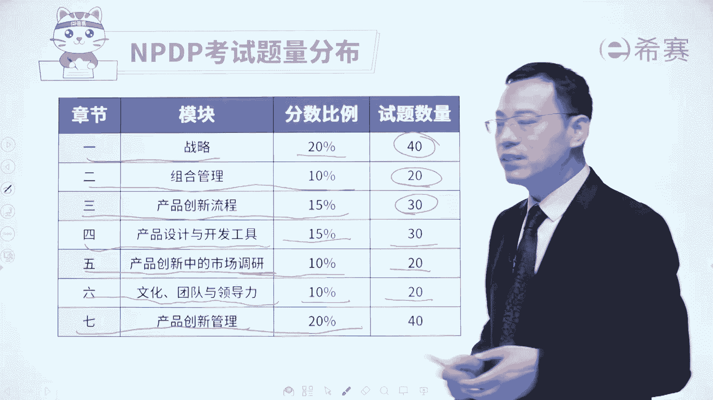

# 【2024年PMP】pmp项目管理认证全套系统教程全套免费观看，零基础可看！ - P99：考完pmp考什么？（NPDP考试介绍） - 渡河的蝉 - BV1Zh4y1D7pa

大家好。

欢迎来到希赛网专业的职业教育平台，我是罗福星，我们一起来分享。

关于NPDP考试的一些基本信息，NPDP它的全称是哦。

国际项目管理专业人士资格认证，那这样一考试呢，它是目前在全球范围内啊。

认可度最高的产品经理考试，虽然叫产品经理考试。

但是我个人是觉得它的内容特别好，涵盖特别广泛，它涵盖什么东西呢。

我们可以看一下它涵盖关于战略，关于组合管理以及各种新产品创新的流程，然后除此以外呢，还有就是关于市场调研呢啊，产品设计工具啊，产品开发工具啊，产品创意的工具啊，团队领导力以及整个创新管理中。

全生命周期的管理，所以NPDP课程如果说你有详细的了解，你会发现它其实是我们在职场上，如果说想要去做一个更大的领导，你需要更多的视野去关注更多信息的话，他会是作为你的一个很好的入门的，这个基础课程。

当然了，作为一个大的产品经理，你去了解这些信息以后，你去做产品的规划，做产品的设计，做产品的安排一定是大有裨益的，那整个NP率考试呢它是这样的，他一共只有七个章节。

而这七个章节考试一共是有200道单项选择题，每道题目一分一共是200分。

你考试要考到150分，就可以顺利的拿下NPPP，那这些个章节它的占比是这样的一个占比方式。

首先第一章叫战略战略，这个章节呢考试占比占到20%，也就是有40道题目，第二章组合管理，那它占比占到10%，有20道题目，第三章是产品创新流程，考试占比占到15%，有30道题目。

而第四章产品设计与开发工具，他会讲到很多这样一些产品创意的工具啊，产品设计的工具考试占比占到15%，也是有30道题目，然后呢再有一个就是产品创新中的市场调研，这个部分的占比占的稍微少一点，10%。

有20道题目。

第六个叫文化团队领导力，占比占到也是10%，有20道题目。

最后一个章节叫产品创新管理，那这个名字虽然叫产品创新管理，它其实既有产品生命周期的管理，也有产品创新的管理，还有这样可持续发展的管理啊，这些内容加到一起，它占的比较多，占到20%。

有40道题目，NPP考试呢，我相信可能很多同学是已经提前了解过pp，再来看NPDP，其实目前相对而言，NPP太考考试题目的难度还没有那么大，所以是一个很好的时候啊，是一个很好的机会来去好好学习。

因为他题目的确定性会更高一些，大部分的题目都是比较偏确定的，当然你要去考到150分，才可以拿下这一考试，所以呢同样也要加油，就像我们刚才有讲过的，你想在一些战略也好，组合管理也好，大的流程也好。

谁才会关心，一般是领导们去关心，包括全生命周期，谁去关心领导们关心，而产品经理他就是一个迷你CEO，是一个没有权限的小CEO，你先替老板们关心我们说越位思考，本位操作，你先把这些事情做好了以后。

你就有更多的机会能够去往上走，那这样一个课程呢详细的内容。