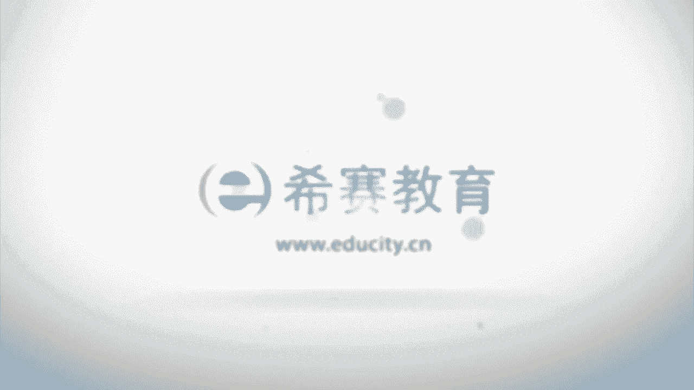

# （24年PMP）PMP项目管理认证考试零基础自学，精讲视频合集！ - P8：1.1《PMBOK》指南概述和目的 - 冬x溪 - BV1CL411f7BM

🎼Yeah。

大家好，欢迎大家来到西塞教育。接下来我们一起看到的是拼搏和指南第六版的第一章引论。理论部分的内容比较少，只分了两个大块，一个呢是拼le指南的概述和目的。呃，第二部分呢是一些基本要素。

我们说万丈高楼平地起，而这个呢就是我们的万丈高楼的底基，它会先对整个拼le指南这本书做一个简单的一些概要。呃，在前面的概述和目的部分呢分分到了三个小块，一个呢是项目管理的标准。这个标准呢。

我们在这一章并不会重点去讲，因为它虽然在书中只是简单罗列了一下，但是它在后面有一个单独的部分，就是书上有第二部分会单独来讲项目管理的标准。我们会把它放到第三章来详细的去讲解。第二个呢是通用词汇。

而通用词汇呢只是在这边有一个列出来做一个表示。我们会整个这本书全部的内容都是会讲到很多项目管理的专业的词汇和一些通用的词汇。第三个是道德与专业行为规范。我们知道我们做任何一件事情。

都会有它对应的一些约束。包括说我们的道德约束，我们的行为的一些约束。那我们在这边呢我们也会有一个简单的认知。我们先看到一个关于拼搏指南概述的这样一个目的。

首先它是会把这样一些项目管理的专业范围内的这样一些知识做一个明确，做一个定义和阐述。并且呢它会给到的是我们在全球内各行各业中对于项目管理所通用的这样一部分所达成共识的这样一部分来去做一个阐述。

它会给到很多的一些图表啊，词汇表啊，并且都是普遍被认可的良好实践。什么叫良好实践呢？它指的是说我们在真实的工作中，在真实的生活中，用这样一种处理方。是相对来讲是比较被大家所认可和认知的。

也是大家所认同的。同时他给到了一套专业的术语。另外，关于呃道德和行为规范，我们会有一个简单的要求。整个项目管理的标准呢，因为它涉及到的内容是呃。比较多。而在这一个第一章引论中呢，只是做了一个简单的概述。

我们也不会对它展开。刚刚有说过，我们会在第三章中详细的来进行说明。而通用词汇呢只是对于专业的学科的做一个一些词汇上做一个基本的一个介绍。然后后面是道德和行为规范。

那我们直接看到的是呃关于那个基本标准这一部分。😊，因为基本标准它是把大多数的项目中视为良好实践的这样一个过程列出来。嗯，然后他还会把这样一些过程，它的相应的输入输出都给列出来。

具体内容应该是它在拼搏指南中有一个第二部分。我们会把这个第二部分内容直接放在第三章来进行讲解。那么在这边呢就不再去去展开来讲。而通用词汇的话呢，因为整个这本书都是在讲这样一些项目管理的词汇。

一些通用词汇，我们也不会说单独列出来去讲词汇。那我么们直接就跳到第3块。第三个板块叫道德与行为规范。道德与行为规范它重点放在这样四个词上面，一个叫责任。也就是说，我们要对自己所做的决策。

或者说是我们决定不采取行动。以及我们决定采取行动这样一些内容都要承担自己对应的这样一个后果。这就是关于责任。也就是我们做某件事情或者不做某件事情，我们做了还是没做，我们计划怎么样做或者计划不怎么样做。

这些行为决定他背后的这样一个结果，我们都应该要去承担。这是关于责任。第二个呢叫尊重。他说的是对于自己对他人，对于委托给自己这样一些资源，要表现出高度的重视，要去对委托的资源呃，可能会包含一些人呢、钱呢。

然后一些他们的一些身望呐、安全呢等等。我们都要表现出高度的重视。我们要去尊重这样一些人员、资源、金钱、时间等等，还包括物品。第三个词呢叫公正，公正，他说的是客宽而无偏见的做出决策和行动。呃。

事实上这个对我们要求本身是非常高。作为一个项目经理，你完全抛开个人喜好是很困难的。但是作为一个成熟的项目经理，我们要重点放在围绕着这样一件事情去做。如何去把这样一件事情做好。

如何把项目能够比较好的去推进下去。为了更好的推进项目的话，我们需要更加的公正的来面对一些项相关的事项。第四个词呢叫诚实。诚实。他说要了解真相，并且在沟通和行为中以诚实的方式来行事。啊，大家要清楚一点啊。

整个pining book指南它是由美国人来起草和撰写。然后呢在全球范围内通用。所以它更多的是体现出了北美人的这样一个价值观和这样一个世界观。

所以这边会特别是说到这样关于诚实、公正、尊重和责任的这样一些概念。啊，我们简单来理解我这边有一一个这样的词，就说。简单来讲就是一个充满了偶像包袱的这样一个圣人。如果说我们把自己往这样一个维度去靠。

通常来讲，关于道德和专业行为规范的内容或者试题就比较好去理解。呃，我们就是要不违规，不违法，我们要正直善良，我们要善进，我们要积极的寻求去解决问题的方案。我们要做的事情，看保持正直。解决利益冲突。

平衡干系人他们之间的这样一个利益。我们要去尊重他人的认知的权利。我们要去妥善的解决一些敏感的问题。通常敏感问题呢呃有一个内容就是我们需要去私底下来解决，而不是放在台面上。并且呢对于项目管理的这样一些。

行业要做出贡献。也就是说我们要去传播项目管理的知识体系指南。我们要去给我们的身边的人去传播这样一些内容，能够让更多的人享受到项目管理的这样一些知识和内容，成为能够更好的去提高工作效率。呃。

所以有了这样一些内容以后，我们再去看到道德和行为规范，就比较容易去认识和理解它。