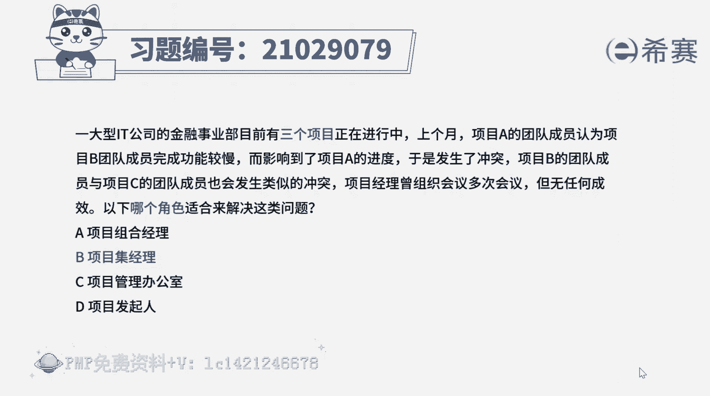
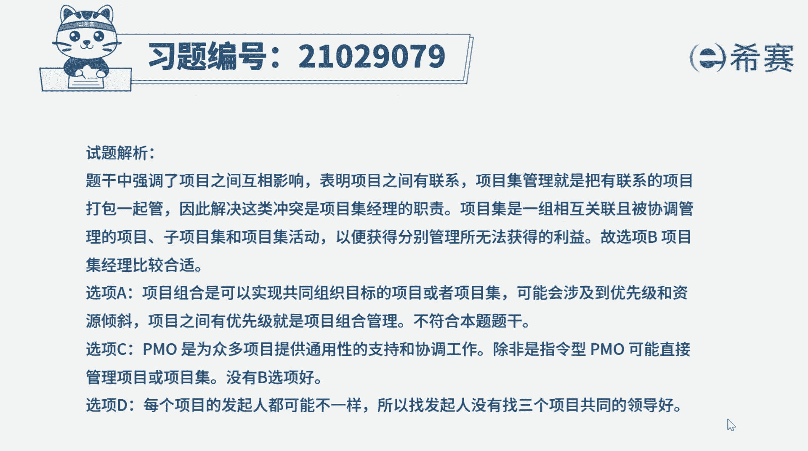
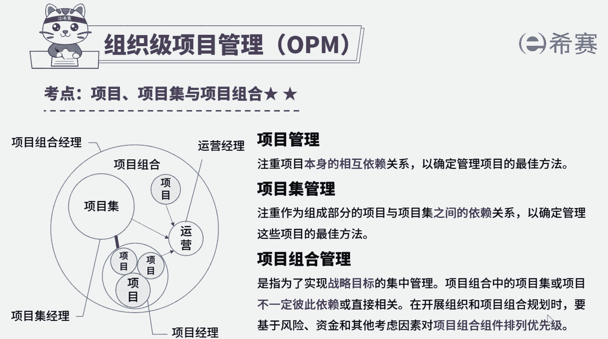

# （24年PMP）pmp项目管理考试零基础刷题视频教程-200道模拟题 - P1：1 - 冬x溪 - BV1S14y1U7Ce

一大型it公司的金融事业部，目前有三个项目正在进行中，上个月，项目a的团队成员，认为项目b团队成员完成功能较慢，而影响到了项目a的进度，于是发生了冲突，项目b的团队成员。

与项目c的团队成员也会发生类似的冲突，项目经理曾组织过多次会议，但无任何成效，以下哪个角色适合来解决这类问题，a项目组合经理，b项目集经理，c项目管理办公室d项目发起人好，我们读完题目。

先来看一下题干关键词，三个项目的团队成员之间发生冲突，问应该由哪个角色来解决好，我们分别来了解一下这几个角色，项目集是一组相互关联且被协调管理的项目，子项目集和项目及活动。

以便获得分别管理所无法获得的利益，而项目组合是指为了实现战略目标而组合在一，起管理的项目，项目机制，项目组合和运营工作，题干提到，不同项目完成的工作之间存在联系，会互相影响，要从项目集层面进行管理。

因此本题的正确选项是b选项，a选项就错误，再来看一下其他选项，选项，c，项目管理办公室，主要在支持战略调整和创造组织价值方面，发挥重要的作用，指令型的项目管理办公室，可能会直接管理项目或项目基。

没有b选项的情况下，可以考虑在这里有b选项，所以b选项会最佳好，那选项d这里涉及到三个项目，这三个项目的发起人可能不是同一个人，因此直接找三个项目共同的领导来解决冲突。

会比找发起人更合适，好十道题我们就先讲解到这里，大家可以自行参考一下文字解析。

整个题目讲解下来，我们可以知道本题考察的知识点就是项目集。

