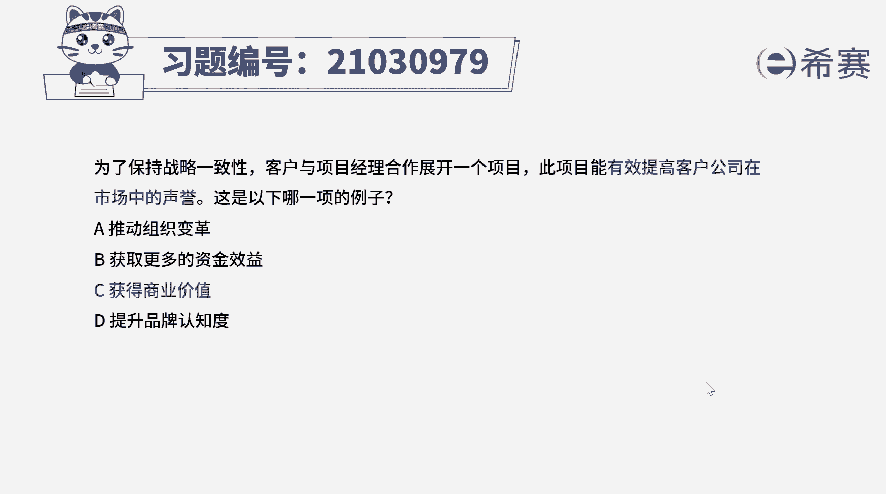
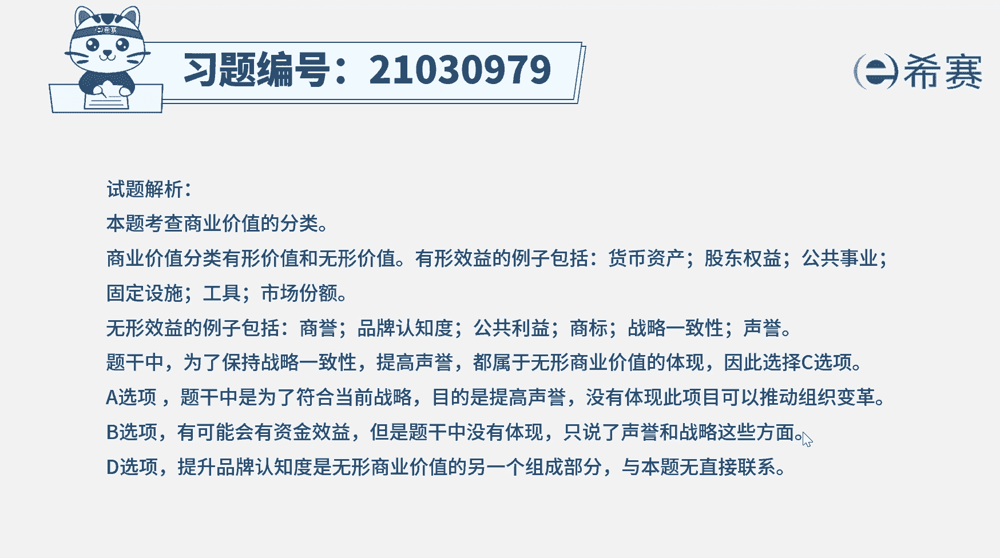
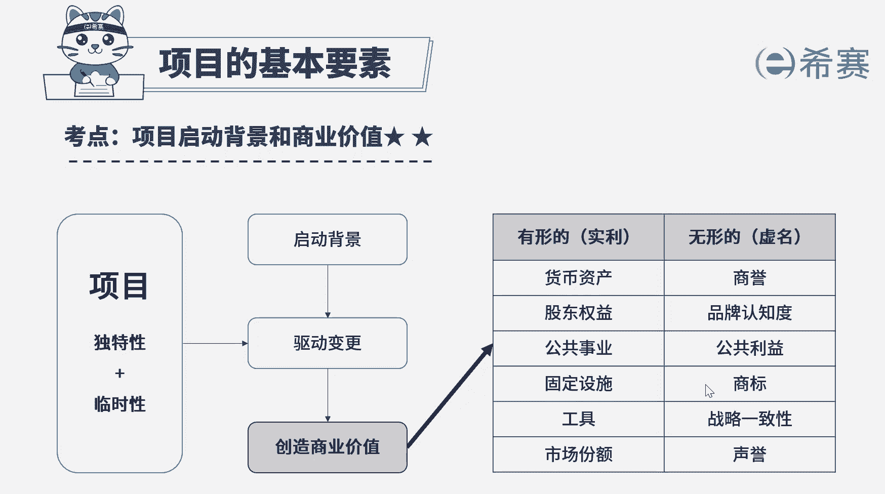

# （24年PMP）pmp项目管理考试零基础刷题视频教程-200道模拟题 - P10：10 - 冬x溪 - BV1S14y1U7Ce

为了保持战略一致性，客户与项目经理合作展开一个项目，此项目能有效提高客户公司在市场上的声誉，这是以下哪一项的例子，a推动组织变革，b获取更多的资金效益，c获得商业价值，d提升品牌认知度，好读完题目。

我们找到题干中的关键词，客户和项目经理合作一个项目，该项目能有效提高高客户公司在市场上的声誉，问这属于什么例子好，我们来综合分析一下每个选项所指的内容，组织变革是运用行为科学和相关管理方法。

对组织的权力机构，组织与其他组织之间的一些关系等，进行有目的的系统的调整和革新，而题干中是说，为了保持战略一致性，提高声誉，所以它应该是与组织变革无关的，我们可以知道a选项这个排除那选项。

并获取更多的资金效益，在整个过程中可能会有资金效益，但题干中并没有具体体现出资金收益，生育和战略是不能直接联系到资金收益的，所以b选项我们也可以排除掉c选项，获得商业价值。

那商业价值是指从商业运作中获得的，可量化净收益啊，这个效益可以是有形的，无形的，或者两者皆有之，有形的价值就包括货币资产，股东权益，市场份额等，但无形价值就包括商誉，品牌认知度，生育商标。

公共利益等这一些，那根据题干中的信息，是提高客户公司在市场上的声誉，那说明这就是为了获得商业价值，那结合题干提高客户公司在市场上的声誉，那说明就是在获取商业价值，所以本题的正确答案应该是c选项。

选项d提升品牌认知度，这个选项其实是比较容易混淆的选项，提升生育之后可能能够提升品牌的认知度，但生育的提高直接体现的是商业价值的增加，生育和品牌认知度都属于无形价值中的一种。

但这两个是独立分开的两种类型，生育这种商业价值，不能直接理解成的另一种商业价值，只能说商业价值中的无形价值，包括生育和品牌认知度啊，这是两个不同的价值，所以d选项是包含在商业价值里面的，因此综合分析。

本题的正确答案为c选项，获得商业价值好。

本期我们就先讲解到这里，大家可以自行参考一下相关的文字解析。

整个题目讲，接下来我们可以知道本题考察的知识点，就是商业价值的分类，商业价值包括有形的，无形的，有形的，包括哪些方面，无形的包括哪些方面。

