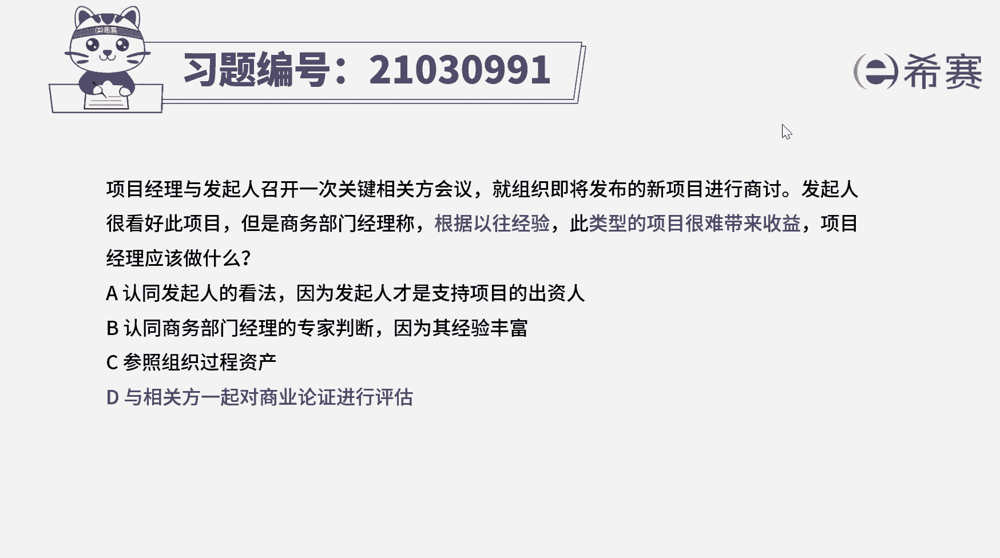
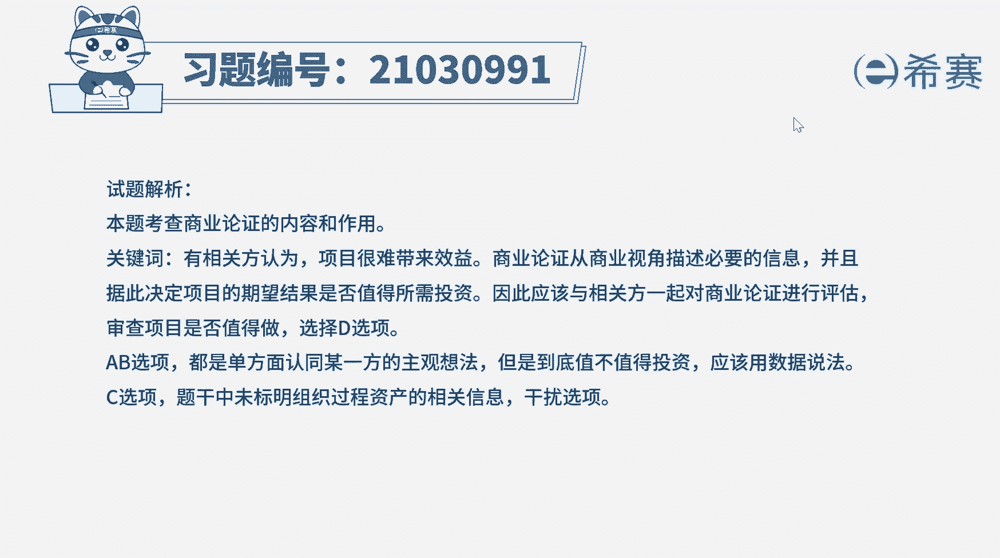
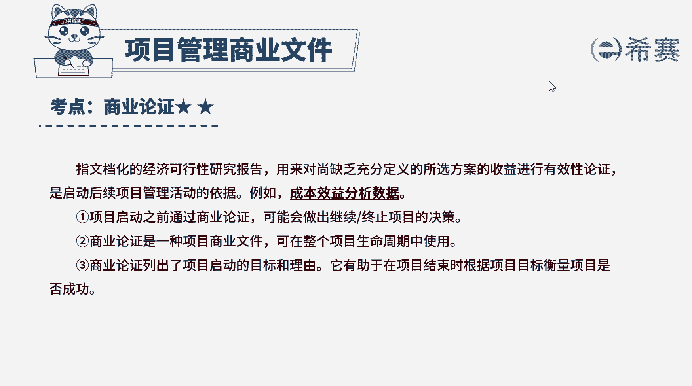

# （24年PMP）pmp项目管理考试零基础刷题视频教程-200道模拟题 - P16：16 - 冬x溪 - BV1S14y1U7Ce

项目经理与发起人召开一次关键相关方会议，就组织即将发布的新项目进行商讨，发起人很看好此项目，根据以往经验，此类型的项目很难带来收益，项目经理应该做什么，a认同发起人的看法。

因为发起人才是支持项目的出资人，因为其经验丰富，c参照组织过程资产，d与相关方一起对商业论证进行评估，好我们读完题目，找到题干中的关键词，商讨新项目的过程中，发起人看好此项目，此类型的项目很难带来收益。

项目经理应该做什么，项目能否带来效益，是否可行，值不值得做，这个不能依据个人的看法，或过往的经验做出判断，而要有理可据，有实际的数据作为参考，才能做出最准确的判断，因此本题的正确答案应该是d选项。

商业论证指文档化的经济可行性研究报告，用来对上缺乏充分定义的所选方案的收益，进行有效论证，是启动后续项目管理活动的依据，好再来看一下其他选项，ab选项，这两个选项都是单方面认同一个人的主观看法。

这些观点都只能代表个人意见，没有实际的数据作为依据，不能据此做出项目是否值得投资的判断，选项，c题干中并没有给出组织过程资产的相关信息，因此无法参照其作出判断，c也属于干扰项好了。

那我们此题就先讲解到这里，大家可以自行参考一下相关的文字解析。

整个题目讲解下来，我们可以知道，本题考察的知识点就是商业论证的内容和作用，判断项目是否可行。

要有理有据。