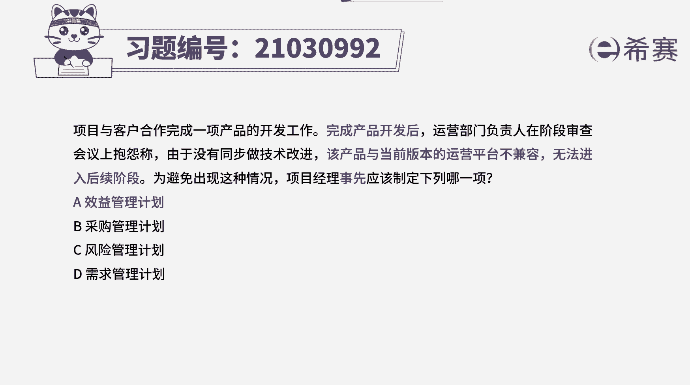
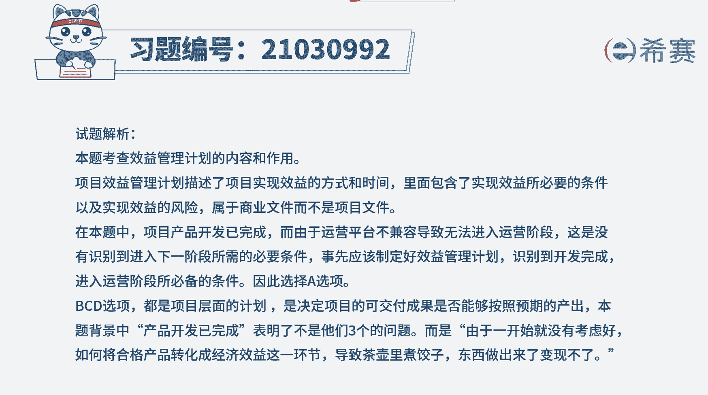
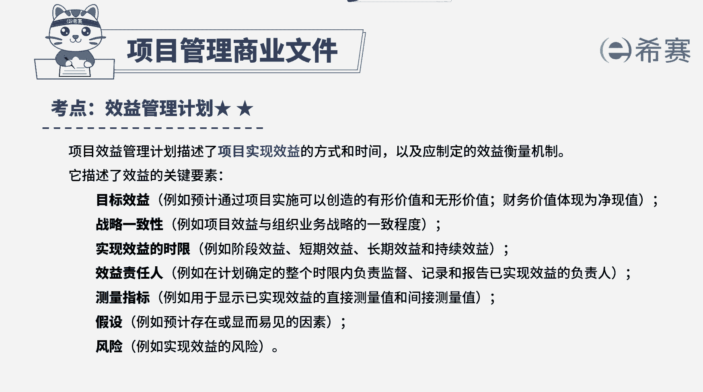

# （24年PMP）pmp项目管理考试零基础刷题视频教程-200道模拟题 - P17：17 - 冬x溪 - BV1S14y1U7Ce

项目与客户合作完成一项产品的开发工作，完成产品开发后，运营部门负责人在阶段审查会议上抱怨称，由于没有同步做技术改进，该产品与当前版本的运营平台不兼容，无法进入后续阶段，为避免出现这种情况。

项目经理事先应该制定下列哪一项，a效益管理计划，b采购管理计划，c风险管理计划d需求管理计划，那读完题目，我们找到题干关键词，完成产品开发后，发现该产品与当前版本的运营平台不兼容，无法进入后续阶段。

问事先应该制定什么计划，产品已经做完了，发现无法进入运营阶段，无法进入运营阶段，就无法为产品运营带来持续的效益，产品无法变现，这说明一开始没有识别到，进入运营阶段所需的必要条件。

没有考虑好如何使产品产生经济效益这一环节，这已经不是项目阶段的事了，而是下一个运营阶段的事，说明事先如何使产品产生实际效益的效益，管理计划就没有做好，教育管理计划。

是对创造提高和保持项目或项目及效益的过程，进行定义的书面文件，它描述了项目实现效益的方式和时间，以及应该制定的效益衡量机制，项目生命早期就应该制定目标效益，并据此制定效益管理计划。

因此本题的正确答案应该是a选项，举个例子哈，项目完成了一条手机生产线带移交给客户，发现这条生产线生产不了手机，那这条生产线就没办法产生效益，事先都按客户要求完成产品了，这不是客户对产品的需求没有满足。

而是生产线如何能够生产手机，产生经济价值，这一需求没有考虑好，这个需求已经不在项目层面了，而在运营层面，所以要通过效益管理计划来描述，生产线能够生产手机所要满足的必要条件和方，法，按这个方法执行。

才能使生产线运营能够生产出手机，好，希望通过这个例子，大家可以对本题，以及刚刚所讲到的效益管理计划，能够有一个更好的了解好，再来看一下其他选项，选项b题干信息与采购的内容无关，所以说b直接排除选项c。

风险管理计划，只能识别和管理本项目开发过程中的风险，但这里项目开发阶段已经完成，是从开发阶段进入运营阶段的条件没有考虑好，所以不属于风险识别的问题，选项d需求是项目开发阶段产品的需求。

例如要添加什么功能，但这里产品已经开发完成，说明开发阶段的需求是满足的，无法运营，是进入运营阶段的需求，没考虑好，这已经不在项目产品开发阶段了，所以需求管理计划也无法解决这个问题。

好十道题我们就先讲解到这里。

大家可以自行参考一下相关的文字解析。

整个题目讲解下来，我们可以知道。

本题考察的知识点。