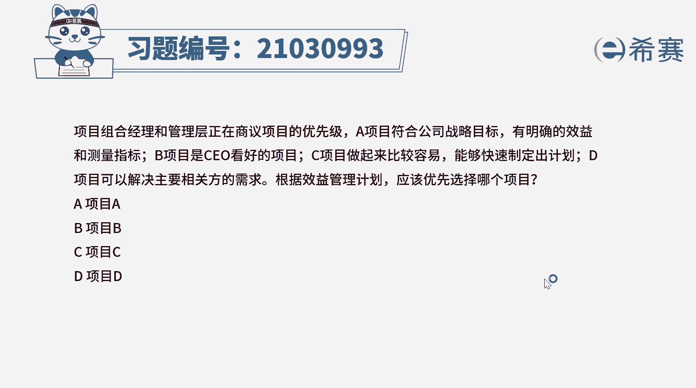
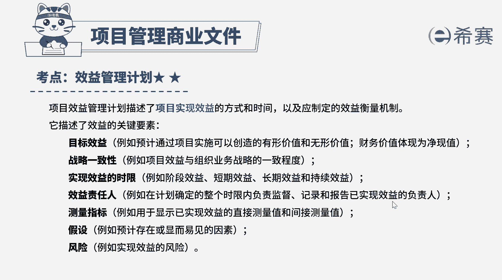

# （24年PMP）pmp项目管理考试零基础刷题视频教程-200道模拟题 - P18：18 - 冬x溪 - BV1S14y1U7Ce

项目组和经理和管理层正在商业项目的优先级，a项目符合公司战略目标，有明确的效益和测量指标，b项目是ceo抗衡的项目，c项目做起来比较容易，能够快速制定出计划，d项目可以解决主要相关方的需求。

根据效益管理计划应该优先选择哪个项目，a项目a b项目b c项目c d项目d好，读完题目，我们来看到本题中的关键词，根据效益管理计划应该优先选择哪个项目，项目效益管理计划。

描述了项目实现效益的方式和时间，以及应制定的效益衡量机制，它描述了效益的几个关键要素，一目标效益只预计通过项目时是可以创造的，有形价值和无形价值，二战略一致性，即项目的效益与组织业务战略的一致程度。

三实现效益的实现，比如阶段效益，短期的效益，长期的效益，持续的效益等等，第四个效益责任人啊，只在计划确定的整个实现内，负责监督记录和报告与实现效益的负责人，五测量指标，用于显示以实现效益的。

直接测量值和间接测量值，六假设即预计项目存在或显而易见的因素，其风险禁止实现效益所存在的一些风险，那根据题干的信息，以及我们刚刚所讲到的项目效益管理计划，那本题的正确答案应该是a选项，符合公司战略目标。

有明确的效益和测量指标，这些都是可以根据效益管理计划，作为选择项目的标准，那b c d选项，它都可以作为启动项目的一个理由，但他们不是效益管理计划的内容，不是实现效益的关键因素，因此它们与题干要求的。

根据效益管理计划来选择项目不相符，好了我们十道题就先讲解到这里，可以自行参考一下相关的文字解析。

整个题目讲解下来。

我们可以知道。