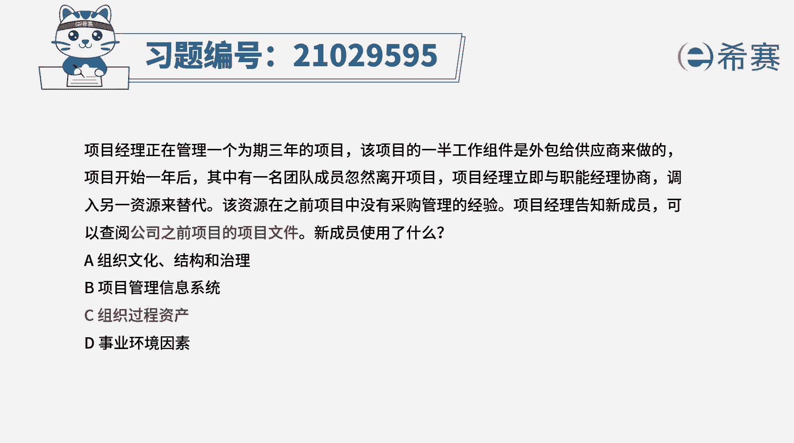
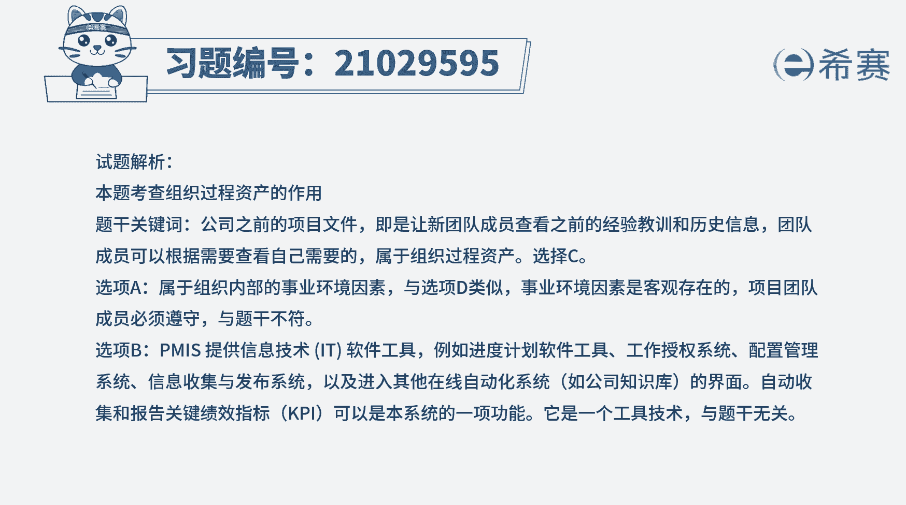
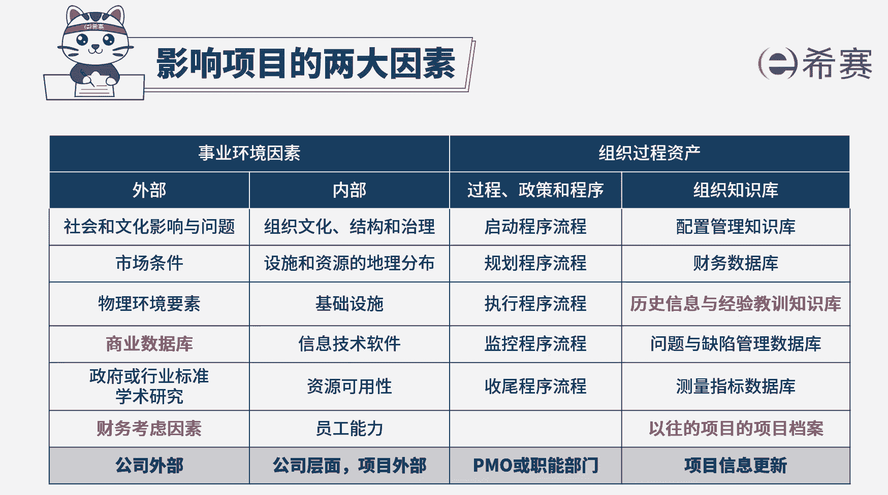

# （24年PMP）pmp项目管理考试零基础刷题视频教程-200道模拟题 - P19：19 - 冬x溪 - BV1S14y1U7Ce

项目经理正在管理一个为期3年的项目，该项目的一半工作组件是外包给供应商来做的，项目开始1年后，其中一名团队成员忽然离开项目，项目经理立即与职能经理协商，调入另一个资源来替代该资源。

在之前项目中没有采购管理的经验，项目经理告知新成员，可以查阅公司之前项目的项目文件，新成员使用的什么，a组织文化结构和治理，b项目管理信息系统，c组织过程资产d事业环境因素好，读完题目。

我们找到题干中的关键词，新成员没有相关经验，可以查阅公司之前项目的项目文件，之前的项目文件，就是一些过往的经验教训和历史信息，这些都属于公司组织过程资产，所以本题的正确选项是c选项。

那再来看一下其他选项，选项a组织文化结构和治理，属于组织内部的事业环境因素，这些是团队不能控制的，将对项目产生影响的条件，所以a选项不符合选项，b项目管理信息系统是提供信息技术软件工具，例如进度计划。

软件工具，工作授权系统，配置管理系统，信息收集与发布系统等，这些它是一项工具，技术，与题干没有直接联系，选项d事业环境因素指项目团队不能掌控的，将对项目产生影响的条件，而过往的经验教训和历史信息。

是团队自己可以编制总结的，所以d选项也不正确。

好了，我们此题先讲解到这里，大家可以自行参考一下相关的文字解析。

整个题目讲解下来，我们可以知道，本题考察的知识点就是组织过程资产的作用，查看组织过程资产。

