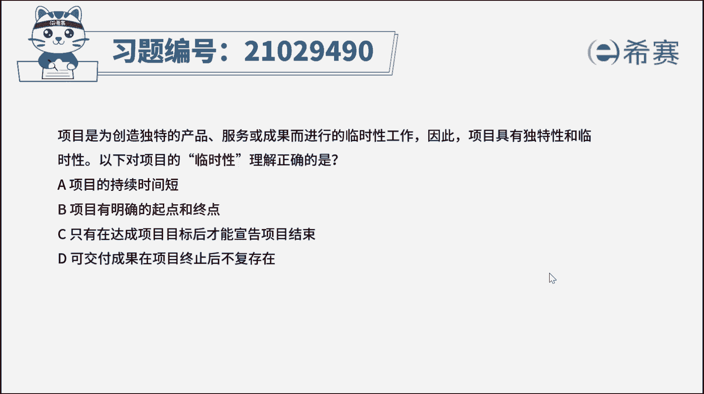

# （24年PMP）pmp项目管理考试零基础刷题视频教程-200道模拟题 - P2：2 - 冬x溪 - BV1S14y1U7Ce

项目是为创造独特的产品服务或成果，而进行的临时性工作，因此项目具有独特性和临时性，以上对项目临时性理解正确的是，a项目的持续时间短，b项目有明确的起点和终点，c只有在达成项目目标后才能宣告项目结束。

d可交付成果在项目终止后不复存在，我们读完题目来看一下问题，对项目临时性理解正确的是好，那我们知道，这道题完全考察的就是，对项目临时性概念的理解，项目具有临时性，指的是项目具有明确的开始时间和结束时间。

不会无限期地延续下去，因此本题正确答案是b选项，项目有明确的起点和终点，那我们来看一下其他选项，选项，a项目的临时性与项目工期的长短没有关系，一个工期只有一个星期的项目是临时的。

一个工期长达10年的项目也是临时的，a不正确，学校c项目可以因为多种原因终止，比如项目目标已经明显无法达成且被批准，那可以提前终止项目，并不只有达到了项目目标才能结束项目。

c说法错误选项d项目具有临时性，但它产生的成果往往具有可持续的长期生命力，例如新赛正在进行一个试题录制项目，项目结束后，试题录制视频会持续出现在西塞网中，供学员使用。

并不会因为试题录制项目的结束而不复存在。

所以d的说法也不正确好了，那我们此题就先讲解到这里，大家可以自行参考一下文字解析，整个题目讲解下来。

我们可以知道本题考察的知识点。