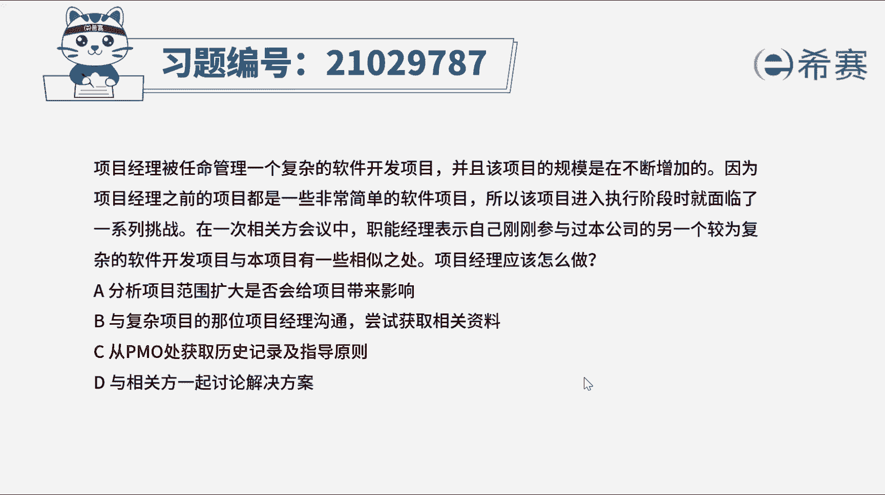
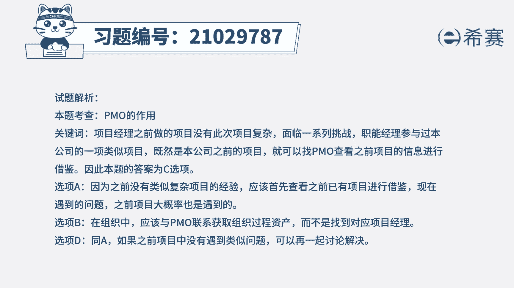
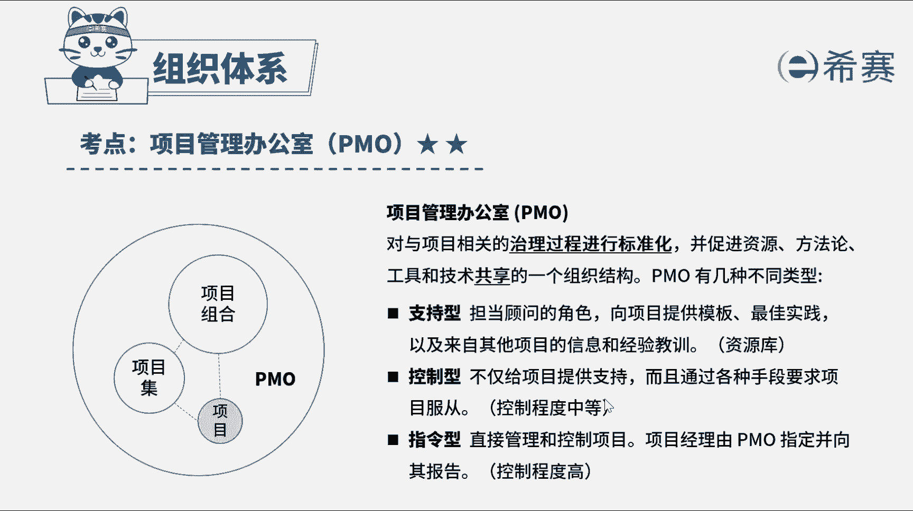

# （24年PMP）pmp项目管理考试零基础刷题视频教程-200道模拟题 - P21：21 - 冬x溪 - BV1S14y1U7Ce

项目经理被任命管理一个复杂的软件开发项目，并且该项目的规模是在不断增加的，因为项目经理之前的项目，都是一些非常简单的软件项目，所以该项目进入执行阶段时，就面临了一系列挑战，在一次相关会议中。

职能经理表示，自己刚刚参与过，本公司的另一个较为复杂的软件开发项目，与本项目有一些相似之处，项目经理应该怎么做，a分析项目范围扩大是否给项目带来影响，b与复杂项目的那位项目经理沟通，尝试获取相关资料。

b与相关方一起讨论解决方案好了，我们读完题目，找到题干中的关键词，项目执行过程中遇到挑战，但发现另一个项目与本项目有相似之处，问项目经理怎么做，另一个项目与本项目相似，想解决本项目的问题。

可以借鉴另一个项目的经验，而历史教训属于组织过程，资产需要从pmo处获取，因此本题的正确选项是c选项，再来看一下其他选项，选项a之前没有类似经验，才导致项目命名问题，现在发现有过完经验可以借鉴。

应该参照过往经验来解决问题，分析范围扩大，对项目的影响并不能有效帮助解决现在的问题，选项b虽然只能经理参加过另一个项目，但个人经验的分享可能存在信息的遗漏，组织过程资产的获取应该通过pmo。

而不是直接询问职能经理，所以b不正确，选项d没有类似经验的情况下，可以和相关方讨论解决方案，但有经验教训可以借鉴的情况下，优先参考过往经验，更有利于问题的解决，好了，我们知道题型讲解到这里。

可以自行参考一下相关的文字解析，整个题目讲解下来。

我们可以知道本题考察的知识点。

