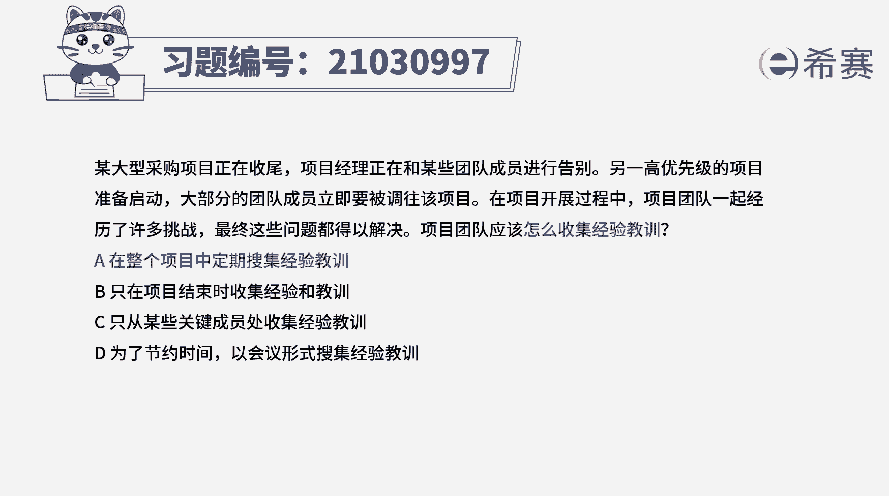
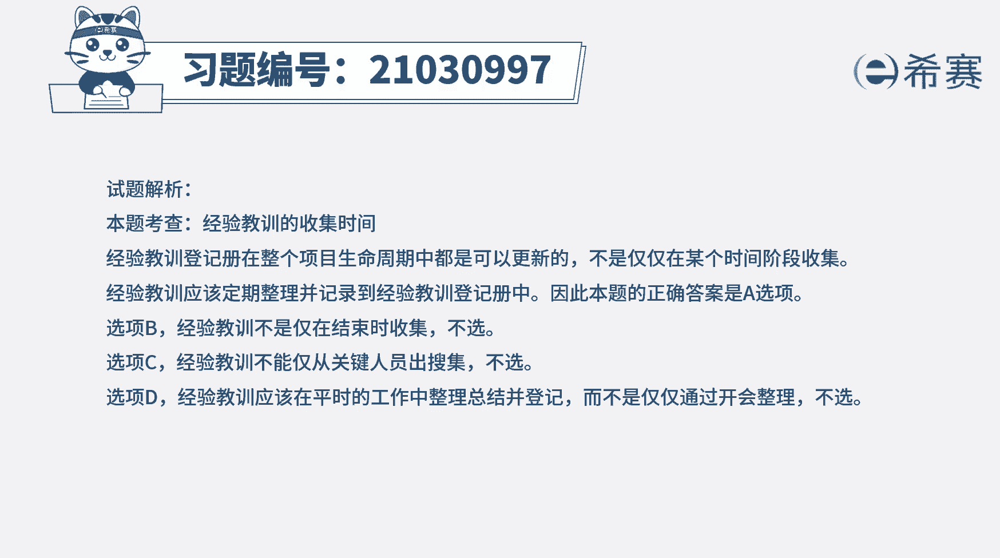
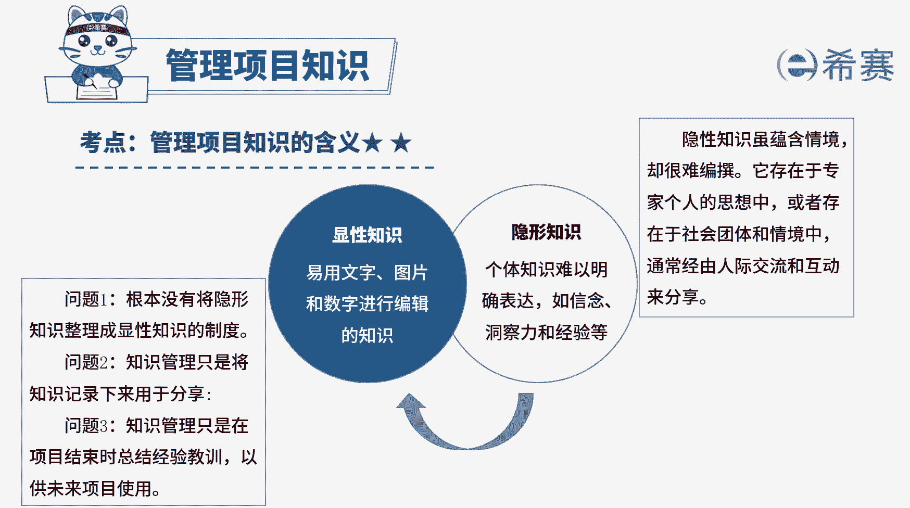

# （24年PMP）pmp项目管理考试零基础刷题视频教程-200道模拟题 - P23：23 - 冬x溪 - BV1S14y1U7Ce

某大型采购项目正在收尾，项目经理正在和某些团队成员进行告别，另一高优先级项目准备启动，大部分的团队成员立即要被调往该项目，在项目开展过程中，项目团队一起经历了许多挑战，最终这些问题都得以解决。

项目团队应该怎么收集经验教训，a在整个项目中定期收集经验教训，b只有在项目结束时收集经验教训，c只从某些关键成员处收集经验教训，d为了节约时间，以会议形式收集经验教训，好，读完题目。

我们找到题干中的关键词，项目团队又怎么收集经验教训，本题考察的其实就是经验教训的收集时间，经验教训登记册的更新，是在整各项目生命周期内都可以进行的，不仅仅只在某个阶段。

所以经验教训的收集也是贯穿于整个项目的，经验教训应该定期收集整理，并记录到经验教训登记册中，所以本题的正确答案是a选项，再来看一下其他选项，选项b，经验教训的收集不仅仅只存在于项目结束时。

在整个项目生命周期都可以进行，并不正确选项c，所有成员的经验教训都应该收集，不能仅从关键成员处收集选项d，经验教训在平常的工作中就可以整理总结，而不是仅仅通过会议的方式整理，所以选项d也不正确好了。

我们此题先讲解到这里。

大家可以自行参考一下相关的文字解析。

整个题目讲解下来，我们可以知道本题考察的知识点。

