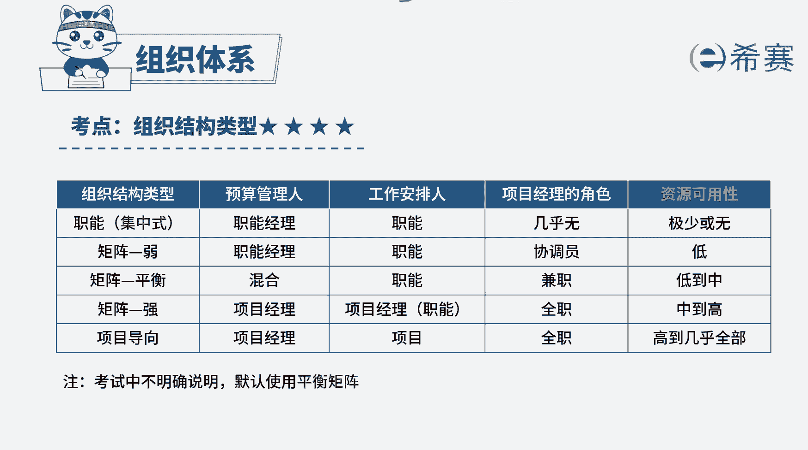

# （24年PMP）pmp项目管理考试零基础刷题视频教程-200道模拟题 - P25：25 - 冬x溪 - BV1S14y1U7Ce

企业的高层管理人员正在讨论，内部使用职能型还是矩阵型组织结构，这两种组织结构都有一些特点，关于这两种组织结构的表述，正确的是，a矩阵型组织结构中，项目经理和职能经理处于平衡地位，b职能型组织结构中。

项目经理资源可用性的水平很高，c矩阵型组织结构中，项目经理和职能经理同时被汇报工作，d直类型组织结构中，项目经理的权限要大于职能经理，好，读完题目，我们可以知道。

本题就是考察对值类型和矩阵型组织结构的理，解，职能型组织结构中，项目经理的权力大，对资源完全具有支配权，几乎不存在项目经理这个角色，职能经理是项目预算管理者，矩阵型组织结构类型有多种，包括强矩阵。

弱矩阵，平衡矩阵，它们的主要区别在于，项目经理与职能经理的权利大小，强举证中，项目经理权力比职能经理大，对资源具有支配权，若矩阵中职能建立比项目经理权力大，对资源拥有支配权，而在平衡矩阵中。

职能经理与项目经理权力大小相同，对于资源的支配往往是共同协商处理，因此本题的正确选项是c选项，不管是哪一种矩阵类型，不管它的权力大小，在矩阵型组织结构中，项目经理和职能经理都有一定的权限。

因此项目团队成员都要向项目经理和职能经理，汇报工作，再来看一下其他选项错在哪里，选项a这仅仅是平衡矩阵的特点，不是所有矩阵型组织的特点，选项b和d职能型组织结构中，职能经理权限很大。

几乎不存在项目经理这个角色，所以bd的说法都是错误的。

好了，我们这道题就先讲解到这里，大家可以自行参考一下相关的文字解析。

整个题目讲解下来，我们可以知道，本题考察的知识点，就是几种组织结构类型的区分，可以通过权力的大小，对资源的支配权。

