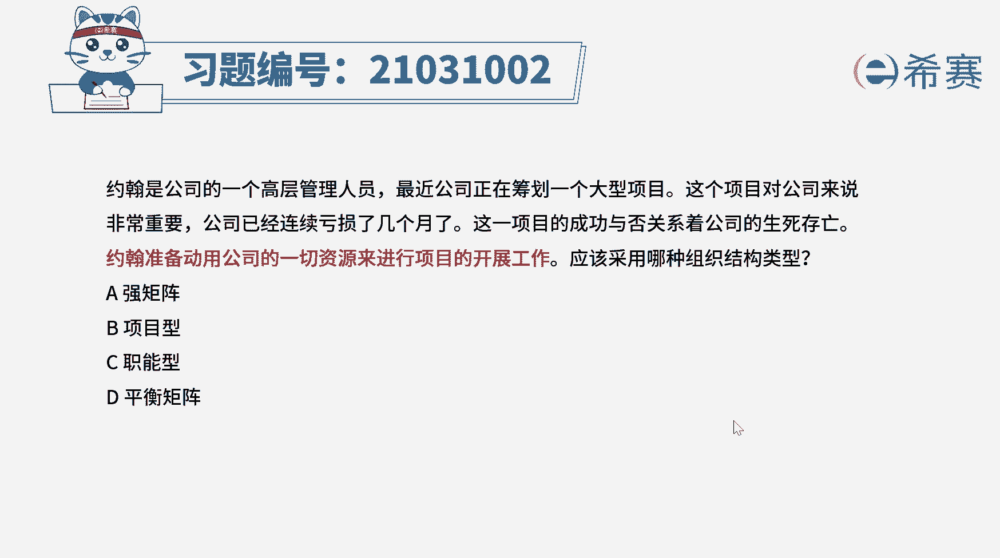
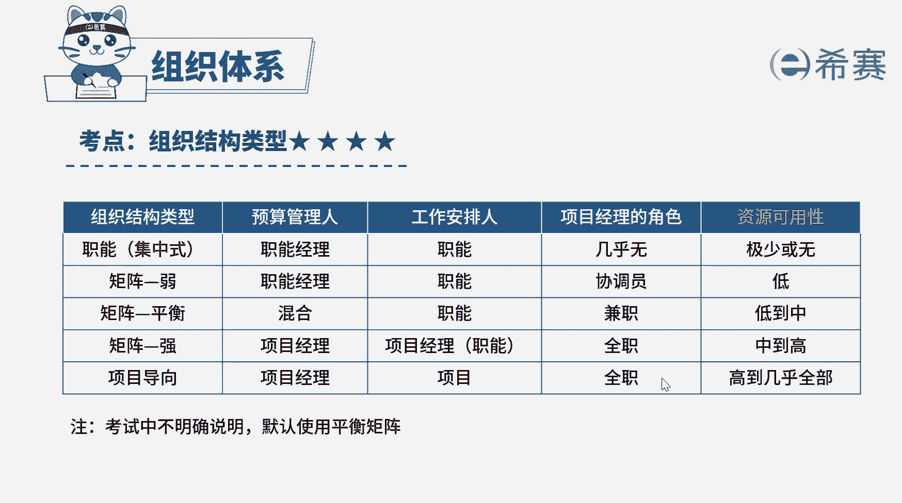

# （24年PMP）pmp项目管理考试零基础刷题视频教程-200道模拟题 - P26：26 - 冬x溪 - BV1S14y1U7Ce

约翰是公司的一个高层管理人员，最近公司正在筹划一个大型项目，这个项目对公司来说非常重要，公司已经连续亏损了好几个月了，这一项目的成功与否，关系着公司的生死存亡，约翰准备动用公司的一切资源。

来进行项目的开展工作，应该采用哪一种组织结构类型，a强矩阵，b项目型，c职能型，d平衡矩阵，好，读完题目，我们找到题干中的关键词，约翰准备动用公司的一切资源，来进行项目的开展。

问这是属于什么组织结构类型，好组织结构类型有多种，我们主要区别在于权力的大小，以及对资源进行支配的权限大小，选项a强矩阵，那强举证项目经理权利比职能经理权利要大，对资源具有支配权。

项目经理是项目预算的管理者，选项b项目型那项目型项目经理权利大，拥有绝对话语权，对资源完全具有支配权，项目经理是项目预算的管理者，选项c职能型，职能型中，职能经理权力大，对资源完全具有支配权。

几乎不存在项目经理这个角色，职能经理是项目预算管理者，选项d平衡矩阵，那在这一种组织结构中，职能经理与项目经理权力大小相同，对于资源的支配往往是共同协商处理，共同管理项目预算，本题中。

约翰作为高级管理层，可以动用公司的一切资源开展项目，说明作为项目经理，他的权力很大，所以cd不符合那强举证中，虽然项目经理的权利也大，但与项目型相比还是比较小的，题干中强调项目对于公司非常重要。

要动用一切资源，项目经理的权限越大，越有利于资源向项目倾斜，因此b选项比a选项更符合本题的，最佳答案是选项b项目型好了。

我们此题先讲解到这里，大家可以自行参考一下相关的文字解析。

整个题目讲解下来，我们可以知道本题的考察知识点，就是几种组织结构类型的区分，可以通过权力的大小对资源的支配权。

