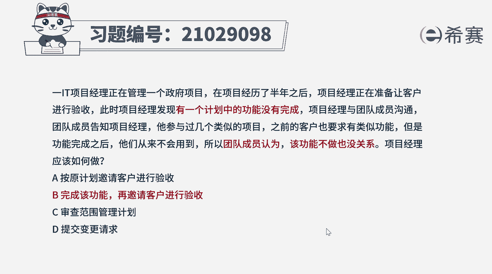
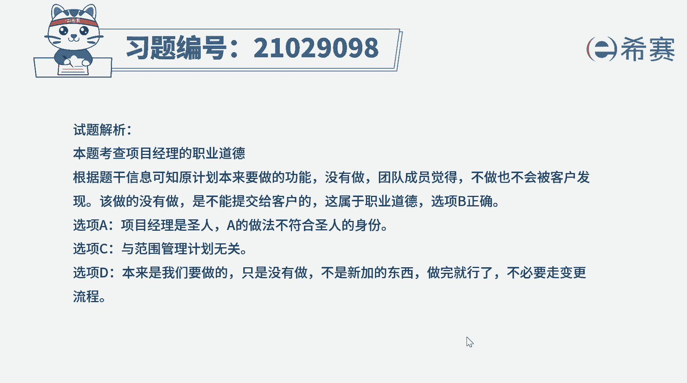
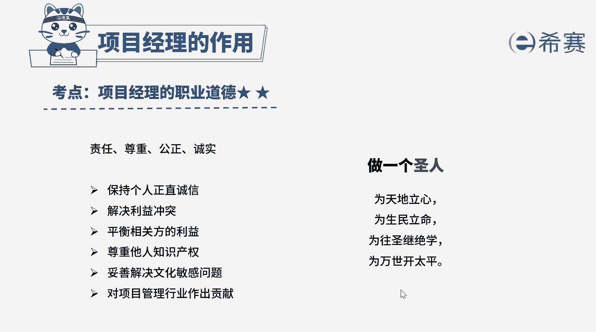

# （24年PMP）pmp项目管理考试零基础刷题视频教程-200道模拟题 - P27：27 - 冬x溪 - BV1S14y1U7Ce

一it项目经理正在管理一个政府项目，在项目经历了8年之后，项目经理正在准备让客户进行验收，此时项目经理发现，有一个计划中的功能没有完成，项目经理与团队成员沟通，团队成员告知项目经理。

他参与过几个类似的项目，之前的客户也要求有类似功能，但是功能完成之后，他们从来不会用到，所以团队成员认为该功能不做也没关系，项目经理应该如何做，a按原计划邀请客户进行验收。

b完成该功能再邀请客户进行验收，c审查范围管理计划d提交变更，请求好，我们读完题目，找到题干中的关键词，项目验收过程中，发现有一个计划中的功能没有完成，团队成员认为其他类似项目中，这个功能并不会用到。

所以做不做都没有关系，问项目经理应该怎么做，项目经理应该秉持诚实的价值观，既然是客户要求的，原来就是计划中要完成的功能，即使客户不会用到，也应该按客户的要求完成，该做的没有做就不能提交给客户。

这属于职业道德，因此本题的正确选项是b选项，完成该功能后才能让客户验收好，再来看一下其他选项，该做的没有做就提交给客户，这是违背项目经理的职业道德的，不符合项目经理圣人的身份，选项c。

题干并没有提到范围管理过程中出现问题，所以与范围管理计划无关，选项d这个工作本来就是要做的，并不是新加的功能，所以直接完成这个功能就可以了。

不需要走变更流程好了，我们几道题就先讲解到这里，大家可以自行参考一下相关的文字解析。

整个题目讲解下来。

我们可以知道本题考察的知识点。