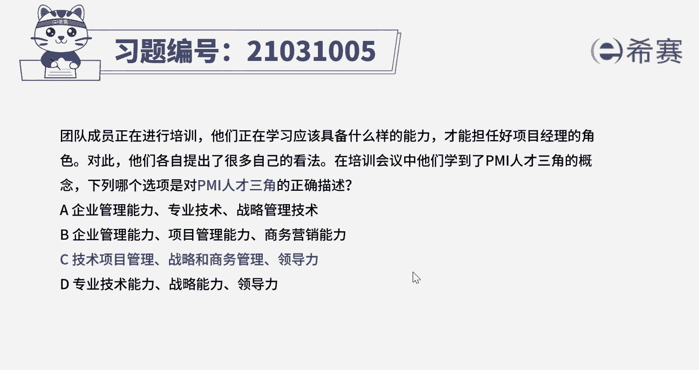
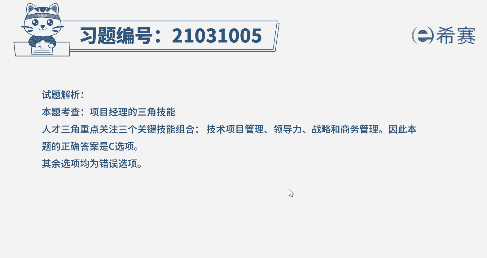
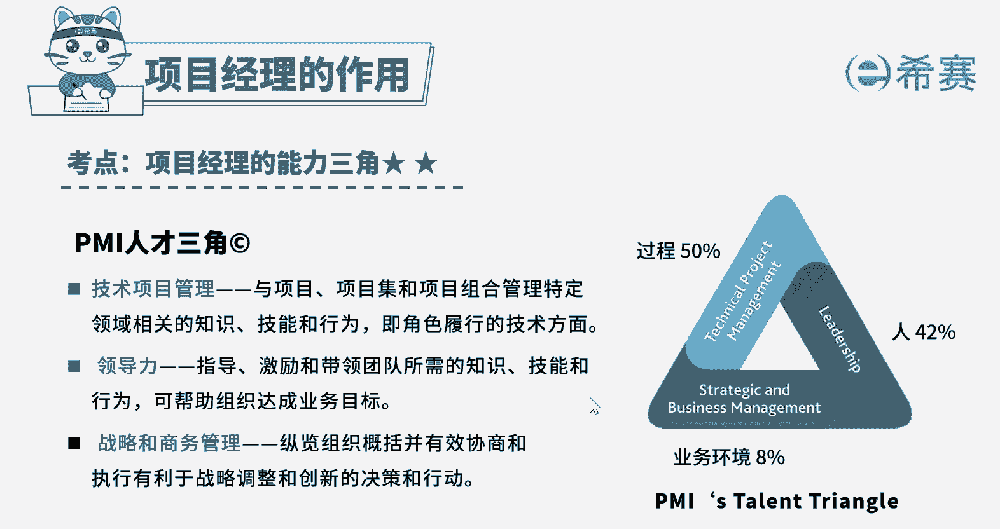

# （24年PMP）pmp项目管理考试零基础刷题视频教程-200道模拟题 - P28：28 - 冬x溪 - BV1S14y1U7Ce

团队成员正在进行培训，他们正在学习应该具备什么样的能力，才能担任好项目经理的角色，对此他们各自提出了很多自己的看法，在培训会议中，他们学到了pmi人才三角的概念。

下列哪个选项是对pmi人才三角的正确描述，a企业管理能力，专业技术，战略管理技术，b企业管理能力，项目管理能力，商务营销能力，c技术项目管理战略和商务管理领导力，d专业技术能力，战略能力，领导力好。

这个题目虽然比较长，但关键词就在最后一句，哪一项是pmi人才三角的正确描述，唉这是一个概念题，项目经理的能力三角指的是技术，项目管理，它指的是与项目项目集和项目组合管理，特定领域相关的知识技能和行为。

即角色旅行的技术方面，好领导力，他指的是指导激励和带领团队所需的知识，技能和行为，可帮助组织达成业务目标啊，战略和商务能力，它指的是重难组织概括并有效协商和执行，有利于战略调整和创新的决策和行动。

唉因此本题的正确选项应该是选项c好，那其他三个选项均为错误选项，注意每一种管理能力前面的名词不同，向选项提及到的企业管理能力，项目管理能力，技术管理能力，那这几种管理能力具体包含的意思也不一样。

大家千万不能混淆了好了。

那我们这道题就先讲解到这里，大家可以自行参考一下相关的文字解析。

整个题目讲解下来，我们可以知道本题考察的知识点就是pmi。

