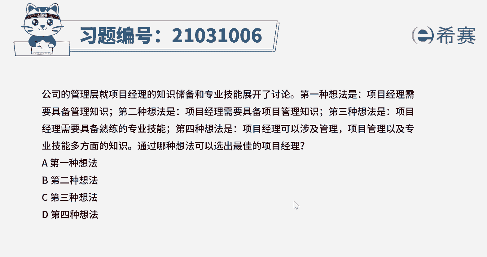

# （24年PMP）pmp项目管理考试零基础刷题视频教程-200道模拟题 - P29：29 - 冬x溪 - BV1S14y1U7Ce

公司的管理层，就项目经理的知识储备和专业技能展开了讨论，第一种想法是项目经理需要具备管理知识，第二种想法是项目经理需要具备项目管理知识，第三种想法是，项目经理需要具备熟练的专业技能。

第四种想法是项目经理可以涉及管理，项目管理以及专业技能多方面的知识，通过哪种想法可以选出最佳的项目经理，第一种想法b，第二种想法c，第三种想法，第四种想法好，读完题目，我们可以知道本题就是问四种想法中。

哪个描述，更符合项目经理的知识储备和专业技能好，我们看到四个描述，第一个是项目经理需要具备管理知识，第二个是项目管理知识，第三个是专业技能，第四个结合前三个的多方面知识嗯，那在项目经理的能力三角中。

包括技术，项目管理，领导力，战略和商务管理这三个技能组合，但项目经理不应该只涉及单方面的知识，而应该具备综合管理等多方面的知识，这样更有利于项目团队的管理，唉因此本道题的最佳选项应该是d。

那其他三种想法的描述，知识与技能都太过于单一。

没有第四种全面好了，那我们这道题就先讲解到这里，大家可以自行参考一下相关的文字解析。

整个题目讲解下来。

我们可以知道，本题考察的知识点就是项目经理的能力。