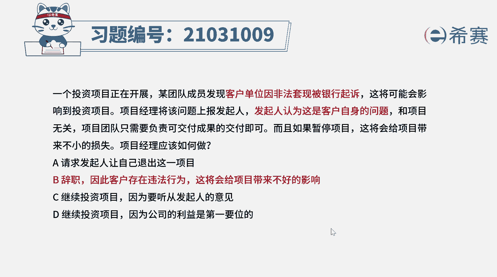
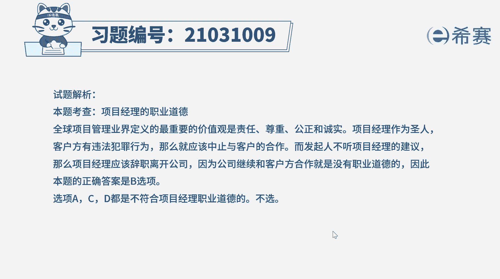

# （24年PMP）pmp项目管理考试零基础刷题视频教程-200道模拟题 - P30：30 - 冬x溪 - BV1S14y1U7Ce

一个投资项目正在开展，某团队成员发现客户单位因非法套现，被银行起诉，这将可能会影响到投资项目，项目经理将该问题上报发起人，发起人认为这是客户自身的问题，和项目无关。

项目团队只需要负责可交付成果的交付即可，而且如果暂停项目，这将会给项目带来不小的损失，项目经理应该如何做，a请求发起人让自己退出这一项目，b辞职，因为客户存在违法行为，这将给项目带来不好的影响。

c继续投资项目，因为要听从发起人的意见，d继续投资项目，因为公司的利益是第一要位的，好读完题目，找到题干中的关键词，客户单位因非法套现被银行起诉，但发起人认为这是客户自身的问题，和项目无关。

要继续项目为，项目经理应该怎么做，这道题考察的其实是项目经理的职业道德，全球项目管理业界定义的最重要的价值观，是责任，尊重公正和诚实，项目经理要做一个圣人，客户方有违法行为，应该直接终止与客户的合作。

题干中，发起人不听从项目经理的建议，项目经理就应该辞职，离开公司，继续和客户合作是没有职业道德的，因此本题的正确答案是b选项，注意项目经理现实的做法可能和考试不同，在pmp考试中，项目经理作为圣人。

违背职业道德的事是坚决不做的，再来看一下其他选项选项a客户方违法了，而发起人仍然坚持要做项目，侧面说明公司本身都是带有错误观念的，项目经理不能同流合污，所以正确的做法是辞职离开这个公司。

cd选项选项c和d继续项目的做法，不符合项目经理的职业道德，所以这两个选项的做法不合适好了。

我们此题先讲解到这里，大家可以自行参考一下相关的文字解析。

整个题目讲，接下来我们可以知道本题考察的知识点。

