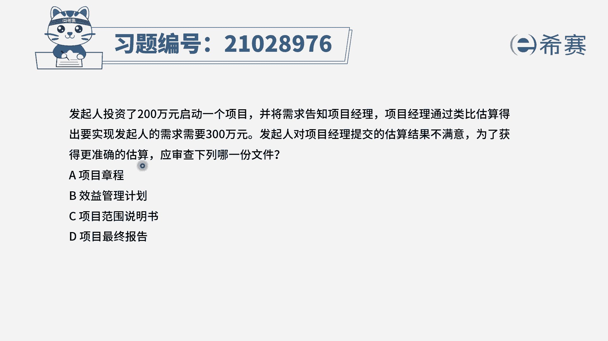

# （24年PMP）pmp项目管理考试零基础刷题视频教程-200道模拟题 - P34：34 - 冬x溪 - BV1S14y1U7Ce

发起人投资了200万元，启动一个项目，并将需求告知项目经理，项目经理通过类比估算得出，要实现发展的需求需要300万，发起对项目经理提交的估算结果不满意，为了获取更准确的估算，应该审查下列哪一项文件选项。

a项目章程选项b效益管理计划选项，c范围说明书选项d项目的最终报告，在这一题中，项目经理他首先是进行了类比估算，但是类比估算是非常粗略的，发起人不满意，现在提纲问，为了获取更准确的估算。

那么哪一种估算是准确估算呢。

我们先来回顾一下成本估算的几种方法，看一下他们的关键词，其中类比估算它是快速粗略的，必须要有类似项目作为对比，而参数估算是基于历史数据和参数模型，如果你的历史数据和参数模型是准确的，那么就是准确的。

如果你模型用错了或者历史数据不准确，那么就是不准确的，而自下而上估算它的关键词，就是基于我们已经明确的范围来做估算，它的准确性是非常高的，最后三点估算他考虑的是风险的一个不确定性。

那么在这个题目中，我们是不是就是为了获取更准确的估算，哪一种估算是最准确的，是自下而上估算，那么自下而上估算它的做法，我们是基于准确的范围，因此应该参考c选项范围说明书，来简单看一下其他几个选项。

a选项，项目章程，项目章程它是启动阶段的文件，并且它里面的内容都是属于高层级的，粗略的，并不能作为一个准确的范围，而b选项和d选项是属于干扰选项，它并不是我们估算时需要参考的文件。

