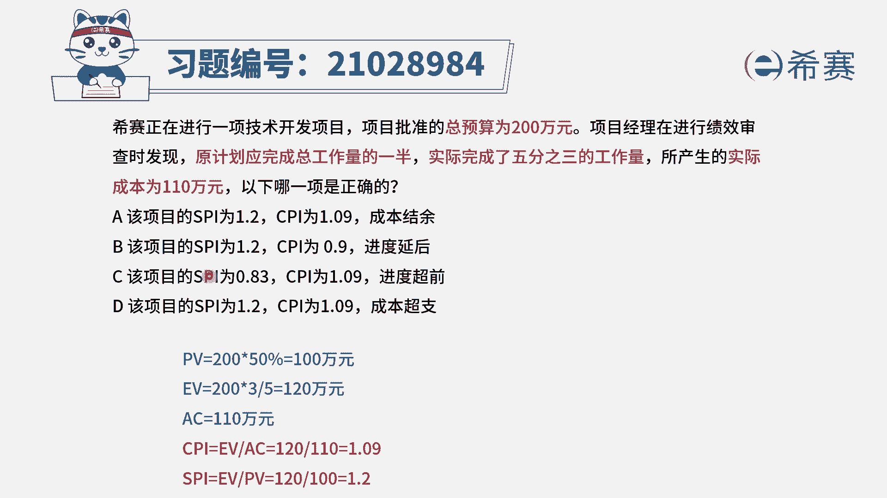
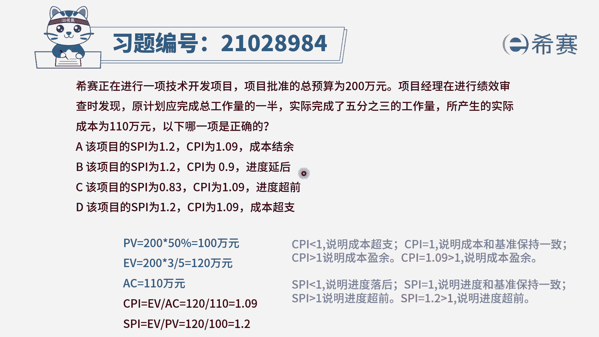
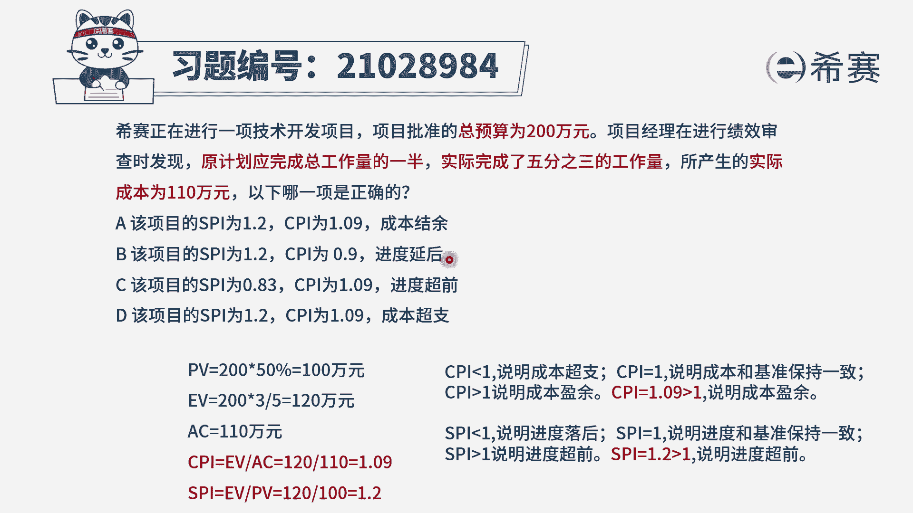
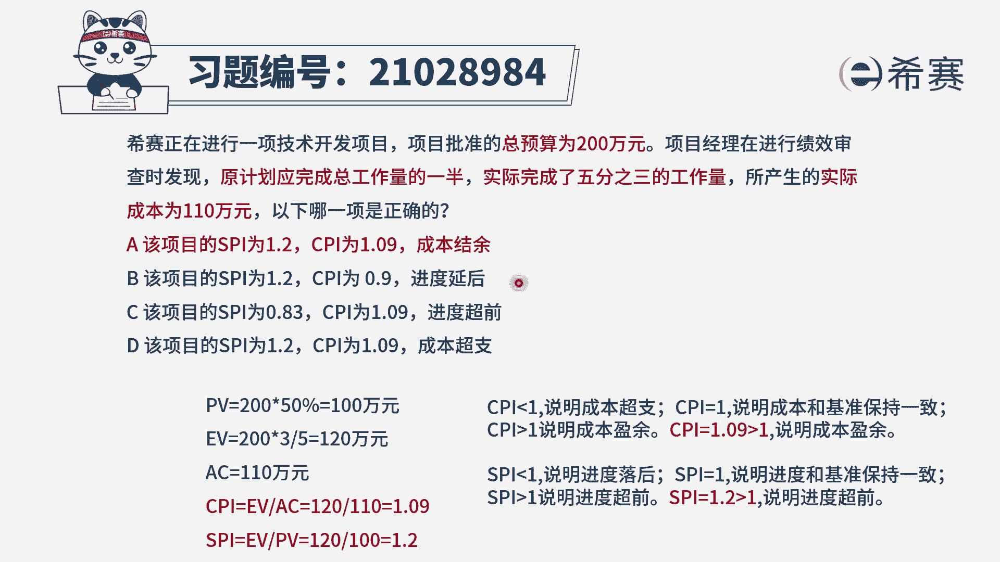
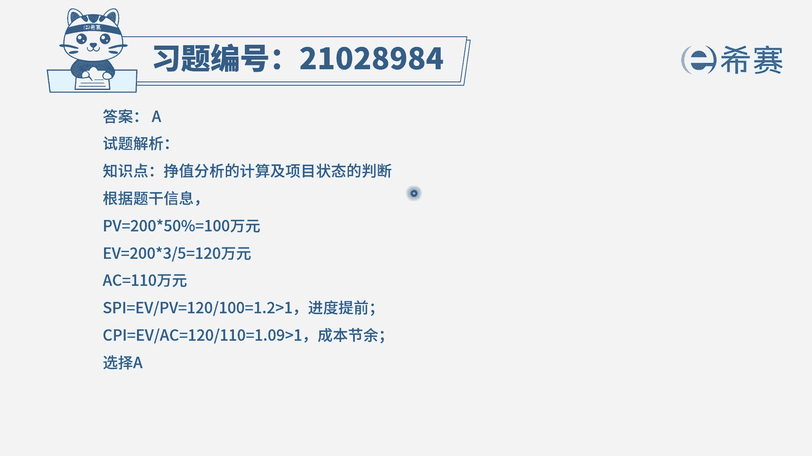
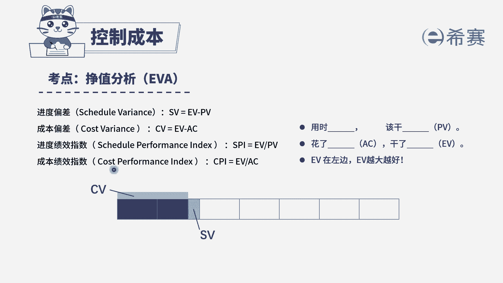

# （24年PMP）pmp项目管理考试零基础刷题视频教程-200道模拟题 - P35：35 - 冬x溪 - BV1S14y1U7Ce

西塞正在进行一项技术开发项目，项目批准的总预算为200万元，项目经理在进行绩效审查时发现，原计划应完成总工作量的一半，实际完成了3/5的工作量，所产生的实际成本为110万元，以下哪一项是正确的。

选项a该项目的spi为1。2，cpi为1。09，成本结余选项b该项目的spi为1。2，cpi为0。9，进度延后选项c该项目的spi为0。83，c p i为1。09，进度超前选项d该项目的spi为1。2。

cpi为1。09，成本超支，那么四个选项是给出了四种不同的进度，绩效指数和成本绩效指数，以及实际的一个项目状态，我们先来看一下题干给了哪些信息，如果我们要计算项目的一个技巧指数，需要三个数据。

分别是pv e v和ac，其中pv指的是计划价值，指的是在这个时间点，我们原计划打算花多少钱，看一下题干说原计划应该完成总工作量的一半，总工作量是200万，那么原计划我们在这个时间节点是完成一半。

也就是100万的量，因此pv是等于100万，再看ev正直正直是指我们实际完成了多少，实际完成了3/5的工作量，因此应该用总的2000000x3/5，ev等于120万，最后ac是指的实际成本。

我们实际花了多少钱，ac题干说等于110万，知道了三个数据之后，我们根据cpi和s p i的计算公式，可以得出cpi成本绩效指数是1。09，而spi而进度绩效指数pi为1。2。

通过计算我们可以排除c选项spi是错误的。

那么如何判断项目的状态呢，我们已知cpi和spi。

不管是s p i还是cpi，我们都是以一为基准，如果是一说明是符合计划的，越大越好，在这里cpi是1。09，它是大于一，因此成本是结余的，a选项正确，d选项错误，s p i是1。2，说明进度也是大于一。

也是比较好的状态，是超前了，因此b选项错误，综合分析下来。

四个选项中只有a选项是正确的。

大家可以看一下文字解析。

本题考察的是政治分析进度。

