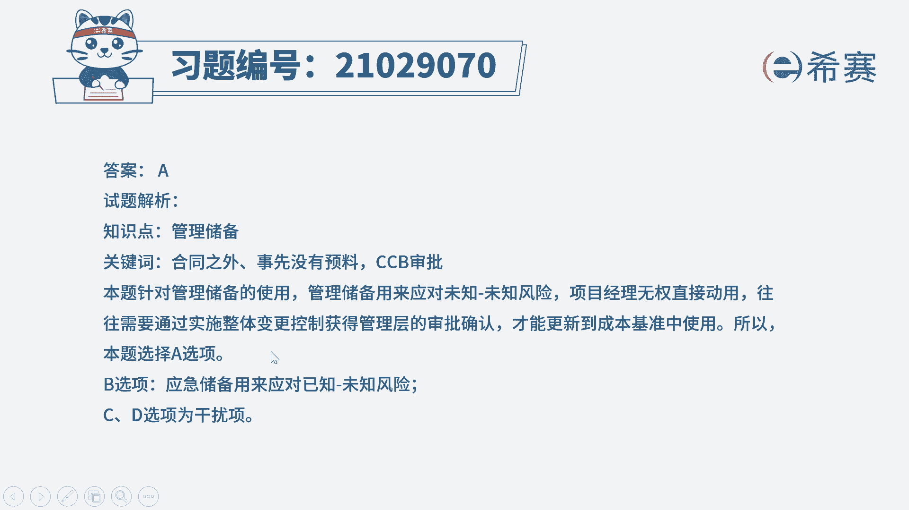

# （24年PMP）pmp项目管理考试零基础刷题视频教程-200道模拟题 - P36：36 - 冬x溪 - BV1S14y1U7Ce

已被任命为某项目的项目经理，在项目过程中，法规的更新，导致需要完成一项合同之外的功能要求，而你之前并没有预料到该法规的变动，于是你将此项变更请求提交到ccd并获得批准。

请问你应该从下列哪项储备中获取资金更新，项目预算选项a管理储备选项，b应急储备选项c客户储备选项d风险储备。

我们先来回顾一下项目预算的组成，首先我们在规划阶段进行了成本估算，由成本估算以及一些已识别的风险不确定性，需要具备的一些应急储备，由应急储备和成本估算，这两者构成了成本基准。

那么成本精准就是成本的一个基准线，因此应急储备它本身是包含在基准类，事先经过了批准，项目经理是可以直接使用的，而成本基准再加上管理储备，就构成了项目的预算，所以管理储备它是成本基准外的。

一旦我们要使用管理储备，就需要获得c c b的批准，先把管理储备挪到成本基准类，项目经理才有权使用。

我们回过头看一下题干，题干说没有预料到，说明这是一个未知未知的风险，我们事先没有想到，因此它对应的是管理储备，另外一个方面也可以证明，说明我们需要使用的这个储备是需要走流程的，项目经理无权直接使用的。

因此更加确定了我们应该是使用的管理储备，因此这一题选择a选项，简单的看一下其他选项，b选项应急储备，它是基准类的，不需要再次获得cc v的批准，c选项客户储备没有这种说法。

而d选项风险储备理论上来说没有这种说法，但是我们可以把它理解成是管理储备，和应急储备的一个总和，但是在这个题干中，我们只需要考虑管理储备，不需要考虑应急储备，所以d选项它也不完全是正确的。

因此这一题我们选择a选项。

