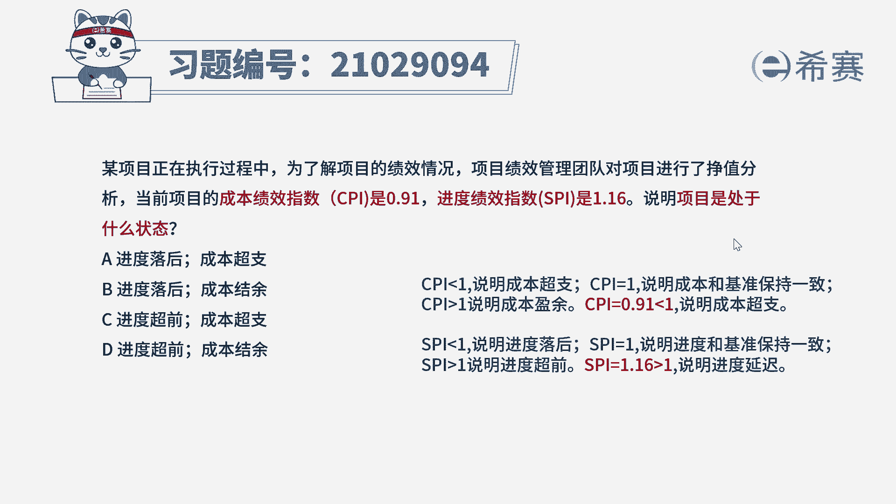
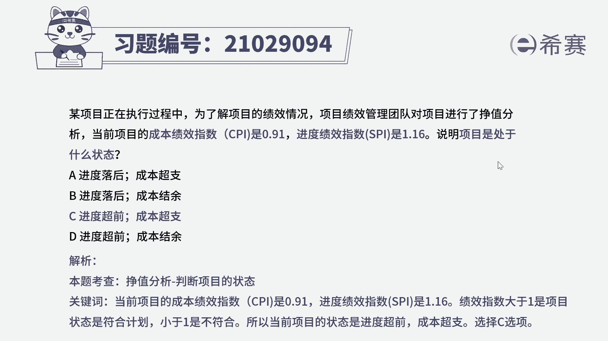

# （24年PMP）pmp项目管理考试零基础刷题视频教程-200道模拟题 - P37：37 - 冬x溪 - BV1S14y1U7Ce

某项目正在执行过程中，为了解项目的绩效情况，项目绩效管理团队对项目进行了政治分析，当前项目的成本绩效指数cpi是0。91，进度绩效指数pi是1。16，说明项目处于什么样的状态，a进度落后，成本超支。

第一进度落后，成本结余，c进度超前，成本超支，d进度超前成本结余，首先看到题干的关键词，成本绩效指数，cpi等于0。91，进度绩效指数s p i是1。16，题目问项目是处于什么样的状态。

由成本绩效指数公式我们可以知道，当cpi小于一的时候，说明成本与基准相比是超支的，当cpi等于一的时候，说明成本和基准保持一致，当cpi大于一时，说明成本与基准相比是盈余的，那么题干中cpi等于0。

91是小于一的，那么说明这个时候，项目的成本与基准相比是超支的，由进度绩效指数公式我们可以知道，当spi小于一时，说明项目进度和基准相比，进度是落后的，当spi等于一时，说明进度和进度基准保持一致。

当spi大于一时，说明项目进度超前于进度基准，那么题干中spi等于1。16是大于一的。

那么说明项目进度和进度基准相比是延迟的，因此我们可以直接选出，本题的正确选项是c选项，其他选项的描述与题干都是不符的。

那么本题的考察点是成本管理，控制成本政治分析的内容，政治分析是将实际进度和成本，绩效与绩效测量基准进行比较，可以实现判断现状和测量基准之间的偏差。

