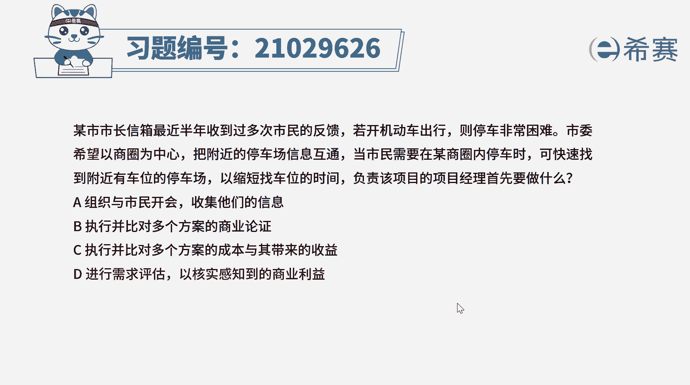
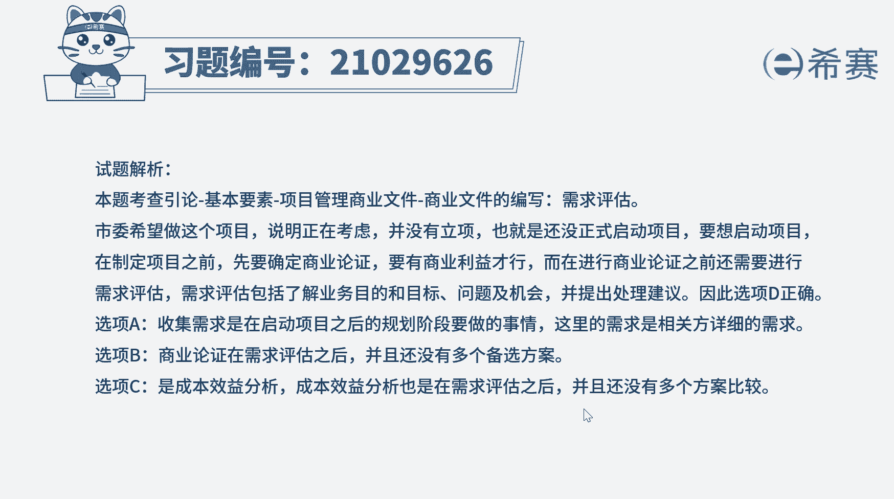
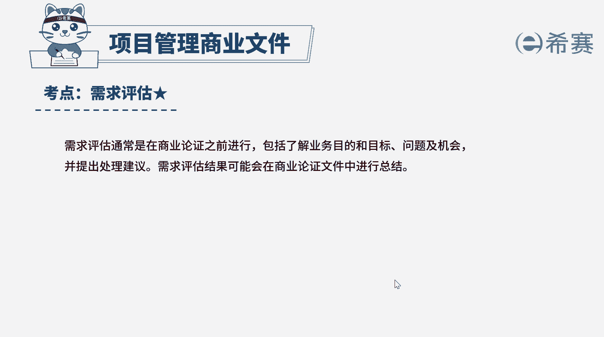

# （24年PMP）pmp项目管理考试零基础刷题视频教程-200道模拟题 - P4：4 - 冬x溪 - BV1S14y1U7Ce

若开机动车出行，则停车非常困难，把附近的停车场信息互通，但市民需要在某商圈内停车时，可快速找到附近有车位的停车场，以缩短找车位的时间，负责该项目的项目经理，首先要做什么，组织与市民开会，收集他们的信息。

b执行并比对多个方案的商业论证，c执行并比对多个方案的成本与其带来的收益，d进行需求评估，以何时感知到的商业利益好，读完题目，我们先找到题干中的关键词，问负责该项目的项目经理首先要做什么。

就是还在考虑这个项目，该项目还没有正式立项，也还没有正式启动，问的是首先要做什么，项目启动之前需要确定商业论证，就是进行可行性研究工作，分析项目的背景等因素，判断项目是否值得去做。

而进行商业论证之前还要进行需求评估，包括了解业务目的和目标问题及机会，并提出处理建议，因此本题的正确选项是d选项，进行需求评估，以何时感知到的商业利益，再来看一下其他选项，a选项收集市民的信息。

就是收集相关方案，对于项目详细的需求，收集需求，是在启动项目之后的规划阶段要做的事，这与题干给出的信息不符合，b选项提高问的首先做什么，需求评估在商业论证之前进行，而且题干并没有给出多个方案。

所以无法对比各个方案，b不太正确，c选项，效益分析是用来比较项目成本，与其带来收益的财务分析工具，这也是在需求评估之后进行的，题干中也没有给出多个方案的对比，所以c选项也要排除好了。

我们十道题就先讲解到这里，大家可以自行参考一下相关的文字解析。

整个题目讲解下来，我们可以知道本题考察的知识点就是项目管理。

