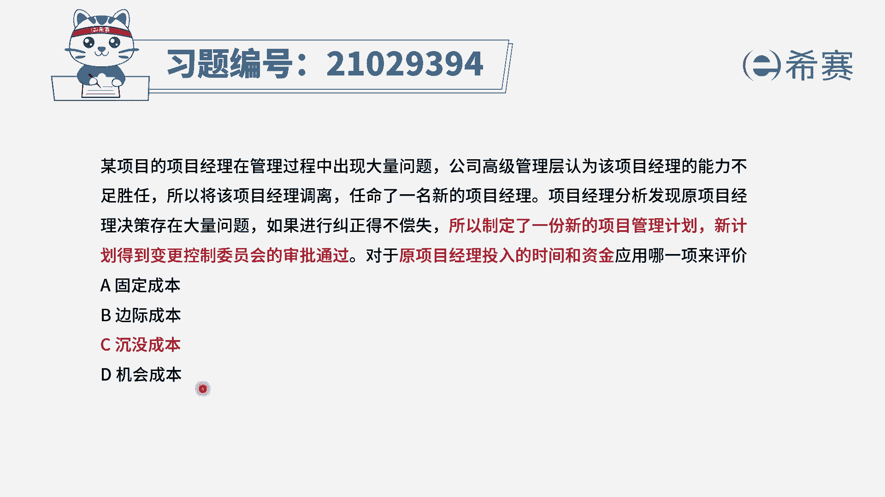
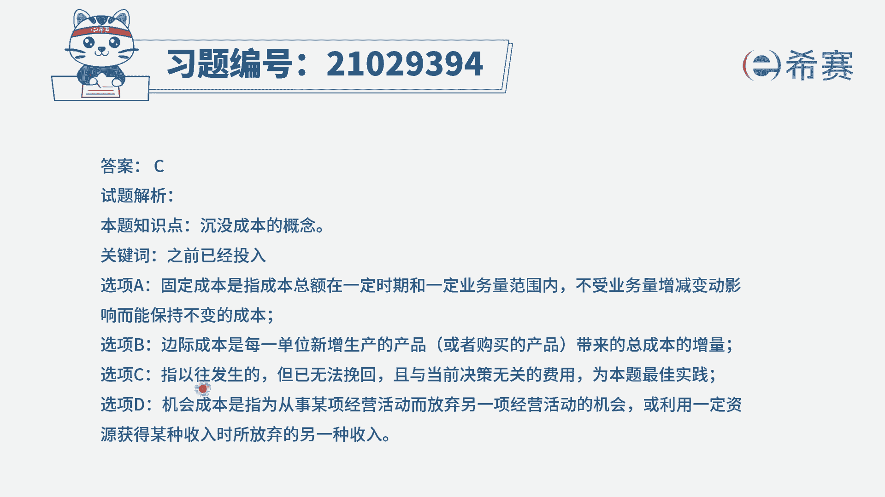
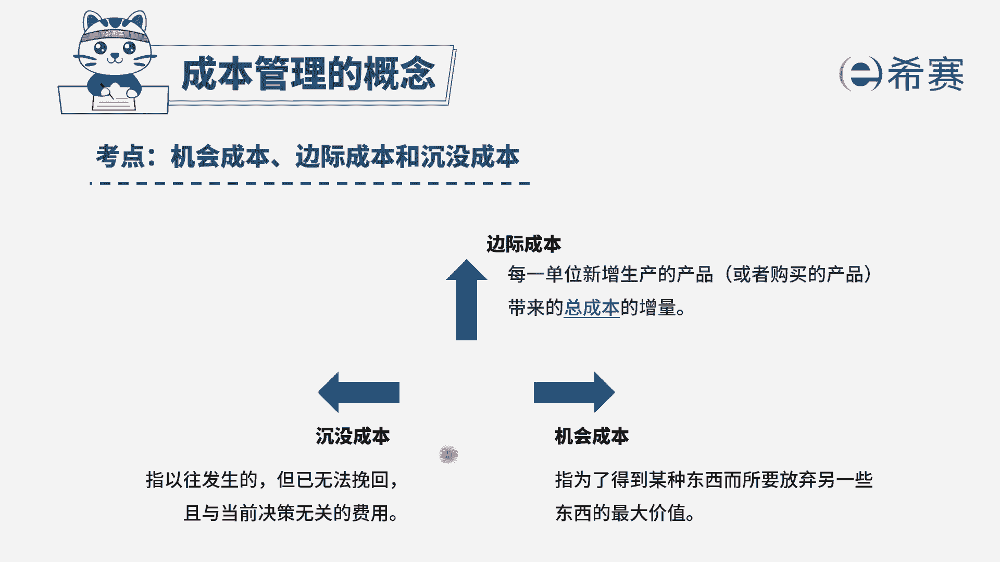

# （24年PMP）pmp项目管理考试零基础刷题视频教程-200道模拟题 - P40：40 - 冬x溪 - BV1S14y1U7Ce

某项目的项目经理在管理过程中出现大量问题，公司高级管理层认为，该项目经理的能力不足以胜任，所以将该项目经理调离，任命了一名新的项目经理，项目经理分析发现，原项目经理决策存在大量问题。

如果进行纠正得不偿失，所以制定了一份新的项目管理计划，新计划得到变更，控制委员会的审批，通过对于原项目经理投入的时间和资金，应用哪一项来评价，选项a固定成本选项b边际成本选项c。

沉没成本选项d机会成本好，我们先来看一下题干到底发生了什么问题，题干问的是原项目经理投入的时间和资金，原项目经理是不是已经制定了一个，项目管理计划，但是咱们的新项目经理发现他的决策是不对的。

如果要纠正的话，会有更多的一个付出，所以他干脆不要原来的计划，直接制定了新的计划，并且获得了变更控制委员会的通过，那么这个决定会带来什么影响，是不是语言项目经理他投入的时间资金，他制定的计划。

包括他做的决策都是白费的呀，这种情况是属于什么呢，我们把这种情况叫做沉没成本，沉没成本它是指我们以往发生的，并且已经无法挽回的跟当前决策无关的费用，因此这一题答案为c选项，举个例子。

比如说你今天正在等公交车，你等了半个小时还没有等到，然后你说啊，算了吧，我去打个车，这个时候你前面所花费的这半个小时，等待公交车的时间，是不是就是白白浪费了，这个我们就叫做沉没成本，这是沉没成本的概念。

我们再来分析一下其他几个选项，先来看a选项，固定成本，固定成本它是指成本的总额，在一定的时期和一定的业务量范围内，它是不会变动的，比如说你用一台机器去造一些包装，那么是不是你包装量越多。

你这个对应包装的成本就越多，所以包装成本是可变成本，那什么是固定成本，固定成本就是你这个机器不管你生产多少，理论情况下，你的这个设备的成本它是不变的，这个就叫做固定的成本，而b选项边际成本。

边际成本是指每一单位新增的产品，带来的总的一个产品的增量，跟题干是没有关系的，最后d选项机会成本，它是指我们选择方案a，那么我们放弃的那个方案b就叫做机会成本，因此四个选项中。

只有c选项是符合咱们的这个概念。

大家可以看一下文字解析。

本题考察的是成本的一个分类。

