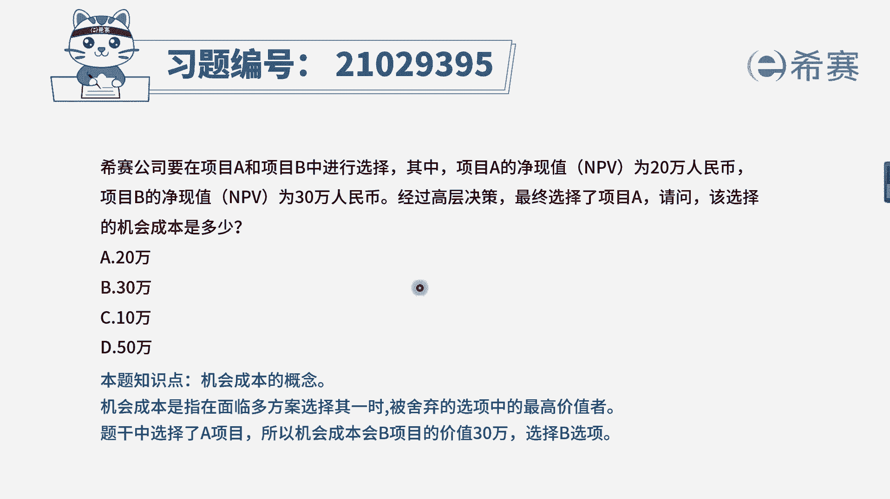
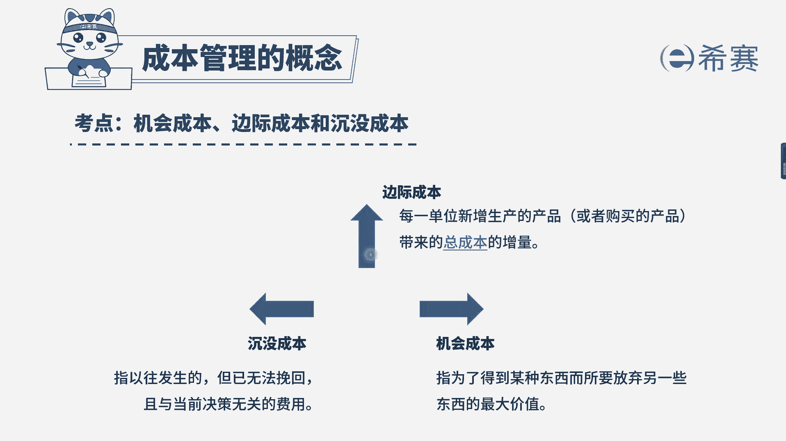

# （24年PMP）pmp项目管理考试零基础刷题视频教程-200道模拟题 - P41：41 - 冬x溪 - BV1S14y1U7Ce

现在公司要在项目a和项目b中进行选择，其中项目a的净现值为20万人民币，项目b的净现值为30万人民币，最终选择了项目a，请问该选择的机会成本是多少，选项a200000 选项b。

30万选项c 100000选项d500000 ，我们一起来看一下题干的关键词，现在我们是根据净现值来进行项目的选择，什么是净现值呢，净现值它指的是未来资金的一个流入的现值，与未来资金流出现值的一个差额。

相当于是说未来的收益与未来的成本，之间的一个差额，只能算成咱们现在的一个价值，这个概念大家了解一下即可，现在咱们是选择了项目a，问的是这个选择的机会成本是多少，机会成本是什么。

机会成本是说我们选择一个东西而放弃的，另外一个东西的最高价值，这里我们选择的是项目a，对应的我们放弃的就是项目b，而项目b的净现值为30万人民币，因此本题的答案为30万人民币，最后大家再来思考一下。

假设我们现在有三个项目，分别为10万，20万，30万，如果我选择了30万，这个时候咱们的机会成本是多少呢，到底是102000 10万还是这两者之和，这个时候就需要大家理解透，机会成本它的定义到底是什么。

机会成本是指我们在面临多个方案选其一时，被舍弃选项中的最高价值，我们选择了30万，是不是102000 10万都是被舍弃的，其中被舍弃的最高价值是20万，所以当出现三个或三个以上多个选择的时候。

被我们舍弃的选择中的最高价值，也就是机会成本好。

最后大家看一下文字解析。

本题考察的是成本管理成本的分类。

