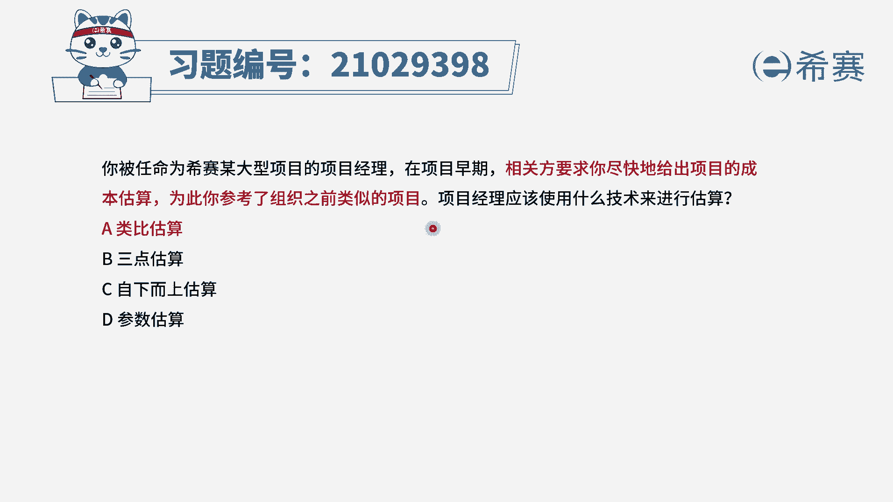
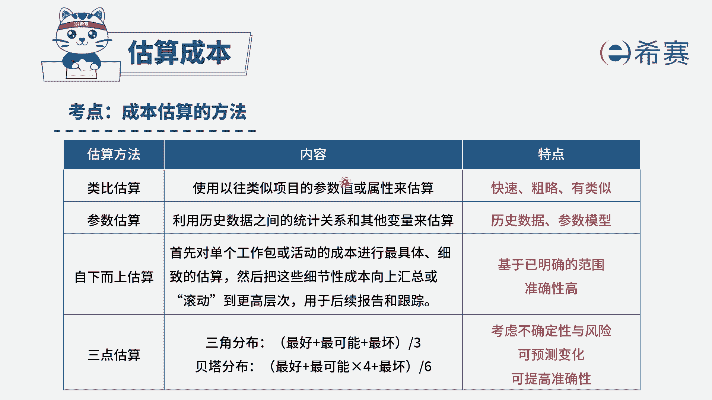

# （24年PMP）pmp项目管理考试零基础刷题视频教程-200道模拟题 - P44：44 - 冬x溪 - BV1S14y1U7Ce

你被任命为西塞某大型项目的项目经理，在项目早期，相关方要求你尽快的给出项目的成本估算，为此你参考了组织之前类似的项目，项目经理应该使用什么技术来进行估算，选项a类比估算选项b3 点估算选项c。

自下而上估算选项d参数估算，我们先来找关键词，在项目的早期，相关方要求你尽快的给出成本估算，也参考了组织之前类似的项目，是不是完美对应到了类比估算啊，因为类比估算它就是基于类似的项目。

进行一个快速粗略的估算，因此这一题选择a选项来简单看一下其他选项，b选项三点估算，三点估算的特点，它是考虑到项目的不确定性和风险，c选项自下而上估算是基于准确的w b s。

而并不是项目早期可以使用的一种方法，d选项参数估算是基于历史数据，它确实也会参考到历史数据，但是还不够，我们还需要有成熟的统计的模型，因此b c d选项，它们和题干的关联性没有那么强。

我们会优先选择a选项，类比估算。

大家可以看一下文字解析，本题考察的是项目成本管理，估算成本的几个方法。

