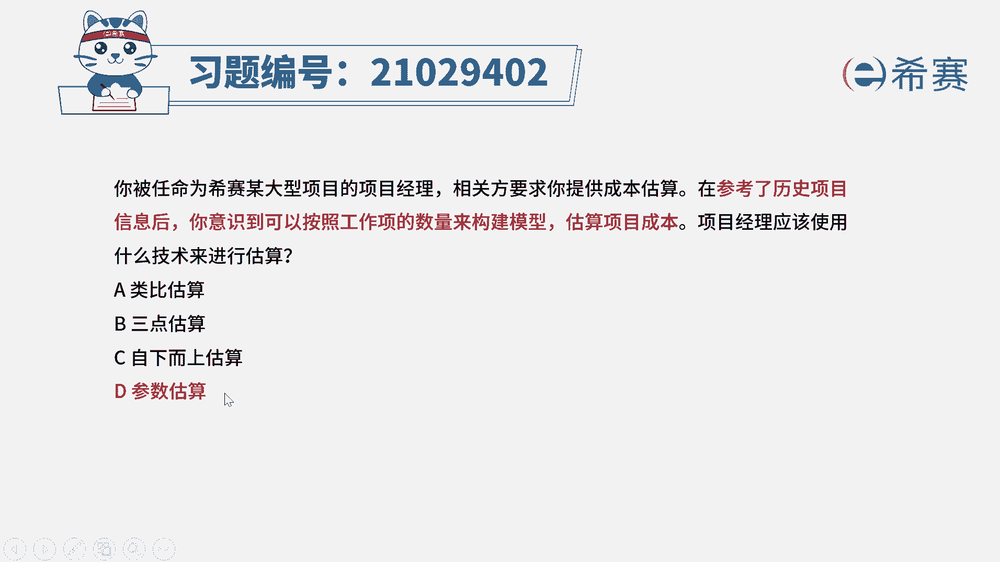
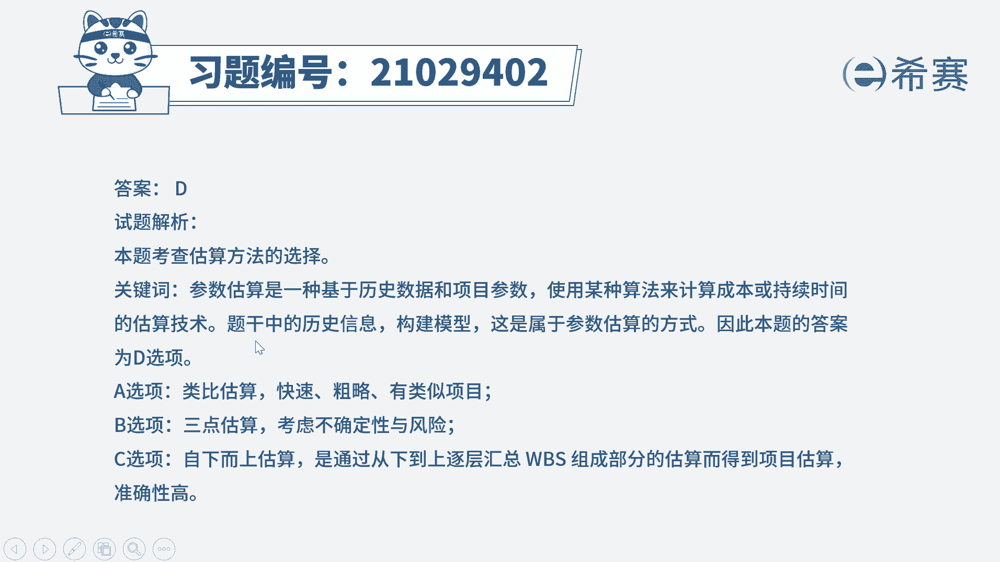
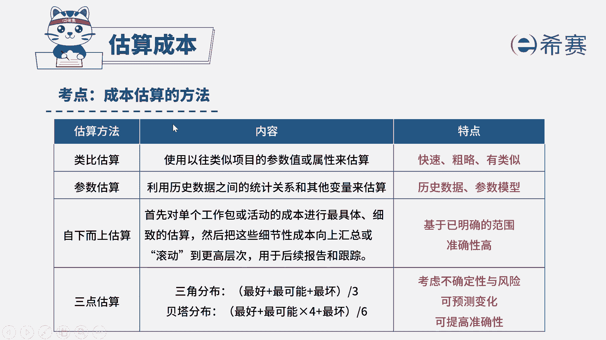

# （24年PMP）pmp项目管理考试零基础刷题视频教程-200道模拟题 - P47：47 - 冬x溪 - BV1S14y1U7Ce

你被任命为西塞某大型项目的项目经理，相关方要求你提供成本估算，在参考了历史项目信息后，你意识到可以按照工作项的数量来构建模型，估算项目成本，项目经理应该使用什么技术来进行估算，选项a类比估算选项b。

三点估算选项c，自下而上估算选项d参数估算好，我们先来找一下题干的关键词，项目经理，他使用到的这种估算方法，是不是参考了历史的项目信息，并且它是按照工作项的数量来构建模型，看到模型历史信息。

我们就应该很快的对应到参数估算，d选项是符合的参数估算，它是一种基于历史数据和项目的参数，使用某种算法模型来计算成本的一个估算技术，跟题干的描述是完全符合的，再来看一下其他几个选项，a选项类比估算。

类比估算它是一种快速的粗略的攻略方法，它有一个必要条件，就是必须要有类似的项目进行参考，同学们一定要注意题干，他仅仅只说了历史项目信息，并没有说是类似的类比估算，它必须要基于类似的项目，举个例子。

如果你之前做过一个汽车生产的项目，你现在要做一个房屋建造的项目，这两个项目之间他们就不能去类比，因为性质是不一样的，所以a选项是不合适的，再来看b选项，三点估算。

三点估算它是考虑项目的一个不确定性和风险，但是在题干中我们没有提及到有风险不确定性，所以没有足够的信息依据支持我们选择b选项，c选项也是同理，自下而上估算，它是基于wb s从下往上进行一个精细的估算。

题干中也没有相关的信息支持，我们选择c选项，因此综合分析下来，我们应该选择和题干关联性最大的选项，选择d选项参数估算。

大家可以看一下文字解析部分，本题考察的是项目成本管理。

