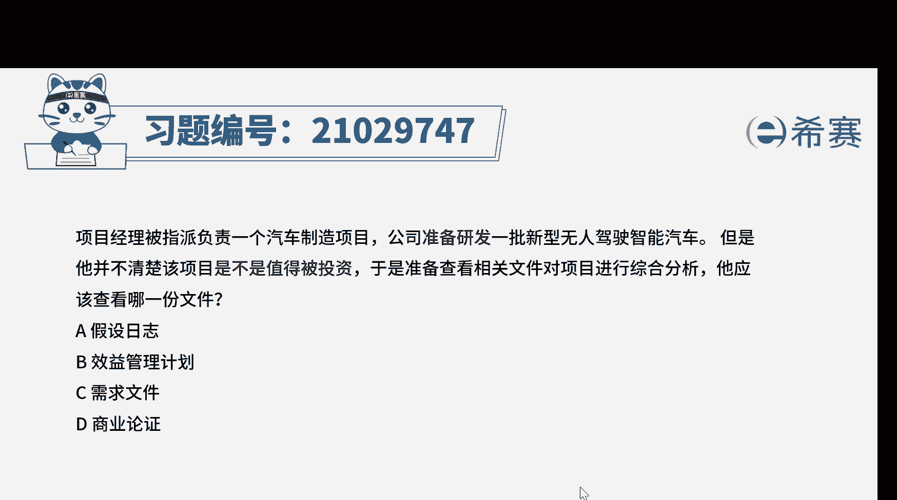
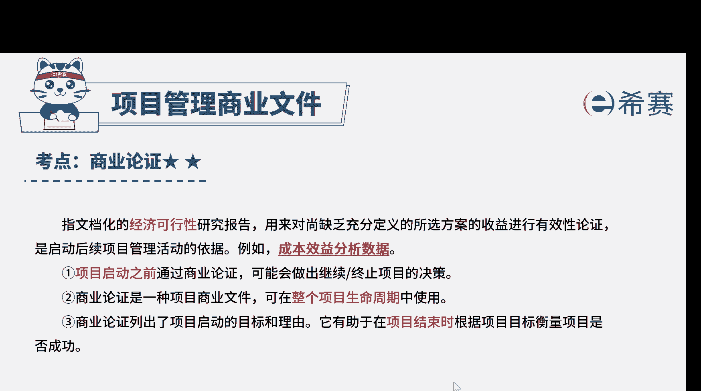

# （24年PMP）pmp项目管理考试零基础刷题视频教程-200道模拟题 - P5：5 - 冬x溪 - BV1S14y1U7Ce

项目经理被指派负责一个汽车制造项目，公司准备研发一批新型无人驾驶智能汽车，但是他并不清楚该项目是不是值得被投资，于是准备查看相关文件，对项目进行综合分析，他应该查看哪一份文件，a假设日志b效益管理计划。

c需求文件d商业论证好，我们读完题目，找到题干中的关键词，准备研发一款无人驾驶汽车，但项目经理想了解项目值不值得被投资，问查看哪一份文件，我们来综合看一下四个选项，选项a假设日志。

它是用来记录整个项目生命周期中，所有假设条件和制约因素，题干中并没有给出，假设条件和制约因素的相关信息，所以a选项肯定要排除选项b效益管理计划，它描述的是项目实现效益的方式和时间。

以及应制定的效益权衡机制，那题干中问的是项目有没有效益是否可行啊，而不是问我们如何去实现效益，现在查看这份文件有点为时过早，选项c需求文件，它描述的是各种单一的需求，将如何满足与项目相关的业务需求。

题干中并没有涉及与需求相关的信息，所以c选项也不正确，那d选项商业论证，它指的就是对将要实时项目在技术上的先进性，成熟性啊，经济上的合理性，执行上的可能性，风险性等进行全面科学的综合分析。

为项目决策提供客观依据的一种技术，经济研究活动，它就是用来确定项目是否实时的依据，其实如果对四个文件有一些了解，那么这道题就比较容易好，我们这道题就先讲解到这里。

大家可以看一下相关的文字解析，整个题目讲解下来，我们可以知道本题考察的对应知识点就是，项目管理，商业文件。

