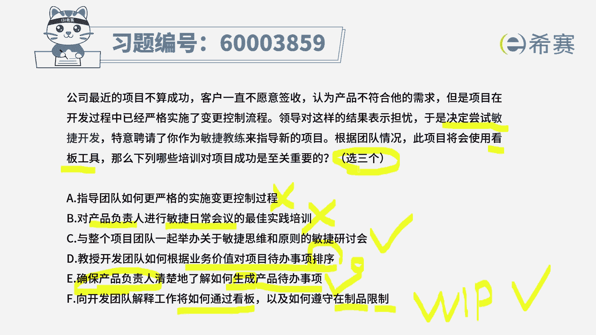
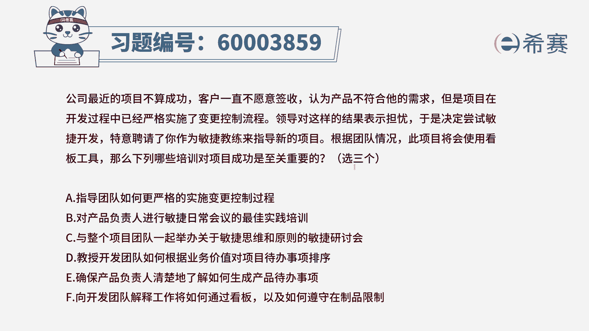

# （24年PMP）pmp项目管理考试零基础刷题视频教程-200道模拟题 - P55：55 - 冬x溪 - BV1S14y1U7Ce

公司最近的项目不算成功，客户一直不愿意签收，认为产品不符合他的需求，但是项目在开发过程中已经严格实施了，变更控制流程，领导对这样的结果表示担忧，于是决定尝试敏捷开发。

特意聘请了你作为敏捷教练来指导新的项目，根据团的情况，此项目将会使用看板工具，那么下列哪些培训对项目成功是至关重要的，有三个正确答案好，我们来看一下这六个选项中的三个正确答案，首先我们通过这道题。

知道现在已经开始要尝试用敏捷的方式来开发，然后呢给大家提供的这样一些培训呢，应该也是偏向于往敏捷方向走的培训，那来看一下这六个选项，选项a说是指导团队如何更严格的去遵循，变更控制。

这个一看就是错误的对吧，因为在敏捷里面，我们是要去拥抱变化，不会是按照结构化项目管理，按照预测型的方式来管理，项目中有变更，走流程的方式，而是客户有任何的这样一些需求，有变更，有反馈都可以提过来。

我们有一套流程和措施来去应对和解决，所以不是去严格的把控啊，这个就是首先错了，排除第二个，对产品负责人进行，迎接日常会议的最佳时间培训，请注意哦，敏捷产品负责人，他一般来讲会参加这个敏捷日常会议吗。

所谓的敏捷日常会议，我们也叫站会，那这会呢其实产品负责人他是可以不参加的，团队成员自己参加就好，敏捷教练可以参与，可以旁听，也可以不听，但是你得要让大家知道并会，所以呢这个选项也错了，也排除哇。

一下排了两个以后，那么就还剩一个可以排出的对吧，这个题目就选出来了，那我们就看一下四个选项中还有哪个可以排除，选项c与整个项目团队一起来举办，关于敏捷思维和原则的敏捷研讨会，那这个一看就是对的对吧。

想都不用想，肯定是对的，因为以前都是用结构化来用预测的方式来管理，现在呢决定尝试又敏捷，所以我们现在要去对这种基本理论知识来进行，培训好，第四个选项，教授开发团队。

如何根据业务价值来对项目代办事项进行排序，首先呃教大家怎么样能够去通过业务，大业务价值来进行排序，这个本身没有错，ok他本身没有错，但是我们知道一个点谁负责，对于这样一些产品待办事项。

列表中的这样一些事项来进行排序，谁来负责产品负责人product owner这个角色，对不对，所以呢这个题目的话呢应该说可以不选，但如果像别的东西有更错的呢，也可以选它，为什么会是这样一个情况。

然后解释一下，通常情况下是由p o来去负责，但是p o在做这些排序的时候，他完全是自己一个人说了算吗，是自己一个人亲自去完成所有的事情吗，很显然也不是，他也需要大家的一些呃支持配合贡献。

所以呢其实做这个事情的时候，应该是大家一起来可以共同去做，但是由p o来说了算，由po来最终拍板做决策，所以这个呢它不完全正确，但是呢你也不能说他就绝对错误，如果说还有更错的离谱的。

我们也可以把它做对的选项，是这个意思啊，所以呢做一个小标记好，再看到第五个，确保产品负责人清楚地了解，如何生成产品待办事项列表，诶这个就比较明确，是对的，产品负责人，他对产品待办事项列表的生成来负责。

这是对的啊，这是对的啊，这句话肯定是对的，最后一句向开发团队解释工作将如何通过看板，以及如何遵守那个在制品限制，这一看就是对的，对不对，因为题目中明确告诉你会使用什么样，它说明确会使用看板工具。

而看板工具呢，那我们肯定要知道怎么样使用看板，并且在看板中有一个很重要的点，就是关于限制在制品呃，他这边把那个限制品换翻译的时候，把它翻译的反过来叫再制品限制，或者也可能叫约束再制品。

其实说的是一回事啊，就是working process w i p，所以呢这个是正确的，那这样看下来的话，既然c ef是正确的，而题目中告诉你只选三个，那么就选他们呢，所以在这种情况下。

d选项我们就不要选进来了，如果说后面的题目，你那个选项中有一个特别错的离谱的，那我们就可以把d选项选进来，是这样的一个套路，你明白，所以说考最佳时间，最佳时间要稍微有一点点灵活的方式来去应对。

不能够太死板了啊。

所以这个题目答案呢是选c ef。

