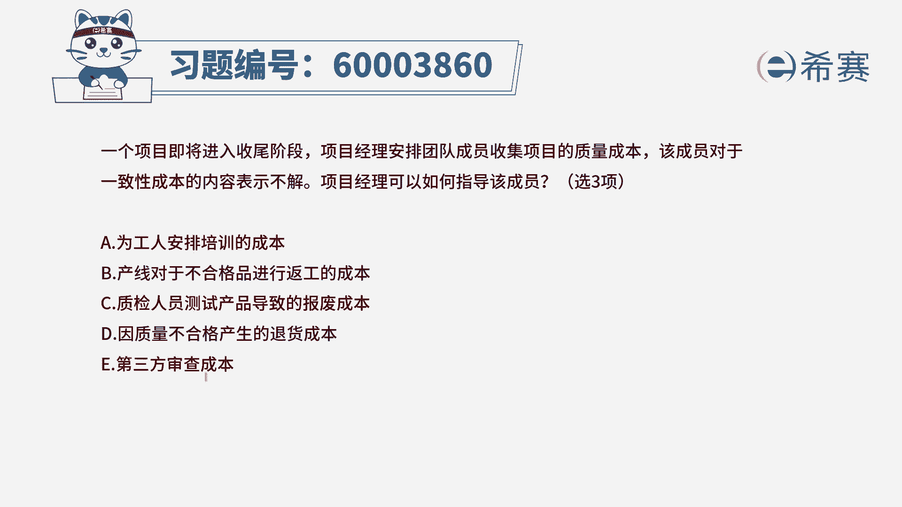
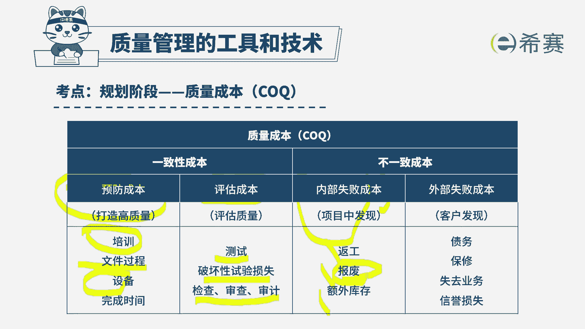
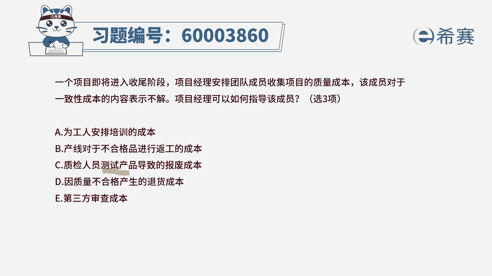
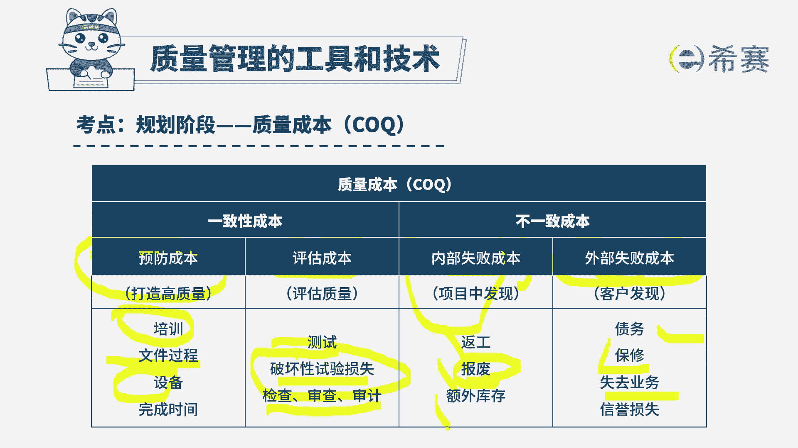

# （24年PMP）pmp项目管理考试零基础刷题视频教程-200道模拟题 - P56：56 - 冬x溪 - BV1S14y1U7Ce

一个项目即将进入收尾阶段，项目经理安排团队成员收集项目的质量成本，该成员对于一致性成本的内容表示不解，项目经理可以如何指导该成员，那有三个正确答案好，我们一起来看一下这个选项。

首先它其实关注的焦点就是一致性成本，那么你想一想，质量成本中包含一次性成本和不一致性成本，或者非一致性成本，对，一次性成本是我们想要让这个产品的质量达标，我们所做出的努力，可能是在前期的时候。

我们去做一些培训呢，呃做一些准备性的工作呀，买好的设备呀，以及包括是在做的过程中，我们可能需要对它进行检查呀，测试呀，审查呀，这都算是一次性成本，而不宜资金成本呢，通常来讲就是在事后做完了以后又要返工。

卖出去以后必要产品召回这种导致的费用，这是不一致性成本，那我们分别来看一下这五个选项，选项a呢是为工人安排的培训，这一看就是对的对吧，培训肯定是对的好，第二个呢，产线对于不合格产品进行反攻，请注意哦。

诶这是做完了以后发现又不行，又要拿回去返工，这属于内部的失败成本啊，这个就不能选选项c，质检人员测试产品导致的报废，那么请注意测试以及包括破坏性测试，它都是属于一致性成本选项。

d因为质量不合格导致的退货，请注意，这肯定是这是外部失败成本，都东西都卖出去了以后，然后客户又把它给退回来，这属于外部的失败成本，好最后一个选项由第三方来进行审查的成本，那么这样一看下来的话。

就只是a c e这三个选项，答案就选a c一了。

那关于成本呢，你看到在前期做一些预防，在产品还没有开始之前，我提前做一些准备性的工作，比方说诶给大家做培训啊，用最好的设备提前做各种准备性的工作，以及包括说在在做项目的过程中，有这样一些评估的成本啊。

对它进行测试，包括破坏性测试，对它进行检查审查，而不一致性成本一个词叫内部的失败成本，就是我们项目都已经完成了以后呢，发现这里有问题有问题，有问题可能是包括报废呀，要返工啊之类的。

那这里有一个句话你需要去了解啊，虽然这里给了一个词叫报废，它是属于内部失败成本，但是这个报废通常说的是，我做完了以后发现没有什么卵用，才叫报废，而咱们题干中说的是。

因为测试导致这东西没有价值，导致它报废。

那这个测试导致的报废呢，它是属于这种叫破坏性测试，所以它是属于这个地方好，那么再回到这个不一致性成本，除了有内部失败成本，还有外部的失败成本，就包括说东西卖出去以后要重新去返修啊。

然后可能会导致客户的呃，让你各种保修啊，退回呀，然后失去业务啊之类的都算好，所以呢这个题目答案呢就是a c e，那如果说你想看解析的话呢。

