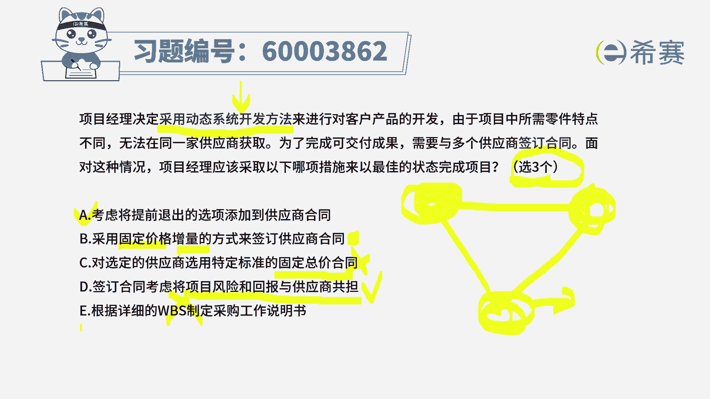
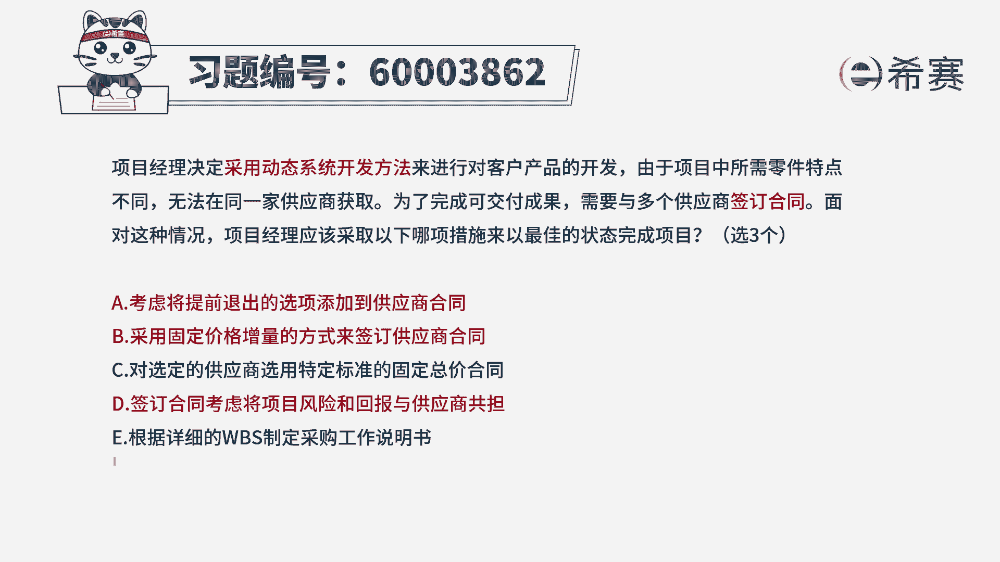
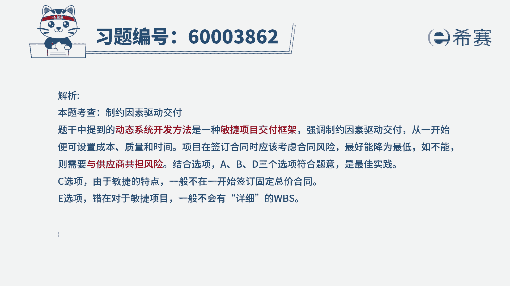

# （24年PMP）pmp项目管理考试零基础刷题视频教程-200道模拟题 - P57：57 - 冬x溪 - BV1S14y1U7Ce

项目经理决定采用动态系统开发方法，来进行对客户产品的开发，由于项目中所需零件特点不同，无法在同一家供应商获取，为了完成可交付成果，需要与多个供应商来签订合同，面对这种情况，项目经理应该采取以下哪项措施。

以最佳的状态来完成项目，那这里面呢给了五个选项，我们先简单来看一下啊，选项一说是考虑将提前退出的选项，添加到供应商合同里面，你一看这句话好像就是正确的，对不对，这句话一看就是正确的啊。

所以他肯定是可以选的，因为不管在任何情形下，都是我们在合同里面都要给出这些退出标准，也就是说是万一遇到什么特殊情形，那我们这个项目就可以终止了，好第二个选项，采用固定价格增量的方式来签订合同。

这里面有一个点需要去了解，就是因为我们这个题干中，给的是叫采用动态系统开发方法，什么叫采用动态系统开发方法呢，嗯你如果说有印象的话，我们在讲敏捷部分的时候，在最后一个就是其他的这种敏捷实践的时候。

其实是有提过一嘴，关于动态系统开发方法，它其实讲到的是什么，也就是在敏捷中，我们的范围是不确定的，是可以变动的，是没有锁定的，但是我们的时间进度时间是锁定了，并且呢我们的成本基本上也锁定了。

那么在这种情形下，我们要做的内容是可以去调整改进的，所以它其实是会倾向于一种敏捷的方式，可能会有适当的变化，调整的方式，有了这样一个认知以后，我们再来看一下后面的选项，我们刚刚说过。

第一个选项肯定是可以选的，对吧好，第二个选项说是采用固定价格，加增量的这种方式，诶，这个看上去好像可以哦，就是如果说有一些东西是确定的，那我就用固定价格，同时有一些东西我不太确定。

可能会根据我的具体情况来，如果多做一些，我就要多付一些费用，这也是说得通的，所以它应该作为一个候选项对吧，好选项选项c，对选定的供应商采用特定的标准的，固定总价合同，请注意要固定总价合同。

我们一般来讲只有三办理，一类是固定总价合同，一类是总价加上激励费用合同，还有一个呢是总价加经济价格调整合同，那其中固定总量就不用说了，他肯定是不适用于这种方式，然后呢总价加激励呢。

它其实也不适用于这种方式，因为总价加激励，他是明确我们要做东西的范围是确定的，而那个总价加经期价格调整，它适用于在周期很长，或者说可能会有这种呃，多国之间有这样一种外汇，外币的这种呃更换。

所以呢都不适合这样一个场景，所以c选项呢就不应该是它的正确选项，好啊，第四个，签订合同会考虑到将项目的风险和回报，与供应商共担诶，这是一种可行的，因为整个在偏敏捷的这种方式里面。

它就会强调是我们去互惠互利的方式，我们去拥抱变化胜过遵循计划的方式，那我为什么要去拥抱变化，我能够为你带来好处，同时你要为我带来金钱，所以呢这个选项是正确的好，最后一个根据详细的工作分解结构。

来制定这个采购工作说明书，那题目中已经明确告诉你，采用动态系统开发方法，它跟这个是相背离，所以呢这个不选，那这样看下来，因为题干中明确告诉你有三个答案可以选，而在其中c和e不能选，那就只有a b d。

所以这道题目的答案呢选a b d。

这三个选项刚刚都已经解释过一遍，不再赘述。

那详细的解析呢在后面。

