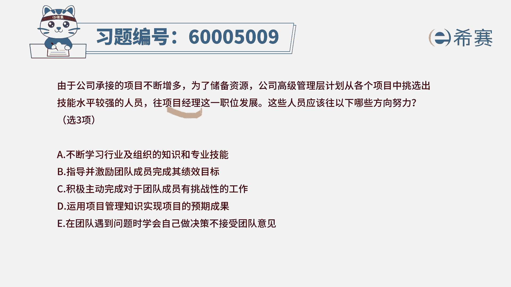

# （24年PMP）pmp项目管理考试零基础刷题视频教程-200道模拟题 - P62：62 - 冬x溪 - BV1S14y1U7Ce

由于公司承接的项目不断增多，未来储备资源，公司高级管理层计划，从各个项目中挑选出技能水平较强的人员，玩项目经理这一职位发展，那这些人员应该往以下哪些方向来努力，其实这个就是说什么，就是说我们说一般来讲。

项目经理你可能需要具备哪一些方面的技能，其中这个技能中还包括一条，说是技术水平比较强的人，他来去做项目经理好，那我们就看一下四个选项，选项a，不断的去学习行业以及组织的，这些知识和专业技能。

这肯定是需要的对吧，毫无疑问肯定是需要的，第二个能够指导并激励团队成员，去完成其绩效目标，哎这肯定也是需要的，因为你作为一个项目经理，作为一个领导，你不能所有的事情都亲力亲为，你能够去激励大家。

能够去带动大家，这也是很重要的一个技能，这是一种管理技能选项，c积极主动去完成，对于项目团队成员有挑战性的工作，那这个呢其实他如果有他更好，但是他不会做一个绝对的选项，因为很多时候，我们不能说。

所有的事情都全部由我一个人来去做，我应该是带着大家一起去做，引导大家一起去完成会更好一些，但是如果说我有这个水平和能力，能够去身先士卒，能够去冲锋陷阵，肯定也是很好的，但是往后面去走的话。

因为是要挑出更多的人来去玩，这个管理型的人才，往这一个项目经理的方向去发展，所以很多时候管理这一部分更重要一些，所以它可以作为一个不能说他错，但不是那么好好，接下来看第四个。

运用项目管理知识来实现项目的预期效果，这不就是摆明了就是告诉你这个答案对吧，你说麻烦你把答案写出来对吧，d选项肯定是正确的，而题干中明确告诉你只有三个选项，那么这就已经明确了，abd是要选的。

来最后一条在团队遇到问题的时候，要学会自己做决策，而不接受团队成员的这个意见，前半句没有问题啊，请注意前半句没有问题，但遇到问题的时候，你要做决策，但是同时你不能不听大家的意见，大家的意见也是很重要的。

ok所以这个后面的说法是错误的。

错误的，那么这样看来的话，答案选a b d c选项，你不能说他就觉得错了，只是说它的重要性在此处没有那么的重要，因为你是要往项目经理这个岗位去发展的，你更多的是需要有这种管理的技能，你既要有专业技能。

也要带领团队，影响团队。

激励团队的这种技能啊。

