# （24年PMP）pmp项目管理考试零基础刷题视频教程-200道模拟题 - P63：63 - 冬x溪 - BV1S14y1U7Ce

在一家职能型的公司中，项目经理正在进行一款新软件的开发项目，客户提出需要增加一项必要的新功能，而这会使得完工日期推迟三个月，那么这项变更应该由谁来负责批准。

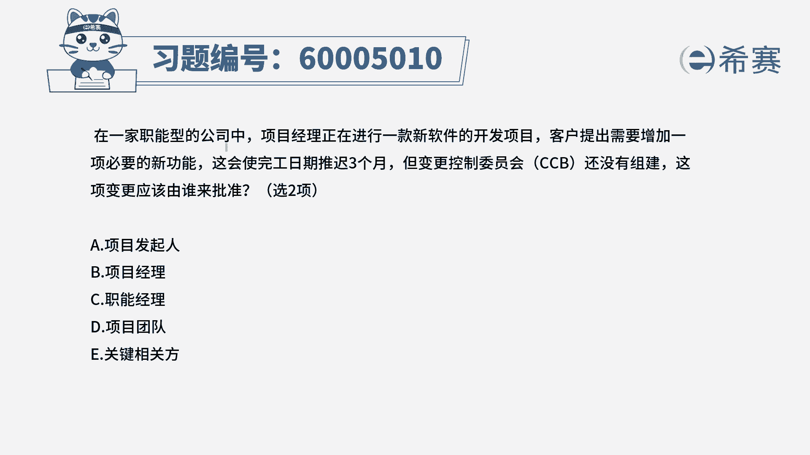

他说答案是有两个选项，那这里有几个词，你稍微需要去了解一下，一个是这个公司呢，它是一个职能型的公司，在职能型的公司谁的权限比较大，职能经理啊，职能经理就是你的部门经理，他的权力比较大好，第二个呢。

就是他说这个项目的c c b，还没有组件的情况下。

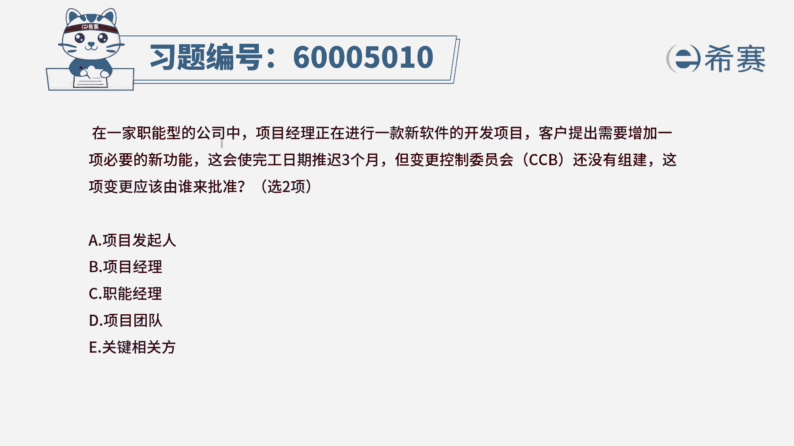

除了职能经理，还有一个很重要的人叫什么叫发起人发钱。

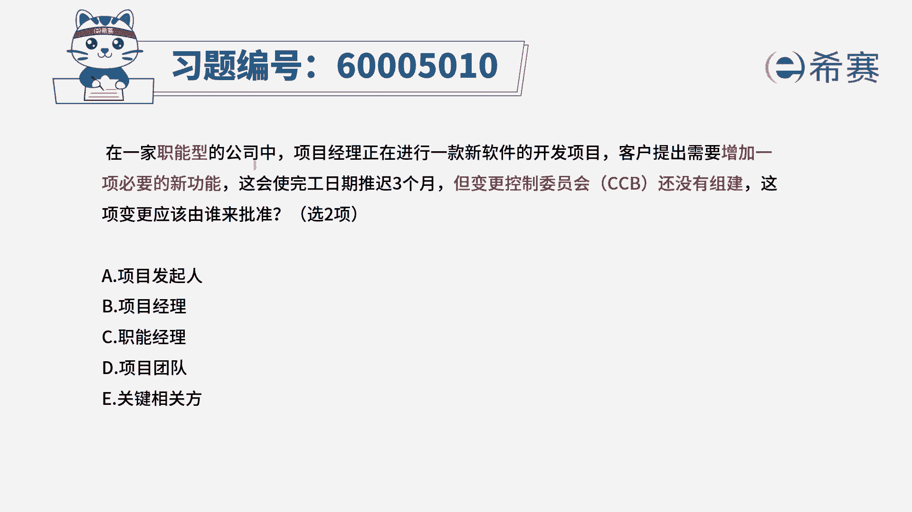

他是为这个项目来提供资金和资源的，这样一个金主爸爸。

所以呢他有话语权，而题目中告诉你，明确告诉你只有两个选项的情况下。

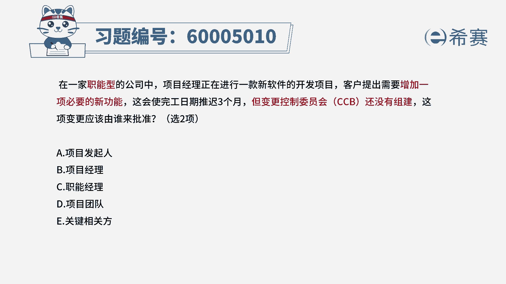

那么就选他们两个了，所以就是选他们两个。

所以答案是选a c啊，项目经理在这种职能型中呢，它是没有什么太多权利的。

嗯你不太有话语权利的，话语权不及职能经理，项目团队成员连项目经理都没有话语权。

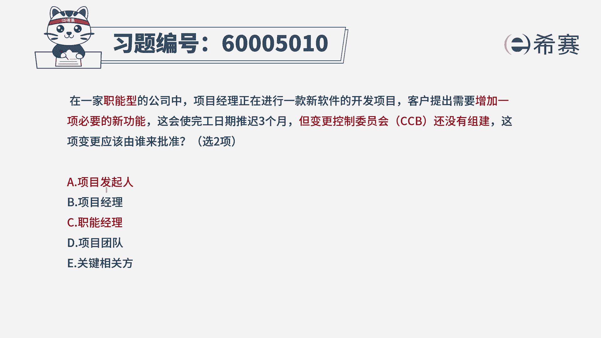

那么项目团队成员就更加不用说了，至于说最后一个选项。

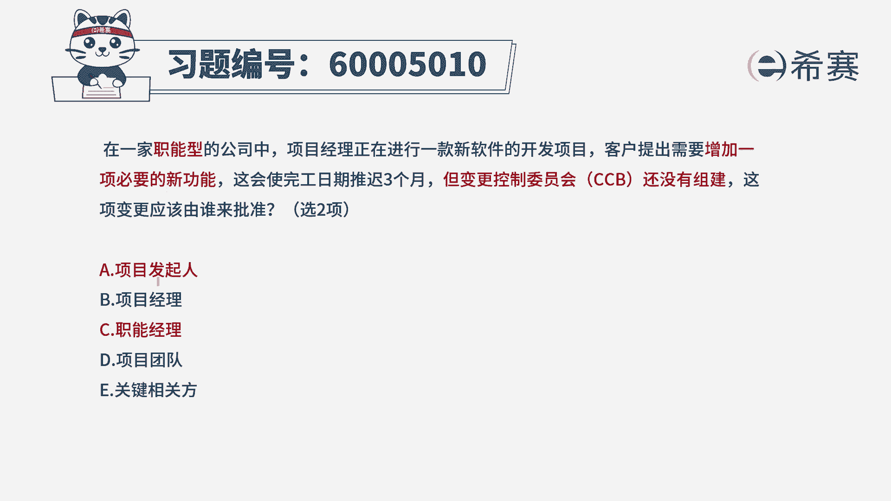

关键相关方其实在某种程度上来讲，它是可以选的。

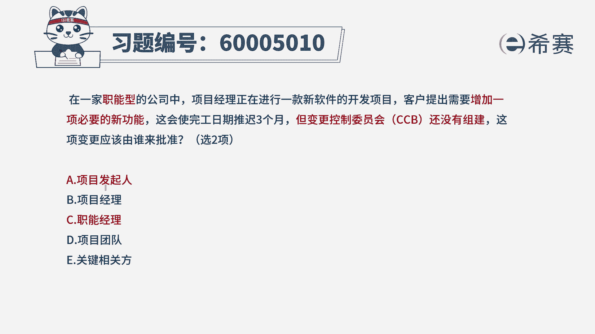

但是因为他没有去具象的来去说明，哪一些是关键相关方，而在这里的话。

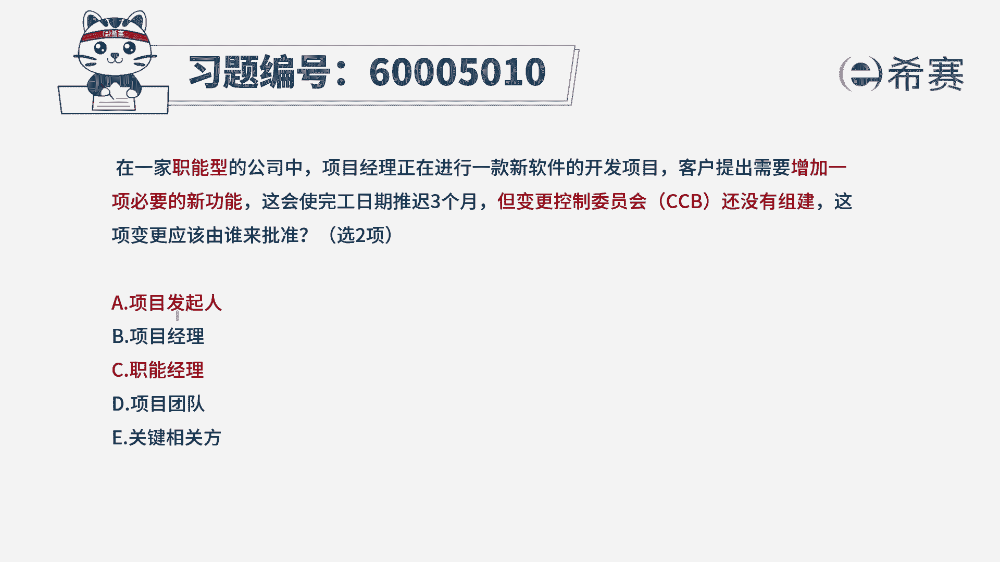

a和c它都是明确的关键相关方，那么所以优先选这个很明确确定的这两个。

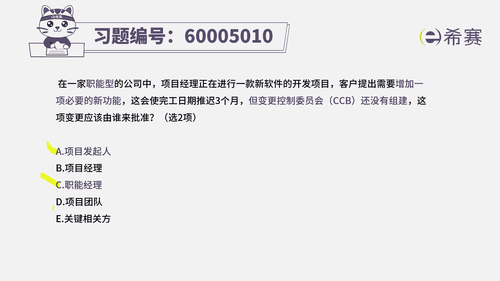

如果说这个题目他非得要说选三个选项的话呢。

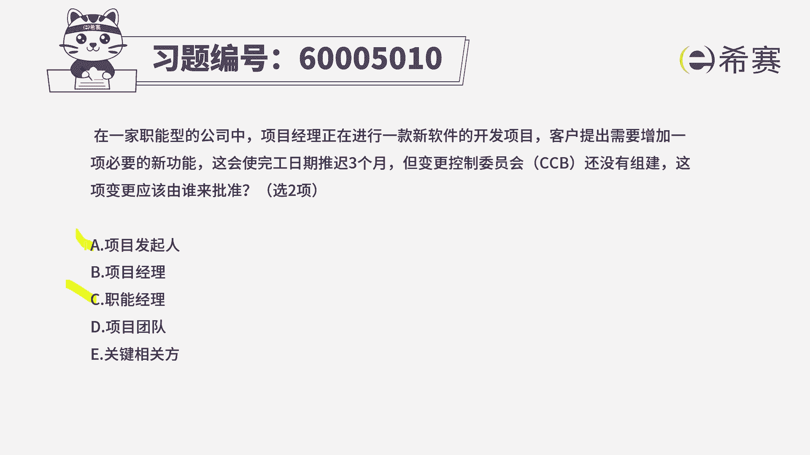

你就可以把最后一个也可以选上来好。

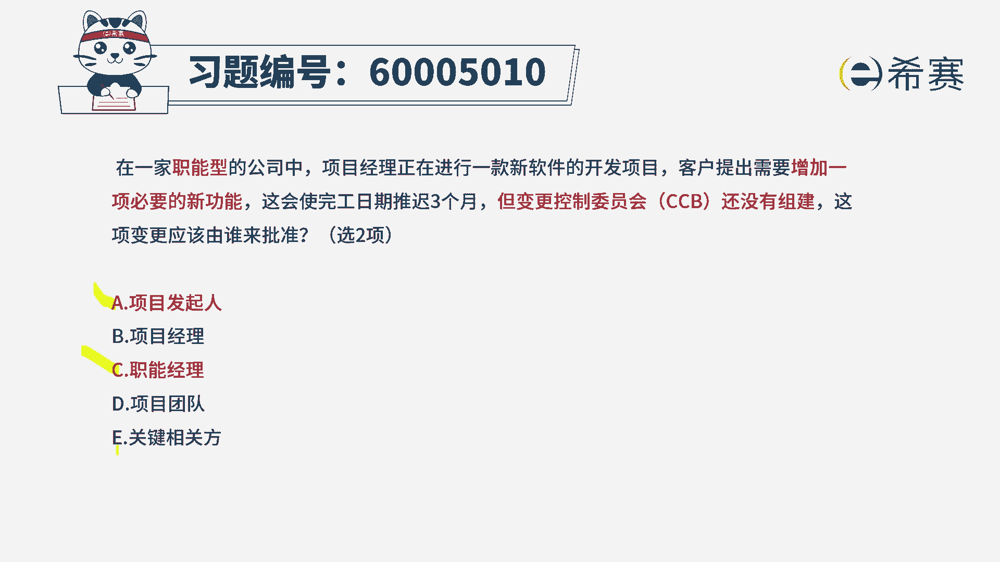