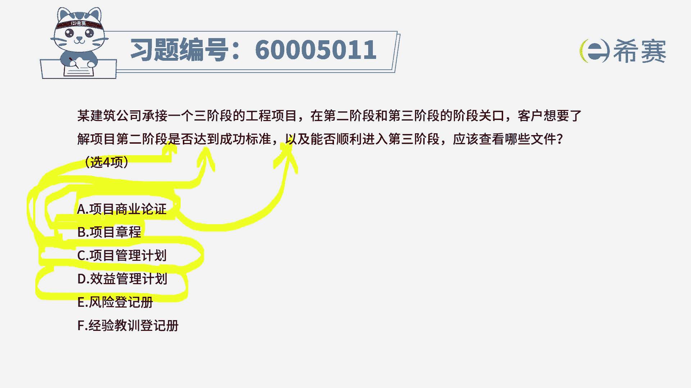
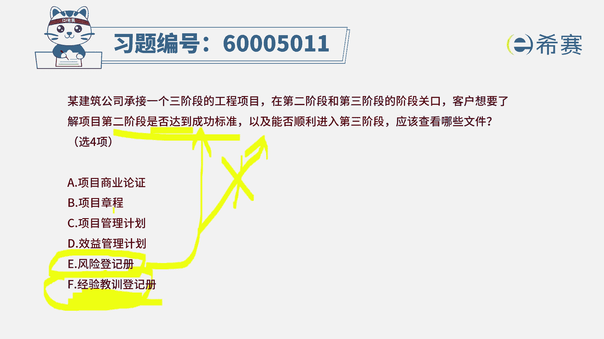
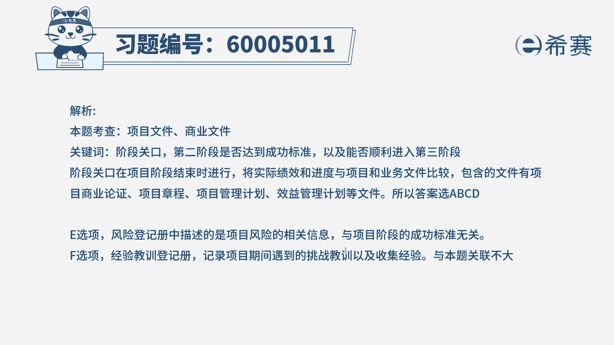

# （24年PMP）pmp项目管理考试零基础刷题视频教程-200道模拟题 - P64：64 - 冬x溪 - BV1S14y1U7Ce

某建筑公司承建了一个商阶段的工程项目，在二阶段和三阶段的阶段关口，客户想要了解项目的第二阶段，是否达到成功标准，以及能否顺利的进入到第三阶段，那么应该查看哪些文件呢，啊这里告诉你有四个正确答案。

那么通常来讲，某一个阶段结束到下一个阶段开始，我们通常说当一个项目周期比较长的时候，会分成若干个阶段，每一个阶段可以当做一个子项目来对待，那么其实也就是说，上一个项目它顺利地达成目标了吗。

啊下一个项目可以开始吗，那关于达成目标和开始关注焦点好多好多呀，首当其冲的就是商业论证，那么商业论证，它能够去确定这个这一阶段要不要开始，对不对啊，同时呢还有一个叫项目章程，项目章程里面会明确来说明。

某一个阶段它完成的标准，或者说是成功的标准是什么，我们通过这个项目专程来比对，就能够知道是不是达成了，然后呢还有一个呢是项目管理计划，那项目管理计划中会明确告诉我们说，这个阶段它包含的东西。

因为在项目管理计划中就会包含了若干的计划，以及范围，基准进度基准成本基准等这些，那这些内容里面就包含了其中范围，基准中包含了这个项目的具体各方各面的，这种小的细节，小的可交付成果的一些个验收的标准。

所以他也会指导我们一个项目的一个顺利完成，包括项目管理计划中，也会告诉我们说在收尾的时候该要怎么办，所以它也会是作为一个重点参考的文件，还有最后一个叫效益管理计划，那通常情况下，效益管理计划呢。

它是跟我们这一个商业论证是放到一起来的，商业论证来确定这个项目值不值得去做，而项目管理计划呢它会更细节的去关注，在经济这个维度，什么时候能够收到钱，能够收到多少钱，能够赚到多少钱，这些很细致的计划。

所以这四个都是碳单。

而后面剩下两个呢，一个是风险登记册，这个东西的话，它对于我们在这个项目的结束也好，下一阶段开始也好，下一阶段还没开始，就没有它，而上一段结束的话呢，就不再去看它了，然后经验教训登记册，它是作为一种辅助。

就是我们做完这一段以后呢，我们可能会得到一些经验教训登记册，但是基于这个经验教训能力，并不能够确定说这个项目是不是成功达标，所以在这种情况下，答案只有a b c d这四个选项。

那你想要看到更多的解析呢。

