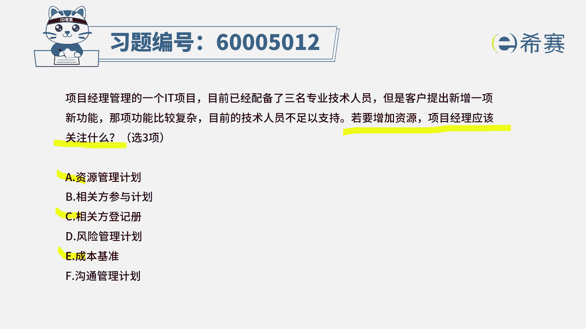
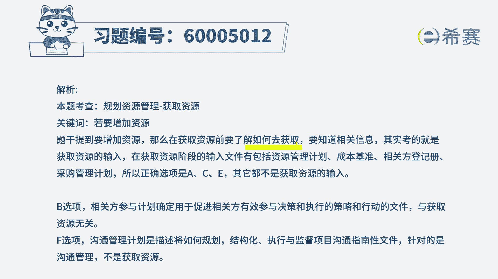

# （24年PMP）pmp项目管理考试零基础刷题视频教程-200道模拟题 - P65：65 - 冬x溪 - BV1S14y1U7Ce

项目经理管理的一个i it项目，目前已经配备了三名专业技术人员，但是客户提出新增一项新功能，那项功能比较复杂，目前的技术人员不足以支撑，若要增加资源，项目经理应该关注什么。

这道题坦白说其实是比较难的一道题目啊，那他会给的是什么信息，他说若要增加资源的话，我们需要去关注什么，我们通常想到说如果说家人的话，肯定是跟人有关，跟沟通有关对吧，一般是这样一个逻辑。

但是呢这道题目的话，他就只给了三个选项，因为你乍一看你会发现好多个选项都可以选，比方说资源管理计划，那肯定是要选的呀，你要加人手，那可能会涉及到关关于人的这种变动，肯定是需要去选的对吧，然后加了人进来。

那么相关方肯定也是需要去选的，然后呢可能沟通管理计划，我们会觉得说有人进来以后，沟通也是需要去选，但是这里有一个特点，就是他会关注的是，如果说我们要去增加资源，我们要优先关注什么呢。

其实是关于增加资源这个内容，就或者是去获取资源这个过程，他的一些输入信息，那获取资源的输入信息中刚好只有这样三个，是在这个题目中，一个是资源管理计划，一个是相关方案的登记册，还有一个呢是成本基准。

这三条是我们的获取资源的输入信息，所以优先选它，所以这个题目它其实是确实是比较不好选，一个题目，若要增加资源，项目经理应该关注什么，那肯定是先优先关注的，但我们已经得到这样一些资源以后。

后续才会想到说诶，那我可能需要去调整这些沟通管理计划，可能要去更新这些相关的能力，测试的就是后续的事情，所以呢这个题目是从这样一个思路来进行。

就是我们需要去关注的是获取资源。

