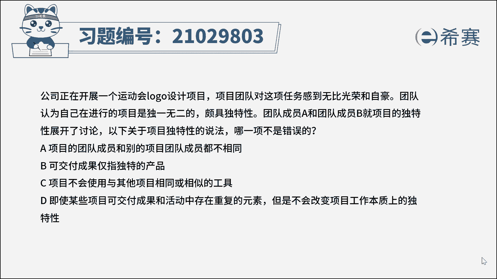
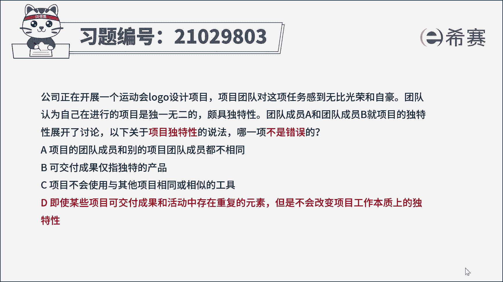
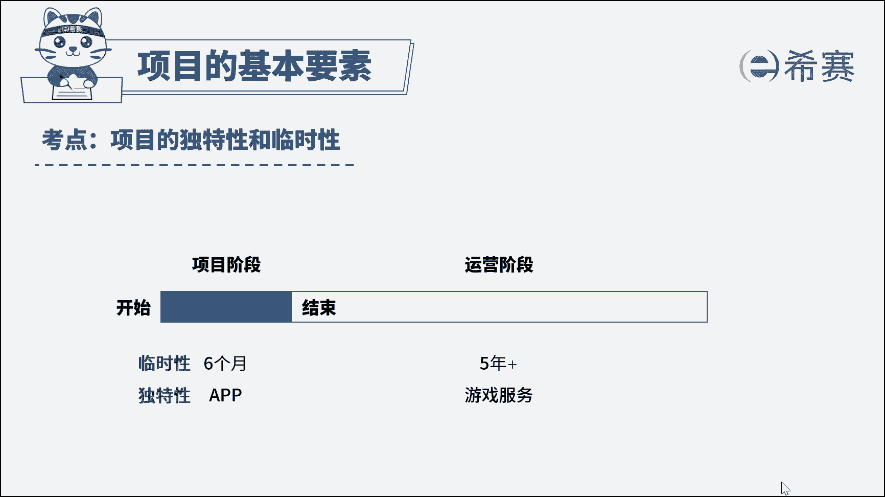

# （24年PMP）pmp项目管理考试零基础刷题视频教程-200道模拟题 - P7：7 - 冬x溪 - BV1S14y1U7Ce

公司正在开展一个运动会logo设计项目。

项目团队对这项任务感到无比光荣和自豪，团队认为自己在进行的项目是独一无二的，颇具独特性，团队成员a和团队成员b，就项目的独特性展开了讨论，一下关于项目独特性的说法，哪一项不是错误的，a。

项目的团队成员和别的项目团队成员都不相同，b可交付成果精致独特的产品，c项目不会使用与其他项目相同或相似的工具，d，即使某些项目可交付成果和活动中，存在重复的元素，但是不会改变项目工作本质上的独特性。

读完题目，我们先看一下问题，关于项目独特性的说法，哪项不是错误的，回到题干，我们可以看到直接问项目独特性的正确说法，考察的就是项目独特性概念的理解，项目具有独特性，这是项目与运营工作最大的区别。

项目大多带有某种创新的性质，过去或将来都不会有完全一致的项目，各项目之间可能存在一些相似或重复的地方，但这并不能改变项目自身的独特性，因此本题的正确答案是d选项，那再来看一下其他选项，选项a。

同一个项目的团队成员可以做完一个项目后，承接另一个项目，但这两个项目是独特的，因此项目团队成员的不同，并不能说明项目就是独特的，举个例子，疾病采用相同或相似的材料，由相同或不同的团队来建设。

但每个建筑项目仍具备独特性，例如位置啊，设计啊，环境啊，情况啊等等这一些，所以a选项这个说法不对，b选项这句话表述是有问题的，独特性是项目可交付成果的重要特点，但可交付成果不一定只是产品。

还可能是某项服务，c选项，某个类似项目，可能会使用其他项目中的相同或相似工具，但这并不会影响到项目的独特性，所以c的说法不正确，此题我们就先讲解到这里。

可以自行参考一下相关的文字解析，整个题目讲解下来，我们可以知道本题考察的知识点。

