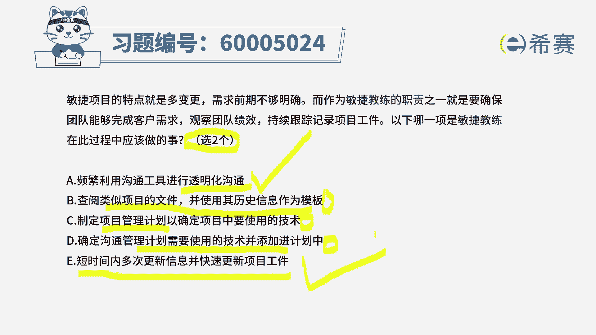
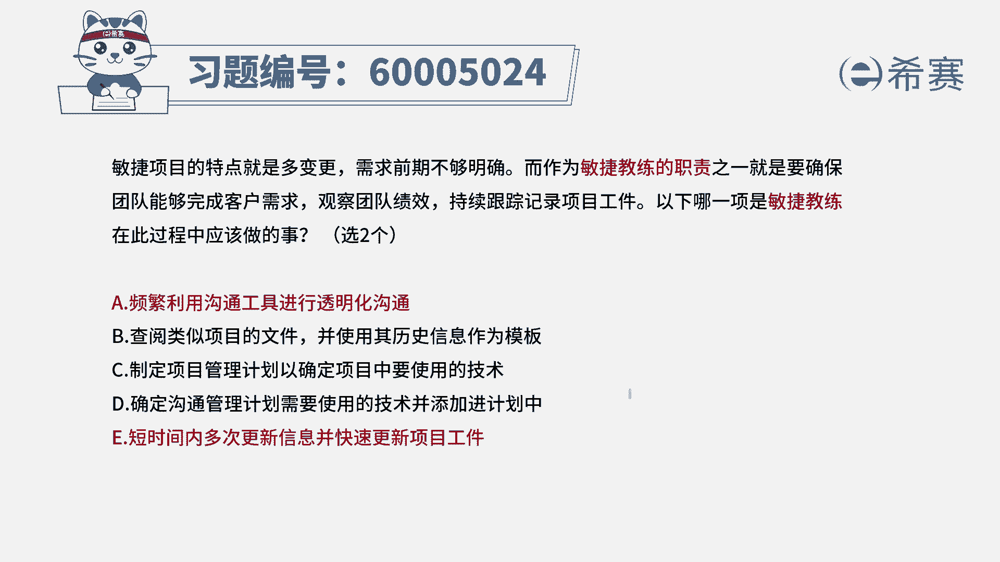
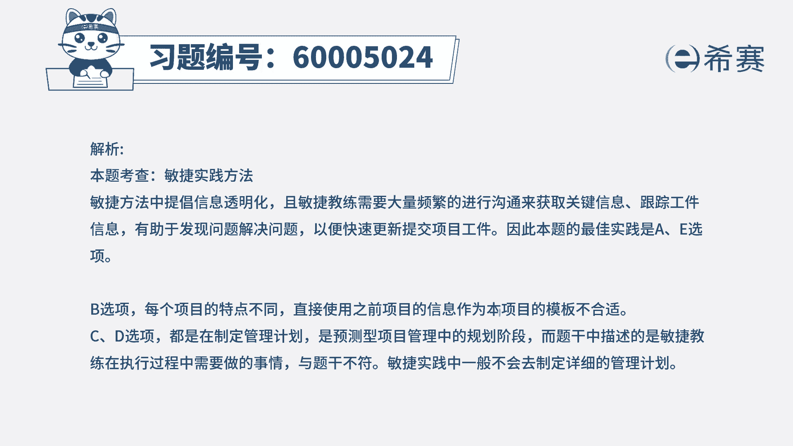

# （24年PMP）pmp项目管理考试零基础刷题视频教程-200道模拟题 - P70：70 - 冬x溪 - BV1S14y1U7Ce

敏捷项目的特点就是多变更需求前期不够明确，而作为敏捷教练的职责之一，就是要确保团队能够完成客户需求，观察团队绩效，持续跟踪记录项目的工作，那下列哪一项是敏捷教练，在此过程中应该做的事情。

有两个是正确答案，那我们把两个正确的挑选出来，或者呢把四个错误的给筛选掉好，首先第一个说频繁的利用沟通工具，进行透明化沟通，因为敏捷中一直会强调透明沟通很重要，所以他肯定是正确的啊。

第二个查阅类似项目文件，并使用历史信息来作为模板，请注意哦，敏捷它其实这种方式是什么方式，是结构化项目管理的方式，但是敏捷中，他其实会不断的去通过开会的方式啊，通过各种方式来去获取一些反馈信息。

然后基于对方的反馈，我们来做调整和改进，所以这种方式它不太适合于敏捷选项，c制定项目管理计划，已确定项目中所使用的这样一个技术，当然了，你不能说完全没有他，但它不会是作为一个那么大的一个焦点。

它会是要去用，但是适当的用，不会是一个特别重要的东西来去对待，所以呢也不能选，然后第四个确定沟通管理计划中，所需要用到的这些技术，并添加进细化中来，这个呢其实是可以选，但是呢不是做一个特别重要的。

所以他只能做一个代选好最后一个选项，短时间内多次更新信息并快速更新项目共建唉，这就刚好是符合敏捷的特征和特点对吧，因为题干中说到敏捷教练，你需要去持续的来，确保大家把该做的事情都给完成对吧。

你需要去持续记录和跟踪项目的弓箭，弓箭其实你可以把它理解为就是要完成的事情，那这个刚好就是很符合敏捷，所以呢这个选项它也是正确的，而题干中告诉我们说只选两个，那就优先选a和b答案选a和e。

这里要提一点啊，c和d你不能说它是错误的，甚至包括b也不能说它是错误的，但是在这里有更正确的选项的时候，我们就优先选更正确的，在敏捷中，这种计划要不要呢，其实也是要的。

只是说他不会做一个特别特别重要的东西，去特别推出，特别关注，ok这些计划可能会是比较简单的。

简洁的好解析。

